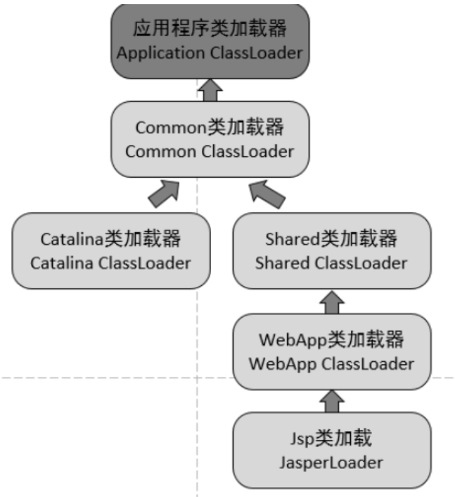
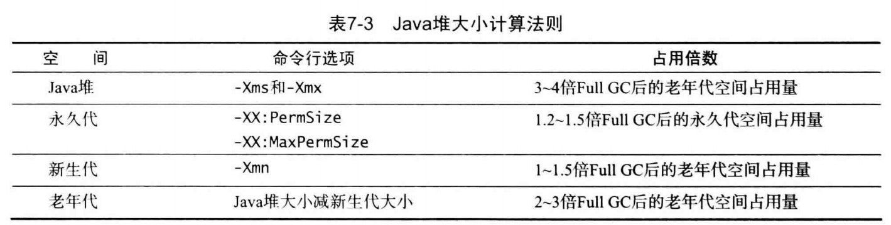

# Table of Contents

- [运行时数据区域](#运行时数据区域)
  - [程序计数器](#程序计数器)
  - [Java 虚拟机栈](#java-虚拟机栈)
  - [本地方法栈](#本地方法栈)
  - [堆](#堆)
  - [方法区](#方法区)
  - [运行时常量池](#运行时常量池)
  - [直接内存](#直接内存)
- [垃圾收集](#垃圾收集)
  - [对象已“死”](#对象已死)
    - [1. 引用计数算法](#1-引用计数算法)
    - [2. 可达性分析算法](#2-可达性分析算法)
    - [3. 方法区的回收](#3-方法区的回收)
    - [4. finalize()](#4-finalize)
  - [引用类型](#引用类型)
    - [1. 强引用](#1-强引用)
    - [2. 软引用](#2-软引用)
    - [3. 弱引用](#3-弱引用)
    - [4. 虚引用](#4-虚引用)
  - [垃圾收集算法](#垃圾收集算法)
    - [1. 标记 - 清除](#1-标记---清除)
    - [2. 标记 - 整理](#2-标记---整理)
    - [3. 复制](#3-复制)
    - [4. 分代收集](#4-分代收集)
  - [垃圾收集器](#垃圾收集器)
    - [1. Serial 收集器](#1-serial-收集器)
    - [2. ParNew 收集器](#2-parnew-收集器)
    - [3. Parallel Scavenge 收集器](#3-parallel-scavenge-收集器)
    - [4. Serial Old 收集器](#4-serial-old-收集器)
    - [5. Parallel Old 收集器](#5-parallel-old-收集器)
    - [6. CMS 收集器](#6-cms-收集器)
    - [7. G1 收集器](#7-g1-收集器)
  - [永久代回收](#永久代回收)
- [内存分配与回收策略](#内存分配与回收策略)
  - [内存分配策略](#内存分配策略)
    - [1. 对象优先在 Eden 分配](#1-对象优先在-eden-分配)
    - [2. 大对象直接进入老年代](#2-大对象直接进入老年代)
    - [3. 长期存活的对象进入老年代](#3-长期存活的对象进入老年代)
    - [4. 动态对象年龄判定](#4-动态对象年龄判定)
    - [5. 空间分配担保](#5-空间分配担保)
  - [Minor GC 和 Full GC](#minor-gc-和-full-gc)
  - [永久代GC](#永久代gc)
  - [什么时候会执行GC](#什么时候会执行gc)
  - [Full GC 的触发条件](#full-gc-的触发条件)
    - [1. 调用 System.gc()](#1-调用-systemgc)
    - [2. 老年代空间不足](#2-老年代空间不足)
    - [3. 空间分配担保失败](#3-空间分配担保失败)
    - [4. JDK 1.7 及以前的永久代空间不足](#4-jdk-17-及以前的永久代空间不足)
    - [5. Concurrent Mode Failure](#5-concurrent-mode-failure)
- [类加载机制](#类加载机制)
  - [类的生命周期](#类的生命周期)
  - [类加载过程](#类加载过程)
    - [1. 加载](#1-加载)
    - [2. 验证](#2-验证)
    - [3. 准备](#3-准备)
    - [4. 解析](#4-解析)
    - [5. 初始化](#5-初始化)
  - [类初始化时机](#类初始化时机)
    - [1. 主动引用](#1-主动引用)
    - [2. 被动引用](#2-被动引用)
  - [类加载器](#类加载器)
    - [类相等](#类相等)
    - [分类](#分类)
    - [自定义类加载器](#自定义类加载器)
  - [双亲委派模型](#双亲委派模型)
    - [1. 工作过程](#1-工作过程)
    - [2. 好处](#2-好处)
    - [3. 实现](#3-实现)
  - [tomcat的非双亲委派](#tomcat的非双亲委派)
    - [原因](#原因)
  - [自定义类加载器实现](#自定义类加载器实现)
- [jvm调优总结](#jvm调优总结)
  - [性能调优的层次](#性能调优的层次)
  - [jvm调优基础](#jvm调优基础)
    - [性能定义](#性能定义)
    - [性能调优原则](#性能调优原则)
    - [性能调优流程](#性能调优流程)
  - [确定内存占用](#确定内存占用)
    - [运行阶段](#运行阶段)
    - [jvm内存分配&参数](#jvm内存分配参数)
    - [计算活跃数据大小](#计算活跃数据大小)
  - [延迟调优](#延迟调优)
    - [系统延迟需求](#系统延迟需求)
    - [优化新生代的大小](#优化新生代的大小)
    - [优化老年代的大小](#优化老年代的大小)
  - [吞吐量调优](#吞吐量调优)
- [jvm命令行性能监控工具](#jvm命令行性能监控工具)
- [内存泄漏与内存溢出](#内存泄漏与内存溢出)
  - [内存溢出](#内存溢出)
    - [栈溢出](#栈溢出)
    - [堆溢出](#堆溢出)
    - [方法区溢出](#方法区溢出)
  - [内存泄漏](#内存泄漏)


# 运行时数据区域

<div align="center">  </div><br>

## 程序计数器

记录正在执行的虚拟机字节码指令的地址（如果正在执行的是本地方法则为空）。

## Java 虚拟机栈

每个 Java 方法在执行的同时会创建一个栈帧用于存储局部变量表、操作数栈、常量池引用等信息。从方法调用直至执行完成的过程，对应着一个栈帧在 Java 虚拟机栈中入栈和出栈的过程。

<div align="center">  </div><br>

可以通过 -Xss 这个虚拟机参数来指定每个线程的 Java 虚拟机栈内存大小，在 JDK 1.4 中默认为 256K，而在 JDK 1.5+ 默认为 1M：

```java
java -Xss2M HackTheJava
```

该区域可能抛出以下异常：

- 当线程请求的栈深度超过最大值，会抛出 StackOverflowError 异常；
- 栈进行动态扩展时如果无法申请到足够内存，会抛出 OutOfMemoryError 异常。

## 本地方法栈

本地方法栈与 Java 虚拟机栈类似，它们之间的区别只不过是本地方法栈为本地方法服务。

本地方法一般是用其它语言（C、C++ 或汇编语言等）编写的，并且被编译为基于本机硬件和操作系统的程序，对待这些方法需要特别处理。

<div align="center">  </div><br>

## 堆

所有对象都在这里分配内存，是垃圾收集的主要区域（"GC 堆"）。

现代的垃圾收集器基本都是采用分代收集算法，其主要的思想是针对不同类型的对象采取不同的垃圾回收算法。可以将堆分成两块：

- 新生代（Young Generation）（一个eden区，两个survivor区）
- 老年代（Old Generation）

堆不需要连续内存，并且可以动态增加其内存，增加失败会抛出 OutOfMemoryError 异常。

可以通过 -Xms 和 -Xmx 这两个虚拟机参数来指定一个程序的堆内存大小，第一个参数设置初始值，第二个参数设置最大值。

```java
java -Xms1M -Xmx2M HackTheJava
```

## 方法区

用于存放已被加载的类信息、常量、静态变量、即时编译器编译后的代码等数据。

和堆一样不需要连续的内存，并且可以动态扩展，动态扩展失败一样会抛出 OutOfMemoryError 异常。

对这块区域进行垃圾回收的主要目标是对常量池的回收和对类的卸载，但是一般比较难实现。

HotSpot 虚拟机把它当成永久代来进行垃圾回收。但很难确定永久代的大小，因为它受到很多因素影响，并且每次 Full GC 之后永久代的大小都会改变，所以经常会抛出 OutOfMemoryError 异常。为了更容易管理方法区，从 JDK 1.8 开始，移除永久代，并把方法区移至元空间，它位于本地内存中，而不是虚拟机内存中。

方法区是一个 JVM 规范，永久代与元空间都是其一种实现方式。在 JDK 1.8 之后，原来永久代的数据被分到了堆和元空间中。元空间存储类的元信息，静态变量和常量池等放入堆中。

## 运行时常量池

运行时常量池是方法区的一部分。

Class 文件中的常量池（编译器生成的字面量和符号引用）会在类加载后被放入这个区域。

除了在编译期生成的常量，还允许动态生成，例如 String 类的 intern()。

## 直接内存

在 JDK 1.4 中新引入了 NIO 类，它可以使用 Native 函数库直接分配堆外内存，然后通过 Java 堆里的 DirectByteBuffer 对象作为这块内存的引用进行操作。这样能在一些场景中显著提高性能，因为避免了在堆内存和堆外内存来回拷贝数据。

# 垃圾收集

垃圾收集主要是针对堆和方法区进行。程序计数器、虚拟机栈和本地方法栈这三个区域属于线程私有的，只存在于线程的生命周期内，线程结束之后就会消失，因此不需要对这三个区域进行垃圾回收。

## 对象已“死”

### 1. 引用计数算法

为对象添加一个引用计数器，当对象增加一个引用时计数器加 1，引用失效时计数器减 1。引用计数为 0 的对象可被回收。

在两个对象出现循环引用的情况下，此时引用计数器永远不为 0，导致无法对它们进行回收。正是因为循环引用的存在，因此 Java 虚拟机不使用引用计数算法。

```java
public class Test {

    public Object instance = null;

    public static void main(String[] args) {
        Test a = new Test();
        Test b = new Test();
        a.instance = b;
        b.instance = a;
        a = null;
        b = null;
        doSomething();
        //此时Test对象还有instance的引用
    }
}
```

在上述代码中，a 与 b 引用的对象实例互相持有了对象的引用，因此当我们把对 a 对象与 b 对象的引用去除之后，由于两个对象还存在互相之间的引用，导致两个 Test 对象无法被回收。

### 2. 可达性分析算法

以 GC Roots 为起始点进行搜索，可达的对象都是存活的，不可达的对象可被回收。

Java 虚拟机使用该算法来判断对象是否可被回收，GC Roots 一般包含以下内容：

- 虚拟机栈中局部变量表中**引用的对象**
- 本地方法栈中 JNI 中引用的对象
- 方法区中类静态属性引用的对象
- 方法区中的常量引用的对象

<div align="center">  </div><br>

### 3. 方法区的回收

因为方法区主要存放永久代对象，而永久代对象的回收率比新生代低很多，所以在方法区上进行回收性价比不高。

主要是对**常量池的回收和对类的卸载。**

为了避免内存溢出，在大量使用反射和动态代理的场景都需要虚拟机具备类卸载功能。

类的卸载条件很多，需要满足以下三个条件，并且满足了条件也不一定会被卸载：

- 该类所有的实例都已经被回收，此时堆中不存在该类的任何实例。
- 加载该类的 ClassLoader 已经被回收。
- 该类对应的 Class 对象没有在任何地方被引用，也就无法在任何地方通过反射访问该类方法。

### 4. finalize()

类似 C++ 的析构函数，用于关闭外部资源。但是 try-finally 等方式可以做得更好，并且该方法运行代价很高，不确定性大，无法保证各个对象的调用顺序，因此最好不要使用。

当一个对象可被回收时，如果需要执行该对象的 finalize() 方法，那么就有可能在该方法中让对象重新被引用，从而实现自救。自救只能进行一次，如果回收的对象之前调用了 finalize() 方法自救，后面回收时不会再调用该方法。

## 引用类型

[强引用、软引用、弱引用、幻象引用有什么区别？具体使用场景是什么？](https://www.cnblogs.com/EveningWind/p/9863533.html)

无论是通过引用计数算法判断对象的引用数量，还是通过可达性分析算法判断对象是否可达，判定对象是否可被回收都与引用有关。

Java 提供了四种强度不同的引用类型。

### 1. 强引用

被强引用关联的对象不会被回收。

使用 new 一个新对象的方式来创建强引用。

```java
Object obj = new Object();
```

### 2. 软引用

被软引用关联的对象只有在内存不够的情况下才会被回收。

使用 SoftReference 类来创建软引用。

```java
Object obj = new Object();
SoftReference<Object> sf = new SoftReference<Object>(obj);
obj = null;  // 使对象只被软引用关联
```

### 3. 弱引用

被弱引用关联的对象一定会被回收，也就是说它只能存活到下一次垃圾回收发生之前。

使用 WeakReference 类来创建弱引用。

```java
Object obj = new Object();
WeakReference<Object> wf = new WeakReference<Object>(obj);
obj = null;
```

### 4. 虚引用

又称为幽灵引用或者幻影引用，一个对象是否有虚引用的存在，不会对其生存时间造成影响，也无法通过虚引用得到一个对象。

为一个对象设置虚引用的唯一目的是能在这个对象被回收时收到一个系统通知。

使用 PhantomReference 来创建虚引用。

```java
Object obj = new Object();
PhantomReference<Object> pf = new PhantomReference<Object>(obj, null);
obj = null;
```

## 垃圾收集算法

### 1. 标记 - 清除

<div align="center">  </div><br>

在标记阶段，程序会检查每个对象是否为活动对象，如果是活动对象，则程序会在对象头部打上标记。

在清除阶段，会进行对象回收并取消标志位，另外，还会判断回收后的分块与前一个空闲分块是否连续，若连续，会合并这两个分块。回收对象就是把对象作为分块，连接到被称为 “空闲链表” 的单向链表，之后进行分配时只需要遍历这个空闲链表，就可以找到分块。

在分配时，程序会搜索空闲链表寻找空间大于等于新对象大小 size 的块 block。如果它找到的块等于 size，会直接返回这个分块；如果找到的块大于 size，会将块分割成大小为 size 与 (block - size) 的两部分，返回大小为 size 的分块，并把大小为 (block - size) 的块返回给空闲链表。

不足：

- 标记和清除过程效率都不高；
- 会产生大量不连续的内存碎片，导致无法给大对象分配内存。

### 2. 标记 - 整理

<div align="center">  </div><br>

让所有存活的对象都向一端移动，然后直接清理掉端边界以外的内存。

优点:

- 不会产生内存碎片

不足:

- 需要移动大量对象，处理效率比较低。

### 3. 复制

<div align="center">  </div><br>

将内存划分为大小相等的两块，每次只使用其中一块，当这一块内存用完了就将还存活的对象复制到另一块上面，然后再把使用过的内存空间进行一次清理。

主要不足是只使用了内存的一半。

现在的商业虚拟机都采用这种收集算法回收新生代，但是并不是划分为大小相等的两块，而是一块较大的 Eden 空间和两块较小的 Survivor 空间，每次使用 Eden 和其中一块 Survivor。在回收时，将 Eden 和 Survivor 中还存活着的对象全部复制到另一块 Survivor 上，最后清理 Eden 和使用过的那一块 Survivor。

HotSpot 虚拟机的 Eden 和 Survivor 大小比例默认为 8:1，保证了内存的利用率达到 90%。如果每次回收有多于 10% 的对象存活，那么一块 Survivor 就不够用了，此时需要依赖于老年代进行空间分配担保，也就是借用老年代的空间存储放不下的对象。

### 4. 分代收集

现在的商业虚拟机采用分代收集算法，它根据对象存活周期将内存划分为几块，不同块采用适当的收集算法。

一般将堆分为新生代和老年代。

- 新生代使用：复制算法
- 老年代使用：标记 - 清除 或者 标记 - 整理 算法

## 垃圾收集器

<div align="center">  </div><br>

以上是 HotSpot 虚拟机中的 7 个垃圾收集器，连线表示垃圾收集器可以配合使用。

- 单线程与多线程：单线程指的是垃圾收集器只使用一个线程，而多线程使用多个线程；
- 串行与并行：串行指的是垃圾收集器与用户程序交替执行，这意味着在执行垃圾收集的时候需要停顿用户程序；并行指的是垃圾收集器和用户程序同时执行。除了 CMS 和 G1 之外，其它垃圾收集器都是以串行的方式执行。

### 1. Serial 收集器

<div align="center">  </div><br>

Serial 翻译为串行，也就是说它以串行的方式执行。

它是单线程的收集器，只会使用一个线程进行垃圾收集工作。

它的优点是简单高效，在单个 CPU 环境下，由于没有线程交互的开销，因此拥有最高的单线程收集效率。

它是 Client 场景下的默认新生代收集器，因为在该场景下内存一般来说不会很大。它收集一两百兆垃圾的停顿时间可以控制在一百多毫秒以内，只要不是太频繁，这点停顿时间是可以接受的。

### 2. ParNew 收集器

<div align="center">  </div><br>

它是 Serial 收集器的多线程版本。

它是 Server 场景下默认的新生代收集器，除了性能原因外，主要是因为除了 Serial 收集器，只有它能与 CMS 收集器配合使用。

### 3. Parallel Scavenge 收集器

与 ParNew 一样是多线程收集器。

**其它收集器目标是尽可能缩短垃圾收集时用户线程的停顿时间，而它的目标是达到一个可控制的吞吐量**，**因此它被称为“吞吐量优先”收集器。这里的吞吐量指 CPU 用于运行用户程序的时间占总时间的比值。**

停顿时间越短就越适合需要与用户交互的程序，良好的响应速度能提升用户体验。而高吞吐量则可以高效率地利用 CPU 时间，尽快完成程序的运算任务，适合在后台运算而不需要太多交互的任务。

缩短停顿时间是以牺牲吞吐量和新生代空间来换取的：新生代空间变小，垃圾回收变得频繁，导致吞吐量下降。

可以通过一个开关参数打开 GC 自适应的调节策略（GC Ergonomics），就不需要手工指定新生代的大小（-Xmn）、Eden 和 Survivor 区的比例、晋升老年代对象年龄等细节参数了。虚拟机会根据当前系统的运行情况收集性能监控信息，动态调整这些参数以提供最合适的停顿时间或者最大的吞吐量。

### 4. Serial Old 收集器

<div align="center">  </div><br>

是 Serial 收集器的老年代版本，也是给 Client 场景下的虚拟机使用。如果用在 Server 场景下，它有两大用途：

- 在 JDK 1.5 以及之前版本（Parallel Old 诞生以前）中与 Parallel Scavenge 收集器搭配使用。
- 作为 CMS 收集器的后备预案，在并发收集发生 Concurrent Mode Failure 时使用。

### 5. Parallel Old 收集器

<div align="center">  </div><br>

是 Parallel Scavenge 收集器的老年代版本。

在注重吞吐量以及 CPU 资源敏感的场合，都可以优先考虑 Parallel Scavenge 加 Parallel Old 收集器。

### 6. CMS 收集器

<div align="center">  </div><br>

CMS（Concurrent Mark Sweep），Mark Sweep 指的是标记 - 清除算法。**收集器是一种以获取最短回收停顿时间为目标的收集器。**

分为以下四个流程：

- 初始标记：仅仅只是标记一下 GC Roots 能直接关联到的对象，速度很快，需要停顿。
- 并发标记：进行 GC Roots Tracing 的过程，它在整个回收过程中耗时最长，不需要停顿。
- 重新标记：为了修正并发标记期间因用户程序继续运作而导致标记产生变动的那一部分对象的标记记录，需要停顿。
- 并发清除：不需要停顿。

在整个过程中耗时最长的并发标记和并发清除过程中，收集器线程都可以与用户线程一起工作，不需要进行停顿。

具有以下缺点：

- 吞吐量低：低停顿时间是以牺牲吞吐量为代价的，导致 CPU 利用率不够高。
- 无法处理浮动垃圾，可能出现 Concurrent Mode Failure。浮动垃圾是指并发清除阶段由于用户线程继续运行而产生的垃圾，这部分垃圾只能到下一次 GC 时才能进行回收。由于浮动垃圾的存在，因此需要预留出一部分内存，意味着 CMS 收集不能像其它收集器那样等待老年代快满的时候再回收。如果预留的内存不够存放浮动垃圾，就会出现 Concurrent Mode Failure，这时虚拟机将临时启用 Serial Old 来替代 CMS。
- 标记 - 清除算法导致的空间碎片，往往出现老年代空间剩余，但无法找到足够大连续空间来分配当前对象，不得不提前触发一次 Full GC。

### 7. G1 收集器

**对比操作系统段页式内存管理**

G1（Garbage-First），它是一款面向服务端应用的垃圾收集器，在多 CPU 和大内存的场景下有很好的性能。HotSpot 开发团队赋予它的使命是未来可以替换掉 CMS 收集器。

**堆被分为新生代和老年代，其它收集器进行收集的范围都是整个新生代或者老年代，而 G1 可以直接对新生代和老年代一起回收。**

<div align="center">  </div><br>

**G1 把堆划分成多个大小相等的独立区域（Region），新生代和老年代不再物理隔离。**

<div align="center">  </div><br>

通过引入 Region 的概念，从而将原来的一整块内存空间划分成多个的小空间，使得每个小空间可以单独进行垃圾回收。这种划分方法带来了很大的灵活性，使得可预测的停顿时间模型成为可能。通过记录每个 Region 垃圾回收时间以及回收所获得的空间（这两个值是通过过去回收的经验获得），并维护一个优先列表，每次根据允许的收集时间，优先回收价值最大的 Region。

每个 Region 都有一个 Remembered Set，用来记录该 Region 对象的引用对象所在的 Region。通过使用 Remembered Set，在做可达性分析的时候就可以避免全堆扫描。

<div align="center">  </div><br>

如果不计算维护 Remembered Set 的操作，G1 收集器的运作大致可划分为以下几个步骤：

- 初始标记
- 并发标记
- 最终标记：为了修正在并发标记期间因用户程序继续运作而导致标记产生变动的那一部分标记记录，虚拟机将这段时间对象变化记录在线程的 Remembered Set Logs 里面，最终标记阶段需要把 Remembered Set Logs 的数据合并到 Remembered Set 中。这阶段需要停顿线程，但是可并行执行。
- 筛选回收：首先对各个 Region 中的回收价值和成本进行排序，根据用户所期望的 GC 停顿时间来制定回收计划。此阶段其实也可以做到与用户程序一起并发执行，但是因为只回收一部分 Region，时间是用户可控制的，而且停顿用户线程将大幅度提高收集效率。

具备如下特点：

- 并行与并发
- **分代收集**
- 空间整合：整体来看是基于“标记 - 整理”算法实现的收集器，从局部（两个 Region 之间）上来看是基于“复制”算法实现的，**这意味着运行期间不会产生内存空间碎片。**
- **可预测的停顿**：能让使用者明确指定在一个长度为 M 毫秒的时间片段内，消耗在 GC 上的时间不得超过 N 毫秒。

## 永久代回收

主要分为废弃常量以及无用的类

废弃常量回收和类回收类似，看引用

无用类的判断必须满足以下3个条件

1. 该类所有的实例已经被回收，即java堆中不存在该类的实例
2. 该类的classloader已经被回收
3. 该类对应的java.lang.class对象没有在任何地方被引用，无法在任何地方通过反射访问该类的方法。

满足以上3个条件只是表明可以回收。

# 内存分配与回收策略

## 内存分配策略

### 1. 对象优先在 Eden 分配

大多数情况下，对象在新生代 Eden 上分配，当 Eden 空间不够时，发起 Minor GC。

### 2. 大对象直接进入老年代

大对象是指需要连续内存空间的对象，最典型的大对象是那种很长的字符串以及数组。

经常出现大对象会提前触发垃圾收集以获取足够的连续空间分配给大对象。

-XX:PretenureSizeThreshold，大于此值的对象直接在老年代分配，避免在 Eden 和 Survivor 之间的大量内存复制。

### 3. 长期存活的对象进入老年代

为对象定义年龄计数器，对象在 Eden 出生并经过 Minor GC 依然存活，将移动到 Survivor 中，年龄就增加 1 岁，增加到一定年龄则移动到老年代中。

-XX:MaxTenuringThreshold 用来定义年龄的阈值。

### 4. 动态对象年龄判定

虚拟机并不是永远要求对象的年龄必须达到 MaxTenuringThreshold 才能晋升老年代，如果在 Survivor 中相同年龄所有对象大小的总和大于 Survivor 空间的一半，则年龄大于或等于该年龄的对象可以直接进入老年代，无需等到 MaxTenuringThreshold 中要求的年龄。

### 5. 空间分配担保

**在发生 Minor GC 之前，虚拟机先检查老年代最大可用的连续空间是否大于新生代所有对象总空间，如果条件成立的话，那么 Minor GC 可以确认是安全的。**（效率高，预减判断）

如果不成立的话虚拟机会查看 HandlePromotionFailure 的值是否允许担保失败，如果允许那么就会继续检查老年代最大可用的连续空间是否大于历次晋升到老年代对象的平均大小（效率低），如果大于，将尝试着进行一次 Minor GC；如果小于，或者 HandlePromotionFailure 的值不允许冒险，那么就要进行一次 Full GC。

## Minor GC 和 Full GC

- Minor GC：回收新生代，因为新生代对象存活时间很短，因此 Minor GC 会频繁执行，执行的速度一般也会比较快。
- Full GC：回收老年代和新生代，老年代对象其存活时间长，因此 Full GC 很少执行，执行速度会比 Minor GC 慢很多。

## 永久代GC

永久代的垃圾回收主要包括**类型的卸载和废弃常量池的回收**。当没有对象引用一个常量的时候，该常量即可以被回收。而类型的卸载更加复杂。必须满足一下三点，该类型的所有实例都被回收了，该类型的ClassLoader被回收了，该类型对应的java.lang.Class没有在任何地方被引用，在任何地方都无法通过反射来实例化一个对象

## 什么时候会执行GC

​	1，对象没有引用
​	2，作用域发生未捕获异常
​	3，程序在作用域正常执行完毕
​	4，程序执行了System.exit（）
​	5，程序发生意外终止（被杀进程等）
​	6、system.gc
​	7、当应用程序空闲时，即没有应用线程在运行时，GC会被调用。
​	8、Java堆内存不足时，GC会被调用。

## Full GC 的触发条件

对于 Minor GC，其触发条件非常简单，当 Eden 空间满时，就将触发一次 Minor GC。而 Full GC 则相对复杂，有以下条件：

### 1. 调用 System.gc()

只是建议虚拟机执行 Full GC，但是虚拟机不一定真正去执行。不建议使用这种方式，而是让虚拟机管理内存。

### 2. 老年代空间不足

老年代空间不足的常见场景为前文所讲的大对象直接进入老年代、长期存活的对象进入老年代等。

为了避免以上原因引起的 Full GC，应当尽量不要创建过大的对象以及数组。除此之外，可以通过 -Xmn 虚拟机参数调大新生代的大小，让对象尽量在新生代被回收掉，不进入老年代。还可以通过 -XX:MaxTenuringThreshold 调大对象进入老年代的年龄，让对象在新生代多存活一段时间。

### 3. 空间分配担保失败

使用复制算法的 Minor GC 需要老年代的内存空间作担保，如果担保失败会执行一次 Full GC。具体内容请参考上面的第 5 小节。

### 4. JDK 1.7 及以前的永久代空间不足

在 JDK 1.7 及以前，HotSpot 虚拟机中的方法区是用永久代实现的，永久代中存放的为一些 Class 的信息、常量、静态变量等数据。

当系统中要加载的类、反射的类和调用的方法较多时，永久代可能会被占满，在未配置为采用 CMS GC 的情况下也会执行 Full GC。如果经过 Full GC 仍然回收不了，那么虚拟机会抛出 java.lang.OutOfMemoryError。

为避免以上原因引起的 Full GC，可采用的方法为增大永久代空间或转为使用 CMS GC。

### 5. Concurrent Mode Failure

执行 CMS GC 的过程中同时有对象要放入老年代，而此时老年代空间不足（可能是 GC 过程中浮动垃圾过多导致暂时性的空间不足），便会报 Concurrent Mode Failure 错误，并触发 Full GC。

# 类加载机制

类是在运行期间第一次使用时动态加载的，而不是一次性加载所有类。因为如果一次性加载，那么会占用很多的内存。

## 类的生命周期

<div align="center">  </div><br>

包括以下 7 个阶段：

- **加载（Loading）** 
- **验证（Verification）** 
- **准备（Preparation）** 
- **解析（Resolution）** 
- **初始化（Initialization）** 
- 使用（Using）
- 卸载（Unloading）

## 类加载过程

包含了加载、验证、准备、解析和初始化这 5 个阶段。

### 1. 加载

加载是类加载的一个阶段，注意不要混淆。

加载过程完成以下三件事：

- 通过类的完全限定名称获取定义该类的二进制字节流。
- 将该字节流表示的静态存储结构转换为方法区的运行时存储结构。
- 在内存中生成一个代表该类的 Class 对象，作为方法区中该类各种数据的访问入口。

其中二进制字节流可以从以下方式中获取：

- 从 ZIP 包读取，成为 JAR、EAR、WAR 格式的基础。
- 从网络中获取，最典型的应用是 Applet。
- 运行时计算生成，例如动态代理技术，在 java.lang.reflect.Proxy 使用 ProxyGenerator.generateProxyClass 的代理类的二进制字节流。
- 由其他文件生成，例如由 JSP 文件生成对应的 Class 类。

### 2. 验证

确保 Class 文件的字节流中包含的信息符合当前虚拟机的要求，并且不会危害虚拟机自身的安全。

### 3. 准备

**类变量是被 static 修饰的变量，准备阶段为类变量分配内存并设置初始值，使用的是方法区的内存。**

实例变量不会在这阶段分配内存，它会在对象实例化时随着对象一起被分配在堆中。应该注意到，实例化不是类加载的一个过程，类加载发生在所有实例化操作之前，并且类加载只进行一次，实例化可以进行多次。

初始值一般为 0 值，例如下面的类变量 value 被初始化为 0 而不是 123。

```java
public static int value = 123;
```

如果类变量是常量，那么它将初始化为表达式所定义的值而不是 0。例如下面的常量 value 被初始化为 123 而不是 0。

```java
public static final int value = 123;

```

### 4. 解析

**将常量池的符号引用替换为直接引用的过程。**

其中解析过程在某些情况下可以在初始化阶段之后再开始，这是为了支持 Java 的动态绑定。

<div data="补充为什么可以支持动态绑定 --> <--"></div>

### 5. 初始化

<div data="modify -->"></div>

**初始化阶段才真正开始执行类中定义的 Java 程序代码。初始化阶段是虚拟机执行类构造器 &lt;clinit>() 方法的过程。在准备阶段，类变量已经赋过一次系统要求的初始值，而在初始化阶段，根据程序员通过程序制定的主观计划去初始化类变量和其它资源。**

&lt;clinit>() 是由编译器自动收集类中所有类变量的赋值动作和静态语句块中的语句合并产生的，编译器收集的顺序由语句在源文件中出现的顺序决定。特别注意的是，静态语句块只能访问到定义在它之前的类变量，定义在它之后的类变量只能赋值，不能访问。例如以下代码：

```java
public class Test {
    static {
        i = 0;                // 给变量赋值可以正常编译通过
        System.out.print(i);  // 这句编译器会提示“非法向前引用”
    }
    static int i = 1;
}

```

由于父类的 &lt;clinit>() 方法先执行，也就意味着父类中定义的静态语句块的执行要优先于子类。例如以下代码：

```java
static class Parent {
    public static int A = 1;
    static {
        A = 2;
    }
}

static class Sub extends Parent {
    public static int B = A;
}

public static void main(String[] args) {
     System.out.println(Sub.B);  // 2
}

```

接口中不可以使用静态语句块，但仍然有类变量初始化的赋值操作，因此接口与类一样都会生成 &lt;clinit>() 方法。但接口与类不同的是，执行接口的 &lt;clinit>() 方法不需要先执行父接口的 &lt;clinit>() 方法。只有当父接口中定义的变量使用时，父接口才会初始化。另外，接口的实现类在初始化时也一样不会执行接口的 &lt;clinit>() 方法。

虚拟机会保证一个类的 &lt;clinit>() 方法在多线程环境下被正确的加锁和同步，如果多个线程同时初始化一个类，只会有一个线程执行这个类的 &lt;clinit>() 方法，其它线程都会阻塞等待，直到活动线程执行 &lt;clinit>() 方法完毕。如果在一个类的 &lt;clinit>() 方法中有耗时的操作，就可能造成多个线程阻塞，在实际过程中此种阻塞很隐蔽。

## 类初始化时机

### 1. 主动引用

虚拟机规范中并没有强制约束何时进行加载，但是规范严格规定了有且只有下列五种情况必须对类进行初始化（加载、验证、准备都会随之发生）：

- 遇到 new、getstatic、putstatic、invokestatic 这四条字节码指令时，如果类没有进行过初始化，则必须先触发其初始化。最常见的生成这 4 条指令的场景是：使用 new 关键字实例化对象的时候；读取或设置一个类的静态字段（被 final 修饰、已在编译期把结果放入常量池的静态字段除外）的时候；以及调用一个类的静态方法的时候。
- 使用 java.lang.reflect 包的方法对类进行反射调用的时候，如果类没有进行初始化，则需要先触发其初始化。
- 当初始化一个类的时候，如果发现其父类还没有进行过初始化，则需要先触发其父类的初始化。
- 当虚拟机启动时，用户需要指定一个要执行的主类（包含 main() 方法的那个类），虚拟机会先初始化这个主类；
- 当使用 JDK 1.7 的动态语言支持时，如果一个 java.lang.invoke.MethodHandle 实例最后的解析结果为 REF_getStatic, REF_putStatic, REF_invokeStatic 的方法句柄，并且这个方法句柄所对应的类没有进行过初始化，则需要先触发其初始化；

### 2. 被动引用

以上 5 种场景中的行为称为对一个类进行主动引用。除此之外，所有引用类的方式都不会触发初始化，称为被动引用。被动引用的常见例子包括：

- 通过子类引用父类的静态字段，不会导致子类初始化。

```java
System.out.println(SubClass.value);  // value 字段在 SuperClass 中定义

```

- 通过数组定义来引用类，不会触发此类的初始化。该过程会对数组类进行初始化，数组类是一个由虚拟机自动生成的、直接继承自 Object 的子类，其中包含了数组的属性和方法。

```java
SuperClass[] sca = new SuperClass[10];

```

- 常量在编译阶段会存入调用类的常量池中，本质上并没有直接引用到定义常量的类，因此不会触发定义常量的类的初始化。

```java
System.out.println(ConstClass.HELLOWORLD);

```

## 类加载器

### 类相等

**两个类相等，需要类本身相等，并且使用同一个类加载器进行加载。这是因为每一个类加载器都拥有一个独立的类名称空间。**

这里的相等，包括类的 Class 对象的 equals() 方法、isAssignableFrom() 方法、isInstance() 方法的返回结果为 true，也包括使用 instanceof 关键字做对象所属关系判定结果为 true。

### 分类

从 Java 虚拟机的角度来讲，只存在以下两种不同的类加载器：

- **启动类加载器（Bootstrap ClassLoader），使用 C++ 实现，是虚拟机自身的一部分；**
- 所有其它类的加载器，使用 Java 实现，独立于虚拟机，继承自抽象类 java.lang.ClassLoader。

从 Java 开发人员的角度看，类加载器可以划分得更细致一些：

- **启动类加载器**（Bootstrap ClassLoader）此类加载器负责将存放在 &lt;JRE_HOME>\lib 目录中的，或者被 -Xbootclasspath 参数所指定的路径中的，并且是虚拟机识别的（仅按照文件名识别，如 rt.jar，名字不符合的类库即使放在 lib 目录中也不会被加载）类库加载到虚拟机内存中。启动类加载器无法被 Java 程序直接引用，用户在编写自定义类加载器时，如果需要把加载请求委派给启动类加载器，直接使用 null 代替即可。
- **扩展类加载器**（Extension ClassLoader）这个类加载器是由 ExtClassLoader（sun.misc.Launcher$ExtClassLoader）实现的。它负责将 &lt;JAVA_HOME>/lib/ext 或者被 java.ext.dir 系统变量所指定路径中的所有类库加载到内存中，开发者可以直接使用扩展类加载器。
- **应用程序类加载器**（Application ClassLoader）这个类加载器是由 AppClassLoader（sun.misc.Launcher$AppClassLoader）实现的。由于这个类加载器是 ClassLoader 中的 getSystemClassLoader() 方法的返回值，因此一般称为系统类加载器。它负责加载用户类路径（ClassPath）上所指定的类库，开发者可以直接使用这个类加载器，如果应用程序中没有自定义过自己的类加载器，一般情况下这个就是程序中默认的类加载器。

### 自定义类加载器

[自定义类加载器](https://www.cnblogs.com/xrq730/p/4847337.html)

## 双亲委派模型

应用程序是由三种类加载器互相配合从而实现类加载，除此之外还可以加入自己定义的类加载器。

下图展示了类加载器之间的层次关系，称为双亲委派模型（Parents Delegation Model）。该模型要求除了顶层的启动类加载器外，其它的类加载器都要有自己的父类加载器。这里的父子关系一般通过组合关系（Composition）来实现，而不是继承关系（Inheritance）。

<div align="center">  </div><br>

### 1. 工作过程

一个类加载器首先将类加载请求转发到父类加载器，只有当父类加载器无法完成时才尝试自己加载。

### 2. 好处

使得 Java 类随着它的类加载器一起具有一种带有优先级的层次关系，从而使得基础类得到统一。

例如 java.lang.Object 存放在 rt.jar 中，如果编写另外一个 java.lang.Object 并放到 ClassPath 中，程序可以编译通过。由于双亲委派模型的存在，所以在 rt.jar 中的 Object 比在 ClassPath 中的 Object 优先级更高，这是因为 rt.jar 中的 Object 使用的是启动类加载器，而 ClassPath 中的 Object 使用的是应用程序类加载器。rt.jar 中的 Object 优先级更高，那么程序中所有的 Object 都是这个 Object。

### 3. 实现

以下是抽象类 java.lang.ClassLoader 的代码片段，其中的 loadClass() 方法运行过程如下：先检查类是否已经加载过，如果没有则让父类加载器去加载。当父类加载器加载失败时抛出 ClassNotFoundException，此时尝试自己去加载。

```java
public abstract class ClassLoader {
    // The parent class loader for delegation
    private final ClassLoader parent;

    public Class<?> loadClass(String name) throws ClassNotFoundException {
        return loadClass(name, false);
    }

    protected Class<?> loadClass(String name, boolean resolve) throws ClassNotFoundException {
        synchronized (getClassLoadingLock(name)) {
            // First, check if the class has already been loaded
            Class<?> c = findLoadedClass(name);
            if (c == null) {
                try {
                    if (parent != null) {
                        c = parent.loadClass(name, false);
                    } else {
                        c = findBootstrapClassOrNull(name);
                    }
                } catch (ClassNotFoundException e) {
                    // ClassNotFoundException thrown if class not found
                    // from the non-null parent class loader
                }

                if (c == null) {
                    // If still not found, then invoke findClass in order
                    // to find the class.
                    c = findClass(name);
                }
            }
            if (resolve) {
                resolveClass(c);
            }
            return c;
        }
    }

    protected Class<?> findClass(String name) throws ClassNotFoundException {
        throw new ClassNotFoundException(name);
    }
}

```

## tomcat的非双亲委派

<https://blog.csdn.net/varyall/article/details/80739669>

### 原因

1、部署在同一个服务器上的两个Web应用程序所使用的Java类库可以实现相互隔离。这是最基本的要求，两个不同的应用程序可能会依赖同一个第三方类库的不同版本，不能要求一个类库在一个服务器中只有一份，服务器应当保证两个应用程序的类库可以互相使用

2、部署在同一个服务器上的两个Web应用程序所使用的Java类库可以相互共享。这个需求也很常见，比如相同的Spring类库10个应用程序在用不可能分别存放在各个应用程序的隔离目录中

3、支持热替换，我们知道JSP文件最终要编译成.class文件才能由虚拟机执行，但JSP文件由于其纯文本存储特性，运行时修改的概率远远大于第三方类库或自身.class文件，而且JSP这种网页应用也把修改后无须重启作为一个很大的优势看待tomcat的实现



commonLoader：Tomcat最基本的类加载器，加载路径中的class可以被Tomcat容器本身以及各个Webapp访问；
catalinaLoader：Tomcat容器私有的类加载器，加载路径中的class对于Webapp不可见；
sharedLoader：各个Webapp共享的类加载器，加载路径中的class对于所有Webapp可见，但是对于Tomcat容器不可见；
WebappClassLoader：各个Webapp私有的类加载器，加载路径中的class只对当前Webapp可见；

CommonClassLoader能加载的类都可以被Catalina ClassLoader和SharedClassLoader使用，从而实现了公有类库的共用，而CatalinaClassLoader和Shared ClassLoader自己能加载的类则与对方相互隔离。

WebAppClassLoader可以使用SharedClassLoader加载到的类，但各个WebAppClassLoader实例之间相互隔离。

而JasperLoader的加载范围仅仅是这个JSP文件所编译出来的那一个.Class文件，它出现的目的就是为了被丢弃：当Web容器检测到JSP文件被修改时，会替换掉目前的JasperLoader的实例，并通过再建立一个新的Jsp类加载器来实现JSP文件的HotSwap功能。

## 自定义类加载器实现

以下代码中的 FileSystemClassLoader 是自定义类加载器，继承自 java.lang.ClassLoader，用于加载文件系统上的类。它首先根据类的全名在文件系统上查找类的字节代码文件（.class 文件），然后读取该文件内容，最后通过 defineClass() 方法来把这些字节代码转换成 java.lang.Class 类的实例。

java.lang.ClassLoader 的 loadClass() 实现了双亲委派模型的逻辑，自定义类加载器一般不去重写它，但是需要重写 findClass() 方法。

```java
public class FileSystemClassLoader extends ClassLoader {

    private String rootDir;

    public FileSystemClassLoader(String rootDir) {
        this.rootDir = rootDir;
    }

    protected Class<?> findClass(String name) throws ClassNotFoundException {
        byte[] classData = getClassData(name);
        if (classData == null) {
            throw new ClassNotFoundException();
        } else {
            return defineClass(name, classData, 0, classData.length);
        }
    }

    private byte[] getClassData(String className) {
        String path = classNameToPath(className);
        try {
            InputStream ins = new FileInputStream(path);
            ByteArrayOutputStream baos = new ByteArrayOutputStream();
            int bufferSize = 4096;
            byte[] buffer = new byte[bufferSize];
            int bytesNumRead;
            while ((bytesNumRead = ins.read(buffer)) != -1) {
                baos.write(buffer, 0, bytesNumRead);
            }
            return baos.toByteArray();
        } catch (IOException e) {
            e.printStackTrace();
        }
        return null;
    }

    private String classNameToPath(String className) {
        return rootDir + File.separatorChar
                + className.replace('.', File.separatorChar) + ".class";
    }
}

```

# jvm调优总结

[如何优化Java GC](https://crowhawk.github.io/2017/08/21/jvm_4/)

[**如何合理的规划一次jvm性能调优**](https://blog.csdn.net/miracle_8/article/details/78347172)

[java性能优化权威指南]()

基于jvm性能调优，结合jvm的各项参数对应用程序调优，主要内容有以下几个方面：

1、jvm调优的一般流程

2、jvm调优所要关注的几个性能指标

3、jvm调优需要掌握的一些原则

4、调优策略&示例

## 性能调优的层次

为了提升系统性能，我们需要对系统的各个角度和层次来进行优化，以下是需要优化的几个层次。

从上面我们可以看到，除了jvm调优以外，还有其他几个层面需要来处理，所以针对系统的调优不是只有jvm调优一项，而是需要针对系统来整体调优，才能提升系统的性能。本篇只针对jvm调优来讲解，其他几个方面，后续再介绍。

在进行jvm调优之前，我们假设项目的架构调优和代码调优已经进行过或者是针对当前项目是最优的。这两个是jvm调优的基础，并且架构调优是对系统影响最大的 ，我们不能指望一个系统架构有缺陷或者代码层次优化没有穷尽的应用，通过jvm调优令其达到一个质的飞跃，这是不可能的。

另外，在调优之前，必须得有明确的性能优化目标， 然后找到其性能瓶颈。之后针对瓶颈的优化，还需要对应用进行压力和基准测试，通过各种监控和统计工具，确认调优后的应用是否已经达到相关目标。

## jvm调优基础

调优的最终目的都是为了令应用程序使用最小的硬件消耗来承载更大的吞吐。jvm的调优也不例外，jvm调优主要是针对垃圾收集器的收集性能优化，令运行在虚拟机上的应用能够使用更少的内存以及延迟获取更大的吞吐量。当然这里的最少是最优的选择，而不是越少越好。

### 性能定义

要查找和评估器性能瓶颈，首先要知道性能定义，对于jvm调优来说，我们需要知道以下三个定义属性，依作为评估基础:

**吞吐量**：重要指标之一，是指不考虑垃圾收集引起的停顿时间或内存消耗，垃圾收集器能支撑应用达到的最高性能指标。 
**延迟**：其度量标准是缩短由于垃圾啊收集引起的停顿时间或者完全消除因垃圾收集所引起的停顿，避免应用运行时发生抖动。 
**内存占用**：垃圾收集器流畅运行所需要 的内存数量。 
这三个属性中，其中一个任何一个属性性能的提高，几乎都是以另外一个或者两个属性性能的损失作代价，不可兼得，具体某一个属性或者两个属性的性能对应用来说比较重要，要基于应用的业务需求来确定。

### 性能调优原则

在调优过程中，我们应该谨记以下3个原则，以便帮助我们更轻松的完成垃圾收集的调优，从而达到应用程序的性能要求。

1. **MinorGC回收原则**： 每次minor GC 都要尽可能多的收集垃圾对象。以减少应用程序发生Full GC的频率。
2. **GC内存最大化原则**：处理吞吐量和延迟问题时候，垃圾处理器能使用的内存越大，垃圾收集的效果越好，应用程序也会越来越流畅。
3. **GC调优3选2原则**: 在性能属性里面，吞吐量、延迟、内存占用，我们只能选择其中两个进行调优，不可三者兼得。

### 性能调优流程

以上就是对应用程序进行jvm调优的基本流程，我们可以看到，jvm调优是根据性能测试结果不断优化配置而多次迭代的过程。在达到每一个系统需求指标之前，之前的每个步骤都有可能经历多次迭代。有时候为了达到某一方面的指标，有可能需要对之前的参数进行多次调整，进而需要把之前的所有步骤重新测试一遍。

另外调优一般是**从满足程序的内存使用需求开始的，之后是时间延迟的要求，最后才是吞吐量的要求**，要基于这个步骤来不断优化，每一个步骤都是进行下一步的基础，不可逆行之。以下我们针对每个步骤进行详细的示例讲解。

在JVM的运行模式方面，我们直接选择server模式，这也是jdk1.6以后官方推荐的模式。

在垃圾收集器方面，我们直接采用了jdk1.6-1.8 中默认的parallel收集器（新生代采用parallelGC,老生代采用parallelOldGC）。

## 确定内存占用

在确定内存占用之前，我们需要知道两个知识点：

应用程序的运行阶段 
jvm内存分配

### 运行阶段

应用程序的运行阶段，我可以划分为以下三个阶段:

1、初始化阶段 : jvm加载应用程序，初始化应用程序的主要模块和数据。

2、**稳定阶段**:应用在此时运行了大多数时间，经历过压力测试的之后，各项性能参数呈稳定状态。核心函数被执行，已经被jit编译预热过。

3、总结阶段:最后的总结阶段，进行一些基准测试，生成响应的策报告。这个阶段我们可以不关注。

确定内存占用以及活跃数据的大小，我们应该是在程序的稳定阶段来进行确定，而不是在项目起初阶段来进行确定，如何确定，我们先看以下jvm的内存分配。

### jvm内存分配&参数

jvm堆中主要的空间，就是以上新生代、老生代、永久代组成,整个堆大小=新生代大小 + 老生代大小 + 永久代大小。 具体的对象提升方式，这里不再过多介绍了，我们看下一些jvm命令参数，对堆大小的指定。如果不采用以下参数进行指定的话，虚拟机会自动选择合适的值，同时也会基于系统的开销自动调整。

-Xms 
初始堆大小，默认为物理内存的1/64(<1GB)

-Xmx 
最大堆大小，默认(MaxHeapFreeRatio参数可以调整)空余堆内存大于70%时，JVM会减少堆直到 -Xms的最小限制 

-XX:NewSize 
新生代空间大小初始值

-XX:MaxNewSize 
新生代空间大小最大值

-Xmn 
新生代空间大小，此处的大小是(eden+2 survivor space) 

-XX:PermSize 
永久代空间的初始值&最小值

-XX：MaxPermSize 
永久代空间的最大值 

老年代：
老年代的空间大小会根据新生代的大小隐式设定
初始值=-Xmx减去-XX:NewSize的值
最小值=-Xmx值减去-XX:MaxNewSize的值

最小值=-Xmx值减去-XX:MaxNewSize的值

在设置的时候，如果关注性能开销的话，应尽量把永久代的初始值与最大值设置为同一值，因为永久代的大小调整需要进行FullGC 才能实现。

### 计算活跃数据大小

计算活跃数据大小应该遵循以下流程:

如前所述，活跃数据应该是基于应用程序稳定阶段时，观察长期存活与对象在java堆中占用的空间大小。

计算活跃数据时应该确保以下条件发生：

1.测试时，启动参数采用jvm默认参数，不人为设置。

2.确保Full GC 发生时，应用程序正处于稳定阶段。

采用jvm默认参数启动，是为了观察应用程序在稳定阶段的所需要的内存使用。

如何才算稳定阶段？

一定得需要产生足够的压力，找到应用程序和生产环境高峰符合状态类似的负荷，在此之后达到峰值之后，保持一个稳定的状态，才算是一个稳定阶段。所以要达到稳定阶段，压力测试是必不可少的，具体如何如何对应用压力测试，本篇不过多说明,后期会有专门介绍的篇幅。

在确定了应用出于稳定阶段的时候，**要注意观察应用的GC日志，特别是Full GC 日志**。

GC日志指令: -XX:+PrintGCTimeStamps -XX:+PrintGCDetails -Xloggc:

GC日志是收集调优所需信息的最好途径，即便是在生产环境，也可以开启GC日志来定位问题，开启GC日志对性能的影响极小，却可以提供丰富数据。

必须得有FullGC 日志，如果没有的话，可以采用监控工具强制调用一次，或者采用以下命令，亦可以触发

jmap -histo:live pid

在稳定阶段触发了FullGC我们一般会拿到如下信息:

从以上gc日志中，我们大概可以分析到，在发生fullGC之时，整个应用的堆占用以及GC时间，当然了，为了更加精确，应该多收集几次，获取一个平均值。或者是采用耗时最长的一次FullGC来进行估算。

在上图中，fullGC之后，老年代空间占用在93168kb（约93MB），我们以此定为老年代空间的活跃数据。

其他堆空间的分配，基于以下规则来进行。


基于以上规则和上图中的FullGC信息，我们现在可以规划的该应用堆空间为：

java 堆空间: 373Mb (=老年代空间93168kb*4)

新生代空间:140Mb(=老年代空间93168kb*1.5)

永久代空间:5Mb(=永久代空间3135kb*1.5)

老年代空间: 233Mb=堆空间-新生代看空间=373Mb-140Mb

对应的应用启动参数应该为:

java -Xms373m -Xmx373m -Xmn140m -XX:PermSize=5m -XX:MaxPermSize=5m

## 延迟调优

在确定了应用程序的活跃数据大小之后，我们需要再进行延迟性调优，因为对于此时堆内存大小，延迟性需求无法达到应用的需要，需要基于应用的情况来进行调试。

在这一步进行期间，我们可能会再次优化堆大小的配置，评估GC的持续时间和频率、以及是否需要切换到不同的垃圾收集器上。

### 系统延迟需求

在调优之前，我们需要知道系统的延迟需求是那些，以及对应的延迟可调优指标是那些。

**应用程序可接受的平均停滞时间: 此时间与测量的Minor GC持续时间进行比较。** 
**可接受的Minor GC频率：Minor GC的频率与可容忍的值进行比较。** 
**可接受的最大停顿时间: 最大停顿时间与最差情况下FullGC的持续时间进行比较。** 
**可接受的最大停顿发生的频率：基本就是FullGC的频率。** 

**以上中，平均停滞时间和最大停顿时间，对用户体验最为重要，可以多关注。**

基于以上的要求，我们需要统计以下数据:

**MinorGC的持续时间；** 
**统计MinorGC的次数；** 
**FullGC的最差持续时间；** 
**最差情况下，FullGC的频率；**

### 优化新生代的大小

**MinorGC的持续时间：**

比如如上的gc日志中，我们可以看到Minor GC的平均持续时间=0.069秒，MinorGC 的频率为0.389秒一次。

如果，我们系统的设置的平均停滞时间为50ms，当前的69ms明显是太长了，就需要调整。

我们知道新生代空间越大，Minor GC的GC时间越长，频率越低。

**如果想减少其持续时长，就需要减少其空间大小**。

**如果想减小其频率，就需要加大其空间大小。**

为了降低改变新生代的大小对其他区域的最小影响。在改变新生代空间大小的时候，尽量保持老年代空间的大小。

比如此次减少了新生代空间10%的大小，应该保持老年代和持代的大小不变化，第一步调优后的参数如下变化:

java -Xms359m -Xmx359m -Xmn126m -XX:PermSize=5m -XX:MaxPermSize=5m

新生代的大小有140m变为126，堆大小顺应变化，此时老年代是没有变化的。

**MinorGC的次数**：

为了举例说明如何通过增大新生代空间，减少MinorGC频率，我们假设应用程序的Minor GC频率要求比实际观测计算的平

均Minor GC频率低，假设应用程序的Minor GC频率要求是每5秒一次。平均MinorGC的频率是每2.147秒一次。由于应用

程序的Minor GC频率要求低于计算出的频率，我们可以增大新生代的空间大小。根据新生代空间的当前大小及平均Minor 

GC的频率，我们能够大致估算出可以增加多少新生代空间。在这个例子里，填充满（分配完）2048MB新生代空间平均耗

时2.147秒。我们假设对象分配率是恒定的，那么需要增加2.3（5/2.147）秒。换句话说，如果2.147秒可以填满2048MB

空间，那么5秒钟可以填满大约4700MB的空间。因此，为了达到5秒钟的MinorGC频率目标，新生代空间大小需要调整为

4700MB。下面是根据前面的分析更新之后的HotSpot VM命令行选项：

-Xms8796m-Xmx8796m-Xmrn4700m
-XX:PermSize=96m-XX:MaxPermSize=96m-XX：+UseParalle101dGC

调整新生代空间时，需要谨记下面几个准则。

**老年代空间大小不应该小于活跃数据大小的1.5倍。**

**新生代空间至少应为Java堆大小的10%**，通过-Xmx和-Xms可以设定该值。新生代过小可能适得其反，会导致频繁的Minor GC。

**增大Java堆大小时，需要注意不要超过JVM可用的物理内存数**。堆占用过多内存将导致底层系统交换到虚拟内存，反而会造成垃圾收集器和应用程序的性能低下。

### 优化老年代的大小

同上一步一样，在优化之前，也需要采集gc日志的数据。此次我们关注的是FullGC的持续时间和频率。

上图中，我们可以看到

FullGC 平均频率 =5.8s

FullGC 平均持续时间=0.14s

(以上为了测试，真实项目的fullGC 没有这么快)

**如果没有FullGC的日志，有办法可以评估么？**

**我们可以通过对象提升率进行计算。**

**对象提升率**

比如上述中启动参数中，我们的老年代大小=233Mb。

那么需要多久才能填满老年代中这233Mb的空闲空间取决于新生代到老年代的提升率。

每次提升老年代占用量=每次MinorGC 之后 java堆占用情况 减去 MinorGC后新生代的空间占用

**对象提升率=平均值（每次提升老年代占用量) 除以 Minor GC的频率**

有了对象提升率，我们就可以算出填充满老年代空间需要多少次minorGC，大概一次fullGC的时间就可以计算出来了。

使用前面Minor GC的例子，每次Minor GC之后，老年代占用的空间分别为：

1588635K，第一次Minor GC
1611428K，第二次Minor GC
1632106K，第三场Minor GC
1653117K，第四次Minor GC

每次GC之后老年代的空间分别为：

22793K，第一次和第二次GC之间
20678K，第二次和第三次GC之间
21011K，第三次和第四次GC之间

每次Minor GC的平均提升为21494KB，约为21MB。

除此之外，要计算提升率，我们还需要知道MinorGC的频率。前面的GC示例中，平均Minor GC的频率是每隔2.147秒一次。因此，提升率为21494KB/2.147秒，或10011KB（10MB）/秒。

填充满2726M可用老年代空间的时间约为272.6秒（2726/10=272.6），大约是4.5分钟。

FullGC的预期最差频率时长可以通过以上两种方式估算出来，可以调整老年代的大小来调整FullGC的频率，**当然了，如果FullGC持续时间过长，无法达到应用程序的最差延迟要求，就需要切换垃圾处理器了。具体如何切换，下篇再讲，比如切换为CMS，针对CMS的调优方式又有会细微的差别。**

## 吞吐量调优

经过上述漫长 调优过程，最终来到了调优的最后一步，这一步对上述的结果进行吞吐量测试，并进行微调。

吞吐量调优主要是基于应用程序的吞吐量要求而来的，应用程序应该有一个综合的吞吐指标，这个指标基于真个应用的需求和测试而衍生出来的。当有应用程序的吞吐量达到或者超过预期的吞吐目标，整个调优过程就可以圆满结束了。

如果出现调优后依然无法达到应用程序的吞吐目标，需要重新回顾吞吐要求，评估当前吞吐量和目标差距是否巨大，如果在20%左右，可以修改参数，加大内存，再次从头调试，如果巨大就需要从整个应用层面来考虑，设计以及目标是否一致了，重新评估吞吐目标。

**对于垃圾收集器来说，提升吞吐量的性能调优的目标就是就是尽可能避免或者很少发生FullGC 或者Stop-The-World压缩式垃圾收集（CMS），因为这两种方式都会造成应用程序吞吐降低。尽量在MinorGC 阶段回收更多的对象，避免对象提升过快到老年代。**

1、增加新生代空间大小。增加新生代空间大小可以降低Minor GC的频率，从而减少固定时间内Minor GC的次数。

2、增加老年代空间的大小。增加老年代空间的大小可以降低CMS周期的频率并减少内存碎片，最终减少并发模式失效以及Stop-The-World压缩式垃圾收集发生的几率。

六、最后

据Plumbr公司对特定垃圾收集器使用情况进行了一次调查研究，研究数据使用了84936个案例。在明确指定垃圾收集器的13%的案例中，并发收集器（CMS）使用次数最多；但大多数案例没有选择最佳垃圾收集器。这个比例占用在87%左右。

JVM调优是一个系统而又复杂的工作，目前jvm下的自动调整已经做的比较优秀，基本的一些初始参数都可以保证一般的应用跑的比较稳定了，对部分团队来说，程序性能可能优先级不高，默认垃圾收集器已经够用了。调优要基于自己的情况而来。

# jvm命令行性能监控工具

[JVM性能监控工具](https://www.jianshu.com/p/25e94a1399a0)

# 内存泄漏与内存溢出

## 内存溢出

[JAVA内存泄漏和内存溢出的区别和联系](https://blog.csdn.net/mashuai720/article/details/79557670)

### 栈溢出

原因：不断递归调用，导致线程的栈帧溢出
解决：需要使用参数 -Xss 去调整JVM栈的大小

### 堆溢出

**原因：**

1. 不断产生新的对象，并且没有被释放掉

2. 数据库查询中一次查询大量数据

3. 直接申请一个大对象，超过堆空间的最大值

4. 内存泄漏，申请了对象，但是没有被释放掉

    

**解决：**

​	要解决这个区域的异常，一般的手段是先通过内存映像分析工具（如EclipseMemoryAnalyzer）对Dump出来的堆转储快照进行分析，重点是确认内存中的对象是否是必要的，也就是要先分清楚到底是出现了内存泄漏（MemoryLeak）还是内存溢出（MemoryOverflow）。

​	如果是内存泄露，可进一步通过工具查看泄露对象到GC的引用链。于是就能找到泄露对象是通过怎样的路径与GCRoots相关联并导致垃圾收集器无法自动回收它们的。掌握了泄露对象的类型信息及GCRoots引用链的信息，就可以比较准确地定位出泄露代码的位置。

​	如果不存在泄露，换句话说，就是内存中的对象确实都还必须存活着，那就应当检查虚拟机的堆参数(-xmx与-xms），与机器物理内存对比看是否还可以调大，从代码上检查是否存在某些对象生命周期过长、持有状态时间过长的情况，尝试减少程序运行期的内存

### 方法区溢出

方法区存放的是CLass的相关信息，如类名，访问修饰符，常量池，字段描述，方法描述。

**出现的原因**：

1. 现在的框架如spring使用到大量的动态代理的时候，会在运行时生成大量的新类，就容器产生方法区溢出
2. 大量的jsp或者动态产生jsp 的应用（jsp第一次运行要编译为java类）

## 内存泄漏

[JAVA 常见内存泄露例子及详解](https://blog.csdn.net/m0_38110132/article/details/81986334)

[Java内存泄漏的排查总结](https://blog.csdn.net/fishinhouse/article/details/80781673)

原因：
		**存在无效的引用**，长生命周期的对象引用短生命周期的对象，java集合类，连接未释放

特点：
		1）首先，这些对象是可达的，即在有向图中，存在通路可以与其相连；
		2）其次，这些对象是无用的，即程序以后不会再使用这些对象。

解决：

​	1、检查List、MAP等集合对象是否有使用完后，未清除的问题。List、MAP等集合对象会始终存有对对象的引用，使得这些对象不能被GC回收
​	2、内存查看工具
​			1、jstat -gcutil 20954 1000
​				**查看堆空间占用情况**
​				**GC次数**
​			2、jmap -histo:live 20954
​				**查看进程中对象的存活情况（实例数和占用内存）**
​			3、jmap -dump:live,format=b,file=heap.hprof 3514  
​				**利用MAT分析是否存在无效引用**


