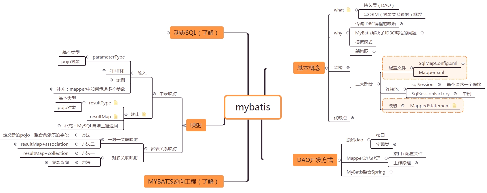

# 参考

[**原** **MyBatis框架的学习(七)——MyBatis逆向工程自动生成代码**](https://blog.csdn.net/yerenyuan_pku/article/details/71909325)

[**原** **MyBatis框架的学习(六)——MyBatis整合Spring**](https://blog.csdn.net/yerenyuan_pku/article/details/71904315)

[**原** **MyBatis框架的学习(五)——一对一关联映射和一对多关联映射**](https://blog.csdn.net/yerenyuan_pku/article/details/71894172)

[**原** **MyBatis框架的学习(四)——Mapper.xml文件中的输入和输出映射以及动态sql**](https://blog.csdn.net/yerenyuan_pku/article/details/71893689)

[**原** **MyBatis框架的学习(三)——Dao层开发方法**](https://blog.csdn.net/yerenyuan_pku/article/details/71700957)

[**原** **MyBatis框架的学习(二)——MyBatis架构与入门**](https://blog.csdn.net/yerenyuan_pku/article/details/71699515)

[**原** **MyBatis框架的学习(一)——MyBatis介绍**](https://blog.csdn.net/yerenyuan_pku/article/details/71699343)