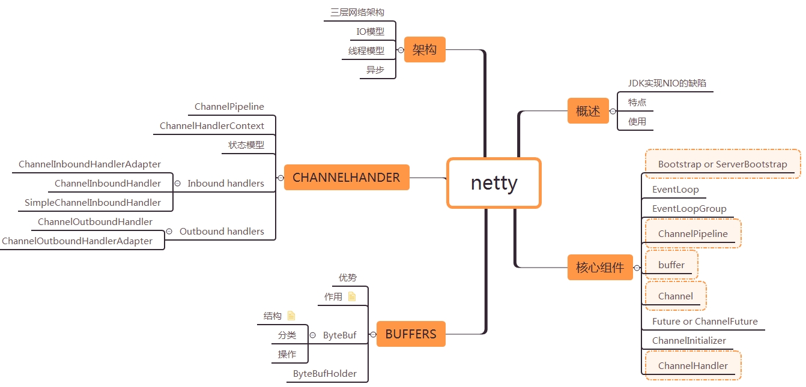

# Table of Contents

* [概述](#概述)
  * [JDK 原生 NIO 程序的问题](#jdk-原生-nio-程序的问题)
  * [特点](#特点)
  * [使用场景](#使用场景)
* [架构](#架构)
  * [三层网络架构](#三层网络架构)
  * [I/O 模型](#io-模型)
  * [线程模型](#线程模型)
  * [异步设计](#异步设计)
  * [执行流程](#执行流程)
* [组件](#组件)
  * [功能特性](#功能特性)
  * [模块组件](#模块组件)
* [可靠性](#可靠性)
  * [链路有效性检测](#链路有效性检测)
  * [流量整形](#流量整形)
  * [优雅停机](#优雅停机)
* [粘包](#粘包)
  * [什么是粘包现象](#什么是粘包现象)
  * [为什么出现粘包现象](#为什么出现粘包现象)
  * [什么时候需要处理粘包现象](#什么时候需要处理粘包现象)
  * [如何处理粘包现象](#如何处理粘包现象)
* [参考](#参考)

# 概述

Netty 是一个异步事件驱动的网络应用程序框架，用于快速开发可维护的高性能协议服务器和客户端。

## JDK 原生 NIO 程序的问题

JDK 原生也有一套网络应用程序 API，但是存在一系列问题，主要如下：

- NIO 的类库和 API 繁杂，使用麻烦。你需要熟练掌握 Selector、ServerSocketChannel、SocketChannel、ByteBuffer 等。
- 需要具备其他的额外技能做铺垫。例如熟悉 Java 多线程编程，因为 NIO 编程涉及到 Reactor 模式，你必须对多线程和网路编程非常熟悉，才能编写出高质量的 NIO 程序。
- 可靠性能力补齐，开发工作量和难度都非常大。例如客户端面临断连重连、网络闪断、半包读写、失败缓存、网络拥塞和异常码流的处理等等。 NIO 编程的特点是功能开发相对容易，但是可靠性能力补齐工作量和难度都非常大。
- JDK NIO 的 Bug。例如臭名昭著的 Epoll Bug，它会导致 Selector 空轮询，最终导致 CPU 100%。 官方声称在 JDK 1.6 版本的 update 18 修复了该问题，但是直到 JDK 1.7 版本该问题仍旧存在，只不过该 Bug 发生概率降低了一些而已，它并没有被根本解决。

## 特点

Netty 对 JDK 自带的 NIO 的 API 进行封装，解决上述问题，主要特点有：

- 设计优雅，适用于各种传输类型的统一 API 阻塞和非阻塞 Socket；基于灵活且可扩展的事件模型，可以清晰地分离关注点；高度可定制的线程模型 - 单线程，一个或多个线程池；真正的无连接数据报套接字支持（自 3.1 起）。
- 使用方便，详细记录的 Javadoc，用户指南和示例；没有其他依赖项，JDK 5（Netty 3.x）或 6（Netty 4.x）就足够了。
- 高性能，吞吐量更高，延迟更低；减少资源消耗；最小化不必要的内存复制。
- 安全，完整的 SSL/TLS 和 StartTLS 支持。
- 社区活跃，不断更新，社区活跃，版本迭代周期短，发现的 Bug 可以被及时修复，同时，更多的新功能会被加入。

## 使用场景

Netty 常见的使用场景如下：

- 互联网行业。在分布式系统中，各个节点之间需要远程服务调用，高性能的 RPC 框架必不可少，Netty 作为异步高性能的通信框架，往往作为基础通信组件被这些 RPC 框架使用。 典型的应用有：阿里分布式服务框架 Dubbo 的 RPC 框架使用 Dubbo 协议进行节点间通信，Dubbo 协议默认使用 Netty 作为基础通信组件，用于实现各进程节点之间的内部通信。
- 游戏行业。无论是手游服务端还是大型的网络游戏，Java 语言得到了越来越广泛的应用。Netty 作为高性能的基础通信组件，它本身提供了 TCP/UDP 和 HTTP 协议栈。 非常方便定制和开发私有协议栈，账号登录服务器，地图服务器之间可以方便的通过 Netty 进行高性能的通信。
- 大数据领域。经典的 Hadoop 的高性能通信和序列化组件 Avro 的 RPC 框架，默认采用 Netty 进行跨界点通信，它的 Netty Service 基于 Netty 框架二次封装实现。

# 架构

## 三层网络架构

Netty 采用了比较典型的三层网络架构进行设计，逻辑架构图如下所示：

第一层：Reactor 通信调度层，它由一系列辅助类完成，包括 Reactor 线程 NioEventLoop 以及其父类、NioSocketChannel/NioServerSocketChannel 以及其父 类、ByteBuffer 以及由其衍生出来的各种 Buffer、Unsafe 以及其衍生出的各种内 部类等。该层的主要职责就是监听网络的读写和连接操作，负责将网络层的数据 读取到内存缓冲区中，然后触发各种网络事件，例如连接创建、连接激活、读事 件、写事件等等，将这些事件触发到 PipeLine 中，由 PipeLine 充当的职责链来 进行后续的处理。

第二层：职责链 PipeLine，它负责事件在职责链中的有序传播，同时负责动态的 编排职责链，职责链可以选择监听和处理自己关心的事件，它可以拦截处理和向 后 / 向前传播事件，不同的应用的 Handler 节点的功能也不同，通常情况下，往往 会开发编解码 Hanlder 用于消息的编解码，它可以将外部的协议消息转换成内部 的 POJO 对象，这样上层业务侧只需要关心处理业务逻辑即可，不需要感知底层 的协议差异和线程模型差异，实现了架构层面的分层隔离。

第三层：业务逻辑处理层，可以分为两类：

\1. 纯粹的业务逻辑 处理，例如订单处理。

\2. 应用层协议管理，例如 HTTP 协议、FTP 协议等。

## I/O 模型

**I/O 模型**

用什么样的通道将数据发送给对方，BIO、NIO 或者 AIO，I/O 模型在很大程度上决定了框架的性能。

**阻塞 I/O**

传统阻塞型 I/O(BIO) 可以用下图表示：

Blocking I/O

特点如下：

- 每个请求都需要独立的线程完成数据 Read，业务处理，数据 Write 的完整操作问题。
- 当并发数较大时，需要创建大量线程来处理连接，系统资源占用较大。
- 连接建立后，如果当前线程暂时没有数据可读，则线程就阻塞在 Read 操作上，造成线程资源浪费。

**I/O 复用模型**

在 I/O 复用模型中，会用到 Select，这个函数也会使进程阻塞，但是和阻塞 I/O 所不同的是这两个函数可以同时阻塞多个 I/O 操作。

而且可以同时对多个读操作，多个写操作的 I/O 函数进行检测，直到有数据可读或可写时，才真正调用 I/O 操作函数。

Netty 的非阻塞 I/O 的实现关键是基于 I/O 复用模型，这里用 Selector 对象表示：

Nonblocking I/O

Netty 的 IO 线程 NioEventLoop 由于聚合了多路复用器 Selector，可以同时并发处理成百上千个客户端连接。

当线程从某客户端 Socket 通道进行读写数据时，若没有数据可用时，该线程可以进行其他任务。

线程通常将非阻塞 IO 的空闲时间用于在其他通道上执行 IO 操作，所以单独的线程可以管理多个输入和输出通道。

由于读写操作都是非阻塞的，这就可以充分提升 IO 线程的运行效率，避免由于频繁 I/O 阻塞导致的线程挂起。

一个 I/O 线程可以并发处理 N 个客户端连接和读写操作，这从根本上解决了传统同步阻塞 I/O 一连接一线程模型，架构的性能、弹性伸缩能力和可靠性都得到了极大的提升。

数据报如何读取？读取之后的编解码在哪个线程进行，编解码后的消息如何派发，线程模型的不同，对性能的影响也非常大。

**事件驱动模型**

通常，我们设计一个事件处理模型的程序有两种思路：

- 轮询方式，线程不断轮询访问相关事件发生源有没有发生事件，有发生事件就调用事件处理逻辑。
- 事件驱动方式，发生事件，主线程把事件放入事件队列，在另外线程不断循环消费事件列表中的事件，调用事件对应的处理逻辑处理事件。事件驱动方式也被称为消息通知方式，其实是设计模式中观察者模式的思路。

以 GUI 的逻辑处理为例，说明两种逻辑的不同：

- 轮询方式，线程不断轮询是否发生按钮点击事件，如果发生，调用处理逻辑。
- 事件驱动方式，发生点击事件把事件放入事件队列，在另外线程消费的事件列表中的事件，根据事件类型调用相关事件处理逻辑。

这里借用 O'Reilly 大神关于事件驱动模型解释图：

## 线程模型

数据报如何读取？读取之后的编解码在哪个线程进行，编解码后的消息如何派发，线程模型的不同，对性能的影响也非常大。

**事件驱动模型**

通常，我们设计一个事件处理模型的程序有两种思路：

- 轮询方式，线程不断轮询访问相关事件发生源有没有发生事件，有发生事件就调用事件处理逻辑。
- 事件驱动方式，发生事件，主线程把事件放入事件队列，在另外线程不断循环消费事件列表中的事件，调用事件对应的处理逻辑处理事件。事件驱动方式也被称为消息通知方式，其实是设计模式中观察者模式的思路。

以 GUI 的逻辑处理为例，说明两种逻辑的不同：

- 轮询方式，线程不断轮询是否发生按钮点击事件，如果发生，调用处理逻辑。
- 事件驱动方式，发生点击事件把事件放入事件队列，在另外线程消费的事件列表中的事件，根据事件类型调用相关事件处理逻辑。

这里借用 O'Reilly 大神关于事件驱动模型解释图：

**事件驱动模型**

主要包括 4 个基本组件：

- 事件队列（event queue）：接收事件的入口，存储待处理事件。
- 分发器（event mediator）：将不同的事件分发到不同的业务逻辑单元。
- 事件通道（event channel）：分发器与处理器之间的联系渠道。
- 事件处理器（event processor）：实现业务逻辑，处理完成后会发出事件，触发下一步操作。

可以看出，相对传统轮询模式，事件驱动有如下优点：

- 可扩展性好，分布式的异步架构，事件处理器之间高度解耦，可以方便扩展事件处理逻辑。
- 高性能，基于队列暂存事件，能方便并行异步处理事件。

**Reactor 线程模型**

Reactor 是反应堆的意思，Reactor 模型是指通过一个或多个输入同时传递给服务处理器的服务请求的事件驱动处理模式。

服务端程序处理传入多路请求，并将它们同步分派给请求对应的处理线程，Reactor 模式也叫 Dispatcher 模式，即 I/O 多了复用统一监听事件，收到事件后分发 (Dispatch 给某进程)，是编写高性能网络服务器的必备技术之一。

Reactor 模型中有 2 个关键组成：

- Reactor，Reactor 在一个单独的线程中运行，负责监听和分发事件，分发给适当的处理程序来对 IO 事件做出反应。它就像公司的电话接线员，它接听来自客户的电话并将线路转移到适当的联系人。
- Handlers，处理程序执行 I/O 事件要完成的实际事件，类似于客户想要与之交谈的公司中的实际官员。Reactor 通过调度适当的处理程序来响应 I/O 事件，处理程序执行非阻塞操作。

Reactor 模型

取决于 Reactor 的数量和 Hanndler 线程数量的不同，Reactor 模型有 3 个变种：

- 单 Reactor 单线程。
- 单 Reactor 多线程。
- 主从 Reactor 多线程。

可以这样理解，Reactor 就是一个执行 while (true) { selector.select(); …} 循环的线程，会源源不断的产生新的事件，称作反应堆很贴切。

篇幅关系，这里不再具体展开 Reactor 特性、优缺点比较，有兴趣的读者可以参考我之前另外一篇文章：《理解高性能网络模型》。

**Netty 线程模型**

Netty 主要基于主从 Reactors 多线程模型（如下图）做了一定的修改，其中主从 Reactor 多线程模型有多个 Reactor：

- MainReactor 负责客户端的连接请求，并将请求转交给 SubReactor。
- SubReactor 负责相应通道的 IO 读写请求。
- 非 IO 请求（具体逻辑处理）的任务则会直接写入队列，等待 worker threads 进行处理。

这里引用 Doug Lee 大神的 Reactor 介绍：Scalable IO in Java 里面关于主从 Reactor 多线程模型的图：

## 异步设计

异步处理能够使我们更加有效的使用各种资源。它启动一个任务后，这个任务并不会一直在那里“等”，直到任务处理结束（即不会阻塞在那里）。取而代之的却是，任务启动，任务执行过程中，你可以去做其他的处理。当任务处理过程结束时，你会收到任务处理结束的一个通知。 

**CallBack**
CallBack是异步编程常用的一种技术。 CallBack被传入某个方法中，该方法执行结束，则调用CallBack。类似的
技术，在javascript中被广泛使用 

这些回调方法，可以从一个调用者线程放入到其他的不同线程中。因此，无法保证究竟在什么时候会回调用到
FetchCallback中的哪个方法。
回调方式面临一个这样的问题，即 当具有不同回调方法的异步方法，链式的放在一起时（即）， 很容易导致代
码的混淆，易读性很差。 当然，代码易用性和可读性是两码事。例如，基于Javascript的Node.js，虽然大量的使用
回调方式；但是，却能很方便的使用它去写应用，代码可读性也很好。

**Futures**

第二中方式就是使用Futures。 Future是一种抽象，它表示在某个条件下，这个值变得有效或者可用。 Future对象
要么表示某个计算结果，要么就表示计算失败的某种异常  

某些时候，使用Future会显得不太优雅，因为你不得不隔一段时间就去检查一下Future的状态以观察它是否执行完成；相比之下， callback则不会这样，它实在某种执行完成后，直接去触发某种相应的操作。

**Netty同时使用了这两种实现方式，从而提供相对更好的异步能力。** 

## 执行流程

**服务端**：

1、创建 ServerBootStrap 实例

2、设置并绑定 Reactor 线程池：EventLoopGroup，EventLoop 就是处理所有注册到本线程的 Selector 上面的 Channel

3、设置并绑定服务端的 channel

4、5、创建处理网络事件的 ChannelPipeline 和 handler，网络时间以流的形式在其中流转，handler 完成多数的功能定制：比如编解码 SSl 安全认证

6、绑定并启动监听端口

7、当轮训到准备就绪的 channel 后，由 Reactor 线程：NioEventLoop 执行 pipline 中的方法，最终调度并执行 channelHandler 

**客户端**

# 组件

## 功能特性

Netty 功能特性如下：

- 传输服务，支持 BIO 和 NIO。
- 容器集成，支持 OSGI、JBossMC、Spring、Guice 容器。
- 协议支持，HTTP、Protobuf、二进制、文本、WebSocket 等一系列常见协议都支持。还支持通过实行编码解码逻辑来实现自定义协议。
- Core 核心，可扩展事件模型、通用通信 API、支持零拷贝的 ByteBuf 缓冲对象。

## 模块组件

**Bootstrap、ServerBootstrap**

Bootstrap 意思是引导，一个 Netty 应用通常由一个 Bootstrap 开始，主要作用是配置整个 Netty 程序，串联各个组件，Netty 中 Bootstrap 类是客户端程序的启动引导类，ServerBootstrap 是服务端启动引导类。

**Future、ChannelFuture**

正如前面介绍，在 Netty 中所有的 IO 操作都是异步的，不能立刻得知消息是否被正确处理。

但是可以过一会等它执行完成或者直接注册一个监听，具体的实现就是通过 Future 和 ChannelFutures，他们可以注册一个监听，当操作执行成功或失败时监听会自动触发注册的监听事件。

**Channel**

Netty 网络通信的组件，能够用于执行网络 I/O 操作。Channel 为用户提供：

- 当前网络连接的通道的状态（例如是否打开？是否已连接？）
- 网络连接的配置参数 （例如接收缓冲区大小）
- 提供异步的网络 I/O 操作 (如建立连接，读写，绑定端口)，异步调用意味着任何 I/O 调用都将立即返回，并且不保证在调用结束时所请求的 I/O 操作已完成。 调用立即返回一个 ChannelFuture 实例，通过注册监听器到 ChannelFuture 上，可以 I/O 操作成功、失败或取消时回调通知调用方。
- 支持关联 I/O 操作与对应的处理程序。

不同协议、不同的阻塞类型的连接都有不同的 Channel 类型与之对应。下面是一些常用的 Channel 类型：

- NioSocketChannel，异步的客户端 TCP Socket 连接。
- NioServerSocketChannel，异步的服务器端 TCP Socket 连接。
- NioDatagramChannel，异步的 UDP 连接。
- NioSctpChannel，异步的客户端 Sctp 连接。
- NioSctpServerChannel，异步的 Sctp 服务器端连接，这些通道涵盖了 UDP 和 TCP 网络 IO 以及文件 IO。

**Selector**

Netty 基于 Selector 对象实现 I/O 多路复用，通过 Selector 一个线程可以监听多个连接的 Channel 事件。

当向一个 Selector 中注册 Channel 后，Selector 内部的机制就可以自动不断地查询 (Select) 这些注册的 Channel 是否有已就绪的 I/O 事件（例如可读，可写，网络连接完成等），这样程序就可以很简单地使用一个线程高效地管理多个 Channel 。

**NioEventLoop**

NioEventLoop 中维护了一个线程和任务队列，支持异步提交执行任务，线程启动时会调用 NioEventLoop 的 run 方法，执行 I/O 任务和非 I/O 任务：

- I/O 任务，即 selectionKey 中 ready 的事件，如 accept、connect、read、write 等，由 processSelectedKeys 方法触发。
- 非 IO 任务，添加到 taskQueue 中的任务，如 register0、bind0 等任务，由 runAllTasks 方法触发。

两种任务的执行时间比由变量 ioRatio 控制，默认为 50，则表示允许非 IO 任务执行的时间与 IO 任务的执行时间相等。

**NioEventLoopGroup**

NioEventLoopGroup，主要管理 eventLoop 的生命周期，可以理解为一个线程池，内部维护了一组线程，每个线程 (NioEventLoop) 负责处理多个 Channel 上的事件，而一个 Channel 只对应于一个线程。

**ChannelHandler**

ChannelHandler 是一个接口，处理 I/O 事件或拦截 I/O 操作，并将其转发到其 ChannelPipeline(业务处理链) 中的下一个处理程序。

ChannelHandler 本身并没有提供很多方法，因为这个接口有许多的方法需要实现，方便使用期间，可以继承它的子类：

- ChannelInboundHandler 用于处理入站 I/O 事件。
- ChannelOutboundHandler 用于处理出站 I/O 操作。

或者使用以下适配器类：

- ChannelInboundHandlerAdapter 用于处理入站 I/O 事件。
- ChannelOutboundHandlerAdapter 用于处理出站 I/O 操作。
- ChannelDuplexHandler 用于处理入站和出站事件。

**ChannelHandlerContext**

保存 Channel 相关的所有上下文信息，同时关联一个 ChannelHandler 对象。

**ChannelPipline**

保存 ChannelHandler 的 List，用于处理或拦截 Channel 的入站事件和出站操作。

ChannelPipeline 实现了一种高级形式的拦截过滤器模式，使用户可以完全控制事件的处理方式，以及 Channel 中各个的 ChannelHandler 如何相互交互。

下图引用 Netty 的 Javadoc 4.1 中 ChannelPipeline 的说明，描述了 ChannelPipeline 中 ChannelHandler 通常如何处理 I/O 事件。

I/O 事件由 ChannelInboundHandler 或 ChannelOutboundHandler 处理，并通过调用 ChannelHandlerContext 中定义的事件传播方法。

例如 ChannelHandlerContext.fireChannelRead（Object）和 ChannelOutboundInvoker.write（Object）转发到其最近的处理程序。

入站事件由自下而上方向的入站处理程序处理，如图左侧所示。入站 Handler 处理程序通常处理由图底部的 I/O 线程生成的入站数据。

通常通过实际输入操作（例如 SocketChannel.read（ByteBuffer））从远程读取入站数据。

出站事件由上下方向处理，如图右侧所示。出站 Handler 处理程序通常会生成或转换出站传输，例如 write 请求。

I/O 线程通常执行实际的输出操作，例如 SocketChannel.write（ByteBuffer）。

在 Netty 中每个 Channel 都有且仅有一个 ChannelPipeline 与之对应，它们的组成关系如下：

一个 Channel 包含了一个 ChannelPipeline，而 ChannelPipeline 中又维护了一个由 ChannelHandlerContext 组成的双向链表，并且每个 ChannelHandlerContext 中又关联着一个 ChannelHandler。

入站事件和出站事件在一个双向链表中，入站事件会从链表 head 往后传递到最后一个入站的 handler，出站事件会从链表 tail 往前传递到最前一个出站的 handler，两种类型的 handler 互不干扰。

结合上面介绍的 Netty Reactor 模型，介绍服务端 Netty 的工作架构图：

服务端 Netty Reactor 工作架构图

Server 端包含 1 个 Boss NioEventLoopGroup 和 1 个 Worker NioEventLoopGroup。

NioEventLoopGroup 相当于 1 个事件循环组，这个组里包含多个事件循环 NioEventLoop，每个 NioEventLoop 包含 1 个 Selector 和 1 个事件循环线程。

每个 Boss NioEventLoop 循环执行的任务包含 3 步：

- 轮询 Accept 事件。
- 处理 Accept I/O 事件，与 Client 建立连接，生成 NioSocketChannel，并将 NioSocketChannel 注册到某个 Worker NioEventLoop 的 Selector 上。
- 处理任务队列中的任务，runAllTasks。任务队列中的任务包括用户调用 eventloop.execute 或 schedule 执行的任务，或者其他线程提交到该 eventloop 的任务。

每个 Worker NioEventLoop 循环执行的任务包含 3 步：

- 轮询 Read、Write 事件。
- 处理 I/O 事件，即 Read、Write 事件，在 NioSocketChannel 可读、可写事件发生时进行处理。
- 处理任务队列中的任务，runAllTasks。

# 可靠性

Netty 面临的可靠性挑战：

\1. 作为 RPC 框架的基础网络通信框架，一旦故障将导致无法进行远程服务（接口）调用。

\2. 作为应用层协议的基础通信框架，一旦故障将导致应用协议栈无法正常工作。

\3. 网络环境复杂（例如手游或者推送服务的 GSM/3G/WIFI 网络），故障不可避免，业务却不能中断。

从应用场景看，Netty 是基础的通信框架，一旦出现 Bug，轻则需要重启应用，重则可能导致整个业务中断。它的可靠性会影响整个业务集群的数据通信和交换，在当今以分布式为主的软件架构体系中，通信中断就意味着整个业务中断，分布式架构下对通信的可靠性要求非常高。

从运行环境看，Netty 会面临恶劣的网络环境，这就要求它自身的可靠性要足够好，平台能够解决的可靠性问题需要由 Netty 自身来解决，否则会导致上层用户关注过多的底层故障，这将降低 Netty 的易用性，同时增加用户的开发和运维成本。

Netty 的可靠性是如此重要，它的任何故障都可能会导致业务中断，蒙受巨大的经济损失。因此，Netty 在版本的迭代中不断加入新的可靠性特性来满足用户日益增长的高可靠和健壮性需求。

## 链路有效性检测

Netty 提供的心跳检测机制分为三种：

\1. 读空闲，链路持续时间 t 没有读取到任何消息；

\2. 写空闲，链路持续时间 t 没有发送任何消息；

\3. 读写空闲，链路持续时间 t 没有接收或者发送任何消息。

当网络发生单通、连接被防火墙 Hang 住、长时间 GC 或者通信线程发生非预期异常时，会导致链路不可用且不易被及时发现。特别是异常发生在凌晨业务低谷期间，当早晨业务高峰期到来时，由于链路不可用会导致瞬间的大批量业务失败或者超时，这将对系统的可靠性产生重大的威胁。

从技术层面看，要解决链路的可靠性问题，必须周期性的对链路进行有效性检测。目前最流行和通用的做法就是心跳检测。

心跳检测机制分为三个层面：

1.TCP 层面的心跳检测，即 TCP 的 Keep-Alive 机制，它的作用域是整个 TCP 协议栈；

\2. 协议层的心跳检测，主要存在于长连接协议中。例如 SMPP 协议；

\3. 应用层的心跳检测，它主要由各业务产品通过约定方式定时给对方发送心跳消息实现。

心跳检测的目的就是确认当前链路可用，对方活着并且能够正常接收和发送消息。做为高可靠的 NIO 框架，Netty 也提供了基于链路空闲的心跳检测机制：

\1. 读空闲，链路持续时间 t 没有读取到任何消息；

\2. 写空闲，链路持续时间 t 没有发送任何消息；

\3. 读写空闲，链路持续时间 t 没有接收或者发送任何消息。

## 流量整形

流量整形（Traffic Shaping）是一种主动调整流量输出速率的措施。Netty 的流量整形有两个作用：

\1. 防止由于上下游网元性能不均衡导致下游网元被压垮，业务流程中断；

\2. 防止由于通信模块接收消息过快，后端业务线程处理不及时导致的 “撑死” 问题。

流量整形的原理示意图如下：

流量整形（Traffic Shaping）是一种主动调整流量输出速率的措施。一个典型应用是基于下游网络结点的 TP 指标来控制本地流量的输出。流量整形与流量监管的主要区别在于，流量整形对流量监管中需要丢弃的报文进行缓存——通常是将它们放入缓冲区或队列内，也称流量整形（Traffic Shaping，简称 TS）。当令牌桶有足够的令牌时，再均匀的向外发送这些被缓存的报文。流量整形与流量监管的另一区别是，整形可能会增加延迟，而监管几乎不引入额外的延迟。

Netty 支持两种流量整形模式：

\1. 全局流量整形：全局流量整形的作用范围是进程级的，无论你创建了多少个 Channel，它的作用域针对所有的 Channel。用户可以通过参数设置：报文的接收速率、报文的发送速率、整形周期。

\2. 链路级流量整形：单链路流量整形与全局流量整形的最大区别就是它以单个链路为作用域，可以对不同的链路设置不同的整形策略。

## 优雅停机

Netty 的优雅停机三部曲：

\1. 不再接收新消息

\2. 退出前的预处理操作

\3. 资源的释放操作

Java 的优雅停机通常通过注册 JDK 的 ShutdownHook 来实现，当系统接收到退出指令后，首先标记系统处于退出状态，不再接收新的消息，然后将积压的消息处理完，最后调用资源回收接口将资源销毁，最后各线程退出执行。

通常优雅退出需要有超时控制机制，例如 30S，如果到达超时时间仍然没有完成退出前的资源回收等操作，则由停机脚本直接调用 kill -9 pid，强制退出。

在实际项目中，Netty 作为高性能的异步 NIO 通信框架，往往用作基础通信框架负责各种协议的接入、解析和调度等，例如在 RPC 和分布式服务框架中，往往会使用 Netty 作为内部私有协议的基础通信框架。 当应用进程优雅退出时，作为通信框架的 Netty 也需要优雅退出，主要原因如下：

尽快的释放 NIO 线程、句柄等资源；

如果使用 flush 做批量消息发送，需要将积攒在发送队列中的待发送消息发送完成；

正在 write 或者 read 的消息，需要继续处理；

设置在 NioEventLoop 线程调度器中的定时任务，需要执行或者清理。

# 参考

[这可能是目前最透彻的Netty原理架构解析](http://www.sohu.com/a/272879207_463994)

[读懂Netty的高性能架构之道](https://blog.csdn.net/weixin_37647084/article/details/64907308)

[TCP的粘包现象](https://www.cnblogs.com/qiaoconglovelife/p/5733247.html)

[彻底理解Netty，这一篇文章就够了](https://www.codercto.com/a/36104.html)

**《netty实战》**

