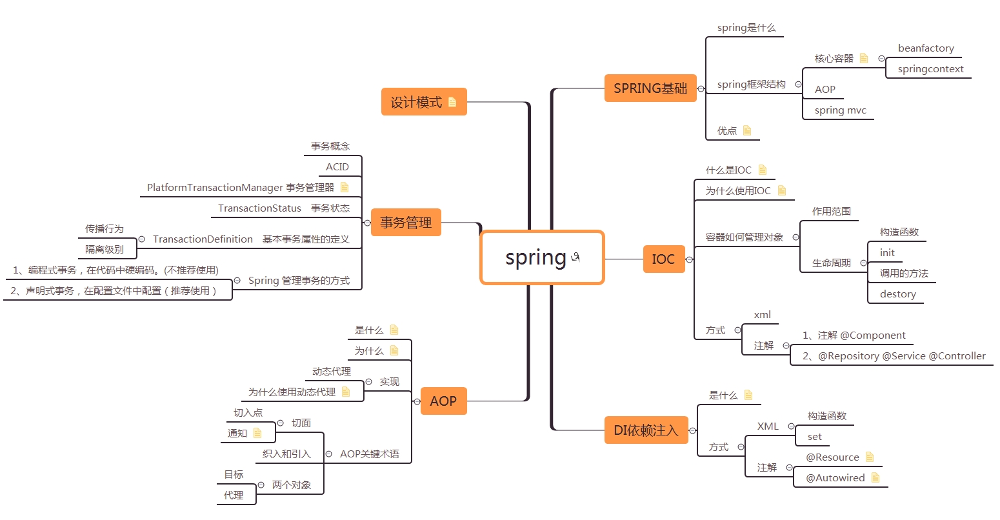

# 参考链接

[Spring详解（八）------事务管理](https://www.cnblogs.com/ysocean/p/7617620.html)   

[Spring详解（七）------AOP 注解](https://www.cnblogs.com/ysocean/p/7531083.html) 

[Spring详解（六）------AspectJ 实现AOP](https://www.cnblogs.com/ysocean/p/7507993.html) 

[Spring详解（五）------AOP](https://www.cnblogs.com/ysocean/p/7476379.html) 

[Spring详解（四）------注解配置IOC、DI](https://www.cnblogs.com/ysocean/p/7472072.html) 

[Spring详解（三）------DI依赖注入](https://www.cnblogs.com/ysocean/p/7471451.html) 

[Spring详解（二）------IOC控制反转](https://www.cnblogs.com/ysocean/p/7466217.html) 

[Spring详解（一）------概述](https://www.cnblogs.com/ysocean/p/7466191.html)

