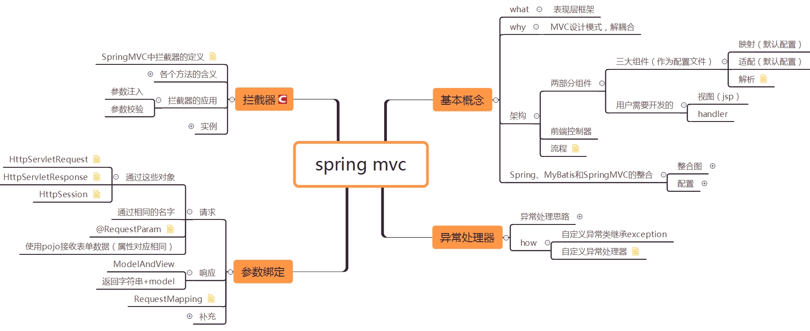

# 参考

[**原** **SpringMVC学习(十二)——SpringMVC中的拦截器**](https://blog.csdn.net/yerenyuan_pku/article/details/72567761)

[**原** **SpringMVC学习(十一)——SpringMVC实现Resultful服务**](https://blog.csdn.net/yerenyuan_pku/article/details/72514034)

[**原** **SpringMVC学习(十)——SpringMVC与前台的json数据交互**](https://blog.csdn.net/yerenyuan_pku/article/details/72514022)

[**原** **SpringMVC学习(九)——SpringMVC中实现文件上传**](https://blog.csdn.net/yerenyuan_pku/article/details/72511975)

[**原** **SpringMVC学习(八)——SpringMVC中的异常处理器**](https://blog.csdn.net/yerenyuan_pku/article/details/72511891)

[**原** **SpringMVC学习(七)——Controller类的方法返回值**](https://blog.csdn.net/yerenyuan_pku/article/details/72511844)

[**原** **SpringMVC学习(六)——SpringMVC高级参数绑定与@RequestMapping注解**](https://blog.csdn.net/yerenyuan_pku/article/details/72511749)

[**原** **SpringMVC学习(五)——SpringMVC的参数绑定**](https://blog.csdn.net/yerenyuan_pku/article/details/72511611)

[**原** **SpringMVC学习(四)——Spring、MyBatis和SpringMVC的整合**](https://blog.csdn.net/yerenyuan_pku/article/details/72231763)

[**原** **SpringMVC学习(三)——SpringMVC的配置文件**](https://blog.csdn.net/yerenyuan_pku/article/details/72231527)

[**原** **SpringMVC学习(二)——SpringMVC架构及组件**](https://blog.csdn.net/yerenyuan_pku/article/details/72231385)

[**原** **SpringMVC学习(一)——SpringMVC介绍与入门**](https://blog.csdn.net/yerenyuan_pku/article/details/72231272)
