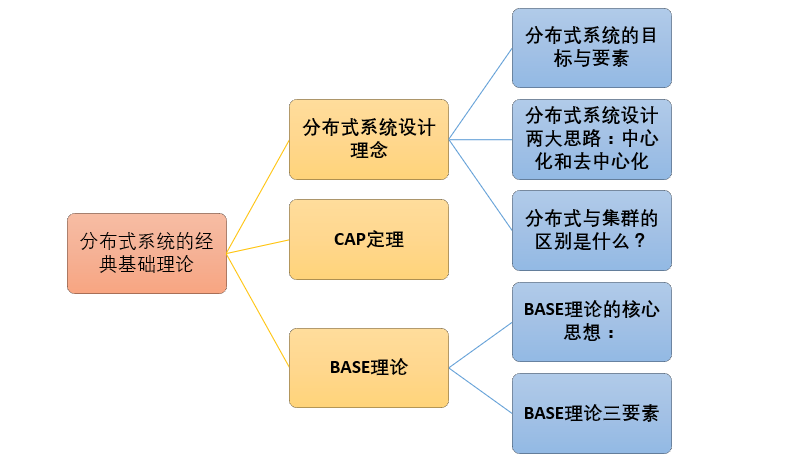

# Table of Contents

* [分布式系统的经典理论](#分布式系统的经典理论)
  * [分布式系统设计理念](#分布式系统设计理念)
    * [分布式系统的目标与要素](#分布式系统的目标与要素)
    * [分布式系统设计两大思路：中心化和去中心化](#分布式系统设计两大思路：中心化和去中心化)
  * [CAP](#cap)
    * [CAP的定义](#cap的定义)
      * [一致性](#一致性)
      * [可用性](#可用性)
      * [分区容忍性](#分区容忍性)
    * [CAP定理的证明](#cap定理的证明)
    * [权衡](#权衡)
  * [BASE](#base)
    * [基本可用](#基本可用)
    * [软状态](#软状态)
    * [最终一致性](#最终一致性)
* [分布式一致性算法](#分布式一致性算法)
  * [Paxos](#paxos)
    * [执行过程](#执行过程)
      * [1. Prepare 阶段](#1-prepare-阶段)
      * [2. Accept 阶段](#2-accept-阶段)
      * [3. Learn 阶段](#3-learn-阶段)
    * [约束条件](#约束条件)
      * [1\. 正确性](#1-正确性)
      * [2\. 可终止性](#2-可终止性)
  * [Raft](#raft)
    * [主从架构](#主从架构)
    * [leader选举](#leader选举)
      * [单个 Candidate 的竞选](#单个-candidate-的竞选)
      * [多个 Candidate 竞选](#多个-candidate-竞选)
    * [数据同步](#数据同步)
  * [ZAB](#zab)
    * [综述](#综述)
      * [介绍](#介绍)
      * [消息广播](#消息广播)
      * [崩溃恢复](#崩溃恢复)
    * [leader选举](#leader选举-1)
      * [1、Zookeeper节点状态](#1、zookeeper节点状态)
      * [2、事务ID](#2、事务id)
      * [3、Zookeeper集群初始化启动时Leader选举](#3、zookeeper集群初始化启动时leader选举)
      * [4、Zookeeper集群运行期间Leader重新选](#4、zookeeper集群运行期间leader重新选)
    * [数据同步](#数据同步-1)
    * [总结](#总结)
* [分布式锁](#分布式锁)
  * [介绍](#介绍-1)
    * [和单机锁的区别](#和单机锁的区别)
    * [什么是分布式锁？](#什么是分布式锁？)
    * [我们需要怎样的分布式锁？](#我们需要怎样的分布式锁？)
  * [实现](#实现)
    * [数据库](#数据库)
      * [基于表主键唯一做分布式锁](#基于表主键唯一做分布式锁)
      * [基于表字段版本号做分布式锁](#基于表字段版本号做分布式锁)
      * [基于数据库排他锁做分布式锁](#基于数据库排他锁做分布式锁)
    * [Redis](#redis)
      * [基于 REDIS 的 SETNX()、EXPIRE() 方法做分布式锁](#基于-redis-的-setnx、expire-方法做分布式锁)
      * [基于 REDIS 的 SETNX()、GET()、GETSET()方法做分布式锁](#基于-redis-的-setnx、get、getset方法做分布式锁)
      * [基于 REDLOCK 做分布式锁](#基于-redlock-做分布式锁)
      * [**基于 REDISSON 做分布式锁**](#基于-redisson-做分布式锁)
    * [ZooKeeper](#zookeeper)
  * [redis和zookeeper实现对比](#redis和zookeeper实现对比)
* [分布式事务](#分布式事务)
  * [介绍](#介绍-2)
    * [什么是分布式事务](#什么是分布式事务)
    * [分布式事务的产生的原因](#分布式事务的产生的原因)
    * [分布式事务的应用场景](#分布式事务的应用场景)
  * [常见的分布式事务解决方案](#常见的分布式事务解决方案)
    * [2PC](#2pc)
      * [**运行过程**](#运行过程)
    * [补偿事务（TCC）](#补偿事务（tcc）)
    * [消息事务](#消息事务)
* [参考](#参考)

# 分布式系统的经典理论

[分布式系统的经典基础理论](https://blog.csdn.net/qq_34337272/article/details/80444032)

## 分布式系统设计理念

**分布式系统架构的第一原则是不要分布**！这句话看似矛盾实则揭露了分布式系统的很多特征。

### 分布式系统的目标与要素

分布式系统的目标是提升系统的整体性能和吞吐量另外还要尽量保证分布式系统的容错性（假如增加10台服务器才达到单机运行效果2倍左右的性能，那么这个分布式系统就根本没有存在的意义）。

即使采用了分布式系统，我们也要尽力运用并发编程、高性能网络框架等等手段提升单机上的程序性能。

### 分布式系统设计两大思路：中心化和去中心化

**1）中心化设计：**

**两个角色：** 中心化的设计思想很简单，分布式集群中的节点机器按照角色分工，大体上分为两种角色： **“领导” 和 “干活的”**

**角色职责：** “领导”通常负责分发任务并监督“干活的”，发现谁太闲了，就想发设法地给其安排新任务，确保没有一个“干活的”能够偷懒，如果“领导”发现某个“干活的”因为劳累过度而病倒了，则是不会考虑先尝试“医治”他的，而是一脚踢出去，然后把他的任务分给其他人。其中微服务架构 Kubernetes 就恰好采用了这一设计思路。

**中心化设计的问题：**
1、中心化的设计存在的最大问题是“领导”的安危问题，如果“领导”出了问题，则群龙无首，整个集群就奔溃了。但我们难以同时安排两个“领导”以避免单点问题。
2、中心化设计还存在另外一个潜在的问题，既“领导”的能力问题：可以领导10个人高效工作并不意味着可以领导100个人高效工作，所以如果系统设计和实现得不好，问题就会卡在“领导”身上。

**领导安危问题的解决办法：** 大多数中心化系统都采用了主备两个“领导”的设计方案，可以是热备或者冷备，也可以是自动切换或者手动切换，而且越来越多的新系统都开始具备自动选举切换“领导”的能力，以提升系统的可用性。

**2)去中心化设计**

**众生地位平等：** 在去中心化的设计里，通常没有“领导”和“干活的”这两种角色的区分，大家的角色都是一样的，地位是平等的，全球互联网就是一个典型的去中心化的分布式系统，联网的任意节点设备宕机，都只会影响很小范围的功能。

**“去中心化”不是不要中心，而是由节点来自由选择中心。** （集群的成员会自发的举行“会议”选举新的“领导”主持工作。最典型的案例就是ZooKeeper及Go语言实现的Etcd）

**去中心化设计的问题：** 去中心化设计里最难解决的一个问题是 “**脑裂**”问题 ，这种情况的发声概率很低，但影响很大。脑裂问题，这种情况的发生概率很低，但影响很大。脑裂指一个集群由于网络的故障，被分为至少两个彼此无法通信的单独集群，此时如果两个集群都各自工作，则可能会产生严重的数据冲突和错误。一般的设计思路是，当集群判断发生了脑裂问题时，规模较小的集群就“自杀”或者拒绝服务。

**分布式与集群的区别是什么？**

分布式： 一个业务分拆多个子业务，部署在不同的服务器上

集群： 同一个业务，部署在多个服务器上。比如之前做电商网站搭的redis集群以及solr集群都是属于将redis服务器提供的缓存服务以及solr服务器提供的搜索服务部署在多个服务器上以提高系统性能、并发量解决海量存储问题。

## CAP

[分布式CAP定理，为什么不能同时满足三个特性？](https://blog.csdn.net/yeyazhishang/article/details/80758354)

[分布式基础，通俗易懂CAP](https://baijiahao.baidu.com/s?id=1615938423889367667&wfr=spider&for=pc)

分布式系统不可能同时满足一致性（C：Consistency）、可用性（A：Availability）和分区容忍性（P：Partition Tolerance），最多只能同时满足其中两项。

  
 

### CAP的定义

#### 一致性

**1、强一致性，2、弱一致性，3、最终一致性**

一致性指的是多个数据副本是否能保持一致的特性，在一致性的条件下，系统在执行数据更新操作之后能够从一致性状态转移到另一个一致性状态。

对系统的一个数据更新成功之后，如果所有用户都能够读取到最新的值，该系统就被认为具有强一致性。

#### 可用性

可用性指分布式系统在面对各种异常时可以提供正常服务的能力，可以用系统可用时间占总时间的比值来衡量，4 个 9 的可用性表示系统 99.99% 的时间是可用的。

在可用性条件下，要求系统提供的服务一直处于可用的状态，对于用户的每一个操作请求总是能够在有限的时间内返回结果。

#### 分区容忍性

网络分区指分布式系统中的节点被划分为多个区域，每个区域内部可以通信，但是区域之间无法通信。

在分区容忍性条件下，分布式系统在遇到任何网络分区故障的时候，仍然需要能对外提供一致性或者可用性的服务，除非是整个网络环境都发生了故障。

分区容错性要求能够使应用虽然是一个分布式系统，而看上去却好像是在一个可以运转正常的整体。比如现在的分布式系统中有某一个或者几个机器宕掉了，其他剩下的机器还能够正常运转满足系统需求，对于用户而言并没有什么体验上的影响。

### CAP定理的证明

现在我们就来证明一下，为什么不能同时满足三个特性？

假设有两台服务器，一台放着应用A和数据库V，一台放着应用B和数据库V，他们之间的网络可以互通，也就相当于分布式系统的两个部分。

在满足一致性的时候，两台服务器 N1和N2，一开始两台服务器的数据是一样的，DB0=DB0。在满足可用性的时候，用户不管是请求N1或者N2，都会得到立即响应。在满足分区容错性的情况下，N1和N2有任何一方宕机，或者网络不通的时候，都不会影响N1和N2彼此之间的正常运作。                                               

当用户通过N1中的A应用请求数据更新到服务器DB0后，这时N1中的服务器DB0变为DB1，通过分布式系统的数据同步更新操作，N2服务器中的数据库V0也更新为了DB1，这时，用户通过B向数据库发起请求得到的数据就是即时更新后的数据DB1。

上面是正常运作的情况，但分布式系统中，最大的问题就是网络传输问题，现在假设一种极端情况，N1和N2之间的网络断开了，但我们仍要支持这种网络异常，也就是满足分区容错性，那么这样能不能同时满足一致性和可用性呢？

假设N1和N2之间通信的时候网络突然出现故障，有用户向N1发送数据更新请求，那N1中的数据DB0将被更新为DB1，由于网络是断开的，N2中的数据库仍旧是DB0；

如果这个时候，有用户向N2发送数据读取请求，由于数据还没有进行同步，应用程序没办法立即给用户返回最新的数据DB1，怎么办呢？有二种选择，第一，牺牲数据一致性，响应旧的数据DB0给用户；第二，牺牲可用性，阻塞等待，直到网络连接恢复，数据更新操作完成之后，再给用户响应最新的数据DB1。

上面的过程比较简单，但也说明了要满足分区容错性的分布式系统，只能在一致性和可用性两者中，选择其中一个。也就是说分布式系统不可能同时满足三个特性。

### 权衡

在分布式系统中，分区容忍性必不可少，因为需要总是假设网络是不可靠的。因此，CAP 理论实际上是要在可用性和一致性之间做权衡。

可用性和一致性往往是冲突的，很难使它们同时满足。在多个节点之间进行数据同步时，

- 为了保证一致性（CP），不能访问未同步完成的节点，也就失去了部分可用性；
- 为了保证可用性（AP），允许读取所有节点的数据，但是数据可能不一致。

**最常见的实践是AP+最终一致**

## BASE

BASE 是基本可用（Basically Available）、软状态（Soft State）和最终一致性（Eventually Consistent）三个短语的缩写。

BASE 理论是对 CAP 中一致性和可用性权衡的结果，它的核心思想是：**即使无法做到强一致性，但每个应用都可以根据自身业务特点，采用适当的方式来使系统达到最终一致性**。也就是牺牲数据的一致性来满足系统的高可用性，系统中一部分数据不可用或者不一致时，仍需要保持系统整体“主要可用”。

### 基本可用

指分布式系统在出现故障的时候，保证核心可用，允许损失部分可用性。

响应时间上的损失:正常情况下，一个在线搜索引擎需要在0.5秒之内返回给用户相应的查询结果，但由于出现故障，查询结果的响应时间增加了1~2秒

系统功能上的损失：正常情况下，在一个电子商务网站上进行购物的时候，消费者几乎能够顺利完成每一笔订单，但是在一些节日大促购物高峰的时候，由于消费者的购物行为激增，为了保护购物系统的稳定性，部分消费者可能会被引导到一个降级页面

### 软状态

指允许系统中的数据存在中间状态，并认为该中间状态不会影响系统整体可用性，即允许系统不同节点的数据副本之间进行同步的过程存在时延。

### 最终一致性

最终一致性强调的是系统中所有的数据副本，在经过一段时间的同步后，最终能达到一致的状态。

ACID 要求强一致性，通常运用在传统的数据库系统上。而 BASE 要求最终一致性，通过牺牲强一致性来达到可用性，通常运用在大型分布式系统中。

在实际的分布式场景中，不同业务单元和组件对一致性的要求是不同的，因此 ACID 和 BASE 往往会结合在一起使用。

# 分布式一致性算法

## Paxos

用于达成共识性问题，即对多个节点产生的值，该算法能保证只选出唯一一个值。

主要有三类节点：

- 提议者（Proposer）：提议一个值；
- 接受者（Acceptor）：对每个提议进行投票；
- 告知者（Learner）：被告知投票的结果，不参与投票过程。

  
 

### 执行过程

规定一个提议包含两个字段：[n, v]，其中 n 为序号（具有唯一性），v 为提议值。

#### 1. Prepare 阶段

下图演示了两个 Proposer 和三个 Acceptor 的系统中运行该算法的初始过程，每个 Proposer 都会向所有 Acceptor 发送 Prepare 请求。

  
 

当 Acceptor 接收到一个 Prepare 请求，包含的提议为 [n1, v1]，并且之前还未接收过 Prepare 请求，那么发送一个 Prepare 响应，设置当前接收到的提议为 [n1, v1]，并且保证以后不会再接受序号小于 n1 的提议。

如下图，Acceptor X 在收到 [n=2, v=8] 的 Prepare 请求时，由于之前没有接收过提议，因此就发送一个 [no previous] 的 Prepare 响应，设置当前接收到的提议为 [n=2, v=8]，并且保证以后不会再接受序号小于 2 的提议。其它的 Acceptor 类似。

  
 

如果 Acceptor 接收到一个 Prepare 请求，包含的提议为 [n2, v2]，并且之前已经接收过提议 [n1, v1]。如果 n1 > n2，那么就丢弃该提议请求；否则，发送 Prepare 响应，该 Prepare 响应包含之前已经接收过的提议 [n1, v1]，设置当前接收到的提议为 [n2, v2]，并且保证以后不会再接受序号小于 n2 的提议。

如下图，Acceptor Z 收到 Proposer A 发来的 [n=2, v=8] 的 Prepare 请求，由于之前已经接收过 [n=4, v=5] 的提议，并且 n > 2，因此就抛弃该提议请求；Acceptor X 收到 Proposer B 发来的 [n=4, v=5] 的 Prepare 请求，因为之前接收到的提议为 [n=2, v=8]，并且 2 <= 4，因此就发送 [n=2, v=8] 的 Prepare 响应，设置当前接收到的提议为 [n=4, v=5]，并且保证以后不会再接受序号小于 4 的提议。Acceptor Y 类似。

  
 

#### 2. Accept 阶段

当一个 Proposer 接收到超过一半 Acceptor 的 Prepare 响应时，就可以发送 Accept 请求。

Proposer A 接收到两个 Prepare 响应之后，就发送 [n=2, v=8] Accept 请求。该 Accept 请求会被所有 Acceptor 丢弃，因为此时所有 Acceptor 都保证不接受序号小于 4 的提议。

Proposer B 过后也收到了两个 Prepare 响应，因此也开始发送 Accept 请求。需要注意的是，Accept 请求的 v 需要取它收到的最大提议编号对应的 v 值，也就是 8。因此它发送 [n=4, v=8] 的 Accept 请求。

  
 

#### 3. Learn 阶段

Acceptor 接收到 Accept 请求时，如果序号大于等于该 Acceptor 承诺的最小序号，那么就发送 Learn 提议给所有的 Learner。当 Learner 发现有大多数的 Acceptor 接收了某个提议，那么该提议的提议值就被 Paxos 选择出来。

  
 

### 约束条件

#### 1\. 正确性

指只有一个提议值会生效。

因为 Paxos 协议要求每个生效的提议被多数 Acceptor 接收，并且 Acceptor 不会接受两个不同的提议，因此可以保证正确性。

#### 2\. 可终止性

指最后总会有一个提议生效。

Paxos 协议能够让 Proposer 发送的提议朝着能被大多数 Acceptor 接受的那个提议靠拢，因此能够保证可终止性。

## Raft

[深入浅出剖析分布式一致性算法](https://baijiahao.baidu.com/s?id=1597294744568311877&wfr=spider&for=pc)

Raft 也是分布式一致性协议，主要是用来竞选主节点。（Redis）

### 主从架构

如果数据可以写入多个节点，那么维护一致性就会很困难

### leader选举

#### 单个 Candidate 的竞选

有三种节点：Follower、Candidate 和 Leader。Leader 会周期性的发送心跳包给 Follower。每个 Follower 都设置了一个随机的竞选超时时间，一般为 150ms\~300ms，如果在这个时间内没有收到 Leader 的心跳包，就会变成 Candidate，进入竞选阶段。

- 下图展示一个分布式系统的最初阶段，此时只有 Follower 没有 Leader。Node A 等待一个随机的竞选超时时间之后，没收到 Leader 发来的心跳包，因此进入竞选阶段。

  
 

- 此时 Node A 发送投票请求给其它所有节点。

  
 

- 其它节点会对请求进行回复，如果超过一半的节点回复了，那么该 Candidate 就会变成 Leader。

  
 

- 之后 Leader 会周期性地发送心跳包给 Follower，Follower 接收到心跳包，会重新开始计时。

  
 

#### 多个 Candidate 竞选

- 如果有多个 Follower 成为 Candidate，并且所获得票数相同，那么就需要重新开始投票。例如下图中 Node B 和 Node D 都获得两票，需要重新开始投票。

  
 

- 由于每个节点设置的随机竞选超时时间不同，因此下一次再次出现多个 Candidate 并获得同样票数的概率很低。

  
 

### 数据同步

- 来自客户端的修改都会被传入 Leader。注意该修改还未被提交，只是写入日志中。

  
 

- Leader 会把修改复制到所有 Follower。

  
 

- Leader 会等待大多数的 Follower 也进行了修改，然后才将修改提交。

  
 

- 此时 Leader 会通知的所有 Follower 让它们也提交修改，此时所有节点的值达成一致。

  
 

## ZAB

[分布式理论(七)—— 一致性协议之 ZAB](https://www.cnblogs.com/stateis0/p/9062133.html)

[简单理解Zookeeper的Leader选举](https://blog.csdn.net/chengyuqiang/article/details/79190061)

### 综述

#### 介绍

1. ZAB 协议全称：Zookeeper Atomic Broadcast（Zookeeper 原子广播协议）。
2. Zookeeper 是一个为分布式应用提供高效且可靠的分布式协调服务。在解决分布式一致性方面，Zookeeper 并没有使用 Paxos ，而是采用了 ZAB 协议。
3. ZAB 协议定义：**ZAB 协议是为分布式协调服务 Zookeeper 专门设计的一种支持 崩溃恢复 和 原子广播 协议**。下面我们会重点讲这两个东西。
4. 基于该协议，Zookeeper 实现了一种 `主备模式` 的系统架构来保持集群中各个副本之间`数据一致性`。具体如下图所示：

上图显示了 Zookeeper 如何处理集群中的数据。所有客户端写入数据都是写入到 主进程（称为 Leader）中，然后，由 Leader 复制到备份进程（称为 Follower）中。从而保证数据一致性。从设计上看，和 Raft 类似。

1. 那么复制过程又是如何的呢？复制过程类似 2PC，ZAB 只需要 Follower 有一半以上返回 Ack 信息就可以执行提交，大大减小了同步阻塞。也提高了可用性。

简单介绍完，开始重点介绍 `消息广播` 和 `崩溃恢复`。**整个 Zookeeper 就是在这两个模式之间切换。** 简而言之，当 Leader 服务可以正常使用，就进入消息广播模式，当 Leader 不可用时，则进入崩溃恢复模式。

#### 消息广播

ZAB 协议的消息广播过程使用的是一个原子广播协议，类似一个 **二阶段提交过程**。对于客户端发送的写请求，全部由 Leader 接收，Leader 将请求封装成一个事务 Proposal，将其发送给所有 Follwer ，然后，根据所有 Follwer 的反馈，如果超过半数成功响应，则执行 commit 操作（先提交自己，再发送 commit 给所有 Follwer）。

**基本上，整个广播流程分为 3 步骤：**

1.将数据都复制到 Follwer 中

1. 等待 Follwer 回应 Ack，最低超过半数即成功

1. 当超过半数成功回应，则执行 commit ，同时提交自己

通过以上 3 个步骤，就能够保持集群之间数据的一致性。实际上，在 Leader 和 Follwer 之间还有一个消息队列，用来解耦他们之间的耦合，避免同步，实现异步解耦。

**还有一些细节：**

1. Leader 在收到客户端请求之后，会将这个请求封装成一个事务，并给这个事务分配一个全局递增的唯一 ID，称为事务ID（ZXID），ZAB 兮协议需要保证事务的顺序，因此必须将每一个事务按照 ZXID 进行先后排序然后处理。
2. 在 Leader 和 Follwer 之间还有一个消息队列，用来解耦他们之间的耦合，解除同步阻塞。
3. zookeeper集群中为保证任何所有进程能够有序的顺序执行，只能是 Leader 服务器接受写请求，即使是 Follower 服务器接受到客户端的请求，也会转发到 Leader 服务器进行处理。
4. 实际上，这是一种简化版本的 2PC，不能解决单点问题。等会我们会讲述 ZAB 如何解决单点问题（即 Leader 崩溃问题）。

#### 崩溃恢复

刚刚我们说消息广播过程中，Leader 崩溃怎么办？还能保证数据一致吗？如果 Leader 先本地提交了，然后 commit 请求没有发送出去，怎么办？

实际上，当 Leader 崩溃，即进入我们开头所说的崩溃恢复模式（崩溃即：Leader 失去与过半 Follwer 的联系）。下面来详细讲述。

假设1：Leader 在复制数据给所有 Follwer 之后崩溃，怎么办？
假设2：Leader 在收到 Ack 并提交了自己，同时发送了部分 commit 出去之后崩溃怎么办？

**针对这些问题，ZAB 定义了 2 个原则：**

1. ZAB 协议确保那些已经在 Leader 提交的事务最终会被所有服务器提交。
2. ZAB 协议确保丢弃那些只在 Leader 提出/复制，但没有提交的事务。

所以，ZAB 设计了下面这样一个选举算法：
**能够确保提交已经被 Leader 提交的事务，同时丢弃已经被跳过的事务。**

针对这个要求，如果让 Leader 选举算法能够保证新选举出来的 Leader 服务器拥有集群总所有机器编号（即 ZXID 最大）的事务，那么就能够保证这个新选举出来的 Leader 一定具有所有已经提交的提案。
而且这么做有一个好处是：**可以省去 Leader 服务器检查事务的提交和丢弃工作的这一步操作。**

这样，我们刚刚假设的两个问题便能够解决。假设 1 最终会丢弃调用没有提交的数据，假设 2 最终会同步所有服务器的数据。这个时候，就引出了一个问题，如何同步？

### leader选举

Leader选举是保证分布式数据一致性的关键所在。Leader选举分为Zookeeper集群初始化启动时选举和Zookeeper集群运行期间Leader重新选举两种情况。在讲解Leader选举前先了解一下Zookeeper节点4种可能状态和事务ID概念。

#### 1、Zookeeper节点状态

​	LOOKING：寻找Leader状态，处于该状态需要进入选举流程
​	LEADING：领导者状态，处于该状态的节点说明是角色已经是Leader
​	FOLLOWING：跟随者状态，表示Leader已经选举出来，当前节点角色是follower
​	OBSERVER：观察者状态，表明当前节点角色是observer

#### 2、事务ID

ZooKeeper状态的每次变化都接收一个ZXID（ZooKeeper事务id）形式的标记。ZXID是一个64位的数字，由Leader统一分配，全局唯一，不断递增。 
ZXID展示了所有的ZooKeeper的变更顺序。每次变更会有一个唯一的zxid，如果zxid1小于zxid2说明zxid1在zxid2之前发生。

#### 3、Zookeeper集群初始化启动时Leader选举

若进行Leader选举，则至少需要两台机器，这里选取3台机器组成的服务器集群为例。 
初始化启动期间Leader选举流程如下图所示。 

在集群初始化阶段，当有一台服务器ZK1启动时，其单独无法进行和完成Leader选举，当第二台服务器ZK2启动时，此时两台机器可以相互通信，每台机器都试图找到Leader，于是进入Leader选举过程。选举过程开始，过程如下： 
　　(1) 每个Server发出一个投票。由于是初始情况，ZK1和ZK2都会将自己作为Leader服务器来进行投票，每次投票会包含所推举的服务器的myid和ZXID，使用(myid, ZXID)来表示，此时ZK1的投票为(1, 0)，ZK2的投票为(2, 0)，然后各自将这个投票发给集群中其他机器。 
　　(2) 接受来自各个服务器的投票。集群的每个服务器收到投票后，首先判断该投票的有效性，如检查是否是本轮投票、是否来自LOOKING状态的服务器。 
　　(3) 处理投票。针对每一个投票，服务器都需要将别人的投票和自己的投票进行比较，规则如下 
　　　　· 优先检查ZXID。ZXID比较大的服务器优先作为Leader。 
　　　　· 如果ZXID相同，那么就比较myid。myid较大的服务器作为Leader服务器。 
　　对于ZK1而言，它的投票是(1, 0)，接收ZK2的投票为(2, 0)，首先会比较两者的ZXID，均为0，再比较myid，此时ZK2的myid最大，于是ZK2胜。ZK1更新自己的投票为(2, 0)，并将投票重新发送给ZK2。 
　　(4) 统计投票。每次投票后，服务器都会统计投票信息，判断是否已经有过半机器接受到相同的投票信息，对于ZK1、ZK2而言，都统计出集群中已经有两台机器接受了(2, 0)的投票信息，此时便认为已经选出ZK2作为Leader。 
　　(5) 改变服务器状态。一旦确定了Leader，每个服务器就会更新自己的状态，如果是Follower，那么就变更为FOLLOWING，如果是Leader，就变更为LEADING。当新的Zookeeper节点ZK3启动时，发现已经有Leader了，不再选举，直接将直接的状态从LOOKING改为FOLLOWING。

#### 4、Zookeeper集群运行期间Leader重新选

在Zookeeper运行期间，如果Leader节点挂了，那么整个Zookeeper集群将暂停对外服务，进入新一轮Leader选举。 
假设正在运行的有ZK1、ZK2、ZK3三台服务器，当前Leader是ZK2，若某一时刻Leader挂了，此时便开始Leader选举。选举过程如下图所示。 

　　(1) 变更状态。Leader挂后，余下的非Observer服务器都会讲自己的服务器状态变更为LOOKING，然后开始进入Leader选举过程。 
　　(2) 每个Server会发出一个投票。在运行期间，每个服务器上的ZXID可能不同，此时假定ZK1的ZXID为124，ZK3的ZXID为123；在第一轮投票中，ZK1和ZK3都会投自己，产生投票(1, 124)，(3, 123)，然后各自将投票发送给集群中所有机器。 
　　(3) 接收来自各个服务器的投票。与启动时过程相同。 
　　(4) 处理投票。与启动时过程相同，由于ZK1事务ID大，ZK1将会成为Leader。 
　　(5) 统计投票。与启动时过程相同。 
		(6) 改变服务器的状态。与启动时过程相同。

###  数据同步

当崩溃恢复之后，需要在正式工作之前（接收客户端请求），Leader 服务器首先确认事务是否都已经被过半的 Follwer 提交了，即是否完成了数据同步。目的是为了保持数据一致。

当所有的 Follwer 服务器都成功同步之后，Leader 会将这些服务器加入到可用服务器列表中。

实际上，Leader 服务器处理或丢弃事务都是依赖着 ZXID 的，那么这个 ZXID 如何生成呢？

答：在 ZAB 协议的事务编号 ZXID 设计中，ZXID 是一个 64 位的数字，其中低 32 位可以看作是一个简单的递增的计数器，针对客户端的每一个事务请求，Leader 都会产生一个新的事务 Proposal 并对该计数器进行 + 1 操作。

而高 32 位则代表了 Leader 服务器上取出本地日志中最大事务 Proposal 的 ZXID，并从该 ZXID 中解析出对应的 epoch 值，然后再对这个值加一。

高 32 位代表了每代 Leader 的唯一性，低 32 代表了每代 Leader 中事务的唯一性。同时，也能让 Follwer 通过高 32 位识别不同的 Leader。简化了数据恢复流程。

基于这样的策略：当 Follower 链接上 Leader 之后，Leader 服务器会根据自己服务器上最后被提交的 ZXID 和 Follower 上的 ZXID 进行比对，比对结果要么回滚，要么和 Leader 同步。

### 总结

到了总结的时刻了。

ZAB 协议和我们之前看的 Raft 协议实际上是有相似之处的，比如都有一个 Leader，用来保证一致性（Paxos 并没有使用 Leader 机制保证一致性）。再有采取过半即成功的机制保证服务可用（实际上 Paxos 和 Raft 都是这么做的）。

ZAB 让整个 Zookeeper 集群在两个模式之间转换，消息广播和崩溃恢复，消息广播可以说是一个简化版本的 2PC，通过崩溃恢复解决了 2PC 的单点问题，通过队列解决了 2PC 的同步阻塞问题。

而支持崩溃恢复后数据准确性的就是数据同步了，数据同步基于事务的 ZXID 的唯一性来保证。通过 + 1 操作可以辨别事务的先后顺序。

# 分布式锁

[Java分布式锁看这篇就够了](https://www.cnblogs.com/seesun2012/p/9214653.html)

[分布式锁的几种实现方式](https://www.cnblogs.com/austinspark-jessylu/p/8043726.html)

[Redis分布式锁的实现原理【石杉的架构笔记】](https://mp.weixin.qq.com/s?__biz=MzU0OTk3ODQ3Ng==&mid=2247483893&idx=1&sn=32e7051116ab60e41f72e6c6e29876d9&chksm=fba6e9f6ccd160e0c9fa2ce4ea1051891482a95b1483a63d89d71b15b33afcdc1f2bec17c03c&scene=21#wechat_redirect)

[【七张图】彻底讲清楚ZooKeeper分布式锁的实现原理【石杉的架构笔记】](https://mp.weixin.qq.com/s?__biz=MzU0OTk3ODQ3Ng==&mid=2247484027&idx=1&sn=d3ec68611979f436c2b90fe222ad8633&chksm=fba6ea78ccd1636ee23a387c845eacd92f2a185747b22068192d9fd818c5c166e3057dd43673&scene=21#wechat_redirect)

[每秒上千订单场景下的分布式锁高并发优化实践！【石杉的架构笔记】](https://mp.weixin.qq.com/s?__biz=MzU0OTk3ODQ3Ng==&mid=2247483926&idx=1&sn=2a796ef514dea15790e45d79d233833e&chksm=fba6ea15ccd1630387b8738a00a8c1dc6ae0c535305ec4d6e3c76d64eff48bf1d47ae0eaea07&scene=21#wechat_redirect)

## 介绍

### 和单机锁的区别

- 分布式与单机情况下最大的不同在于其不是多线程而是`多进程`。
- 多线程由于可以共享堆内存，因此可以简单的采取内存作为标记存储位置。而进程之间甚至可能都不在同一台物理机上，因此需要将标记存储在一个所有进程都能看到的地方。

### 什么是分布式锁？

- 当在分布式模型下，**数据只有一份**（或有限制），此时需要利用锁的技术控制某一时刻修改数据的进程数。
- 与单机模式下的锁不仅需要保证进程可见，还需要考虑进程与锁之间的网络问题。（我觉得分布式情况下之所以问题变得复杂，主要就是需要考虑到网络的延时和不可靠。。。一个大坑）
- 分布式锁还是可以将标记存在内存，只是该内存不是某个进程分配的内存而是公共内存如 Redis、Memcache。至于利用数据库、文件等做锁与单机的实现是一样的，只要保证标记能互斥就行。

### 我们需要怎样的分布式锁？

- 可以保证在分布式部署的应用集群中，同一个方法在同一时间只能被一台机器-上的一个线程执行。
- 这把锁要是一把**可重入锁（**避免死锁）
- 这把锁最好是一把**阻塞锁**（根据业务需求考虑要不要这条）
- 这把锁最好是一把**公平锁**（根据业务需求考虑要不要这条）
- **有高可用的获取锁和释放锁功能**
- **获取锁和释放锁的性能要好**

## 实现

在单机场景下，可以使用语言的内置锁来实现进程同步。但是在分布式场景下，需要同步的进程可能位于不同的节点上，那么就需要使用分布式锁。

阻塞锁通常使用互斥量来实现：

- 互斥量为 0 表示有其它进程在使用锁，此时处于锁定状态；
- 互斥量为 1 表示未锁定状态。

1 和 0 可以用一个整型值表示，也可以用某个数据是否存在表示。

### 数据库

#### 基于表主键唯一做分布式锁

**思路：**利用主键唯一的特性，如果有多个请求同时提交到数据库的话，数据库会保证只有一个操作可以成功，那么我们就可以认为操作成功的那个线程获得了该方法的锁，当方法执行完毕之后，想要释放锁的话，删除这条数据库记录即可。

上面这种简单的实现有以下几个问题：

- 这把锁强依赖数据库的可用性，数据库是一个单点，一旦数据库挂掉，会导致业务系统不可用。
- 这把锁没有失效时间，一旦解锁操作失败，就会导致锁记录一直在数据库中，其他线程无法再获得到锁。
- 这把锁只能是非阻塞的，因为数据的 insert操作，一旦插入失败就会直接报错。没有获得锁的线程并不会进入排队队列，要想再次获得锁就要再次触发获得锁操作。
- 这把锁是非重入的，同一个线程在没有释放锁之前无法再次获得该锁。因为数据中数据已经存在了。
- 这把锁是非公平锁，所有等待锁的线程凭运气去争夺锁。
- 在 MySQL 数据库中采用主键冲突防重，在大并发情况下有可能会造成锁表现象。

当然，我们也可以有其他方式解决上面的问题。

- 数据库是单点？搞两个数据库，数据之前双向同步，一旦挂掉快速切换到备库上。
- 没有失效时间？只要做一个定时任务，每隔一定时间把数据库中的超时数据清理一遍。
- 非阻塞的？搞一个 while 循环，直到 insert 成功再返回成功。
- 非重入的？在数据库表中加个字段，记录当前获得锁的机器的主机信息和线程信息，那么下次再获取锁的时候先查询数据库，如果当前机器的主机信息和线程信息在数据库可以查到的话，直接把锁分配给他就可以了。
- 非公平的？再建一张中间表，将等待锁的线程全记录下来，并根据创建时间排序，只有最先创建的允许获取锁。
- 比较好的办法是在程序中生产主键进行防重。

#### 基于表字段版本号做分布式锁

这个策略源于 mysql 的 mvcc 机制，使用这个策略其实本身没有什么问题，唯一的问题就是对数据表侵入较大，我们要为每个表设计一个版本号字段，然后写一条判断 sql 每次进行判断，增加了数据库操作的次数，在高并发的要求下，对数据库连接的开销也是无法忍受的。

#### 基于数据库排他锁做分布式锁

在查询语句后面增加`for update`，数据库会在查询过程中给数据库表增加排他锁 (注意： InnoDB 引擎在加锁的时候，只有通过索引进行检索的时候才会使用行级锁，否则会使用表级锁。这里我们希望使用行级锁，就要给要执行的方法字段名添加索引，值得注意的是，这个索引一定要创建成唯一索引，否则会出现多个重载方法之间无法同时被访问的问题。重载方法的话建议把参数类型也加上。)。当某条记录被加上排他锁之后，其他线程无法再在该行记录上增加排他锁。

我们可以认为获得排他锁的线程即可获得分布式锁，当获取到锁之后，可以执行方法的业务逻辑，执行完方法之后，通过`connection.commit()`操作来释放锁。

这种方法可以有效的解决上面提到的无法释放锁和阻塞锁的问题。

- 阻塞锁？ `for update`语句会在执行成功后立即返回，在执行失败时一直处于阻塞状态，直到成功。
- 锁定之后服务宕机，无法释放？使用这种方式，服务宕机之后数据库会自己把锁释放掉。

但是还是无法直接解决数据库单点和可重入问题。

这里还可能存在另外一个问题，虽然我们对方法字段名使用了唯一索引，并且显示使用 for update 来使用行级锁。但是，MySQL 会对查询进行优化，即便在条件中使用了索引字段，但是否使用索引来检索数据是由 MySQL 通过判断不同执行计划的代价来决定的，如果 MySQL 认为全表扫效率更高，比如对一些很小的表，它就不会使用索引，这种情况下 InnoDB 将使用表锁，而不是行锁。如果发生这种情况就悲剧了。。。

还有一个问题，就是我们要使用排他锁来进行分布式锁的 lock，那么一个排他锁长时间不提交，就会占用数据库连接。一旦类似的连接变得多了，就可能把数据库连接池撑爆。

优缺点

**优点**：简单，易于理解

**缺点**：会有各种各样的问题（操作数据库需要一定的开销，使用数据库的行级锁并不一定靠谱，性能不靠谱）

### Redis 

#### 基于 REDIS 的 SETNX()、EXPIRE() 方法做分布式锁

------

**setnx()**

------

setnx 的含义就是 SET if Not Exists，其主要有两个参数 setnx(key, value)。该方法是原子的，如果 key 不存在，则设置当前 key 成功，返回 1；如果当前 key 已经存在，则设置当前 key 失败，返回 0。

**expire()**

------

expire 设置过期时间，要注意的是 setnx 命令不能设置 key 的超时时间，只能通过 expire() 来对 key 设置。

**使用步骤**

------

1、setnx(lockkey, 1) 如果返回 0，则说明占位失败；如果返回 1，则说明占位成功

2、expire() 命令对 lockkey 设置超时时间，为的是避免死锁问题。

3、执行完业务代码后，可以通过 delete 命令删除 key。

这个方案其实是可以解决日常工作中的需求的，但从技术方案的探讨上来说，可能还有一些可以完善的地方。**比如，如果在第一步 setnx 执行成功后，在 expire() 命令执行成功前，发生了宕机的现象，那么就依然会出现死锁的问题，所以如果要对其进行完善的话，可以使用 redis 的 setnx()、get() 和 getset() 方法来实现分布式锁。**

#### 基于 REDIS 的 SETNX()、GET()、GETSET()方法做分布式锁

------

这个方案的背景主要是在 setnx() 和 expire() 的方案上针对可能存在的死锁问题，做了一些优化。

**getset()**

------

这个命令主要有两个参数 getset(key，newValue)。该方法是原子的，对 key 设置 newValue 这个值，并且返回 key 原来的旧值。假设 key 原来是不存在的，那么多次执行这个命令，会出现下边的效果：

- getset(key, “value1”) 返回 null 此时 key 的值会被设置为 value1
- getset(key, “value2”) 返回 value1 此时 key 的值会被设置为 value2
- 依次类推！

**使用步骤**

------

- setnx(lockkey, 当前时间+过期超时时间)，如果返回 1，则获取锁成功；如果返回 0 则没有获取到锁，转向 2。
- get(lockkey) 获取值 oldExpireTime ，并将这个 value 值与当前的系统时间进行比较，如果小于当前系统时间，则认为这个锁已经超时，可以允许别的请求重新获取，转向 3。
- 计算 newExpireTime = 当前时间+过期超时时间，然后 getset(lockkey, newExpireTime) 会返回当前 lockkey 的值currentExpireTime。
- 判断 currentExpireTime 与 oldExpireTime 是否相等，如果相等，说明当前 getset 设置成功，获取到了锁。如果不相等，说明这个锁又被别的请求获取走了，那么当前请求可以直接返回失败，或者继续重试。
- 在获取到锁之后，当前线程可以开始自己的业务处理，当处理完毕后，比较自己的处理时间和对于锁设置的超时时间，如果小于锁设置的超时时间，则直接执行 delete 释放锁；如果大于锁设置的超时时间，则不需要再锁进行处理。

#### 基于 REDLOCK 做分布式锁

------

Redlock 是 Redis 的作者 antirez 给出的集群模式的 Redis 分布式锁，它基于 N 个完全独立的 Redis 节点（通常情况下 N 可以设置成 5）。

算法的步骤如下：

- 1、客户端获取当前时间，以毫秒为单位。
- 2、客户端尝试获取 N 个节点的锁，（每个节点获取锁的方式和前面说的缓存锁一样），N 个节点以相同的 key 和 value 获取锁。客户端需要设置接口访问超时，接口超时时间需要远远小于锁超时时间，比如锁自动释放的时间是 10s，那么接口超时大概设置 5-50ms。这样可以在有 redis 节点宕机后，访问该节点时能尽快超时，而减小锁的正常使用。
- 3、客户端计算在获得锁的时候花费了多少时间，方法是用当前时间减去在步骤一获取的时间，只有客户端获得了超过 3 个节点的锁，而且获取锁的时间小于锁的超时时间，客户端才获得了分布式锁。
- 4、客户端获取的锁的时间为设置的锁超时时间减去步骤三计算出的获取锁花费时间。
- 5、如果客户端获取锁失败了，客户端会依次删除所有的锁。

使用 Redlock 算法，可以保证在挂掉最多 2 个节点的时候，分布式锁服务仍然能工作，这相比之前的数据库锁和缓存锁大大提高了可用性，由于 redis 的高效性能，分布式缓存锁性能并不比数据库锁差。

**优点：** 性能高

**缺点：**

失效时间设置多长时间为好？如何设置的失效时间太短，方法没等执行完，锁就自动释放了，那么就会产生并发问题。如果设置的时间太长，其他获取锁的线程就可能要平白的多等一段时间。

#### **基于 REDISSON 做分布式锁**

上面的这个问题 ——> 失效时间设置多长时间为好？这个问题在 redisson 的做法是：每获得一个锁时，只设置一个很短的超时时间，同时起一个线程在每次快要到超时时间时去刷新锁的超时时间。在释放锁的同时结束这个线程。

**（1）加锁机制**

咱们来看上面那张图，现在某个客户端要加锁。如果该客户端面对的是一个redis cluster集群，他首先会根据hash节点选择一台机器。

**这里注意**，仅仅只是选择一台机器！这点很关键！

紧接着，就会发送一段lua脚本到redis上，那段lua脚本如下所示：

.webp)

为啥要用lua脚本呢？

因为一大坨复杂的业务逻辑，可以通过封装在lua脚本中发送给redis，保证这段复杂业务逻辑执行的**原子性**。

那么，这段lua脚本是什么意思呢？

**KEYS[1]**代表的是你加锁的那个key，比如说：

RLock lock = redisson.getLock("myLock");

这里你自己设置了加锁的那个锁key就是“myLock”。

**ARGV[1]**代表的就是锁key的默认生存时间，默认30秒。

**ARGV[2]**代表的是加锁的客户端的ID，类似于下面这样：

8743c9c0-0795-4907-87fd-6c719a6b4586:1

给大家解释一下，第一段if判断语句，就是用“exists myLock”命令判断一下，如果你要加锁的那个锁key不存在的话，你就进行加锁。

如何加锁呢？很简单，用下面的命令：

hset myLock 

​    8743c9c0-0795-4907-87fd-6c719a6b4586:1 1

通过这个命令设置一个hash数据结构，这行命令执行后，会出现一个类似下面的数据结构：

.webp)

上述就代表“8743c9c0-0795-4907-87fd-6c719a6b4586:1”这个客户端对“myLock”这个锁key完成了加锁。

接着会执行“pexpire myLock 30000”命令，设置myLock这个锁key的生存时间是30秒。

好了，到此为止，ok，加锁完成了。

**（2）锁互斥机制**

那么在这个时候，如果客户端2来尝试加锁，执行了同样的一段lua脚本，会咋样呢？

很简单，第一个if判断会执行“exists myLock”，发现myLock这个锁key已经存在了。

接着第二个if判断，判断一下，myLock锁key的hash数据结构中，是否包含客户端2的ID，但是明显不是的，因为那里包含的是客户端1的ID。

所以，客户端2会获取到pttl myLock返回的一个数字，这个数字代表了myLock这个锁key的**剩余生存时间。**比如还剩15000毫秒的生存时间。

此时客户端2会进入一个while循环，不停的尝试加锁。

**（3）watch dog自动延期机制**

客户端1加锁的锁key默认生存时间才30秒，如果超过了30秒，客户端1还想一直持有这把锁，怎么办呢？

简单！只要客户端1一旦加锁成功，就会启动一个watch dog看门狗，**他是一个后台线程，会每隔10秒检查一下**，如果客户端1还持有锁key，那么就会不断的延长锁key的生存时间。

**（4）可重入加锁机制**

那如果客户端1都已经持有了这把锁了，结果可重入的加锁会怎么样呢？

第一个if判断肯定不成立，“exists myLock”会显示锁key已经存在了。

第二个if判断会成立，因为myLock的hash数据结构中包含的那个ID，就是客户端1的那个ID，也就是“8743c9c0-0795-4907-87fd-6c719a6b4586:1”

此时就会执行可重入加锁的逻辑，他会用：

incrby myLock 

 8743c9c0-0795-4907-87fd-6c71a6b4586:1 1

通过这个命令，对客户端1的加锁次数，累加1。

此时myLock数据结构变为下面这样：

.webp)

大家看到了吧，那个myLock的hash数据结构中的那个客户端ID，就对应着加锁的次数

**（5）释放锁机制**

如果执行lock.unlock()，就可以释放分布式锁，此时的业务逻辑也是非常简单的。

其实说白了，就是每次都对myLock数据结构中的那个加锁次数减1。

如果发现加锁次数是0了，说明这个客户端已经不再持有锁了，此时就会用：

“del myLock”命令，从redis里删除这个key。

然后呢，另外的客户端2就可以尝试完成加锁了。

这就是所谓的**分布式锁的开源Redisson框架的实现机制。**

一般我们在生产系统中，可以用Redisson框架提供的这个类库来基于redis进行分布式锁的加锁与释放锁。

**（6）上述Redis分布式锁的缺点**

其实上面那种方案最大的问题，就是如果你对某个redis master实例，写入了myLock这种锁key的value，此时会异步复制给对应的master slave实例。

但是这个过程中一旦发生redis master宕机，主备切换，redis slave变为了redis master。

接着就会导致，客户端2来尝试加锁的时候，在新的redis master上完成了加锁，而客户端1也以为自己成功加了锁。

此时就会导致多个客户端对一个分布式锁完成了加锁。

这时系统在业务语义上一定会出现问题，**导致各种脏数据的产生**。

所以这个就是redis cluster，或者是redis master-slave架构的**主从异步复制**导致的redis分布式锁的最大缺陷：在redis master实例宕机的时候，可能导致多个客户端同时完成加锁。

### ZooKeeper

首先大家看看下面的图，如果现在有两个客户端一起要争抢zk上的一把分布式锁，会是个什么场景？

.webp)

咱们就假设客户端A抢先一步，对zk发起了加分布式锁的请求，这个加锁请求是用到了zk中的一个特殊的概念，叫做**“临时顺序节点”。**

简单来说，就是直接在"my_lock"这个锁节点下，创建一个顺序节点，这个顺序节点有zk内部自行维护的一个节点序号。

比如说，第一个客户端来搞一个顺序节点，zk内部会给起个名字叫做：xxx-000001。然后第二个客户端来搞一个顺序节点，zk可能会起个名字叫做：xxx-000002。大家注意一下，**最后一个数字都是依次递增的**，从1开始逐次递增。zk会维护这个顺序。

所以这个时候，假如说客户端A先发起请求，就会搞出来一个顺序节点，大家看下面的图，Curator框架大概会弄成如下的样子：

.webp)

大家看，客户端A发起一个加锁请求，先会在你要加锁的node下搞一个临时顺序节点，这一大坨长长的名字都是Curator框架自己生成出来的。

然后，那个最后一个数字是"1"。大家注意一下，因为客户端A是第一个发起请求的，所以给他搞出来的顺序节点的序号是"1"。

接着客户端A创建完一个顺序节点。还没完，他会查一下"**my_lock**"这个锁节点下的所有子节点，并且这些子节点是按照序号排序的，这个时候他大概会拿到这么一个集合：

.webp)

接着客户端A会走一个关键性的判断，就是说：唉！兄弟，这个集合里，我创建的那个顺序节点，是不是排在第一个啊？

如果是的话，那我就可以加锁了啊！因为明明我就是第一个来创建顺序节点的人，所以我就是第一个尝试加分布式锁的人啊！

bingo！**加锁成功**！大家看下面的图，再来直观的感受一下整个过程。

.webp)

接着假如说，客户端A都加完锁了，客户端B过来想要加锁了，这个时候他会干一样的事儿：先是在"**my_lock**"这个锁节点下创建一个**临时顺序节点**，此时名字会变成类似于：

.webp)

**大家看看下面的图：**

.webp)

客户端B因为是第二个来创建顺序节点的，所以zk内部会维护序号为"2"。

接着客户端B会走加锁判断逻辑，查询"**my_lock**"锁节点下的所有子节点，按序号顺序排列，此时他看到的类似于：

.webp)

同时检查自己创建的顺序节点，是不是集合中的第一个？

明显不是啊，此时第一个是客户端A创建的那个顺序节点，序号为"01"的那个。**所以加锁失败**！

加锁失败以后，客户端B就会通过ZK的API，**对他的上一个顺序节点加一个监听器。**zk天然就可以实现对某个节点的监听。

我们举例说明，客户端B的顺序节点是：

.webp)

他的上一个顺序节点，不就是下面这个吗？

.webp)

也就是客户端A创建的那个顺序节点！

所以，客户端B会对：

.webp)

这个节点加一个监听器，监听这个节点是否被删除等变化！

说了那么多，老规矩，给大家来一张图，直观的感受一下：

.webp)

接着，客户端A加锁之后，可能处理了一些代码逻辑，然后就会释放锁。那么，释放锁是个什么过程呢？

其实很简单，就是把自己在zk里创建的那个顺序节点，也就是：

.webp)

这个节点给删除。

删除了那个节点之后，zk会负责通知监听这个节点的监听器，也就是客户端B之前加的那个监听器，说：兄弟，你监听的那个节点被删除了，有人释放了锁。

我们一起来看看下面的图，体会一下这个过程：

.webp)

此时客户端B的监听器感知到了上一个顺序节点被删除，也就是排在他之前的某个客户端释放了锁。

此时，就会通知客户端B重新尝试去获取锁，也就是获取"**my_lock**"节点下的子节点集合，此时为：

.webp)

集合里此时只有客户端B创建的唯一的一个顺序节点了！

然后呢，客户端B一判断，**发现自己居然是集合中的第一个顺序节点**，bingo！可以加锁了！**直接完成加锁**，运行后续的业务代码即可，运行完了之后再次释放锁。

最后，再给大家来一张图，大伙儿顺着图仔细的捋一捋这整个过程：

.webp)

**三、总结**

其实如果有客户端C、客户端D等N个客户端争抢一个zk分布式锁，原理都是类似的。

- **大家都是上来直接创建一个锁节点下的一个接一个的临时顺序节点**
- **如果自己不是第一个节点，就对自己上一个节点加监听器**
- **只要上一个节点释放锁，自己就排到前面去了，相当于是一个排队机制。**

而且用临时顺序节点的另外一个用意就是，如果某个客户端创建临时顺序节点之后，不小心自己宕机了也没关系，zk感知到那个客户端宕机，会自动删除对应的临时顺序节点，相当于自动释放锁，或者是自动取消自己的排队。

**优点：**

有效的解决单点问题，不可重入问题，非阻塞问题以及锁无法释放的问题。实现起来较为简单。

**缺点：**

性能上可能并没有缓存服务那么高，因为每次在创建锁和释放锁的过程中，都要动态创建、销毁临时节点来实现锁功能。ZK 中创建和删除节点只能通过 Leader 服务器来执行，然后将数据同步到所有的 Follower 机器上。

## redis和zookeeper实现对比

- redis 分布式锁，其实**需要自己不断去尝试获取锁**，比较消耗性能。
- zk 分布式锁，获取不到锁，注册个监听器即可，不需要不断主动尝试获取锁，性能开销较小。
- zk需要动态的创建临时节点

另外一点就是，如果是 redis 获取锁的那个客户端 出现 bug 挂了，那么只能等待超时时间之后才能释放锁；而 zk 的话，因为创建的是临时 znode，只要客户端挂了，znode 就没了，此时就自动释放锁。

redis 分布式锁大家没发现好麻烦吗？遍历上锁，计算时间等等......zk 的分布式锁语义清晰实现简单。

所以先不分析太多的东西，就说这两点，我个人实践认为 zk 的分布式锁比 redis 的分布式锁牢靠、而且模型简单易用。

# 分布式事务

- [深入理解分布式事务](http://www.codeceo.com/article/distributed-transaction.html)
- [分布式事务？No, 最终一致性](https://zhuanlan.zhihu.com/p/25933039)
- [聊聊分布式事务，再说说解决方案](https://www.cnblogs.com/savorboard/p/distributed-system-transaction-consistency.html) 　　

## 介绍

### 什么是分布式事务

分布式事务就是指事务的参与者、支持事务的服务器、资源服务器以及事务管理器分别位于不同的分布式系统的不同节点之上。以上是百度百科的解释，简单的说，就是一次大的操作由不同的小操作组成，这些小的操作分布在不同的服务器上，且属于不同的应用，分布式事务需要保证这些小操作要么全部成功，要么全部失败。本质上来说，分布式事务就是为了保证不同数据库的数据一致性。

### 分布式事务的产生的原因

**数据库分库分表**

当数据库单表一年产生的数据超过1000W，那么就要考虑分库分表，具体分库分表的原理在此不做解释，以后有空详细说，简单的说就是原来的一个数据库变成了多个数据库。这时候，如果一个操作既访问01库，又访问02库，而且要保证数据的一致性，那么就要用到分布式事务。

**应用SOA化**

所谓的SOA化，就是业务的服务化。比如原来单机支撑了整个电商网站，现在对整个网站进行拆解，分离出了订单中心、用户中心、库存中心。对于订单中心，有专门的数据库存储订单信息，用户中心也有专门的数据库存储用户信息，库存中心也会有专门的数据库存储库存信息。这时候如果要同时对订单和库存进行操作，那么就会涉及到订单数据库和库存数据库，为了保证数据一致性，就需要用到分布式事务。

以上两种情况表象不同，但是本质相同，都是因为要操作的数据库变多了！

### 分布式事务的应用场景

**支付**

最经典的场景就是支付了，一笔支付，是对买家账户进行扣款，同时对卖家账户进行加钱，这些操作必须在一个事务里执行，要么全部成功，要么全部失败。而对于买家账户属于买家中心，对应的是买家数据库，而卖家账户属于卖家中心，对应的是卖家数据库，对不同数据库的操作必然需要引入分布式事务。

**在线下单**

买家在电商平台下单，往往会涉及到两个动作，一个是扣库存，第二个是更新订单状态，库存和订单一般属于不同的数据库，需要使用分布式事务保证数据一致性。

## 常见的分布式事务解决方案

### 2PC

在分布式系统中，每一个机器节点虽然都能够明确地知道自己在进行事务操作过程中的结果是成功或失败，但却无法直接获取到其他分布式节点的操作结果。因此，当一个事务操作需要跨越多个分布式节点的时候，为了保持事务处理的ACID特性，就需要引入一个称为“协调者（Coordinator）”的组件来统一调度所有分布式节点的执行逻辑，这些被调度的分布式节点则被称为“参与者”（Participant）。协调者负责调度参与者的行为，并最终决定这些参与者是否要把事务真正进行提交。

**运行过程**

**1、准备阶段**

协调者询问参与者事务是否执行成功，参与者执行事务，参与者发回事务执行结果。

  
 

**2、提交阶段**

如果事务在每个参与者上都执行成功，事务协调者发送通知让参与者提交事务；否则，协调者发送通知让参与者回滚事务。

需要注意的是，在准备阶段，参与者执行了事务，但是还未提交。只有在提交阶段接收到协调者发来的通知后，才进行提交或者回滚。

  
 

**优点：** 尽量保证了数据的强一致，适合对数据强一致要求很高的关键领域。（其实也不能100%保证强一致）

**缺点：** 实现复杂，牺牲了可用性，对性能影响较大，不适合高并发高性能场景，

**同步阻塞**

所有事务参与者在等待其它参与者响应的时候都处于同步阻塞状态，无法进行其它操作。

 **单点问题**

协调者在 2PC 中起到非常大的作用，发生故障将会造成很大影响。特别是在阶段二发生故障，所有参与者会一直等待，无法完成其它操作。

 **数据不一致**

在阶段二，如果协调者只发送了部分 Commit 消息，此时网络发生异常，那么只有部分参与者接收到 Commit 消息，也就是说只有部分参与者提交了事务，使得系统数据不一致。

**太过保守**

任意一个节点失败就会导致整个事务失败，没有完善的容错机制。

### 补偿事务（TCC）

是两阶段提交的一个变种。TCC 其实就是采用的补偿机制，其核心思想是：针对每个操作，都要注册一个与其对应的确认和补偿（撤销）操作。它分为三个阶段：

- Try 阶段主要是对业务系统做检测及资源预留
- Confirm 阶段主要是对业务系统做确认提交，Try阶段执行成功并开始执行 Confirm阶段时，默认 Confirm阶段是不会出错的。即：只要Try成功，Confirm一定成功。
- Cancel 阶段主要是在业务执行错误，需要回滚的状态下执行的业务取消，预留资源释放。

1）假入 Bob 要向 Smith 转账，思路大概是：
我们有一个本地方法，里面依次调用
1、首先在 Try 阶段，要先调用远程接口把 Smith 和 Bob 的钱给冻结起来。
2、在 Confirm 阶段，执行远程调用的转账的操作，转账成功进行解冻。
3、如果第2步执行成功，那么转账成功，如果第二步执行失败，则调用远程冻结接口对应的解冻方法 (Cancel)。

2）在线下单，Try阶段会去扣库存，Confirm阶段则是去更新订单状态，如果更新订单失败，则进入Cancel阶段，会去恢复库存。总之，TCC就是通过代码人为实现了两阶段提交，不同的业务场景所写的代码都不一样，复杂度也不一样，因此，这种模式并不能很好地被复用。

**优点：** 跟2PC比起来，实现以及流程相对简单了一些，但数据的一致性比2PC也要差一些

**缺点：** 缺点还是比较明显的，在2,3步中都有可能失败。TCC属于应用层的一种补偿方式，所以需要程序员在实现的时候多写很多补偿的代码，在一些场景中，一些业务流程可能用TCC不太好定义及处理。

### 消息事务

所谓的消息事务就是基于消息中间件的两阶段提交，本质上是对消息中间件的一种特殊利用，它是将本地事务和发消息放在了一个分布式事务里，保证要么本地操作成功成功并且对外发消息成功，要么两者都失败，开源的RocketMQ就支持这一特性，具体原理如下：

1、A系统向消息中间件发送一条预备消息
2、消息中间件保存预备消息并返回成功
3、A执行本地事务
4、A发送提交消息给消息中间件

通过以上4步完成了一个消息事务。对于以上的4个步骤，每个步骤都可能产生错误，下面一一分析：

- 步骤一出错，则整个事务失败，不会执行A的本地操作
- 步骤二出错，则整个事务失败，不会执行A的本地操作
- 步骤三出错，这时候需要回滚预备消息，怎么回滚？答案是A系统实现一个消息中间件的回调接口，消息中间件会去不断执行回调接口，检查A事务执行是否执行成功，如果失败则回滚预备消息
- 步骤四出错，这时候A的本地事务是成功的，那么消息中间件要回滚A吗？答案是不需要，其实通过回调接口，消息中间件能够检查到A执行成功了，这时候其实不需要A发提交消息了，消息中间件可以自己对消息进行提交，从而完成整个消息事务

基于消息中间件的两阶段提交往往用在高并发场景下，将一个分布式事务拆成一个消息事务（A系统的本地操作+发消息）+B系统的本地操作，其中B系统的操作由消息驱动，只要消息事务成功，那么A操作一定成功，消息也一定发出来了，这时候B会收到消息去执行本地操作，如果本地操作失败，消息会重投，直到B操作成功，这样就变相地实现了A与B的分布式事务。原理如下：

虽然上面的方案能够完成A和B的操作，但是A和B并不是严格一致的，而是最终一致的，我们在这里牺牲了一致性，换来了性能的大幅度提升。当然，这种玩法也是有风险的，如果B一直执行不成功，那么一致性会被破坏，具体要不要玩，还是得看业务能够承担多少风险。

**优点：** 一种非常经典的实现，避免了分布式事务，实现了最终一致性。

**缺点：** 消息表会耦合到业务系统中，如果没有封装好的解决方案，会有很多杂活需要处理。

# 参考

[**JavaGuide**](https://github.com/Snailclimb/JavaGuide/blob/master/docs/system-design/website-architecture/%E5%88%86%E5%B8%83%E5%BC%8F.md)

[CS-Notes](https://github.com/CyC2018/CS-Notes/blob/master/notes/%E5%88%86%E5%B8%83%E5%BC%8F.md#%E4%B8%89cap)
