# Table of Contents

* [大型网站架构演化](#大型网站架构演化)
  * [传统架构](#传统架构)
    * [500并发：单机](#500并发：单机)
    * [1000并发：集群](#1000并发：集群)
  * [分布式架构（10000并发）](#分布式架构（10000并发）)
  * [基于SOA的架构](#基于soa的架构)
* [大型网站架构模式](#大型网站架构模式)
  * [综述](#综述)
  * [分层](#分层)
  * [分割](#分割)
  * [分布式](#分布式)
  * [集群](#集群)
  * [缓存](#缓存)
  * [异步](#异步)
  * [冗余](#冗余)
  * [自动化](#自动化)
  * [安全](#安全)
* [大型网站核心架构要素](#大型网站核心架构要素)
  * [综述](#综述-1)
  * [性能](#性能)
    * [性能测试指标](#性能测试指标)
    * [性能测试方法](#性能测试方法)
      * [性能测试报告](#性能测试报告)
    * [Web前端性能优化](#web前端性能优化)
      * [浏览器访问优化](#浏览器访问优化)
      * [CDN加速](#cdn加速)
      * [反向代理](#反向代理)
    * [应用服务器性能优化](#应用服务器性能优化)
      * [分布式缓存](#分布式缓存)
      * [异步操作](#异步操作)
      * [使用集群](#使用集群)
      * [代码优化](#代码优化)
    * [存储性能优化](#存储性能优化)
  * [可用性](#可用性)
    * [网站可用性的度量与考核](#网站可用性的度量与考核)
      * [度量](#度量)
      * [考核](#考核)
    * [网站架构高可用（总述）](#网站架构高可用（总述）)
    * [应用层高可用](#应用层高可用)
      * [通过负载均衡进行无状态服务失效转移](#通过负载均衡进行无状态服务失效转移)
      * [应用服务器集群的Session管理](#应用服务器集群的session管理)
    * [服务层高可用](#服务层高可用)
    * [数据层高可用](#数据层高可用)
      * [CAP原理](#cap原理)
      * [数据备份](#数据备份)
      * [失效转移](#失效转移)
  * [伸缩性](#伸缩性)
    * [网站架构的伸缩性设计](#网站架构的伸缩性设计)
      * [不同功能进行物理分离实现伸缩](#不同功能进行物理分离实现伸缩)
      * [单一功能通过集群规模实现伸缩](#单一功能通过集群规模实现伸缩)
    * [应用服务器集群的伸缩性设计](#应用服务器集群的伸缩性设计)
      * [HTTP重定向负载均衡](#http重定向负载均衡)
      * [DNS域名解析负载均衡](#dns域名解析负载均衡)
      * [反向代理负载均衡](#反向代理负载均衡)
      * [IP负载均衡](#ip负载均衡)
      * [数据链路层负载均衡](#数据链路层负载均衡)
      * [负载均衡算法](#负载均衡算法)
    * [分布式缓存集群的伸缩性设计](#分布式缓存集群的伸缩性设计)
    * [数据存储服务集群的伸缩性设计](#数据存储服务集群的伸缩性设计)
      * [关系数据库集群的伸缩性设计](#关系数据库集群的伸缩性设计)
      * [NoSQL数据库集群的伸缩性设计](#nosql数据库集群的伸缩性设计)
  * [扩展性](#扩展性)
    * [扩展性与伸缩性](#扩展性与伸缩性)
    * [构建可扩展的网站架构](#构建可扩展的网站架构)
    * [利用分布式消息队列降低系统耦合性](#利用分布式消息队列降低系统耦合性)
    * [利用分布式服务打造可复用的业务平台](#利用分布式服务打造可复用的业务平台)
  * [安全性](#安全性)
    * [网站应用攻击与防御](#网站应用攻击与防御)
      * [XSS攻击](#xss攻击)
      * [注入攻击](#注入攻击)
      * [CSRF攻击](#csrf攻击)
    * [Web应用防火墙](#web应用防火墙)
    * [网站安全漏洞扫描](#网站安全漏洞扫描)
    * [信息加密技术及密钥安全管理](#信息加密技术及密钥安全管理)
      * [单向散列加密](#单向散列加密)
      * [对称加密](#对称加密)
      * [非对称加密](#非对称加密)
    * [密钥安全管理](#密钥安全管理)
* [参考资料](#参考资料)


# 大型网站架构演化

## 传统架构

一个节点部署所有的系统模块

### 500并发：单机

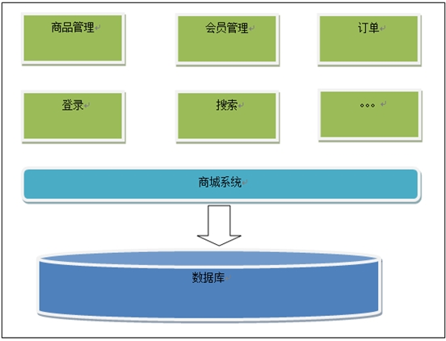

 

存在的问题：

​       1、功能耦合度高

​       2、系统维护成本高

​       3、如果并发量大，无法解决高并发的问题


###  1000并发：集群

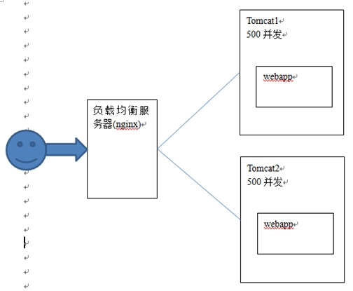

 

存在的问题：

1、系统无法有效进行水平扩展（集群不能针对功能模块）

2、用户存在重复登录的问题

针对第二点：需要session共享，是以session广播的形式，比较消耗资源，宽带。


如果要达到10000并发

**需要20台服务器做tomcat集群。当tomcat集群中节点数量增加，服务能力先增加后下降。**

**所以集群中节点数量不能太多，一般也就5个左右。**

 

## 分布式架构（10000并发）

​       需要按照功能点把系统拆分，拆分成独立的功能工程，可以单独为某一个节点添加服务器，需要系统之间配合才能完成整个业务逻辑这就叫做分布式。

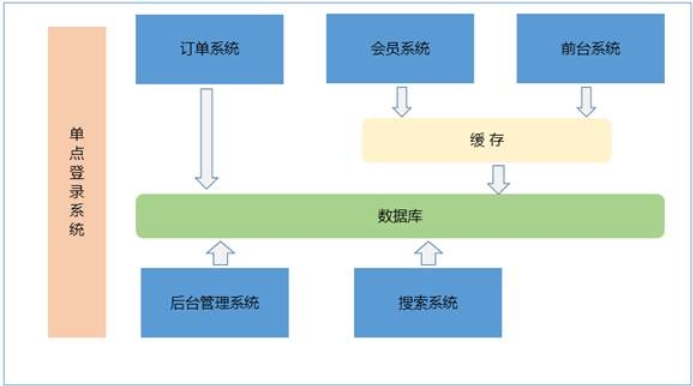

 

集群：相当于同一个工程代码拷贝多份部署到多台服务器，每台服务器单独独立部署运行。

分布式架构：把系统按照模块拆分成多个子系统；多个子系统相互协作才能完成业务流程系统之间需要进行通信。


优点：

1、把模块拆分，使用接口通信(RPC调用)，降低模块之间的耦合度。

2、把项目拆分成若干个子项目，不同的团队负责不同的子项目。

3、增加功能时只需要再增加一个子项目，调用其他系统的接口就可以。

4、可以灵活的进行分布式部署。

 

缺点：

1、系统之间交互需要使用远程通信，需要开发接口，增加工作量。

2、各个模块有一些通用的业务逻辑无法公用。


## 基于SOA的架构

​       SOA：Service Oriented Architecture面向服务的架构。也就是把工程都拆分成服务层工程、表现层工程。服务层中包含业务逻辑，只需要对外提供服务即可。表现层只需要处理和页面的交互，业务逻辑都是调用服务层的服务来实现。工程都可以独立部署。

**随着业务复杂度提升，我们会发现很多系统之间有着共同的业务，我们可以把这部分业务抽取出来，做成一个共通的基础服务。**

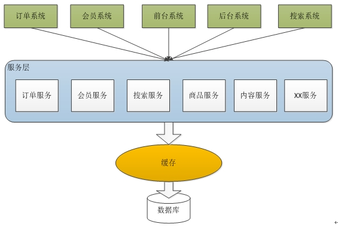


# 大型网站架构模式

## 综述

1. 模式：每一个模式描述了一个在我们周围不断重复发生的问题及该问题解决方案的核心。这样，你就能一次又一次地使用该方案而不必做重复工作。
2. 网站架构模式：大型互联网公司在实践中提出了许多解决方案，以实现网站**高性能、高可用、易伸缩、可扩展、安全**等各种技术框架目标。这些解决方案又被更多网站重复使用，从而逐渐形成大型网站架构模式。

**分层，分割，分布式，负载均衡：易伸缩、可扩展**

**集群冗余：高可用**

**缓存，异步，集群：高性能**

## 分层

**概念**

1. 将系统在横向维度上切分成几个部分，每个部分负责一部分相对比较单一的职责，然后通过上层对下层的依赖和调用组成一个完整的系统。

2. 实践中，大的分层结构内部还可以继续分层。

**目的**

1. 便于分工合作开发和维护；

2. 各层独立，只要维持调用接口不变，各层可根据具体问题独立演化发展而无需其他层必须相应调整；

3. 物理部署上，三层结构可部署在同一物理机器上，随着网站业务发展，必然要分离部署，其三层结构分别部署在不同服务器，使网站拥有更多计算资源应对更多用户访问。

**举例**

| 应用层 | 负责具体业务和视图展示，如网站首页及搜索输入和结果展示 |
| ------ | ------------------------------------------------------ |
| 服务层 | 为应用层提供服务支持，如用户管理服务，购物车服务等     |
| 数据层 | 提供数据存储访问服务，如数据库、缓存、文件、搜索引擎等 |

## 分割

**概念**

1. 从纵向方面对软件进行切分，将不同功能和服务分割开来，包装成高内聚低耦合的模块单元。

2. 大型网站分割粒度可能会很小。

**目的**

1. 有助于软件开发和维护；

2. 便于不同模块的分布式部署，提供网站的并发处理能力和功能扩展能力。

**举例**

1. 在应用层，按业务分割为购物、论坛、搜索、广告不同的应用，独立团队负责，部署在不同服务器；

2. 同一应用内部，如果规模庞大业务复杂，会继续分割，比如购物业务分割为机票酒店业务、3C业务、小商品业务等更细小的粒度。

## 分布式

**概念**

分层和分割的一个主要目的是为了切分后的模块便于分布式部署，即不同模块部署在不同服务器上，通过远程调用协同工作。

**目的**

可使用更多的计算机完成同样的功能，计算机越多，CPU、内存、存储资源也越多，处理并发访问和数据量就越大。

**缺点**

1. 分布式服务调用必须通过网络，可能会影响性能；

2. 服务器越多，服务器宕机概率就越大；

3. 分布式环境数据一致性非常困难，分布式事务也难以保证；

4. 分布式导致网站依赖错综复杂，开发管理维护困难。

**举例**

1. 分布式应用和服务：将分层和分割后的应用和服务模块分布式部署。

2. 分布式静态资源：网站的静态资源如JS、CSS、Logo图片等资源独立分布式部署，并采用独立域名，即动静分离。

3. 分布式数据和存储：大型网站需处理以P为单位的海量数据，单台计算机无法提供如此大的存储空间，此时需分布式存储。

4. 分布式计算：严格来说，应用、服务、实时数据处理都是计算，网站除了要处理这些在线业务，还有很大一部分后台业务，包括搜索引擎的索引构建、数据仓库的数据分析统计等。

## 集群

**概念**

通过负载均衡技术为一个应用构建一个多台服务器组成的集群，共同对外提供服务。

**目的**

提高系统可用性。

## 缓存

**概念**

将数据存放在距离计算最近的位置。

**目的**

加快处理速度。

**举例**

1. CDN。

2. 反向代理。

3. 本地缓存。

4. 分布式缓存。

5. 以上4个都在前面章节已说明，不再赘述。

## 异步

**概念**

1. 单一服务器内部可通过多线程共享内部队列方式实现异步，业务操作前面的线程将输出写入队列，后面的线程从队列读取数据处理。

2. 分布式系统中，多个服务器集群通过分布式消息队列实现异步。

**目的**

1. 提高系统可用性：消费者服务器发生故障，数据会在消息队列服务器存储堆积，生产服务器可以继续处理业务请求，系统整体表现无故障。消费者服务器恢复正常后，继续处理消息队列中的数据。

2. 加快网站响应速度：业务处理前端的生产着服务器将数据写入消息队列，无需等待消费者服务器处理就可以返回，响应延迟减少。

3. 消除并发访问高峰：用户访问网站是随机的，虽然存在高峰和低谷，但突发事件（促销活动、微博热点事件）会造成网站并发访问突然增大。使用消息队列将突然增加的访问请求数据放入消息队列，等待消费者服务器依次处理，减小网站负载压力。

4. 解耦，提升扩展性。

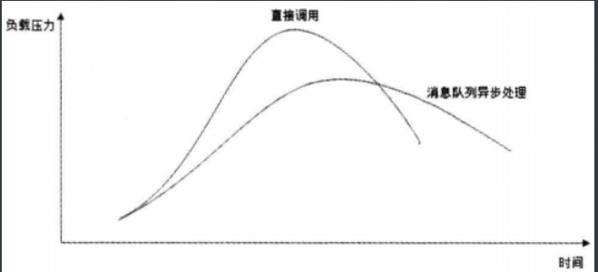

5. 缺点：消费者服务器处理（如业务校验、写数据库）失败，以订单提交为例，可在成功提交后Email或短信通知用户订单成功，避免交易纠纷。

## 冗余

**概念**

任何服务都必须部署至少两台服务器构成的一个集群。

**目的**

实现服务高可用。

**举例**

1. 冷备份：定期备份，存档保存。

2. 热备份：主从分离，实时同步。

## 自动化

**目的**

减少人为干预，减少故障。

**举例**

1. 自动化发布。

​    a) 自动化代码管理：代码版本控制、代码分支创建合并等过程自动化，开发工程师只要提交自己参与开发的产品代号，系统自动为其创建开发分支，后期自动合并代码。

​    b) 自动化测试：代码开发完成，提交测试后，系统自动将代码部署到测试环境，启动自动化测试用例测试，向相关人员发送测试报告，向系统反馈测试结果。

​    c) 自动化安全检测：安全检测工具对代码静态安全扫描及部署到安全测试环境进行安全攻击测试，评估安全性。

​    d) 自动化部署：将工程代码自动部署到线上生产环境。

2. 自动化监控。

​    a) 自动化报警：对线上生产环境自动化监控，对服务器心跳检测，及各项性能指标和应用程序的关键数据指标。如果发现异常、超出预设阀值，自动化向相关人员发送报警，警告故障可能发生。

​    b) 自动化失效转移：检测到故障发生后，系统自动化将失效服务器从集群隔离，不再处理请求。

​    c) 自动化失效恢复：待故障消除后，系统自动化重新启动服务，同步数据保证数据一致性。

​    d) 自动化降级：网站遇到访问高峰，超出网站最大处理能力时，为保证整个网站安全可用，会自动化拒绝部分请求及关闭部分不重要服务将系统负载降至安全水平。

​    e) 自动化分配资源：将空闲资源分配给重要服务，扩大部署规模。、

## 安全

**举例**

1. 通过密码和手机验证码身份认证。

2. 登录、交易等操作需网络通信加密，网站服务器上存储的敏感数据也加密处理。

3. 使用验证码识别，防止机器人程序滥用网络资源攻击网站。

4. 对常见的用于攻击网站的XSS攻击、SQL注入进行编码转换等处理。

5. 对垃圾信息、敏感信息过滤。

6. 对交易转账等重要操作根据交易模式和交易信息进行风险控制。


# 大型网站核心架构要素

## 综述

**性能：缓存+异步+集群+代码优化**

**高可用：负载均衡，数据备份和故障切换**

**伸缩性：表现为服务系统的分层与分割，数据库的分库分表，读写分离，由负载均衡和一致性hash实现**

**拓展性：低耦合，模块化，分层与分割**

## 性能

### 性能测试指标

1. **响应时间**

​    a) 解释：从发出请求开始到收到最后响应数据所需要的时间。

​    b) 意义：系统最重要的性能指标。

​    c) 测试方法：测试程序通过模拟应用程序，记录收到响应和发出请求之间的时间差；通常重复请求，取平均值。

​    d) 常用系统操作响应时间表。

| **操作**                          | **响应时间** |
| --------------------------------- | ------------ |
| 打开一个网站                      | 几秒         |
| 在数据库中查询一条记录（有索引）  | 十几毫秒     |
| 机械磁盘一次寻址定位              | 4毫秒        |
| 从机械磁盘顺序读取1MB数据         | 2毫秒        |
| 从SSD磁盘顺序读取1MB数据          | 0.3毫秒      |
| 从远程分布式缓存Redis读取一个数据 | 0.5毫秒      |
| 从内存中读取1MB数据               | 十几微妙     |
| Java程序本地方法调用              | 几微妙       |
| 网络传输2KB数据                   | 1微妙        |

2. **并发数**

​    a) 解释：同时处理请求的数目，反映了系统的负载特性。网站并发数指“并发用户数”。

​    b) 并发用户数：同时提交请求的用户数目。

​    c) 在线用户数：当前登录网站的用户数目。

​    d) 系统用户数：可能访问系统的总用户数，对多数网站而言就是注册用户数。

​    e) 三者数量比较关系：系统用户数>>在线用户数>>并发用户数。

​    f) 意义：网站产品设计初期，产品经理和运营人员要规划不同发展阶段网站系统用户数，以此为基础，推算在线用户数和并发用户数，这些指标是非功能设计的重要依据。

​    g) 测试方法：测试程序多线程模拟并发用户测试并发处理能力；测试程序并不多线程不停发送请求，而是两次请求间加随机等待时间，模拟用户思考时间。

3. **吞吐量**

​    a) 解释：单位时间内系统处理的请求数量。

​    b) 常用量化指标：“请求数/秒”或“页面数/秒”、“访问人数/天”或“处理的业务数/小时”、TPS（每秒事务数）、HPS（每秒HTTP请求数）、QPS（每秒查询数）。

​    c) 三者关系：并发数由小逐增过程中，服务器资源消耗逐增，吞吐量逐增，响应时间小幅上升；达到吞吐量极限后，并发数增加反而下降，响应时间快速上升；达到系统崩溃点后，系统资源耗尽，吞吐量为零，失去响应。


4. **性能计数器**

​    a) 解释：描述服务器或操作系统性能一些数据指标，包括System Load、对象与线程数、内存使用、CPU使用、磁盘与网络IO等。

​    b) 意义：系统监控的重要参数，监控系统发现性能计数器超过阀值时，向运维人员报警，及时发现处理异常。

​    c) System Load（系统负载）：当前正在被CPU执行和等待被CPU执行的进程数目总和，反映系统闲忙程度的重要指标。多核CPU情况下，Load值等于CPU数目时，说明所有CPU都在使用，没有CPU不足和空闲；Load值大于CPU数目时，说明进程排队等待CPU调度，资源不足；Load值小于CPU数目时，说明CPU空闲。Linux的“top”命令可查询最近1分钟、10分钟、15分钟的运行队列平均进程数。


### 性能测试方法

1. 性能测试是总称，细分为：

​    a) 性能测试：以系统设计初期规划的性能指标为预期目标，不断施加压力（增加并发请求），验证系统在资源可接受范围，可否达到预期。

​    b) 负载测试：不断施加压力（增加并发请求），直到某项或多项性能指标达到安全临界值（比如资源已饱和）。此时继续加压，系统处理能力会下降。

​    c) 压力测试：超过安全负载情况下，不断施加压力（增加并发请求），直到系统崩溃或无法处理任何请求，依此获得系统最大压力承受能力。

​    d) 稳定性测试：被测试系统在特定硬件、软件、网络环境下，加载一定业务压力（模拟生产环境不同时间点、不均匀请求，呈波浪特性）运行一段较长时间，以此检测系统是否稳定。

2. 性能测试曲线：横坐标为消耗的系统资源，纵坐标为吞吐量。a~b为网站日常运行区间，c为系统最大负载点，d为系统崩溃点。


#### 性能测试报告

| **并发数** | **响应时间（ms）** | **TPS** | **错误率（%）** | **Load** | **内存（GB）** | **备注** |
| ---------- | ------------------ | ------- | --------------- | -------- | -------------- | -------- |
| 10         | 500                | 20      | 0               | 5        | 8              | 性能测试 |
| 20         | 800                | 30      | 0               | 10       | 10             | 性能测试 |
| 30         | 1000               | 40      | 2               | 15       | 14             | 性能测试 |
| 40         | 1200               | 45      | 20              | 30       | 16             | 负载测试 |
| 60         | 2000               | 30      | 40              | 50       | 16             | 压力测试 |
| 80         | 超时               | 0       | 100             | 不详     | 不详           | 压力测试 |


### Web前端性能优化

#### 浏览器访问优化

1. 减少HTTP请求：合并CSS、合并JavaScript、合并图片。

2. 使用浏览器缓存：CSS、JavaScript、Logo、图标等静态资源文件更新频率较低，通过HTTP头Cache-Control和Expires设置缓存数天，甚至几个月。更新此类文件时，不更新内容，而是修改文件名，生成新文件并更新HTML引用。当有一批此类文件要更新时，不宜一次全部更新，而是逐个更新，并有时间间隔，以免浏览器大量缓存失效，集中更新缓存，服务器负载剧增。

3. 启用压缩：文本文件（如HTML、CSS、JavaScript）GZip压缩率可达80%以上，有效减少通信传输数据量。但服务器、浏览器压力上升，所以要权衡。

4. CSS放在页面最上面，JavaScript放在页面最下面：浏览器下载全部CSS后才渲染页面，而在加载JavaScript后立即执行，可能会阻塞页面，渲染缓慢。

5. 减少Cookie传输：每次请求和响应都会包含Cookie，影响数据传输；静态资源访问（如CSS、JavaScript）发送Cookie无意义。可静态资源使用独立域名，避免请求静态资源时发送Cookie。


#### CDN加速

前面章节已说明，不再赘述。

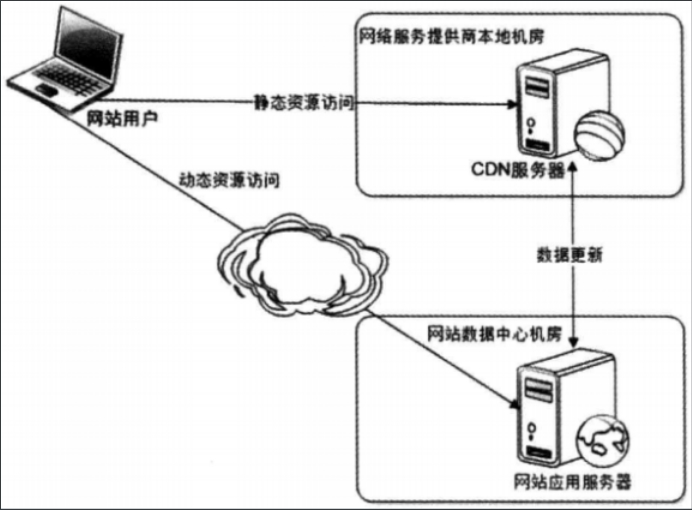


#### 反向代理

前面章节已说明，不再赘述。

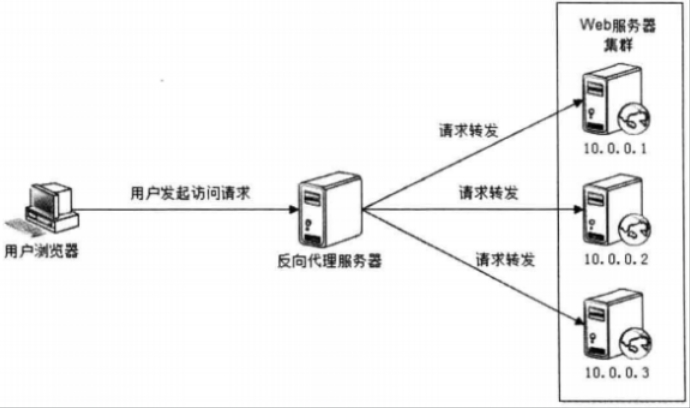


### 应用服务器性能优化

#### 分布式缓存

1. 网站性能优化第一定律：优先考虑使用缓存优化性能。

2. 缓存优点：缓存访问速度快，减少数据访问时间；如果缓存的数据是经过计算得到的，则此类数据无需重复计算可直接使用。

3. 缓存本质：以一对Key、Value形式存储在内存的Hash表，读写时间复杂度O(1)。


4. 使用缓存注意事项。

​    a) 频繁修改的数据：如果缓存频繁修改的数据，会造成写入缓存后来不及读取已失效。一般数据读写比应在2:1以上，甚至更高。

​    b) 没有热点的访问：缓存使用内存，资源宝贵，应遵循二八定律，即缓存20%热点数据。

​    c) 数据不一致与脏读：一般设置缓存失效时间，失效后从数据库加载，因此要容忍一定时间的数据不一致。也可数据更新时立即更新缓存，但会带来更多系统开销和事务一致性问题。

​    d) 缓存可用性：为避免缓存雪崩（缓存不可用造成数据库无法承受压力而宕机），可将缓存数据分布到集群多台服务器，宕机时只有部分缓存数据丢失。

​    e) 缓存预热（warn up）：热点数据是通过LRU（最近最久未用算法）淘汰生成的，需较长时间。

​    f) 缓存穿透：缓存不存在的数据（其值为null），避免不恰当业务或恶意攻击高并发请求某个不存在数据，造成数据库压力而崩溃。

#### 异步操作

前面章节已说明，不再赘述。

#### 使用集群

前面章节已说明，不再赘述。

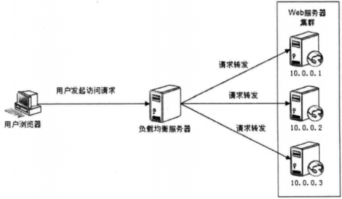


#### 代码优化

1. 多线程

​    a) 目的：利用多线程IO阻塞与执行交替进行，最大限度利用CPU资源；多线程最大限度利用多核CPU。

​    b) Web容器线程数设置：如果都是CPU计算型任务，则线程数最多不超过CPU内核数（更多线程CPU来不及调度）；如果都是等待磁盘IO、网络IO的任务，则多启动线程有助于提高任务并发度，提高吞吐能力。

2. 资源复用：单例（Singleton）、对象池（Object Pool）。

3. 数据结构。

4. 垃圾回收：即优化JVM。


### 存储性能优化

可能暂时不重要，以后需要时在看书。


## 可用性

### 网站可用性的度量与考核

#### 度量

1. 业界通常用多少个9来衡量网站可用性。

2. 网站不可用也称网站故障。

3. 网站不可用时间公式：

```
网站不可用时间（故障时间）= 故障修复时间点-故障发现（报告）时间点
```

4. 网站年度可用性指标公式：

```
网站年度可用性指标 =（1-网站不可用时间/年度总时间）×100%
```

5. 常见可用性：

| **可用性（9）** | **可用性（百分比）** | **网站年度不可用时间** | **说明**         |
| --------------- | -------------------- | ---------------------- | ---------------- |
| 2个9            | 99%                  | 小于88小时             |                  |
| 3个9            | 99.9%                | 小于9小时              |                  |
| 4个9            | 99.99%               | 小于53分钟             | 具有自动恢复能力 |
| 5个9            | 99.999%              | 小于5分钟              | 可用性极高       |


#### 考核

1. 故障分：对网站故障进行分类加权计算故障责任的方法。

2. 网站故障分类权重表（示例）

| **分类**   | **描述**                                   | **权重** |
| ---------- | ------------------------------------------ | -------- |
| 事故级故障 | 严重故障，网站整体不可用                   | 100      |
| A类故障    | 网站访问不顺畅或核心功能不可用             | 20       |
| B类故障    | 非核心功能不可用，或核心功能少数用户不可用 | 5        |
| C类故障    | 以上故障以外的其他故障                     | 1        |

3. 故障分公式：

```
故障分=故障时间（分钟）×故障权重
```

4. 考核过程：年初或考核季度开始时，根据网站产品可用性指标计算总的故障分，然后根据团队和个人职责角色分摊故障分，这个可用性指标和故障分是管理预期；故障发生后，根据故障分类和责任划分给故障产生的故障分分配给责任者承担；年末或考核季度末时，个人及团队实际承担的故障分如果超过年度分摊的故障分，绩效考核受到影响。


### 网站架构高可用（总述）

1. 以百度为例。

​    a) 应用层：文库、贴吧、百科等属不同产品，各自独立部署集群。

​    b) 服务层：应用层产品依赖共同的复用业务，这些业务服务各自部署集群。

​    c) 数据层：各自部署集群。

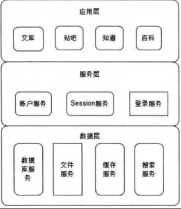

2. 实现高可用架构主要手段：**数据和服务的冗余备份及失效转移**。

3. 应用层高可用：通过**负载均衡**设备将一组服务器组成一个集群对外处理高并发请求，负载均衡设备通过心跳检测等手段监控到应用服务器不可用时，将其从集群列表剔除，请求分发到集群其他可用服务器上。

4. 服务层高可用：也是通过集群实现高可用。服务层被应用层通过分布式服务调用框架访问，分布式服务调用框架在应用层客户端中实现负载均衡，服务注册中心获取服务层服务器心跳检测，发现不可用服务器，立即通知客户端修改服务层访问列表，剔除不可用服务器（说的就是**Dubbo的自动注册与删除**）。

5. 数据层高可用：比较特殊，数据服务器存储了数据。数据写入时**同步复制**数据到多台服务器上，实现数据冗余备份；数据服务器宕机时，数据访问切换到备份数据服务器上。

6. 网站升级发布可能引起故障。


### 应用层高可用

#### 通过负载均衡进行无状态服务失效转移

无状态应用：应用服务器不保存业务的上下文信息，而仅根据每次请求提交的数据处理业务逻辑，多台服务器之间完全对等，请求提交到任意服务器结果一样。是应用层高可用的基础。

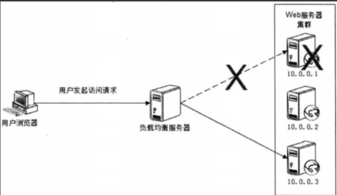


#### 应用服务器集群的Session管理

事实上业务总是有状态的（Session），负载均衡集群环境下，负载均衡服务器可能会将请求分发到集群任何依他应用服务器上，所以每次请求获取正确的Session要比单机复杂。几种手段：

1. Session复制：集群各台服务器间同步Session对象，每台服务器都保存所有用户的Session信息。服务器内存无法保存大量Session，不适合大型网站。

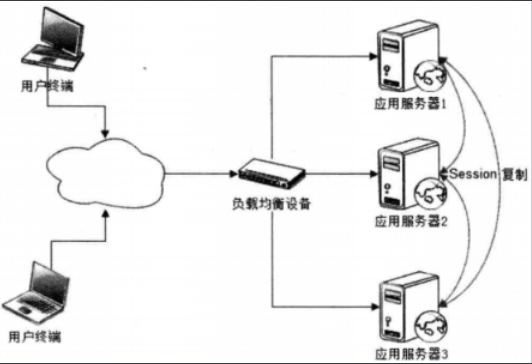

2. Session绑定：利用负载均衡的源地址Hash算法，负载均衡服务器总是将源于同一IP的请求分发到同一服务器。服务器宕机Session丢失，无法高可用，不适合大型网站。

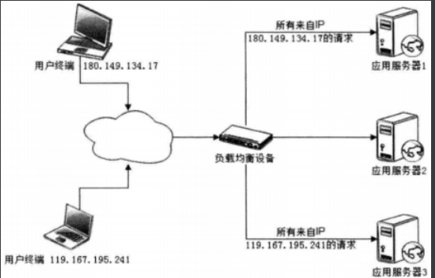

3. 利用Cookie记录Session：Cookie大小限制；每次请求响应都传输Cookie，影响性能；用户关闭Cookie将不正常。Cookie简单易用，可用性高，支持应用服务器线性伸缩，许多网站或多或少都使用Cookie记录Session。


4. Session服务器：利用分布式缓存、数据库等存取Session，实现应用服务器的状态分离。可用性高、伸缩性好、性能不错，适合大型网站。

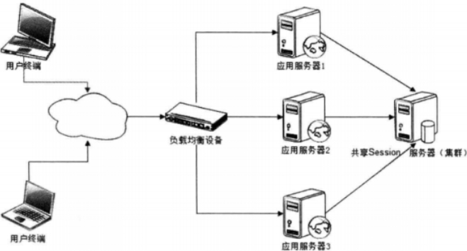


### 服务层高可用

1. 分级管理。

​    a) 核心应用和服务优先使用更好的硬件和更快的运维响应速度。

​    b) 部署隔离，避免故障连锁反应：低优先级服务启动不同线程或部署在不同虚拟机上隔离；高优先级服务部署在不同物理机上；核心服务和数据甚至部署在不同地域的数据中心。

2. 超时设置：在应用程序设置服务调用超时时间，超时后通信框架抛出异常，避免因服务器宕机、线程死锁导致应用程序对服务端调用失去响应，进而用户请求长时间得不到响应，同时占用应用程序资源。

3. 异步调用：前面章节已说明，不再赘述。

4. 服务降级：有两种手段。

​    a) 拒绝服务：拒绝低优先级应用的调用，减少并发数，确保核心应用正常调用；随机拒绝部分请求调用，让另一部分请求成功，避免大家一起死的餐具。

​    b) 关闭服务：关闭部分不重要服务或服务内部关闭部分不重要功能，节约开销。

5. 幂等性设计：应用层只要未收到调用成功的响应，都认为调用服务失败，并重试服务调用，因此服务层必须保证服务重复调用和调用一次的结果相同，即服务具有幂等性。


### 数据层高可用

#### CAP原理

1. 数据高可用含义。

​    a) 数据持久性：在各种情况下都不会出现数据丢失问题。

​    b) 数据可访问性：多数据副本分别存放在不同存储设备情况下，失效转移能很快完成（终端用户几乎没有感知）。

​    c) 数据一致性：多数据副本情况下，各副本之间数据一致。

2. CAP原理：一个提供数据服务的存储系统无法同时满足数据一致性（Consistency）、数据可用性（Availability）、分区耐受性（Partition Tolerance）这三个条件。


3. 大型网站实践：通常选择强化分布式存储系统的可用性（A）和伸缩性（P），而在某种程度上放弃一致性（C）。一般数据不一致出现在系统高并发写操作或集群状态不稳定（故障恢复、集群扩容等）时，应用系统要对分布式数据处理系统的数据不一致性有了解并进行某种意义上的补偿和纠错，以保证最终一致性。

4. 举例：2012年淘宝“双十一”，活动开始第一分钟就涌入1000万独立用户访问，极端的高并发对数据处理系统造成巨大压力，存储系统较弱的数据一致性导致部分商品超卖。


#### 数据备份

1. 冷备。

​    a) 优点：简单、廉价，成本和技术难度都较低。

​    b) 缺点：无法保证数据一致性（备份设备中的数据比系统中的数据陈旧）。

​    c) 现状：作为传统的数据保护手段依然在运维中使用。

2. 热备。

​    a) 异步热备：多份数据副本的写入操作异步完成，即应用程序收到数据服务系统的写操作成功响应时，只写成功了一份，存储系统将异步地写其他副本（该过程可能失败）。


​    b) 同步热备：多份数据副本的写入操作同步完成，即应用程序收到数据服务系统的写成功响应时，多份数据都已经写操作成功。


3. 同步热备优化：应用程序客户端并发向多个存储服务器同时写入数据，所有写操作成功响应后，再通知应用程序成功。优点：存储服务器无主从之分，完全对等，便于管理维护；并发写操作意味着多份数据的总写操作延时是响应最慢的那台存储服务响应。

4. 实际：通常使用读写分离，写操作只访问Master数据库，读操作只访问Slave数据库。


#### 失效转移

1. 失效确认：有心跳检测和应用程序访问失败报告两种手段。对于后者，控制中心还要再一次发送心跳检测确认，以免错误判断服务器宕机。


2. 访问转移：将数据读写访问重新路由到其他服务器上。

3. 数据恢复：数据副本数目已减少，必须将副本数目恢复到系统设定的值，否则再有宕机可能无法访问转移（所有副本服务器宕机）。

## 伸缩性

### 网站架构的伸缩性设计

#### 不同功能进行物理分离实现伸缩

1. 方法：不同服务器部署不同服务，提供不同功能。

2. 纵向分离（分层后分离）：将业务处理流程上的不同部分分离部署，实现伸缩性。


3. 横向分离（业务分割后分离）：将不同的业务模块分离部署，实现伸缩性。


#### 单一功能通过集群规模实现伸缩

方法：集群内的多台服务器部署相同服务，提供相同功能。


### 应用服务器集群的伸缩性设计

1. 负载均衡器：HTTP请求分发装置。

2. 负载均衡：同时实现伸缩性和可用性，可谓网站的杀手锏。

#### HTTP重定向负载均衡

1. 原理：HTTP重定向服务器根据用户的HTTP请求计算一台真实Web服务器地址，将该地址写入HTTP重定向响应（状态码302）返回用户浏览器。


2. 优点：简单。

3. 缺点：浏览器两次请求服务器才能完成一次访问；302状态码重定向可能使搜索引擎判断为SEO作弊，降低搜索排名。

4. 实际：不多见。

#### DNS域名解析负载均衡

1. 原理：DNS服务器中配置多个A记录（如www.mysite.com IN A 114.100.80.1、www.mysite.com IN A 114.100.80.2、www.mysite.com IN A 114.100.80.3），每次域名解析请求都会根据负载均衡算法计算一个IP地址返回。


2. 优点：负载均衡交给DNS，省去维护负载均衡服务器的麻烦；DNS支持基于地理位置的解析，即解析距离用户最近的服务器地址。

3. 缺点：服务器下线时，更新DNS解析生效时间较长；DNS负载均衡控制权在域名服务商，无法对其更多改善和管理。

4. 实际：大型网站使用DNS解析作为第一级负载均衡，即解析得到的一组服务器是内部负载均衡服务器，再由内部负载均衡服务器分发到真是Web服务器。


#### 反向代理负载均衡

1. 原理：反向代理同时实现了缓存和负载均衡功能；Web服务器不使用外部IP地址，由反向代理服务器配置双网卡和内外两套IP地址。


2. 优点：反向代理服务器功能集中，部署简单。

3. 缺点：反向代理服务器是所有请求的响应的中转站，性能可能成为瓶颈。


#### IP负载均衡

1. 原理：负载均衡服务器114.10.80.10在操作系统内核进程获取网络数据包，根据负载均衡算法计算得到一台Web服务器10.0.0.1，再将数据目的IP地址修改为10.0.0.1，无需用户进程处理；Web服务器10.0.0.1响应后，负载均衡服务器再将数据包源地址修改为自身IP地址114.10.80.10，发送给浏览器。


2. 优点：在内核进程完成数据分发，较反向代理负载均衡（应用程序分发）性能更好。

3. 缺点：与反向代理负载均衡相同。


#### 数据链路层负载均衡

1. 原理：三角传输模式；直接路由方式（DR）；负载均衡服务器只在数据链路层修改目的MAC地址，配置真实物理服务器所有机器虚拟IP与负载均衡服务器IP地址一致，即可不修改数据包源地址和目的地址进行分发；真实物理服务器IP与数据请求目的IP一致，无需通过负载均衡服务器就可响应数据返回浏览器。


2. 优点：避免负载均衡服务器成为瓶颈。

3. 实际：大型网站使用最广的负载均衡。Linux上最好的开源产品是LVS（Linux Virtual Server）。


#### 负载均衡算法

1. 轮询（Round Robin，RR）：所有请求依次分发到每台服务器，适合所有服务器硬件都相同的场景。

2. 加权轮询（Weight Round Robin，WRR）：轮询基础上，按照配置的权重将请求分发到每台服务器，高性能的服务器分配更多请求。

3. 随机（Random）：请求随机分发到每台服务器，也可加权随机。

4. 最少连接（Least Connections）：记录每台服务器正在处理请求（连接）数，将新请求分发到最少连接服务器，最符合负载均衡定义，也可加权最少连接。

5. 源地址散列（Source Hashing）：根据请求来源IP地址的Hash值，得到服务器，同一IP地址请求总在一台服务器上处理。


### 分布式缓存集群的伸缩性设计

1. 分布式缓存集群特点：集群中各服务器数据不同，缓存访问请求不可以在任意一台处理，必须先找到有缓存数据的服务器才能访问。

2. 分布式缓存集群访问原理：以写缓存Memcached为例，应用程序输入数据<'BEIJING',DATA>，API将KEY('BEIJING')输入路由算法模块，路由算法根据KEY和集群服务器列表计算得到一台服务器编号NODE1和IP地址、端口；API调用通信模块将数据写入服务器NODE1。


3. **分布式缓存的一致性Hash算法**：可解决伸缩性问题，但算法介绍Memcached且复杂，可能会使用Redis代替，以后再看。

   **基本原理**

   将哈希空间 [0, 2<sup>n</sup>-1] 看成一个哈希环，每个服务器节点都配置到哈希环上。每个数据对象通过哈希取模得到哈希值之后，存放到哈希环中顺时针方向第一个大于等于该哈希值的节点上。

   <div align="center">  </div><br>
一致性哈希在增加或者删除节点时只会影响到哈希环中相邻的节点，例如下图中新增节点 X，只需要将它前一个节点 C 上的数据重新进行分布即可，对于节点 A、B、D 都没有影响。
   
<div align="center">  </div><br>
   **虚拟节点**

   上面描述的一致性哈希存在数据分布不均匀的问题，节点存储的数据量有可能会存在很大的不同。

   数据不均匀主要是因为节点在哈希环上分布的不均匀，这种情况在节点数量很少的情况下尤其明显。

   解决方式是通过增加虚拟节点，然后将虚拟节点映射到真实节点上。虚拟节点的数量比真实节点来得多，那么虚拟节点在哈希环上分布的均匀性就会比原来的真实节点好，从而使得数据分布也更加均匀。


### 数据存储服务集群的伸缩性设计


#### 关系数据库集群的伸缩性设计

1. **主从复制**：利用关系数据库数据复制功能，进行简单伸缩。


2. **分库**：不同业务数据表部署在不同数据库集群上。制约条件是跨库不能join操作。

3. **分片**：对某些单表数据量大的表（如Facebook用户表、淘宝商品表），将一张表拆分存储在多个数据库。

​    a) 比较成熟的支持数据分片的开源分布式关系数据库产品：Amoeba、Cobar。


​    b) 分布式关系数据库特点：限制了关系数据库某些功能；海量数据压力不得不利用分布式关系数据库伸缩。

​    c) 分布式关系数据库注意：避免事务或利用事务补偿机制代替数据库事务；分解数据访问逻辑避免join操作。


#### NoSQL数据库集群的伸缩性设计

NoSQL特点：放弃了关系数据库的以关系代数为基础的结构化查询语言（SQL）和事务一致性保证（ACID），而强化大型网站关注的高可用性和可伸缩性。


## 扩展性


### 扩展性与伸缩性

1. 扩展性（Extensibility）：对现有系统影响最小的情况下，系统功能可持续扩展或提升的能力。

2. 伸缩性（Scalability）：系统能够通过增加（减少）自身资源规模的方式增强（减少）自己计算处理事务的能力。


### 构建可扩展的网站架构

1. 设计网站可扩展架构的核心思想是模块化，并在此基础上降低模块间的耦合性，提高模块复用性。

2. 模块化的重要手段：分层和分割，分层、分割为若干个低耦合的独立组件模块（模块可分布式部署，从物理上分离模块间耦合），各模块以消息传递及依赖调用方式聚合成完整系统。


### 利用分布式消息队列降低系统耦合性

1. 事件驱动架构（Event Driven Architecture）：通过在低耦合的模块之间传输事件消息，以保持模块的松散耦合，并借助事件消息的通信完成模块间合作。典型的EDA架构就是生产者消费者模式。大型网站最常见是分布式消息队列，利用发布/订阅模式工作。

2. 分布式消息队列。

​    a) 原理：前面章节已说明，不再赘述。


​    b) 伸缩性：新服务器加入消息队列集群事，修改生产者服务器的消息队列服务器列表即可。

​    c) 可用性：为避免消费者进程处理缓慢、消息队列服务器内存不足等问题，如果内存队列已满，消息会被写入磁盘；为避免消息队列服务器宕机，生产者服务器会保存消息直至消息真正被消费者服务器处理后才删除，如果消息队列服务器宕机，生产者服务器会选择分布式消息队列集群中其他服务器发送。

​    d) 开源Apache ActiveMQ实现了可用性、伸缩性、数据一致性、性能和可管理性等。


### 利用分布式服务打造可复用的业务平台

1. 纵向拆分：将一个大应用拆分为多个小应用，如果新增业务较为独立，那么直接部署为一个独立的Web应用。

2. 横向拆分：将复用的业务拆分，独立部署为分布式服务，新增业务只需要调用这些分布式服务，无需依赖具体模块代码。


3. 不使用WebServices的理由：

​    a) 臃肿的注册与发现机制；

​    b) 低效的XML序列化手段；

​    c) 开销较高的HTTP远程通信；

​    d) 复杂的部署和维护手段；

​    e) 无法解决大型网站高性能、高可用、易部署、易维护的要求。

4. 大型网站分布式服务的需求与特点：

​    a) 注册与发现；

​    b) 负载均衡

​    c) 失效转移；

​    d) 高效的远程通信：核心服务每天调用次数数以亿计；

​    e) 整合异构系统：服务可能使用不同语言开发并部署不同平台；

​    f) 对应用最小侵入；

​    g) 版本管理：支持服务接口的多版本发布，方便服务调用者使用未升级的旧接口；

​    h) 实时监控。

5. 开源分布式服务框架：阿里巴巴Dubbo、Facebook Thrift。


## 安全性


### 网站应用攻击与防御


#### XSS攻击

1. 攻击：即跨站脚本攻击（Cross Site Script），攻击者通过篡改网页，注入恶意HTML脚本，在用户浏览器网页时，控制用户浏览器进行恶意操作。

​    a) 反射型：攻击者诱使用户点击一个嵌入恶意脚本的连接，达到攻击目的。


​    b) 持久型：攻击者提交含有恶意脚本的请求，保存在被攻击的Web站点的数据库，用户浏览网页时，恶意脚本被包含在正常网页中，达到攻击目的。


2. 防御。

​    a) 消毒：对某些HTML危险字符转义，如“>”转义为“&gt;”、“<”转义为“&lt;”。

​    b) HttpOnly：浏览器禁止JavaScript访问带有HttpOnly属性的Cookie。无法防御XSS，但可防止XSS攻击者窃取Cookie。


#### 注入攻击

1. SQL攻击：攻击者在HTTP请求中注入恶意SQL（如drop table users），服务器用请求参数构造数据库SQL时，恶意SQL被一起执行。


2. 获取数据库表结构的手段。

​    a) 开源：网站采用开源软件（如Discuz!）搭建，已公开。

​    b) 错误回显：如果网站开启错误（服务器内部500）回显，攻击者构造非法参数，使异常信息输出到浏览器。

​    c) 盲注：如果网站关闭错误回显，攻击者根据页面变化判断SQL执行情况，猜测表结构。

3. 防御：使用预编译，绑定参数。

4. 其他注入攻击：OS命令、编程语言代码。


#### CSRF攻击

1. 攻击：跨站请求伪造（Cross Site Request Forgery），攻击者通过跨站请求，以合法用户身份进行非法操作。核心是利用浏览器Cookie或服务器Session盗取用户身份。


2. 防御。

​    a) 表单Token：页面表单增加一个随机数作为Token，每次响应页面Token都不同，伪造的请求无法获得Token，服务器检查该Token合法性。

​    b) 验证码：请求提交时，需用户输入验证码，但验证码用户体验变差。

​    c) Referer check：HTTP请求头Referer记录请求来源，验证其合法性。很多网站利用该功能实现图片防盗链。


### Web应用防火墙

ModSecurity是一个开源Web应用防火墙，既可嵌入Web应用服务器，也可独立部署。最早是Apache一个模块，支持Nginx。


### 网站安全漏洞扫描

安全漏洞扫描工具根据内置规则，构造具有攻击性的URL请求，模拟攻击者攻击行为，以发现漏洞。


### 信息加密技术及密钥安全管理


#### 单向散列加密

1. 解释：通过对不同输入长度的信息进行散列计算，得到固定长度的输出，散列计算过程是单向的，即不能对固定长度输出进行计算获得输入信息。


2. 场景：密码加密保存。


3. 常见算法：MD5、SHA。


#### 对称加密

1. 解释：加密和解密使用的密钥是同一个密钥（或者可以相互推算）。


2. 场景：信息需安全交换或存储的场合，如Cookie加密、通信加密。

3. 优点：加解密效率高，系统开销小，适合大量数据加密。

4. 常见算法：DES、RC。


#### 非对称加密

1. 解释：加密和解密使用的密钥不是同一密钥，一个公钥，一个私钥。


2. 场景：信息安全传输，数字签名场合。

3. 常见算法：RSA。


### 密钥安全管理


1. 应用程序调用加解密服务接口对信息加解密。

2. 加解密服务接口通过密钥服务器获取加解密密钥，并缓存在本地（定时更新）。

3. 密钥服务器中的密钥来自多个密钥存储服务器，一个密钥分片后存储在多个存储服务器。

4. 密钥申请者、密钥管理者、安全审核人员通过密钥管理控制台管理更新密钥，没有人能查看完整的密钥。

# 参考资料

大型网站技术架构:核心原理与案例分析*李智慧著

[《大型网站技术架构：核心原理与案例分析》笔记](https://www.cnblogs.com/netoxi/p/7258895.html)

[**8 张图读懂大型网站技术架构**](https://github.com/Snailclimb/JavaGuide/blob/master/docs/system-design/website-architecture/8%20%E5%BC%A0%E5%9B%BE%E8%AF%BB%E6%87%82%E5%A4%A7%E5%9E%8B%E7%BD%91%E7%AB%99%E6%8A%80%E6%9C%AF%E6%9E%B6%E6%9E%84.md#4-%E7%9E%AC%E6%97%B6%E5%93%8D%E5%BA%94%E7%BD%91%E7%AB%99%E7%9A%84%E9%AB%98%E6%80%A7%E8%83%BD%E6%9E%B6%E6%9E%84)
