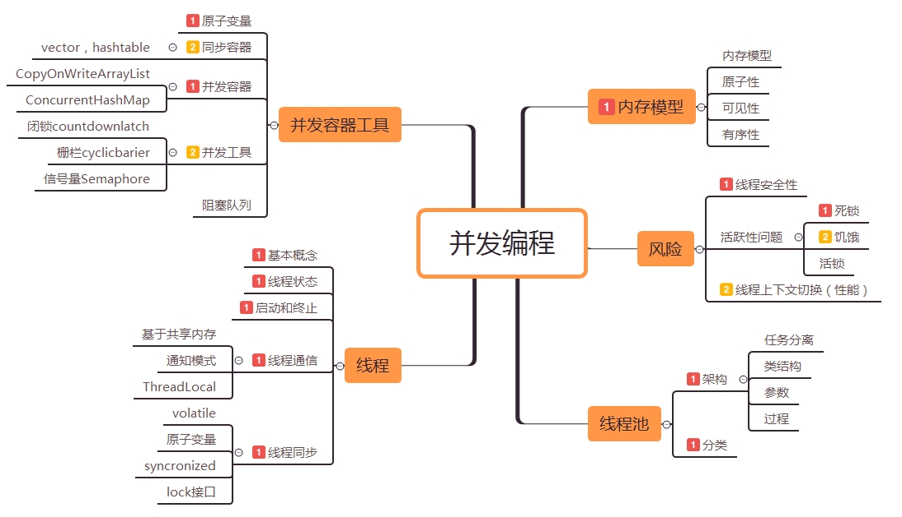
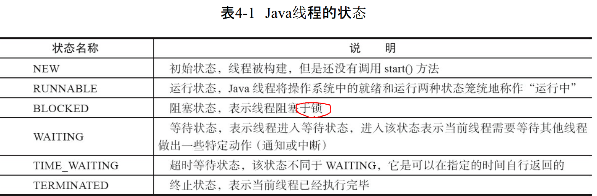
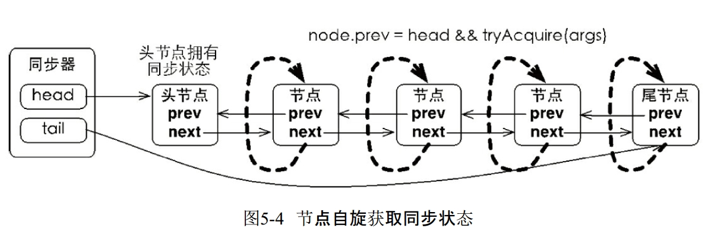
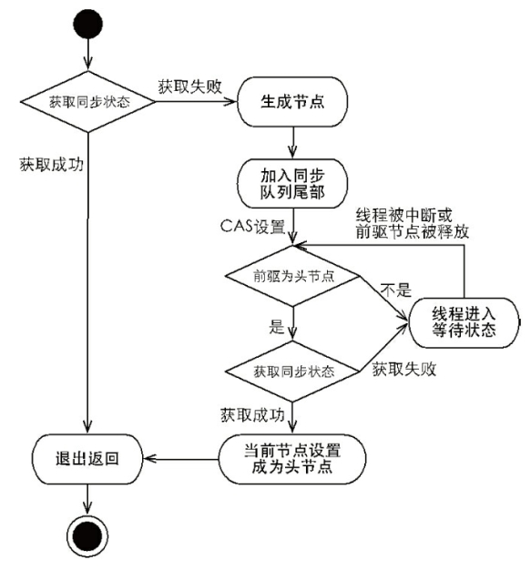
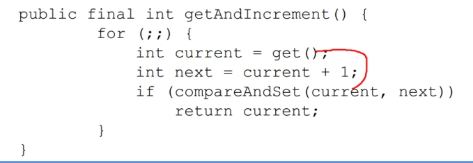

# Table of Contents

- [内存模型](#内存模型)
  - [一道关于Java并发的面试题](#一道关于java并发的面试题)
  - [共享变量](#共享变量)
  - [Java 内存间的操作](#java-内存间的操作)
  - [原子性](#原子性)
  - [可见性](#可见性)
  - [有序性](#有序性)
  - [Happens-Before 规则](#happens-before-规则)
- [线程概述](#线程概述)
  - [线程的实现](#线程的实现)
    - [实现 Runnable 接口](#实现-runnable-接口)
    - [实现 Callable 接口](#实现-callable-接口)
    - [继承 Thread 类](#继承-thread-类)
  - [线程的状态转换](#线程的状态转换)
  - [线程间的通信](#线程间的通信)
  - [安全取消任务](#安全取消任务)
    - [手动设置中断标记](#手动设置中断标记)
    - [中断](#中断)
    - [Future](#future)
    - [ExecutorService](#executorservice)
- [线程安全](#线程安全)
  - [synchronized ：阻塞同步](#synchronized-：阻塞同步)
    - [使用](#使用)
    - [原理](#原理)
    - [锁膨胀](#锁膨胀)
  - [lock：CAS同步](#lock：cas同步)
    - [Lock 接口](#lock-接口)
    - [3 个高级的 lock 方法](#3-个高级的-lock-方法)
    - [公平锁与非公平锁](#公平锁与非公平锁)
    - [读写锁](#读写锁)
    - [Condition](#condition)
    - [AQS](#aqs)
    - [CAS：非阻塞同步机制](#cas：非阻塞同步机制)
    - [lock与synchronized 比较](#lock与synchronized-比较)
    - [synchronized 和 ReentrantLock 的选择](#synchronized-和-reentrantlock-的选择)
  - [ThreadLocal ：无同步线程封闭](#threadlocal-：无同步线程封闭)
  - [final：无同步不可变](#final：无同步不可变)
  - [Volatile：无同步](#volatile：无同步)
  - [原子变量：无同步CAS](#原子变量：无同步cas)
- [并发工具](#并发工具)
  - [同步容器类](#同步容器类)
  - [并发容器类](#并发容器类)
    - [ConcurrentHashMap](#concurrenthashmap)
    - [CopyOnWriteArrayList](#copyonwritearraylist)
  - [并发工具类](#并发工具类)
    - [BlockingQueue](#blockingqueue)
    - [CountDownLatch](#countdownlatch)
    - [CyclicBarrier（栅栏）](#cyclicbarrier（栅栏）)
    - [Semaphore](#semaphore)
    - [Exchanger](#exchanger)
- [线程池](#线程池)
  - [简单使用](#简单使用)
  - [为什么要使用线程池](#为什么要使用线程池)
  - [Executor](#executor)
    - [概述](#概述)
    - [主要类和接口](#主要类和接口)
  - [ExecutorService：任务执行](#executorservice：任务执行)
  - [Future 接口 & FutureTask ：任务结果](#future-接口--futuretask-：任务结果)
    - [Future](#future-1)
    - [FutureTask](#futuretask)
  - [Runnable  & Callable ：任务创建](#runnable---callable-：任务创建)
  - [ThreadPoolExecutor](#threadpoolexecutor)
    - [分类](#分类)
    - [阻塞队列](#阻塞队列)
    - [拒绝策略](#拒绝策略)
  - [设置线程池的大小](#设置线程池的大小)
    - [线程池过大过小的缺点](#线程池过大过小的缺点)
    - [线程池大小的设置](#线程池大小的设置)
- [原子类](#原子类)
  - [分类](#分类-1)
  - [AtomicInteger](#atomicinteger)
  - [AtomicIntegerArray](#atomicintegerarray)
  - [AtomicReference](#atomicreference)
- [活跃性危险](#活跃性危险)
  - [死锁](#死锁)
  - [饥饿](#饥饿)
  - [活锁](#活锁)
- [性能评估](#性能评估)
  - [应用程序性能评估](#应用程序性能评估)
  - [Amdahl 定律](#amdahl-定律)
  - [上下文切换](#上下文切换)
- [生产者-消费者模式](#生产者-消费者模式)
  - [背景](#背景)
  - [方式一：synchronized、wait和notify](#方式一：synchronized、wait和notify)
  - [方式二：lock和condition的await、signalAll](#方式二：lock和condition的await、signalall)
  - [方式三：BlockingQueue](#方式三：blockingqueue)
- [简单线程池设计](#简单线程池设计)
  - [方案1](#方案1)
  - [方案2](#方案2)
  - [方案3](#方案3)
- [参考](#参考)



# 内存模型

## 一道关于Java并发的面试题

[一道关于Java并发的面试题](https://mp.weixin.qq.com/s?__biz=MzIxMjE5MTE1Nw==&mid=2653198082&idx=1&sn=07c04fdfcc2ff222dd52267416b22e1a&chksm=8c99e5d8bbee6cce2ec001c8ce729be974123eb51e4133c09e48e1435145cc5c00f7777fe067&mpshare=1&scene=23&srcid=#rd)

```java
package yzl;

public class ThreadSafeCache {
    int result;

    public int getResult() {
        return result;
    }

    public synchronized void setResult(int result) {
        this.result = result;
    }

    public static void main(String[] args) {
        ThreadSafeCache threadSafeCache = new ThreadSafeCache();

        for (int i = 0; i < 8; i++) {
            new Thread(() -> {
                int x = 0;
                while (threadSafeCache.getResult() < 100) {
                    x++;
                }
                System.out.println(x);
            }).start();
        }

        try {
        	//主线程等待1s，等带其他线程执行
            Thread.sleep(1000);
        } catch (InterruptedException e) {
            e.printStackTrace();
        }

        threadSafeCache.setResult(200);
    }
}
```

程序会一直卡在这边不动，表示set修改的200，get方法并不可见！！！

## 共享变量

在Java中，所有**实例域、静态域和数组元素**都存储在堆内存中，堆内存在线程之间共享。局部变量，方法定义参数和异常处理器参数不会在线程之间共享，它们不会有内存可见性问题，也不受内存模型的影响。

## Java 内存模型

Java线程之间的通信由Java内存模型控制，**JMM决定一个线程对共享变量的写入何时对另一个线程可见**。从抽象的角度来看，JMM定义了线程和主内存之间的抽象关系：**线程之间的共享变量存储在主内存**（Main Memory）中，每个线程都有一个私有的**本地内存（Local Memory），本地内存中存储了该线程以读/写共享变量的副本。**本地内存是JMM的一个抽象概念，并不真实存在。它涵盖了缓存、写缓冲区、寄存器以及其他的硬件和编译器优化。


## 原子性

[[Java多线程之原子性 volatile、atomicInteger测试](https://www.cnblogs.com/carlos-liye/p/6693043.html)](https://www.cnblogs.com/carlos-liye/p/6693043.html)

假定有两个操作A和B，如果从执行A的线程来看，当另一个线程执行B时，要么将B全部执行完，要么完全不执行B，那么A和B对彼此来说是原子的。原子操作是指对访问同一状态的所有操作来说，这是操作是一个以原子方式执行的操作。

**原子变量解决单个变量的原子性操作**

**加锁：synchronized解决多个变量的复合操作问题**

```java
public class IncrementTestDemo {

    public static int count = 0;
    public static Counter counter = new Counter();
    public static AtomicInteger atomicInteger = new AtomicInteger(0);
    volatile public static int countVolatile = 0;
    
    public static void main(String[] args) {
        for (int i = 0; i < 10; i++) {
            new Thread() {
                public void run() {
                    for (int j = 0; j < 1000; j++) {
                        count++;
                        counter.increment();
                        atomicInteger.getAndIncrement();
                        countVolatile++;
                    }
                }
            }.start();
        }
        try {
            Thread.sleep(3000);
        } catch (InterruptedException e) {
            e.printStackTrace();
        }
        
        System.out.println("static count: " + count);
        System.out.println("Counter: " + counter.getValue());
        System.out.println("AtomicInteger: " + atomicInteger.intValue());
        System.out.println("countVolatile: " + countVolatile);
    }
    
}

class Counter {
    private int value;

    public synchronized int getValue() {
        return value;
    }

    public synchronized int increment() {
        return ++value;
    }

    public synchronized int decrement() {
        return --value;
    }
}
```

```
static count: 9952
Counter: 10000
AtomicInteger: 10000
countVolatile: 9979
```

第一行与最后一行，每次运行将得到不同的结果，但是中间两行的结果相同。

　　通过上面的例子说明，要解决自增操作在多线程环境下线程不安全的问题，可以选择使用Java提供的原子类，或者使用synchronized同步方法。

　　而通过Volatile关键字，并不能解决非原子操作的线程安全性

## 可见性

- 当一条线程修改了共享变量的值，其他线程可以立即得知这个修改。
- 实现方式：在变量修改后将新值同步回主内存，在变量读取前从主内存刷新变量值的方式实现，依赖主内存作为传输媒质。
- 可以保证可见性的关键字：
  - `volatile`：通过volatile的特殊规则；
  - `synchronized`：通过“对一个变量执行 unlock 操作前，必须将该变量同步回主内存”这条规则。
  - `final`：被 final 修饰的字段，一旦完成了初始化，其他线程就能看到它，并且它也不会再变了。
    - 即只要不可变对象被正确的构建出来（没有发生 this 引用溢出），它就是线程安全的。

## 有序性

- 如果在本线程内观察，所有操作都是有序的。
  - 即 Java 内存模型会保证重排序后的执行，**在线程内看起来和串行的效果是一样的。**
- 如果在一个线程观察另一个线程，所有操作都是无序的。
- 可以保证有序性的关键字：
  - volatile：本身禁止指令重排序；
  - synchronized：通过保证线程的串行执行来保证有序性，因为“线程内表现为串行的语义”。
- 如果两个操作之间缺乏 Happens-Before 规则，那么 JVM 可对它们任意地排序。

## Happens-Before 规则

- 操作的顺序：
  - **程序顺序规则：** 如果代码中操作 A 在操作 B 之前，那么同一个线程中 A 操作一定在 B 操作前执行，即在本线程内观察，所有操作都是有序的。
  - **传递性：** A 先于 B ，B 先于 C 那么 A 必然先于 C。
- 锁和 volatile：
  - **监视器锁规则：** 监视器锁的解锁操作必须在同一个监视器锁的加锁操作前执行。
  - **volatile 变量规则：** 对 volatile 变量的写操作必须在对该变量的读操作前执行，这样才能保证时刻读取到这个变量的最新值。
- 线程和中断：
  - **线程启动规则：** `Thread#start()` 方法一定先于该线程中执行的操作。
  - **线程结束规则：** 线程的所有操作先于线程的终结。
  - **中断规则：** 假设有线程 A，其他线程 interrupt A 的操作先于检测 A 线程是否中断的操作，即对一个线程的 interrupt() 操作和 interrupted() 等检测中断的操作同时发生，那么 interrupt() 先执行。
- 对象生命周期相关：
  - **终结器规则：** 对象的构造函数执行先于 finalize() 方法。

# 线程概述

## 线程的实现

**实现多线程的三种方式**

- 继承 Thread 类
- 实现 Runnable 接口
- 实现 Callable 接口

实现 Runnable 和 Callable 接口的类只能当做一个可以在线程中运行的任务，不是真正意义上的线程，因此最后还需要通过 Thread 来调用。可以说任务是通过线程驱动从而执行的。

### 实现 Runnable 接口

需要实现 run() 方法。

通过 Thread 调用 start() 方法来启动线程。

```java
public class MyRunnable implements Runnable {
    public void run() {
        // ...
    }
}
public static void main(String[] args) {
    MyRunnable instance = new MyRunnable();
    Thread thread = new Thread(instance);
    thread.start();
}
```

### 实现 Callable 接口

与 Runnable 相比，Callable 可以有返回值，返回值通过 FutureTask 进行封装。

```java
public class MyCallable implements Callable<Integer> {
    public Integer call() {
        return 123;
    }
}
public static void main(String[] args) throws ExecutionException, InterruptedException {
    MyCallable mc = new MyCallable();
    FutureTask<Integer> ft = new FutureTask<>(mc);
    Thread thread = new Thread(ft);
    thread.start();
    System.out.println(ft.get());
}
```

### 继承 Thread 类

同样也是需要实现 run() 方法，因为 Thread 类也实现了 Runable 接口。

当调用 start() 方法启动一个线程时，虚拟机会将该线程放入就绪队列中等待被调度，当一个线程被调度时会执行该线程的 run() 方法。

```java
public class MyThread extends Thread {
    public void run() {
        // ...
    }
}
public static void main(String[] args) {
    MyThread mt = new MyThread();
    mt.start();
}
```

**实现接口 VS 继承 Thread**

实现接口会更好一些，因为：

- Java 不支持多重继承，因此继承了 Thread 类就无法继承其它类，但是可以实现多个接口；
- 类可能只要求可执行就行，继承整个 Thread 类开销过大。


## 线程的状态转换




## 线程间的通信

- synchronized 和 volatile 关键字
- 等待/通知机制
- `Thread#join()`
  - 如果一个线程 A 执行了 `threadA.join()`，那么只有当线程 A 执行完之后，`threadA.join()` 之后的语句才会继续执行，类似于创建 A 的线程要等待 A 执行完后才继续执行；
  - 使用 join 方法中线程被中断的效果 == 使用 wait 方法中线程被中断的效果，即会抛出 InterruptedException。因为 join 方法内部就是用 wait 方法实现的；
  - join 还有一个带参数的方法：`join(long)`，这个方法是等待传入的参数的毫秒数，如果计时过程中等待的方法执行完了，就接着往下执行，如果计时结束等待的方法还没有执行完，就不再继续等待，而是往下执行。
    - **`join(long)` 和 `sleep(long)` 的区别**
      - 如果等待的方法提前结束，`join(long)` 不会再计时了，而是往下执行，而 `sleep(long)` 一定要等待够足够的毫秒数；
      - `join(long)` 会释放锁，`sleep(long)` 不会释放锁，原因是 `join(long)` 方法内部是用 `wait(long)` 方法实现的。
- 管道流：`PipedInputStream` & `PipedOutputStream`
- ThreadLocal

## 安全取消任务

### 手动设置中断标记

最简单的任务取消方法：自己设置一个取消标记：`private volatile boolean cancelled;`，然后在运行任务过程中不断的循环判断这个标记，然后用另一个线程改变这个标记，一旦当前线程检测到这个取消标记发生变化，就退出停止执行。

**示例：**

```java
public class PrimeGenerator implements Runnable {
    private static ExecutorService exec = Executors.newCachedThreadPool();

    private final List<BigInteger> primes = new ArrayList<BigInteger>();
    private volatile boolean cancelled;

    public void run() {
        BigInteger p = BigInteger.ONE;
        while (!cancelled) {            // 这里循环判断这个标记
            p = p.nextProbablePrime();
            synchronized (this) {//因为primes不是线程安全的，所以要使用同步
                primes.add(p);
            }
        }
    }

    public void cancel() {
        cancelled = true;        // 用另一个线程设置这个取消标记
    }

    public synchronized List<BigInteger> get() {
        return new ArrayList<BigInteger>(primes);
    }
}
```

不过这种方法是有缺陷的，一旦正在执行的任务发生了阻塞，并且该阻塞状态一直没有解除，那么它将不再有机会判断取消标记，这样即使令 `cancelled = true` 了，需要被取消的线程也检测不到。就像下面这段代码这样：

```java
class BrokenPrimeProducer extends Thread {
    private final BlockingQueue<BigInteger> queue;
    private volatile boolean cancelled = false;

    BrokenPrimeProducer(BlockingQueue<BigInteger> queue) {
        this.queue = queue;
    }

    public void run() {
        try {
            BigInteger p = BigInteger.ONE;
            while (!cancelled)
                // 如果队列已经满了，而且也没有消费者从队列中take元素了
                // 这个线程将一直卡在这里，没有机会去判断cancelled的状态
                //其实这里会产生InterruptedException，可以退出循环
                queue.put(p = p.nextProbablePrime());
        } catch (InterruptedException consumed) {}
    }

    public void cancel() {
        cancelled = true;
    }
}
```


### 中断

通过上一节的讲解我们发现，自己设置一个标记用来判断线程是否要被取消实在不太好用，所以我们就不自己定义一个 boolean 表示线程的状态了，而是直接用 Java 给我们提供的中断机制，其实，每个线程都有一个 boolean 类型的中断状态。当中断线程时，这个线程的中断状态将被设置为 true，也就是说： **中断并不会真正地停止一个正在运行的线程，只是将被中断线程的中断标记设置为 true，然后由线程自己在一个合适的时刻检查自己的中断标记中断自己（这些时刻也被称为取消点），这样可以防止线程在不应该被中断的地方强制停止执行。（这也是为什么叫做协作式中断）**

**中断方法**

| 方法                                  | 说明                                                   |
| ------------------------------------- | ------------------------------------------------------ |
| `public void interrupt()`             | 中断目标线程（**将当前线程的中断标记设置为 true**）    |
| `public boolean isInterrupted()`      | 返回目标线程的中断状态，执行后中断标记还保持它原来的值 |
| `public static boolean interrupted()` | 返回目标线程的中断状态，执行后将中断标记设置为为 false |

> **注意：**
>
> - `interrupted()` 方法是能清除中断状态的唯一方法；
> - 在调用 `interrupted()` 返回值为 true 时，除非我们想要屏蔽这个中断，否则必须对它进行处理。有以下两种处理方式：（这两种方法也是正确的中断处理方法！）
>   - 抛出 `InterruptedException`
>   - 再次调用 `interrupt()` 方法，将中断标记恢复为 true

**什么时候抛出InterruptedException**

阻塞库方法，例如Thread.sleep和Object.wait，Object.join等，**都会检查线程何时中断**，**并且在发现中断时提前返回**。它们在响应中断时执行的操作包括：**清除中断状态，抛出InterruptedException**，表示阻塞操作由于中断而提前结束。JVM并不能保证阻塞方法检测到中断的速度，但在实际情况中响应速度还是非常快的。

```java
  if (Thread.interrupted())  // Clears interrupted status!
      throw new InterruptedException();
```

**使用中断来取消任务**

BrokenPrimeProducer中的问题很容易解决（和简化）：使用中断而不是bcolean标志来请求取消。在每次迭代循环中，有两个位置可以检测出中断：在阻塞的put方法调用中，以及在循环开始处查询中断状态时。由于调用了阻塞的put方法，因此这里并不一定需要进行显式的检测，但执行检测却会使PrimeProducer对中断具有更高的响应性，因为它是在启动寻找素数任务之前检查中断的，而不是在任务完成之后。如果可中断的阻塞方法的调用频率并不高，不足以获得足够的响应性，那么显式地检测中断状态能起到一定的帮助作用。

```java
public class PrimeProducer extends Thread {
    private final BlockingQueue<BigInteger> queue;

    PrimeProducer(BlockingQueue<BigInteger> queue) {
        this.queue = queue;
    }

    public void run() {
        try {
            BigInteger p = BigInteger.ONE;
            while (!Thread.currentThread().isInterrupted())//双重检测，在运行put方法之前，就检测了中断，可以提高效率
                queue.put(p = p.nextProbablePrime());/*put方法会检查中断状态，并且会跑出InterruptedException */
        } catch (InterruptedException consumed) {
            /* Allow thread to exit */
        }
    }

    public void cancel() {
        interrupt();
    }
}
/*补充：put方法会调用下面这个方法
    public final void acquireInterruptibly(int arg)
            throws InterruptedException {
        if (Thread.interrupted())
            throw new InterruptedException();
        if (!tryAcquire(arg))
            doAcquireInterruptibly(arg);
    }
*/
```

**中断策略**

正如任务中应该包含取消策略一样，线程同样应该包含中断策略。中断策略规定线程如何解释某个中断请求——当发现中断请求时，应该做哪些工作（如果需要的话），哪些工作单元对于中断来说是原子操作，以及以多快的速度采响应中断。

最合理的中断策略是某种形式的线程级（Thread-Level）取消操作或服务级（Service-Level）取消操作：尽快退出，在必要时进行清理，通知某个所有者该线程已经退出。此外还可以建立其他的中断策略，例如暂停服务或重新开始服务，但对于那些包含非标准中断策略的线程或线程池，只能用于能知道这些策略的任务中。

### Future 

**需求：** 给一个 Runnable r 和时间 long timeout，解决“最多花 timeout 分钟运行 Runnable，没运行完就取消”这种要求。

```java
private static final ExecutorService cancelExec = Executors.newCachedThreadPool();
public static void timedRun(Runnable r, long timeout, TimeUnit unit) {
    Future<?> task = cancelExec.submit(r);
    try {
        task.get(timeout, unit);
    } catch (TimeoutException e) {
        // 如果超时，抛出超时异常
    } catch (ExecutionException e) {
        // 如果任务运行出现了异常，抛出任务的异常
        throw launderThrowable(e.getCause());
    } finally {
        // 如果任务已经结束，这句没影响
        // 如果任务还在运行，这句会中断任务
        task.cancel(true);
    }
}
```

### ExecutorService 

**ExecutorService 的关闭方法：**

- shutdown
  - 会把当前执行的和尚未启动的任务清单中的程序执行完再关闭
  - 关闭速度慢但安全
- shutdownNow
  - 首先关闭当前正在执行的任务，然后任何返回任务清单中尚未执行的任务


# 线程安全

**所见即所知，始终都能表现出正确的行为**

近于我们对正确性的理解，因此我们可以将单线程的正确性近似定义为“**所见即所知**（we know it when we see it）"。在对“正确性”给出了一个较为清晰的定义后，就可以定义线程安全性：**当多个线程访问某个类时，这个类始终都能表现出正确的行为，那么就称这个类是线程安全的。**

## synchronized ：阻塞同步

### 使用

synchronized 是互斥锁，也就是说，在同一时刻，它只允许一个线程拿到锁对象，它有如下两种使用方法：

**修饰代码块：**

```java
synchronized (lock对象) {
    // 同步代码块
}
```

**修饰方法：**

修饰普通方法：（锁是调用方法的对象）

```java
synchronized public void getValue() {...}
```

修饰静态方法：（锁是该方法所在的 Class 对象）

```java
synchronized public static void getValue() {...}
```

**synchronized 锁是可重入的**

拿到锁的线程可以再次拿到锁，这意味着获取锁的操作粒度是“线程”。

**如何减小 synchronized 对应用性能的影响**

- 将不影响共享状态且执行时间较长的操作放在同步代码块外面，尽量让同步代码块中放的是一些执行时间比较短的操作，让持有锁的时间尽可能短。
- 执行时间较长的计算或者可能无法快速完成的操作时（如：网络I/O或控制台I/O操作），一定不要持有锁！

```java
public class CachedFactorizer extends GenericServlet implements Servlet {
    @GuardedBy("this") private BigInteger lastNumber;
    @GuardedBy("this") private BigInteger[] lastFactors;
    @GuardedBy("this") private long hits;
    @GuardedBy("this") private long cacheHits;

    public synchronized long getHits() {
        return hits;
    }

    public synchronized double getCacheHitRatio() {
        return (double) cacheHits / (double) hits;
    }

    public void service(ServletRequest req, ServletResponse resp) {
        BigInteger i = extractFromRequest(req);//栈上变量，不需要同步
        BigInteger[] factors = null;//栈上变量，不需要同步
        synchronized (this) {
            ++hits;
            if (i.equals(lastNumber)) {
                ++cacheHits;
                factors = lastFactors.clone();
            }
        }
        if (factors == null) {
            factors = factor(i);
            synchronized (this) {
                lastNumber = i;
                lastFactors = factors.clone();
            }
        }
        encodeIntoResponse(resp, factors);
    }

    void encodeIntoResponse(ServletResponse resp, BigInteger[] factors) {
    }

    BigInteger extractFromRequest(ServletRequest req) {
        return new BigInteger("7");
    }

    BigInteger[] factor(BigInteger i) {
        // Doesn't really factor
        return new BigInteger[]{i};
    }
}
```

### 原理

[Java并发编程：Synchronized及其实现原理](https://www.cnblogs.com/paddix/p/5367116.html)

如果对上面的执行结果还有疑问，也先不用急，我们先来了解Synchronized的原理，再回头上面的问题就一目了然了。我们先通过反编译下面的代码来看看Synchronized是如何实现对代码块进行同步的：

```java
package com.paddx.test.concurrent;

public class SynchronizedDemo {
    public void method() {
        synchronized (this) {
            System.out.println("Method 1 start");
        }
    }
}
```

反编译结果：


每个对象有一个监视器锁（monitor）。当monitor被占用时就会处于锁定状态，线程执行monitorenter指令时尝试获取monitor的所有权，过程如下：

1、如果monitor的进入数为0，则该线程进入monitor，然后将进入数设置为1，该线程即为monitor的所有者。

2、如果线程已经占有该monitor，只是重新进入，则进入monitor的进入数加1.

3、如果其他线程已经占用了monitor，则该线程进入阻塞状态，直到monitor的进入数为0，再重新尝试获取monitor的所有权。

执行monitorexit的线程必须是object ref所对应的monitor的所有者。

指令执行时，monitor的进入数减1，如果减1后进入数为0，那线程退出monitor，不再是这个monitor的所有者。其他被这个monitor阻塞的线程可以尝试去获取这个 monitor 的所有权。 

**为什么wait,notify和notifyAll要与synchronized一起使用？**

每一个对象都有一个与之对应的监视器
每一个监视器里面都有一个该对象的锁和一个等待队列和一个同步队列
wait()而导致阻塞的线程是放在阻塞队列中的，因竞争失败导致的阻塞是放在同步队列中的

wait语义:一是释放当前对象锁，另一个是进入阻塞队列，可以看到，这些操作都是与监视器相关的，当然要指定一个监视器才能完成这个操作了。

notify()语义：把阻塞队列中的线程放到同步队列中去


我们再来看一下同步方法的反编译结果：

反编译结果：


　　从反编译的结果来看，方法的同步并没有通过指令monitorenter和monitorexit来完成（理论上其实也可以通过这两条指令来实现），不过相对于普通方法，其常量池中多了ACC_SYNCHRONIZED标示符。JVM就是根据该标示符来实现方法的同步的：当方法调用时，调用指令将会检查方法的 ACC_SYNCHRONIZED 访问标志是否被设置，如果设置了，执行线程将先获取monitor，获取成功之后才能执行方法体，方法执行完后再释放monitor。在方法执行期间，其他任何线程都无法再获得同一个monitor对象。 其实本质上没有区别，只是方法的同步是一种隐式的方式来实现，无需通过字节码来完成。

**synchronized是一个非公平的锁，如果竞争激烈的话，可能导致某些线程一直得不到执行**

### 锁膨胀

**锁对象**

刚才我们说，锁实际上是加在对象上的，那么被加了锁的对象我们称之为**锁对象**，在java中，任何一个对象都能成为锁对象。
为了让大家更好着理解虚拟机是如何知道这个对象就是一个锁对象的，我们下面简单介绍一下java中一个对象的结构。
java对象在内存中的存储结构主要有一下三个部分：

1. 对象头
2. 实例数据
3. 填充数据
   这里强调一下，**对象头**里的数据主要是一些运行时的数据。
   其简单的结构如下

| 长度     | 内容                   | 说明                        |
| -------- | ---------------------- | --------------------------- |
| 32/64bit | Mark Work              | hashCode,GC分代年龄，锁信息 |
| 32/64bit | Class Metadata Address | 指向对象类型数据的指针      |
| 32/64bit | Array Length           | 数组的长度(当对象为数组时)  |

从该表格中我们可以看到，对象中关于锁的信息是存在Markword里的。
我们来看一段代码

```
LockObject lockObject = new LockObject();//随便创建一个对象
synchronized(lockObject){
    //代码
}
```

当我们创建一个对象LockObject时，该对象的部分Markword关键数据如下。

| bit fields | 是否偏向锁 | 锁标志位 |
| ---------- | ---------- | -------- |
| hash       | 0          | 01       |

从图中可以看出，**偏向锁**的标志位是“01”，状态是“0”，表示该对象还没有被加上偏向锁。（“1”是表示被加上偏向锁）。该对象被创建出来的那一刻，就有了偏向锁的标志位，这也说明了所有对象都是可偏向的，但所有对象的状态都为“0”，也同时说明所有被创建的对象的偏向锁并没有生效。

**偏向锁**

不过，当线程执行到临界区（critical section）时，此时会利用CAS(Compare and Swap)操作，将线程ID插入到Markword中，同时修改偏向锁的标志位。

> 所谓临界区，就是只允许一个线程进去执行操作的区域，即同步代码块。CAS是一个原子性操作

此时的Mark word的结构信息如下：

| bit fields |       | 是否偏向锁 | 锁标志位 |
| ---------- | ----- | ---------- | -------- |
| threadId   | epoch | 1          | 01       |

此时偏向锁的状态为“1”，说明对象的偏向锁生效了，同时也可以看到，哪个线程获得了该对象的锁。

那么，什么是偏向锁?

偏向锁是jdk1.6引入的一项锁优化，其中的“偏”是偏心的偏。它的意思就是说，这个锁会偏向于第一个获得它的线程，在接下来的执行过程中，假如该锁没有被其他线程所获取，没有其他线程来竞争该锁，那么持有偏向锁的线程将永远不需要进行同步操作。
也就是说:
在此线程之后的执行过程中，如果再次进入或者退出同一段同步块代码，并不再需要去进行**加锁**或者**解锁**操作，而是会做以下的步骤：

1. Load-and-test，也就是简单判断一下当前线程id是否与Markword当中的线程id是否一致.
2. 如果一致，则说明此线程已经成功获得了锁，继续执行下面的代码.
3. 如果不一致，则要检查一下对象是否还是可偏向，即“是否偏向锁”标志位的值。
4. 如果还未偏向，则利用CAS操作来竞争锁，也即是第一次获取锁时的操作。

如果此对象已经偏向了，并且不是偏向自己，则说明存在了**竞争**。此时可能就要根据另外线程的情况，可能是重新偏向，也有可能是做偏向撤销，但大部分情况下就是升级成**轻量级锁**了。
可以看出，偏向锁是针对于一个线程而言的，线程获得锁之后就不会再有解锁等操作了，这样可以省略很多开销。假如有两个线程来竞争该锁话，那么偏向锁就失效了，进而升级成轻量级锁了。
为什么要这样做呢？因为经验表明，其实大部分情况下，都会是同一个线程进入同一块同步代码块的。这也是为什么会有偏向锁出现的原因。
在Jdk1.6中，偏向锁的开关是默认开启的，适用于只有一个线程访问同步块的场景。

**锁膨胀**

刚才说了，当出现有两个线程来竞争锁的话，那么偏向锁就失效了，此时锁就会膨胀，升级为轻量级锁。这也是我们经常所说的**锁膨胀**

**锁撤销**

由于偏向锁失效了，那么接下来就得把该锁撤销，锁撤销的开销花费还是挺大的，其大概的过程如下：

1. 在一个安全点停止拥有锁的线程。
2. 遍历线程栈，如果存在锁记录的话，需要修复锁记录和Markword，使其变成无锁状态。
3. 唤醒当前线程，将当前锁升级成轻量级锁。
   所以，如果某些同步代码块大多数情况下都是有两个及以上的线程竞争的话，那么偏向锁就会是一种累赘，对于这种情况，我们可以一开始就把偏向锁这个默认功能给关闭

**轻量级锁**

锁撤销升级为轻量级锁之后，那么对象的Markword也会进行相应的的变化。下面先简单描述下锁撤销之后，升级为轻量级锁的过程：

1. 线程在自己的栈桢中创建锁记录 LockRecord。
2. 将锁对象的对象头中的MarkWord复制到线程的刚刚创建的锁记录中。
3. 将锁记录中的Owner指针指向锁对象。
4. 将锁对象的对象头的MarkWord替换为指向锁记录的指针。

对应的图描述如下(图来自周志明深入java虚拟机)


之后Markwork如下：

| bit fields           | 锁标志位 |
| -------------------- | -------- |
| 指向LockRecord的指针 | 00       |

注：锁标志位”00”表示**轻量级锁**
轻量级锁主要有两种

1. 自旋锁
2. 自适应自旋锁

**自旋锁**

所谓自旋，就是指当有另外一个线程来竞争锁时，这个线程会在原地循环等待，而不是把该线程给**阻塞**，直到那个获得锁的线程释放锁之后，这个线程就可以马上获得锁的。
注意，锁在原地循环的时候，是会消耗cpu的，就相当于在执行一个啥也没有的for循环。
所以，轻量级锁适用于那些同步代码块执行的很快的场景，这样，线程原地等待很短很短的时间就能够获得锁了。
经验表明，大部分同步代码块执行的时间都是很短很短的，也正是基于这个原因，才有了轻量级锁这么个东西。

**自旋锁的一些问题**

1. 如果同步代码块执行的很慢，需要消耗大量的时间，那么这个时侯，其他线程在原地等待空消耗cpu，这会让人很难受。
2. 本来一个线程把锁释放之后，当前线程是能够获得锁的，但是假如这个时候有好几个线程都在竞争这个锁的话，那么有可能当前线程会获取不到锁，还得原地等待继续空循环消耗cup，甚至有可能一直获取不到锁。

基于这个问题，我们必须给线程空循环设置一个次数，当线程超过了这个次数，我们就认为，继续使用自旋锁就不适合了，此时锁会再次膨胀，升级为**重量级锁**。
默认情况下，自旋的次数为10次，用户可以通过-XX:PreBlockSpin来进行更改。

> 自旋锁是在JDK1.4.2的时候引入的

**自适应自旋锁**

所谓自适应自旋锁就是线程空循环等待的自旋次数并非是固定的，而是会动态着根据实际情况来改变自旋等待的次数。
其大概原理是这样的：
假如一个线程1刚刚成功获得一个锁，当它把锁释放了之后，线程2获得该锁，并且线程2在运行的过程中，此时线程1又想来获得该锁了，但线程2还没有释放该锁，所以线程1只能自旋等待，但是虚拟机认为，**由于线程1刚刚获得过该锁，那么虚拟机觉得线程1这次自旋也是很有可能能够再次成功获得该锁的，所以会延长线程1自旋的次数**。
另外，如果对于某一个锁，一个线程自旋之后，很少成功获得该锁，那么以后这个线程要获取该锁时，是有可能直接忽略掉自旋过程，直接升级为重量级锁的，以免空循环等待浪费资源。

> 轻量级锁也被称为**非阻塞同步**、**乐观锁**，因为这个过程并没有把线程阻塞挂起，而是让线程空循环等待，串行执行。

**重量级锁**

轻量级锁膨胀之后，就升级为重量级锁了。重量级锁是依赖对象内部的monitor锁来实现的，而monitor又依赖操作系统的MutexLock(互斥锁)来实现的，所以重量级锁也被成为**互斥锁**。
当轻量级所经过锁撤销等步骤升级为重量级锁之后，它的Markword部分数据大体如下

| bit fields      | 锁标志位 |
| --------------- | -------- |
| 指向Mutex的指针 | 10       |

**为什么说重量级锁开销大呢**

主要是，当系统检查到锁是重量级锁之后，会把等待想要获得锁的线程进行**阻塞**，被阻塞的线程不会消耗cup。但是阻塞或者唤醒一个线程时，都需要操作系统来帮忙，这就需要从**用户态**转换到**内核态**，而转换状态是需要消耗很多时间的，有可能比用户执行代码的时间还要长。
这就是说为什么重量级线程开销很大的。

> 互斥锁(重量级锁)也称为**阻塞同步**、**悲观锁**

## lock：CAS同步

[Lock与synchronized 的区别](https://www.cnblogs.com/nsw2018/p/5821738.html)

[Lock和synchronized比较详解](https://www.cnblogs.com/handsomeye/p/5999362.html)

### Lock 接口

`Lock` 的标准使用示例

```java
Lock lock = new ReentrantLock();
lock.lock();
try {
    // 同步代码块
} finally {
    lock.unlock(); // 千万不能忘记在finally块中释放锁
}
```

`Lock` 的 API

```java
/* 构造方法 */
public ReentrantLock(boolean fair) { // fair默认是false
    sync = fair ? new FairSync() : new NonfairSync();
}

void lock();//会阻塞
void lockInterruptibly() throws InterruptedException;//阻塞方法，并且能够响应中断
boolean tryLock();//轮询获取锁，不会阻塞
boolean tryLock(long time, TimeUnit unit) throws InterruptedException;//等待time时间后，轮询获取锁
void unlock();
Condition newCondition();
```

接下来，我们将对 Lock 的重要方法进行介绍。

### 3 个高级的 lock 方法

轮询锁（不会阻塞的锁）： `tryLock()`

- 只有在锁没有被其他线程拿到时才获取锁，然后返回 true，否则返回 false，会立即返回，**不会阻塞**

- 不是可中断锁

- **可以避免锁顺序死锁的发生**

  - 我们知道，死锁发生的一个典型示例就是锁顺序死锁，即（假设我们要进行一个转账操作）

    ```java
    public boolean transferMoney(Account fromAcct, Account toAcct, double money) {
        synchronized (fromAcct) {
            synchronized (toAcct) {
    			// 转账
            }
        }
    }
    
    // 调用
    final Account A = new Account();
    final Account B = new Account();
    new Thread() {
        public void run() {
            transferMoney(A, B, 100)
        }
    }.start();
    
    new Thread() {
        public void run() {
            transferMoney(B, A, 100)
        }
    }.start();
    // 两个线程在进行方向相反的转账操作，及容易发生死锁！
    ```

  - 我们可以通过 `tryLock()` 的方式来避免锁顺序死锁

    ```java
    public boolean transferMoney(Account fromAcct, Account toAcct, double money) {
        long fixedDelay = getFixedDelayComponentNanos(timeout, unit); // 固定时延部分
        long randMod = getRandomDelayModulusNanos(timeout, unit); // 随机时延部分
        long stopTime = System.nanoTime() + unit.toNanos(timeout); // 过期时间
        while (true) {
            if (fromAcct.lock.tryLock()) {
                try {
                    if (toAcct.lock.tryLock()) { // 如果失败了，该线程会放开已经持有的锁，避免了死锁发生
                        try {
                            // 转账
                        } finally {
                            toAcct.lock.unlock();
                        }
                    }
                } finally {
                    fromAcct.lock.unlock();
                }
            }
            if (System.nanoTime() < stopTime) // 检查是否超时
                return false;
            NANOSECONDS.sleep(fixedDelay + rnd.nextLong() % randMod); // 等待一定时长，防止陷入活锁
        }
    }
    ```

定时锁： `tryLock(long time, TimeUnit unit)`

- 定时锁是可中断锁，你看它是能 `throw InterruptedException` 的，能抛出 InterruptedException 的方法都是阻塞方法
- 等待 timeout 时间，再去 tryLock 锁

中断锁： `lockInterruptibly()`

- 能在获得锁的同时保持对中断的响应，即在调用 lockInterruptibly() 获得锁之后，如果线程被 interrupt() 打上了中断标记，会抛中断异常
- 相当于在同步代码块中加入了取消点

### 公平锁与非公平锁

- **公平锁：** 在有线程持有锁和有线程在队列中等待锁的时候，会将新发出请求的线程放入队列中，而不是立即执行它，也就是说，获取锁的顺序和线程请求锁的顺序是一样的。
- **非公平锁：** 只当有线程持有锁时，新发出请求的线程才被放入队列中，如果新的线程到达时没有线程持有锁，但队列中有等待的线程（比如队列中的线程还在启动中，还没有拿到锁），这时新请求锁的线程会先于队列中的线程获取锁。
- **非公平锁性能更优的原因：**
  - 恢复一个被挂起的线程到这个线程真正运行起来之间，存在着巨大时时延
  - 在等待队列中的线程被恢复的超长时延里，如果正好进来了一个线程获取锁，非公平锁会让这个新进来的线程先执行，它很有可以能等待队列中的线程恢复运行前就执行完了，相当于时间不变的情况下，利用等待线程的恢复运行时延，多执行了一个线程
  - 只要当线程运行时间长，或锁的请求频率比较低时，才适合使用公平锁

### 读写锁

**特点：** 支持读操作并发执行，涉及到写操作时才线程间互斥执行。

**方法：**

- 获得读锁： `lock.readLock().lock()`
- 释放读锁： `lock.readLock().unlock()`
- 获得写锁： `lock.writeLock().lock()`
- 释放写锁： `lock.writeLock().unlock()`

### Condition

在介绍 Condition 前，我们要先来介绍以下为什么需要 Condition，因此，我们需要先来介绍一下 “等待/通知机制”。

等待/通知机制

**主要方法：** 这些方法都是 Object 类的方法，因为 synchronized 可以将任意一个对象作为锁。

```java
wait()             // 使调用该方法的线程释放锁，从运行状态中退出，进入等待队列，直到接到通知或者被中断
wait(long timeout) // 等待time毫秒内是否有线程对其进行了唤醒，如果超过这个时间则自动唤醒
notify()           // 随机唤醒等待队列中等待锁的一个线程，使该线程退出等待队列，进入可运行状态
notifyAll()        // 使所有线程退出等待队列，进入可运行状态，执行的顺序由JVM决定
```

> 注意
>
> - 在调用以上这些方法时，如果它们没有持有适当的锁，即不在同步代码块中，会抛出 IllegalMonitorStateException 异常（RuntimeException，不用 catch），同时调用 wait() 和 notify() 的方法也必须是同一个对象
> - 最好使用 notifyAll() 来唤醒等待线程，不然很容易发生死锁

**wait 的线程是如何被其对应的 notify 通知到的？（等待/通知机制实现原理）！！！**

- 每个锁对象都又两个队列，一个是就绪队列，一个是阻塞队列
- 就绪队列中存储了将要获得锁的线程，阻塞队列中存储了被阻塞的线程
- 一个线程被唤醒后，会进入就绪队列，等待 CPU 调度
- 一个线程被 wait 后就会进入阻塞队列，等待其他线程调用 notify，它才会被选中进入就绪队列，等待被 CPU 调度

**条件队列的标准使用形式：**

```java
void stateDependentMethod() throws InterruptedException {
    synchronized (lock) {
        while(!conditionPredicate())
            lock.wait(); // 一个条件队列可能与多个条件相关，
                         // 我们并不知道notifyAll是针对哪一个条件的，
                         // 为了防止wait被过早唤醒，wait必须放在循环中！
    }
}

void stateAwakeMethod() {
    synchronized (lock) {
        lock.notifyAll(); // 不要使用notify！！！
                          // 一旦有一个notify错误的在wait前执行了，
                          // 将会有一个wait永远无法被唤醒！
    }
}
```

**使用 wait 和 notifyAll 实现可重新关闭的阀门：巧妙的用法！！！**

```java
public class ThreadGate {
    @GuardedBy("this") private boolean isOpen;
    @GuardedBy("this") private int generation;

    public synchronized void close() {
        isOpen = false;
    }

    public synchronized void open() {
        ++generation;
        isOpen = true;
        notifyAll();
    }
    
    public synchronized void await() throws InterruptedException {
        int arrivalGeneration = generation;
        // 如果阀门打开后很快就关闭了，那么这个while循环可能检测不到isOpen为true的状态，
        // 会一直阻塞在这里；添加一个generation，在open时该变它的值，
        // 这样只要open了一次，这个while循环就一直为false了，一定会放行线程！
        while (!isOpen && arrivalGeneration == generation)
            wait();
    }
}
```

通过观察上面：条件队列的标准使用形式，我们发现 “等待/通知机制” 由于不能指定条件，使用起来是很不方便的，因为我们不能控制 notify 唤醒的 wait 到底是哪一个，可能会导致：提前唤醒了正在 wait 的线程，然后本应该被唤醒的 wait 却没有被唤醒。这种时候，我们可以通过 `Condition` 来实现 wait 和 notify 的分堆，防止 notify 唤醒别人的 wait。

Condition 接口

```java
/* 获取Condition的方法 */
protected final Lock lock = new ReentrantLock();
Condition condition = lock.newCondition();

/* Condition接口中的方法 */
void await() throws InterruptedException; // 相当于wait()
void awaitUninterruptibly();
long awaitNanos(long nanosTimeout) throws InterruptedException;
boolean await(long time, TimeUnit unit) throws InterruptedException; // 相当于wait(long timeout)
boolean awaitUntil(Date deadline) throws InterruptedException;
void signal(); // 相当于notify()
void signalAll(); // 相当于notifyAll()
```

有了 Condition 后，我们就可以选择使用 `signal()` 而不是 `signalAll()` 了，因为我们不用担心 `signal()` 会唤醒其他 `await()` 然后错过自己本该唤醒的 `await()` 了。这个时候使用 `signal()`，每次只会唤醒一个线程，能降低锁的竞争，减少上下问切换的次数，性能是要比 `signalAll()` 好的。

### AQS

**原理**

队列同步器AQS是用来构建锁或其他同步组件的基础框架，内部使用一个**int成员变量表示同步状态**，通过内置的**FIFO队列**来完成资源获取线程的排队工作，其中内部状态state，等待队列的头节点head和尾节点head，都是通过volatile修饰，保证了多线程之间的可见。

获取独占锁流程总结如下：

AQS的模板方法acquire通过调用子类自定义实现的tryAcquire获取同步状态失败后->将线程构造成Node节点(addWaiter)->将Node节点添加到同步队列对尾(addWaiter)->节点以自旋的方法获取同步状态(acquirQueued)。在节点自旋获取同步状态时，只有其前驱节点是头节点的时候才会尝试获取同步状态，如果该节点的前驱不是头节点或者该节点的前驱节点是头节点但获取同步状态失败，则判断当前线程是否需要阻塞，如果需要阻塞则在被唤醒过后才返回。

**AQS 框架的方法**

在构建同步器的过程中，我们主要依赖于一下几类操作：

- **状态更改操作：**
  - `protected final int getState()`
  - `protected final void setState(int newState)`
  - `protected final boolean compareAndSetState(int expect, int update)`
- **获取和释放操作：**
  - 独占式：
    - `public final void acquire(int arg)`
    - `public final boolean release(int arg)`
  - 共享式：
    - `public final void acquireShared(int arg)`
    - `public final boolean releaseShared(int arg)`
- **try 获取和释放操作：** 模板方法，extends AbstractQueuedSynchronizer 时需要按需修改的方法。
  - 独占式：
    - `protected boolean tryAcquire(int arg)`
    - `protected boolean tryRelease(int arg)`
  - 共享式：
    - `protected int tryAcquireShared(int arg)`
    - `protected boolean tryReleaseShared(int arg)`
- **判断同步器是否被当前线程独占：**
  - `protected boolean isHeldExclusively()`

**独占式同步状态获取与释放**

首先调用自定义同步器实现的tryAcquire(int arg)方法，该方法保证线程安全的获取同步状态，如果同步状态获取失败，则**构造同步节点**并通过addWaiter(Node node)方法将该节点加入到同步队列的尾部，最后调用acquireQueued(Node node,int arg)方法，使得该节点以“死循环”的方式获取同步状态。如果获取不到则阻塞节点中的线程，而被阻塞线程的唤醒主要依靠前驱节点的出队或阻塞线程被中断来现。 在释放同步状态时，同步器调用tryRelease(int arg)方法释放同步状态，然后唤醒头节点的后继节点。 

节点进入同步队列之后，就进入了一个**自旋**的过程，每个节点（或者说每个线程）都在自省地观察，当条件满足，获取到了同步状态，就可以从这个自旋过程中退出，否则依旧留在这个自旋过程中（并会阻塞节点的线程） 



独占式同步状态获取流程 



**共享式同步状态获取与释放**

共享式获取与独占式获取最主要的区别在于同一时刻能否有多个线程同时获取到同步状态。

通过调用同步器的acquireShared(int arg)方法可以共享式地获取同步状态 

 

```java
public final void acquireShared(int arg) {
	if (tryAcquireShared(arg) < 0)
	doAcquireShared(arg);
}
private void doAcquireShared(int arg) {
	final Node node = addWaiter(Node.SHARED);
	boolean failed = true;
	try {
        boolean interrupted = false;
        for (;;) {
            final Node p = node.predecessor();
            if (p == head) {
                int r = tryAcquireShared(arg);
                if (r >= 0) {
                    setHeadAndPropagate(node, r);
                    p.next = null; // help GC
                    if (interrupted)
                        selfInterrupt();
                        failed = false;
                        return;
                    }
        		}
            if (shouldParkAfterFailedAcquire(p, node) &&
            parkAndCheckInterrupt())
            interrupted = true;
        }
    } finally {
    if (failed)
    cancelAcquire(node);
    }
}

```

在acquireShared(int arg)方法中，同步器调用tryAcquireShared(int arg)方法尝试获取同步状态，tryAcquireShared(int arg)方法返回值为int类型，当返回值大于等于0时，表示能够获取到同步状态。因此，在共享式获取的自旋过程中，成功获取到同步状态并退出自旋的条件就是tryAcquireShared(int arg)方法返回值大于等于0。可以看到，在doAcquireShared(int arg)方法的自旋过程中，如果当前节点的前驱为头节点时，尝试获取同步状态，如果返回值大于等于0，表示该次获取同步状态成功并从自旋过程中退出。 

### CAS：非阻塞同步机制

[CAS操作确保原子性](https://blog.csdn.net/liangwenmail/article/details/80832580)

**对比锁与非阻塞同步机制**

**锁**

- **优势：** 线程之间存在竞争时，锁能自动处理竞争问题，即让一个线程拿到锁执行，然后阻塞其他线程。
- **劣势：** 线程被阻塞到恢复执行的过程中存在很大的性能开销。
  - 有一些智能的 JVM 会根据之前的操作对锁的持有时间的长短，判断是自旋等待还是挂起线程，以提高性能。

**非阻塞同步：CAS（Compare and Set）比较并设置**

- **输入：**
  - 需要读写的内存位置 V
  - 我们认为这个位置现在的值 A
  - 想要写入的新值 B
- **输出：** V 位置以前的值（无论写入操作是否成功）
- **含义：** 我们认为 V 处的值应该是 A，如果是，把 V 处的值改为 B，如果不是则不修改，然后把 V 处现在的值返回给我。

**乐观锁与悲观锁**

锁与 CAS 分别对应着悲观锁与乐观锁这两种不同的锁。它们的定义如下：

- **悲观锁**
  - 就是独占锁，假设最坏情况，同一时刻只允许一个线程执行
  - **适合写多读少，锁竞争严重的情况** （当资源竞争严重时，CAS 大概率会自旋，会浪费 CPU 资源）
- **乐观锁**
  - 借助冲突检查机制判断在更新状态的过程中有没有其他线程修改状态，如果有，更新操作失败，可以选择重试
  - **适合读多写少，资源竞争少的情况** （资源竞争少时，使用 synchronized 同步锁会进行线程的阻塞和唤醒，而 CAS 不需要切换线程，并且自旋概率较低）

**非阻塞算法**

我们一般通过使用原子变量类来实现非阻塞同步算法，因为它们有 compareAndSet 方法

**非阻塞计数器（基于 1 个CAS）**

```java
public class CasCounter {
    private SimulatedCAS value;
    
    public int getValue() {
        return value.get();
    }
    
    public int increment() {
        int v;
        // 以下3行为CAS的标准使用方式：
        // 1. 使用do-while循环，在do中先获取oldValue值
        // 2. 在while的判断中进行CAS操作，并将返回值与do语句块中获取的oldValue比较
        // 3. 直到CAS成功才结束循环
        do {
            v = value.get();
        } while (v != value.compareAndSwap(v, v + 1));
        return v + 1;
    }
}
```

**CAS实现原子操作的三大问题**

**1、ABA 问题**

**问题描述：** V 处的值经历了 `A -> B -> A` 的变化后，也认为是发生了变化的，而传统的 CAS 是无法发现这种变化的。

**解决方法：**

- 使用 `AtomicStampedReference` 的 `int stamp` 版本号判断数据是否被修改过
- 使用 `AtomicMarkableReference` 的 `boolean marked` 判断数据是否被修改过

**2、循环时间长开销大。**

自旋CAS如果长时间不成功，会给CPU带来非常大的执行开销

**3、只能保证一个共享变量的原子操作。**

当对一个共享变量执行操作时，我们可以使用循环CAS的方式来保证原子操作，但是对多个共享变量操作时，循环CAS就无法保证操作的原子性，这个时候就可以用锁。还有一个取巧的办法，就是把多个共享变量合并成一个共享变量来

### lock与synchronized 比较

锁的释放

```
synchronized是在JVM层面上实现的，不但可以通过一些监控工具监控synchronized的锁定，而且在代码执行时出现异常，JVM会自动释放锁定，但是使用Lock则不行，lock是通过代码实现的，要保证锁定一定会被释放，就必须将unLock()放到finally{}中
采用synchronized不需要用户去手动释放锁，当synchronized方法或者synchronized代码块执行完之后，系统会自动让线程释放对锁的占用；而Lock则必须要用户去手动释放锁，如果没有主动释放锁，就有可能导致出现死锁现象。
```

超时锁

```
如果使用 synchronized ，如果A不释放，B将一直等下去，不能被中断，如果 使用ReentrantLock，如果A不释放，可以使B在等待了足够长的时间以后，中断等待，而干别的事情
```

读写锁

```
如果多个线程都只是进行读操作，所以当一个线程在进行读操作时，其他线程只能等待无法进行读操作。通过Lock可以知道线程有没有成功获取到锁。这个是synchronized无法办到的。
```

效率问题

```
当竞争不是很激烈的时候Synchronized使用的是轻量级锁或者偏向锁，这两种锁都能有效减少轮询或者阻塞的发生，相比与Lock仍旧要将未获得锁的线程放入等待队列阻塞带来的上下文切换的开销，此时Synchronized效率会高些，当竞争激烈的时候Synchronized会升级为重量级锁，由于Synchronized的出对速度相比Lock要慢，所以Lock的效率会更高些。一般对于数据结构设计或者框架的设计都倾向于使用Lock而非Synchronized。
```

公平性

```
synchronized块不支持公平性，任何线程一旦释放就可以获得锁定，不能指定任何偏好。我们可以通过指定公平属性来实现Lock API中的公平性。它确保最长的等待线程可以访问锁
```

底层实现策略

```
syncronized：阻塞
互斥同步最主要的问题就是进行线程阻塞和唤醒所带来的性能问题，因而这种同步又称为阻塞同步，它属于一种悲观的并发策略，即线程获得的是独占锁。独占锁意味着其他线程只能依靠阻塞来等待线程释放锁。而在CPU转换线程阻塞时会引起线程上下文切换，当有很多线程竞争锁的时候，会引起CPU频繁的上下文切换导致效率很低。synchronized采用的便是这种并发策略。

lock：CAS
1.在乐观的并发策略中，需要操作和冲突检测这两个步骤具备原子性，它靠硬件指令来保证，这里用的是CAS操作（Compare and Swap）。JDK1.5之后，Java程序才可以使用CAS操作。我们可以进一步研究ReentrantLock的源代码，会发现其中比较重要的获得锁的一个方法是compareAndSetState，这里其实就是调用的CPU提供的特殊指令。现代的CPU提供了指令，可以自动更新共享数据，而且能够检测到其他线程的干扰，而compareAndSet() 就用这些代替了锁定。这个算法称作非阻塞算法，意思是一个线程的失败或者挂起不应该影响其他线程的失败或挂起。
2.随着指令集的发展，我们有了另一种选择：基于冲突检测的乐观并发策略，通俗地讲就是先进性操作，如果没有其他线程争用共享数据，那操作就成功了，如果共享数据被争用，产生了冲突，那就再进行其他的补偿措施（最常见的补偿措施就是不断地重拾，直到试成功为止），这种乐观的并发策略的许多实现都不需要把线程挂起，因此这种同步被称为非阻塞同步。ReetrantLock采用的便是这种并发策略。
```

### synchronized 和 ReentrantLock 的选择

- **选择方式：**
  - 只有当我们需要如下高级功能时才使用 ReentrantLock，否则优先使用 synchronized
    - **可轮询、可定时、可中断的锁**
    - **公平锁**
    - **非块结构的锁**
- **优先选择 synchronized 的原因：**
  - Java 6开始，ReenstrantLock 和内置锁的性能相差不大
  - synchronized 是 JVM 的内置属性，未来更有可能对 synchronized 进行性能优化，如对线程封闭的锁对象的锁消除，增加锁的粒度等
  - ReenstrantLock 危险性更高（如忘记在 finally 块中 lock.unlock() 了，会导致锁永远无法被释放，出现问题，极难 debug）
  - 许多现有程序中已使用了 synchronized，两种方式混合使用比较易错

## ThreadLocal ：无同步线程封闭

ThreadLocal为每个使用该变量的线程提供独立的变量副本，所以每一个线程都可以独立地改变自己的副本，而不会影响其它线程所对应的副本。

在ThreadLocal类中有一个Map，用于存储每一个线程的变量副本，Map中元素的键为ThreadLocal对象，而值对应线程的变量副本。这个map是thread类的一个私有属性，所以可以通过线程获取该map的值。

### 使用threadlocal的原因

1、不需要**侵入**客户端代码，保证XxlRpcInvokeFuture始终在线程内部，任何时候都能拿到。

2、每一个线程的XxlRpcInvokeFuture是不同的，使用ThreadLocal可以起到**隔离**作用

3、ThreadLocal的**生命周期**与线程相同，用户可以在任务需要的时候获取需要的结果

### 为什么使用弱引用的key

[正确理解Thread Local的原理与适用场景](http://www.jasongj.com/java/threadlocal/)


​	由于每个线程访问某 ThreadLocal 变量后，都会在自己的 Map 内维护该 ThreadLocal 变量与具体实例的映射，如果不删除这些引用（映射），则这些 ThreadLocal 不能被回收，可能会造成内存泄漏。

​	使用弱引用的原因在于，当没有强引用指向 ThreadLocal 变量时，它可被回收，从而避免上文所述 ThreadLocal 不能被回收而造成的内存泄漏的问题。

但是，这里又可能出现另外一种内存泄漏的问题。ThreadLocalMap 维护 ThreadLocal 变量与具体实例的映射，当 ThreadLocal 变量被回收后，该映射的键变为 null，该 Entry 无法被移除。从而使得实例被该 Entry 引用而无法被回收造成内存泄漏。

**注：**Entry虽然是弱引用，但它是 ThreadLocal 类型的弱引用（也即上文所述它是对 **键** 的弱引用），而非具体实例的的弱引用，所以无法避免具体实例相关的内存泄漏。

### 防止内存泄漏

对于已经不再被使用且已被回收的 ThreadLocal 对象，它在每个线程内对应的实例由于被线程的 ThreadLocalMap 的 Entry 强引用，无法被回收，可能会造成内存泄漏。

针对该问题，ThreadLocalMap 的 set 方法中，通过 replaceStaleEntry 方法将所有键为 null 的 Entry 的值设置为 null，从而使得该值可被回收。另外，会在 rehash 方法中通过 expungeStaleEntry 方法将键和值为 null 的 Entry 设置为 null 从而使得该 Entry 可被回收。通过这种方式，ThreadLocal 可防止内存泄漏。

```java
private void set(ThreadLocal<?> key, Object value) {
  Entry[] tab = table;
  int len = tab.length;
  int i = key.threadLocalHashCode & (len-1);

  for (Entry e = tab[i]; e != null; e = tab[i = nextIndex(i, len)]) {
    ThreadLocal<?> k = e.get();
    if (k == key) {
      e.value = value;
      return;
    }
    if (k == null) {
      replaceStaleEntry(key, value, i);
      return;
    }
  }
  tab[i] = new Entry(key, value);
  int sz = ++size;
  if (!cleanSomeSlots(i, sz) && sz >= threshold)
    rehash();
}
```

## final：无同步不可变

不可变对象一定是线程安全的。

- 对象创建后，其状态不能被修改
- 对象是正确创建的（无 this 引用逸出）

final 域是我们用来构造不可变对象的一个利器，因为被它修饰的域一旦被初始化后，就是不可修改的了，不过这有一个前提，就是如果 final 修饰的是一个对象引用，必须保证这个对象也是不可变对象才行，否则 final 只能保证这个引用一直指向一个固定的对象，但这个对象自己的状态是可以改变的，所以**一个所有域都是 final 的对象也不一定是不可变对象**。

**当满足以下条件时，对象才是不可变的：**

- 对象创建以后其我态就不能修改
- 对象的所有域都是final类型。
- 对象是正确创建的（在对象的创建期间，this引用没有逸出）。

**final重排序语义**

- **在构造函数内对一个final域的写入，与随后把这个构造函数的引用赋值给一个引用变量，两个操作不能重排序**
- 读取一个final域的引用和随后读取这个final域，不能重排序

2 种初始化方式

```java
final i = 42;
final i;  // 之后在每一个构造函数中给i赋值
```

> 注意：对于含有 final 域的对象，JVM 必须保证对象的初始引用在构造函数之后执行，不能乱序执行（也就是说，一旦得到了对象的引用，那么这个对象的 final 域一定是已经完成了初始化的）!

```java
package net.jcip.examples;

import java.util.*;

import net.jcip.annotations.*;
@Immutable
 public final class ThreeStooges {
    //条件1：申明为final类型
    //条件2：这个类没有提供set方法，无法对stooges进行修改
    private final Set<String> stooges= new HashSet<String>();
	//条件3：只在初始化的时候才对stooges进行修改
    public ThreeStooges() {
        stooges.add("Moe");
        stooges.add("Larry");
        stooges.add("Curly");
    }

    public boolean isStooge(String name) {
        return stooges.contains(name);
    }

    public String getStoogeNames() {
        List<String> stooges = new Vector<String>();
        stooges.add("Moe");
        stooges.add("Larry");
        stooges.add("Curly");
        return stooges.toString();
    }
}
```

## Volatile：无同步

**volatile可以保证线程可见性且提供了一定的有序性，但是无法保证原子性。在JVM底层volatile是采用“内存屏障”来实现的。**

上面那段话，有两层语义

1. 保证可见性、不保证原子性
2. 禁止指令重排序（happen-before）

内存屏障的两个作用

1. 刷新到主内存
2. 使缓冲行失效


## 原子变量：无同步CAS



```java
public class CountingFactorizer extends GenericServlet implements Servlet {
    private final AtomicLong count = new AtomicLong(0);

    public long getCount() { return count.get(); }

    public void service(ServletRequest req, ServletResponse resp) {
        BigInteger i = extractFromRequest(req);
        BigInteger[] factors = factor(i);
        count.incrementAndGet();
        encodeIntoResponse(resp, factors);
    }

    void encodeIntoResponse(ServletResponse res, BigInteger[] factors) {}
    BigInteger extractFromRequest(ServletRequest req) {return null; }
    BigInteger[] factor(BigInteger i) { return null; }
}
```

# 并发工具

## 同步容器类

是一类将对应容器的状态都封装起来，并对每个共有方法都进行同步（加synchronized关键字修饰）的类，相当于让所有对容器的状态的访问串行化，虽然安全但是并发性差。

- Vector
- HashTable

对容器进行迭代操作时，我们要考虑它是不是会被其他的线程修改，如果是我们自己写代码，可以考虑通过如下方式对容器的迭代操作加锁：

```java
synchronized (vector) {
    for (int i = 0; i < vector.size(); i++)
        doSomething(vector.get(i));
}
```

不过 Java 自己的同步容器类并没有考虑并发修改的问题，它主要采用了一种**及时失败**的方法，即一旦容器被其他线程修改，它就会抛出异常，例如 Vector 类，它的内部实现是这样的：

`Vector#iterator()`会返回一个 Vector 的内部类`Itr implement Iterator<E>`，在 Itr 的`next()`和`remove()`方法中有如下代码：

```java
synchronized (Vector.this) { // 类名.this：在内部类中，要用到外围类的this对象，使用“外围类名.this”
    checkForComodification();	// 在进行next和remove操作前，会先检查以下容器是否被修改
    ...
}

/* checkForComodification()方法 */
final void checkForComodification() {
    if (modCount != expectedModCount) // 在Itr的成员变量中有一个：int exceptedModCount = modCount;
        throw new ConcurrentModificationException(); // 如果容器被修改了，modCount会变
}
```

因此，我们在调用 Vector 的如下方法时，要小心，因为它们会隐式的调用 Vector 的迭代操作。

- toString
- hashCode
- equals
- containsAll
- removeAll
- retainAll
- 容器作为参数的构造函数

## 并发容器类

通过上一小节的分析，我们发现同步容器类的性能实在太差，所以我们可以通过并发容器类代替同步容器类，来提高系统的可伸缩性。我们主要介绍`ConcurrentHashMap`和`CopyOnWriteArrayList`。

### ConcurrentHashMap

**特点**

- ConcorrentHashMap 实现了 ConcorrentMap 接口，能在并发环境实现更高的吞吐量，而在单线程环境中只损失很小的性能；
- 采用分段锁，使得任意数量的读取线程可以并发地访问 Map，一定数量的写入线程可以并发地修改 Map；
- 不会抛出 ConcorrentModificationException，它返回迭代器具有“弱一致性”，即可以容忍并发修改，但不保证将修改操作反映给容器；
- size() 的返回结果可能已经过期，只是一个估计值，不过 size() 和 isEmpty() 方法在并发环境中用的也不多；
- 提供了许多原子的复合操作：
  - `V putIfAbsent(K key, V value);`：K 没有相应映射才插入
  - `boolean remove(K key, V value);`：K 被映射到 V 才移除
  - `boolean replace(K key, V oldValue, V newValue);`：K 被映射到 oldValue 时才替换为 newValue

**ConcurrentHashMap 内部结构：**


- 在构造的时候，Segment 的数量由所谓的 concurrentcyLevel 决定，默认是 16；
- Segment 是基于 ReentrantLock 的扩展实现的，在 put 的时候，会对修改的区域加锁。

**锁分段实现原理**

不同线程在同一数据的不同部分上不会互相干扰，例如，ConcurrentHashMap 支持 16 个并发的写入器，是用 16 个锁来实现的。它的实现原理如下：

- 使用了一个包含 16 个锁的数组，每个锁保护所有散列桶的 1/16，其中第 N 个散列桶由第（N % 16）个锁来保护；

- 这大约能把对于锁的请求减少到原来的 1/16，也是 ConcurrentHashMap 最多能支持 16 个线程同时写入的原因；

- 对于 ConcurrentHashMap 的 size() 操作，为了避免枚举每个元素，ConcurrentHashMap 为每个分段都维护了一个独立的计数，并通过每个分段的锁来维护这个值，而不是维护一个全局计数；

- 代码示例：

  ```java
  public class StripedMap {
      // 同步策略：buckets[n]由locks[n % N_LOCKS]保护
      private static final int N_LOCKS = 16;
      private final Node[] buckets;
      private final Object[] locks; // N_LOCKS个锁
      private static class Node {
          Node next;
          Object key;
          Object value;
      }
      public StripedMap(int numBuckets) {
          buckets = new Node[numBuckets];
          locks = new Object[N_LOCKS];
          for (int i = 0; i < N_LOCKS; i++)
              locks[i] = new Object();
      }
      private final int hash(Object key) {
          return Math.abs(key.hashCode() % buckets.length);
      }
      public Object get(Object key) {
          int hash = hash(key);
          synchronized (locks[hash % N_LOCKS]) { // 分段加锁
              for (Node m = buckets[hash]; m != null; m = m.next)
                  if (m.key.equals(key))
                      return m.value;
          }
          return null;
      }
      public void clear() {
          for (int i = 0; i < buckets.length; i++) {
              synchronized (locks[i % N_LOCKS]) { // 分段加锁
                  buckets[i] = null;
              }	
          }
      }
  }
  ```

**注意**

- **关于 put 操作：**
  - 是否需要扩容
    - 在插入元素前判断是否需要扩容，
    - 比 HashMap 的插入元素后判断是否需要扩容要好，因为可以插入元素后，Map 扩容，之后不再有新的元素插入，Map就进行了一次无效的扩容
  - 如何扩容
    - 先创建一个容量是原来的2倍的数组，然后将原数组中的元素进行再散列后插入新数组中
    - 为了高效，ConcurrentHashMap 只对某个 segment 进行扩容
- **关于 size 操作：**
  - 存在问题：如果不进行同步，只是计算所有 Segment 维护区域的 size 总和，那么在计算的过程中，可能有新的元素 put 进来，导致结果不准确，但如果对所有的 Segment 加锁，代价又过高。
  - 解决方法：重试机制，通过获取两次来试图获取 size 的可靠值，如果没有监控到发生变化，即 `Segment.modCount` 没有变化，就直接返回，否则获取锁进行操作。

### CopyOnWriteArrayList

- 只要正确发布了这个 list，它就是不可变的了，所以随便并发访问，当需要修改时，就创建一个新的容器副本替代原来的，以实现可变性；
- 应用于迭代操作远多于修改操作的情形，如：事件通知系统，分发通知时需要迭代已注册监听器链表，并调用每一个监听器，一般注册和注销事件监听器的操作远少于接收事件通知的操作。

## 并发工具类

可以根据自身状态协调线程的控制流：

- 生产者消费者模式：阻塞队列（BlockingQueue）
- 并发流程控制：
  - 闭锁（CountDownLatch）
  - 栅栏（Barrier）
  - 信号量（Semaphore）
- 线程间的数据交换：交换者（Exchanger）

### BlockingQueue

BlockingQueue 提供了可阻塞的 put 和 take 方法：(都是阻塞方法，会抛出 InterruptException 异常)

- 如果队列为空，take 方法一直被阻塞，直到队列中出现一个可用元素
- 如果队列已满，put 方法一直被阻塞，直到队列中出现可用空间

是设计 “生产者 -- 消费者模式” 的利器！（**为什么**）

**Java 中支持的阻塞队列**

| 阻塞队列类            | 结构                 | 界   | 特点                                                         |
| --------------------- | -------------------- | ---- | ------------------------------------------------------------ |
| ArrayBlockingQueue    | 数组                 | 有   | FIFO                                                         |
| LinkedBlockingQueue   | 链表                 | 有   | FIFO                                                         |
| PriorityBlockingQueue | 优先队列             | 无   | 按优先级先后出队                                             |
| DelayQueue            | 使用优先队列实现     | 无   | 向队列中 put 元素时指定多久才能从队列中获取当前元素，只有当延时时间到了，才能从队列中获取该元素，队列元素要实现 Delayed 接口，可以用来设计缓存系统 |
| SynchronousQueue      | 不存储元素的阻塞队列 | 有   | 每一个 put 操作等待一个 take 操作，否则无法继续添加元素      |
| LinkedTransferQueue   | 链表                 | 无   | `transfer()`：如果当前有在等待接收元素的消费者，可以把新元素直接给消费者，没有则阻塞；`tryTransfer()`：如果没有消费者等待会返回 false；它们的区别就在于会不会立即返回 |
| LinkedBlockDeque      | 链表（双向队列）     | 有   | 双向队列可用来实现工作密取模式，即如果一个消费者完成了自己的 Deque 中的全部任务，它可以偷偷的去其他消费者的 Deque 的尾部获取工作，以保证所有线程都处于忙碌状态，可应用于爬虫。 |

**阻塞队列的实现原理**

对于阻塞队列的实现原理，我们最关注的是其通知模式的实现，即 BlockingQueue 是如何在队列满时通知 put 操作等待，和如何在队列空时通知 take 操作等待的。

我们可以通过阅读 ArrayBlockingQueue 的源码得知：

- ArrayBlockingQueue 中有**一个 ReentrantLock lock**；
- 这个 lock 给我们提供了**两个 Condition：notEmpty 和 notFull**；
- **take 操作中**，会以 while 循环的方式轮询 count == items.length，如果为 true，就 **notFull.await()**，这个阻塞状态需要通过 **dequeue 方法中**的 **notFull.signal()** 来解除；
- **put 操作中**，会以 while 循环的方式轮询 count == 0，如果为 true，就 **notEmpty.await()**，这个阻塞状态需要通过 **enqueue 方法中**的 **notEmpty.signal()** 来解除。

```java
public class ArrayBlockingQueue<E> extends AbstractQueue<E>
		implements BlockingQueue<E>, java.io.Serializable {
	int count;  // 队列中元素的个数
	final ReentrantLock lock;  // 下面的两个Condition绑定在这个锁上
	private final Condition notEmpty;  // 用来等待take的条件
	private final Condition notFull;  // 用来等待put的条件
	
	public ArrayBlockingQueue(int capacity, boolean fair) {
        // 省略...
        lock = new ReentrantLock(fair);
        notEmpty = lock.newCondition();
        notFull =  lock.newCondition();
    }
    
    public void put(E e) throws InterruptedException {
        checkNotNull(e);
        final ReentrantLock lock = this.lock;
        lock.lockInterruptibly();  // 加可中断锁
        try {
            while (count == items.length)
                notFull.await();  // 轮询count值，等待count < items.length
            enqueue(e);  // 包含notFull.signal();
        } finally {
            lock.unlock();
        }
    }
    
    public E take() throws InterruptedException {
        final ReentrantLock lock = this.lock;
        lock.lockInterruptibly();
        try {
            while (count == 0)
                notEmpty.await();  // 轮询count值，等待count > 0
            return dequeue();  // 包含notEmpty.signal();
        } finally {
            lock.unlock();
        }
    }
    
    private void enqueue(E x) {
        // assert lock.getHoldCount() == 1;
        // assert items[putIndex] == null;
        final Object[] items = this.items;
        items[putIndex] = x;
        if (++putIndex == items.length)
            putIndex = 0;
        count++;
        notEmpty.signal();  // 会唤醒在等待的take操作
    }
    
    private E dequeue() {
        // assert lock.getHoldCount() == 1;
        // assert items[takeIndex] != null;
        final Object[] items = this.items;
        @SuppressWarnings("unchecked")
        E x = (E) items[takeIndex];
        items[takeIndex] = null;
        if (++takeIndex == items.length)
            takeIndex = 0;
        count--;
        if (itrs != null)
            itrs.elementDequeued();
        notFull.signal();  // 会唤醒在等待的put操作
        return x;
    }
}
```

### CountDownLatch

可以让一个或多个线程等待其他线程操作完成在继续执行，不可以循环使用，只能使用一次。

```java
public CountDownLatch(int count);  // 参数count为计数值

// 调用await()方法的线程会被挂起，它会等待直到count值为0才继续执行，或等待中线程中断
public void await() throws InterruptedException;

// 和await()类似，只不过等待一定的时间后count值还没变为0的话就会继续执行
public boolean await(long timeout, TimeUnit unit) throws InterruptedException;

public void countDown();  // 将count值减1
```

使用 CountDownLatch 替代 join()（有什么好处？join是基于syncronized的）

```java
public class CountDownLatchAndJoin {
    static CountDownLatch countDownLatch = new CountDownLatch(2);

    public static void main(String[] args) throws InterruptedException {
        new Thread() {
            @Override
            public void run() {
                System.out.println(1);
                countDownLatch.countDown();
                System.out.println(2);
                countDownLatch.countDown();
            }
        }.start();
        countDownLatch.await();
        System.out.println("Main Finished");
    }
}
/*
输出：
1
2
Main Finished  // main线程会等待main启动的线程执行完再结束
*/
```

### CyclicBarrier（栅栏）

可以让一组线程到达一个屏障时被阻塞，直到最后一个线程到达屏障时，屏障才会打开，让所有线程通过，并且这个屏障可以循环使用（这点和 CountDownLatch 很不同）。

**API**

```java
/**
 * parties指让多少个线程或者任务等待至barrier状态
 * barrierAction为当这些线程都达到barrier状态时会执行的内容
 */
public CyclicBarrier(int parties, Runnable barrierAction);  // 常用
public CyclicBarrier(int parties);

public int await()
        throws InterruptedException, BrokenBarrierException;
public int await(long timeout, TimeUnit unit)
        throws InterruptedException, BrokenBarrierException, TimeoutException;
```

demo

```java
public class CyclicBarrierDemo2 {
    static CyclicBarrier barrier = new CyclicBarrier(2, new After());

    public static void main(String[] args) {
        new Thread() {
            @Override
            public void run() {
                System.out.println("In thread");
                try {
                    barrier.await();
                } catch (Exception e) {
                    e.printStackTrace();
                }
            }
        }.start();

        System.out.println("In main");
        try {
            barrier.await();
        } catch (Exception e) {
            e.printStackTrace();
        }
        System.out.println("Finish.");
    }

    static class After implements Runnable {
        @Override
        public void run() {
            System.out.println("All reach barrier.");
        }
    }
}
/*
输出：
In main  // main线程到达屏障之后会被阻塞
In thread
All reach barrier.  // thread到达屏障之后会执行After的run
Main finish  // 然后被阻塞的main线程和thread线程才会继续执行下去
Thread finish
*/
```

### Semaphore

用来控制同时访问特定资源的线程数量。

**API**

```java
// 参数permits表示许可数目，即同时可以允许多少线程进行访问，默认是非公平的
public Semaphore(int permits) {
    sync = new NonfairSync(permits);
}

// 这个多了一个参数fair表示是否是公平的，即等待时间越久的越先获取许可
public Semaphore(int permits, boolean fair) {
    sync = (fair) ? new FairSync(permits) : new NonfairSync(permits);
}

/* 会阻塞等待的acquire方法 */
public void acquire() throws InterruptedException;  // 获取一个许可
public void acquire(int permits) throws InterruptedException;  // 获取permits个许可
public void release();  // 释放一个许可
public void release(int permits);  // 释放permits个许可

/* 会阻塞但不等待，立即返回的acquire方法 */
// 尝试获取一个许可，若获取成功，则立即返回true，若获取失败，则立即返回false
public boolean tryAcquire() { }

// 尝试获取一个许可，若在指定的时间内获取成功，则立即返回true，否则则立即返回false
public boolean tryAcquire(long timeout, TimeUnit unit)
        throws InterruptedException { }

// 尝试获取permits个许可，若获取成功，则立即返回true，若获取失败，则立即返回false
public boolean tryAcquire(int permits) { }

// 尝试获取permits个许可，若在指定的时间内获取成功，则立即返回true，否则则立即返回false
public boolean tryAcquire(int permits, long timeout, TimeUnit unit)
        throws InterruptedException { }
```

**Demo**

```java
public class SemaphoreDemo2 {
    private static final int THREAD_COUNT = 10;

    private static ExecutorService threadPool = Executors.newFixedThreadPool(THREAD_COUNT);

    private static Semaphore semaphore = new Semaphore(2);

    public static void main(String[] args) {
        for (int i = 0; i < THREAD_COUNT; i++) {
            threadPool.execute(new Runnable() {
                @Override
                public void run() {
                    try {
                        semaphore.acquire();
                        System.out.println("save data");
                        Thread.sleep(1000);
                        semaphore.release();
                    } catch (Exception e) {
                        e.printStackTrace();
                    }
                }
            });
        }
        threadPool.shutdown();
    }
}
/*
结果会两个两个的蹦出：save data，说明同时只有两个线程能拿到资源
*/
```

### Exchanger

一个用于两个线程间交换数据的工具类。如果第一个线程先执行了`exchange(V)`方法，它会阻塞在那里，等待第二个线程执行`exchange(V)`方法，`exchange(V)`会返回另一个线程传入的数据。

**API**

```java
public Exchanger();

public V exchange(V x)
           throws InterruptedException;

public V exchange(V x, long timeout, TimeUnit unit)
           throws InterruptedException, TimeoutException;
```

**Demo**

```java
public class ExchangeDemo {
    private static Exchanger<String> exch = new Exchanger<>();

    private static ExecutorService pool = Executors.newFixedThreadPool(2);

    // 用来保证线程池在两个线程执行完之后再关闭
    private static CountDownLatch latch = new CountDownLatch(2);

    public static void main(String[] args) {
        pool.execute(new Runnable() {
            @Override
            public void run() {
                try {
                    String data = "第一个线程的结果";
                    Thread.sleep(100);
                    String res = exch.exchange(data);
                    System.out.println("我是第一个线程，我收到另一个线程的结果为：" + res);
                    latch.countDown();
                } catch (InterruptedException e) {
                    e.printStackTrace();
                }
            }
        });

        pool.execute(new Runnable() {
            @Override
            public void run() {
                try {
                    String data = "第二个线程的结果";
                    Thread.sleep(1000);
                    String res = exch.exchange(data);
                    System.out.println("我是第二个线程，我收到另一个线程的结果为：" + res);
                    latch.countDown();
                } catch (InterruptedException e) {
                    e.printStackTrace();
                }
            }
        });

        try {
            latch.await();  // 等待两线程执行完，然后关闭线程池
        } catch (Exception e) {
            e.printStackTrace();
        }
        pool.shutdown();
    }
}
```


# 线程池

## 简单使用

```java
public class ThreadPoolDemo {
    public static void main(String[] args) throws InterruptedException {
        ExecutorService pool = Executors.newFixedThreadPool(5);
        CountDownLatch latch = new CountDownLatch(15);  //闭锁， 用来判断线程池是否可以关闭

        Runnable runnable = new Runnable() {
            @Override
            public void run() {
                try {
                    System.out.println("线程开始");
                    Thread.sleep(1000);
                    System.out.println("线程结束");
                    latch.countDown();
                } catch (InterruptedException e) {
                }
            }
        };

        for (int i = 0; i < 15; i++) {
            pool.execute(runnable);
        }
        latch.await();  // main线程等待线程池中的线程运行完毕
        System.out.println("finish");
        pool.shutdown();
    }
}
```

以上 Demo 运行之后，15 个线程不会一下执行完，而是会 5 个 5 个的往外蹦。

## 为什么要使用线程池

**我们希望应用程序是这样的：**(高QPS)

- 在正常的负载下，服务器应用程序应该同时表现出良好的吞吐量和快速的响应性；
- 当负荷过载时，应用程序的性能应该是逐渐降低，而不是直接失败。

**如果不使用线程池，为每一个任务都创建一个线程来执行，我们将会遇到如下问题：**

- **线程的创建和销毁都需要时间**，会延迟请求的处理，并且消耗系统资源；
  - 尤其是内存，还会增加 GC 的压力；同时在系统崩溃的临界点，如果多创建一个线程，就会导致系统崩溃，而不是性能的缓慢下降。
- 如果线程数超过了 CPU 数，增加线程反而会降低性能，因为会出现频繁的**上下文切换。**

**合理使用线程池的好处：**

- 降低资源消耗：可以重复使用已经创建好的线程
- 提高响应速度：任务到达时，可以不需要等待线程创建的时间
- 提高线程的可管理性

## Executor 

### 概述

通过 Executor 框架，我们可以将工作单元（Runnable & Callable）与执行机制（Executor）分离，即**将任务的提交和任务的执行分离**。

**Executor 框架主要由 3 大部分组成**

- **任务：** 实现接口：Runnable 接口或 Callable 接口。
- **任务的执行：** 包括任务执行机制的核心接口 Executor，以及继承自 Executor 的 ExecutorService 接口。
  - Executor 框架有两个关键类实现了 ExecutorService 接口
    - ThreadPoolExecutor
    - ScheduledThreadPoolExecutor
- **异步计算的结果** ：接口 Future 和实现 Future 接口的 FutureTask 类。

**Executor 是基于生产者 -- 消费者模式的**

- 提交任务的操作相当于生产者（生成待完成的工作单元）
- 执行任务的线程则相当于消费者（执行完这些工作单元）

### 主要类和接口

**Executor 接口：** 框架的基础，线程池都是实现自它的子接口的。

```java
public interface Executor {
    void execute(Runnable command);
}
```


Executor 框架的主要成员：**

- ThreadPoolExecutor
- ScheduledThreadPoolExecutor
- Future 接口 & FutureTask 实现类
- Executors 工厂类

## ExecutorService：任务执行

任务执行的生命周期方法

```java
public interface ExecutorService extends Executor {
    // shutdown方法将执行平缓的关闭过程：
    // 不再接受新的任务，同时等待已经提交的任务执行完成（包括那些还未开始执行的任务）
    void shutdown();

    // 执行粗暴的关闭过程：
    // 它将尝试取消所有运行中的任务，并且不再启动队列中尚未开始执行的任务
    List<Runnable> shutdownNow();

    boolean isshutdown();

    // 返回ExecutorService是否已经终止
    boolean isTerminated();

    // 等待ExecutorService到达终止状态，一般调用完它之后立即调用shutdown
    boolean awaitTermination(long timeout，TimeUnit unit)
        throws InterruptedException;
    // ...
}
```

**ExecutorService的生命周期的3种状态：**

- **运行：** 初始创建的时候。
- **关闭：** 调用 shutdown 和 shutdownNow，关闭任务
  - 在 ExecutorService 关闭后提交的任务将由“拒绝执行处理器（RejectedExecutionHandler）”来处理，它会抛弃任务，或者使得 execute 方法抛出一个未检查的 RejectedExecutionException（RuntimeException异常）
- **已终止：** 等所有任务都完成后，ExecutorService 将转入终止状态
  - 可以调用 awaitTermination 等待 ExecutorService 到达终止状态
  - 可以通过调用 isTerminated 来轮询 ExecutorService 是否已经终止

## Future 接口 & FutureTask ：任务结果

[[Java并发编程：Callable、Future和FutureTask](https://www.cnblogs.com/dolphin0520/p/3949310.html)

Future 接口 & FutureTask 实现类表示异步运算的结果，截至至 Java 8，FutureTask 是 Future 接口唯一的实现类。

### Future 

Executor执行的任务有4个生命周期阶段：创建、提交、开始和完成。

Future表示一个任务的生命周期，并提供了相应的方法来判断是否已经完成或取消，以及获取任务的结果和取消任务等。

```java
public incerface Puture<V>{
	boolean cance1(boolean mayInterruptIfRunning); 
    boolean iscancelled(); 
    boolean isDone(); 
	V get() throws InterruptedException,ExecutionException, CancellationException; 
    V get(long timeout,TimeUnit unit) throws InterruptedException,ExecutionException, CancellationException,TimeoutException;
}
```

使用Callable+Future获取执行结果

```java
public class Test {
    public static void main(String[] args) {
        ExecutorService executor = Executors.newCachedThreadPool();
        Task task = new Task();
        Future<Integer> result = executor.submit(task);
        executor.shutdown();
         
        try {
            Thread.sleep(1000);
        } catch (InterruptedException e1) {
            e1.printStackTrace();
        }
         
        System.out.println("主线程在执行任务");
         
        try {
            System.out.println("task运行结果"+result.get());
        } catch (InterruptedException e) {
            e.printStackTrace();
        } catch (ExecutionException e) {
            e.printStackTrace();
        }
         
        System.out.println("所有任务执行完毕");
    }
}
class Task implements Callable<Integer>{
    @Override
    public Integer call() throws Exception {
        System.out.println("子线程在进行计算");
        Thread.sleep(3000);
        int sum = 0;
        for(int i=0;i<100;i++)
            sum += i;
        return sum;
    }
}
```

### FutureTask 

```java
public class FutureTask<V> implements RunnableFuture<V>
public interface RunnableFuture<V> extends Runnable, Future<V> {
    void run();
}
//构造方法
public FutureTask(Callable<V> callable) {}
public FutureTask(Runnable runnable, V result) {}
```

可以看出RunnableFuture继承了Runnable接口和Future接口，而FutureTask实现了RunnableFuture接口。所以它既可以作为Runnable被线程执行，又可以作为Future得到Callable的返回值。

使用Callable+FutureTask获取执行结果

```java
public class Test {
    public static void main(String[] args) {
        //第一种方式
        ExecutorService executor = Executors.newCachedThreadPool();
        Task task = new Task();
        FutureTask<Integer> futureTask = new FutureTask<Integer>(task);
        executor.submit(futureTask);
        executor.shutdown();
         
        //第二种方式，注意这种方式和第一种方式效果是类似的，只不过一个使用的是ExecutorService，一个使用的是Thread
        /*Task task = new Task();
        FutureTask<Integer> futureTask = new FutureTask<Integer>(task);
        Thread thread = new Thread(futureTask);
        thread.start();*/
         
        try {
            Thread.sleep(1000);
        } catch (InterruptedException e1) {
            e1.printStackTrace();
        }
         
        System.out.println("主线程在执行任务");
         
        try {
            System.out.println("task运行结果"+futureTask.get());
        } catch (InterruptedException e) {
            e.printStackTrace();
        } catch (ExecutionException e) {
            e.printStackTrace();
        }
         
        System.out.println("所有任务执行完毕");
    }
}
class Task implements Callable<Integer>{
    @Override
    public Integer call() throws Exception {
        System.out.println("子线程在进行计算");
        Thread.sleep(3000);
        int sum = 0;
        for(int i=0;i<100;i++)
            sum += i;
        return sum;
    }
}
```

**FutureTask 的状态迁移：**


**FutureTask 的 get 和 cancel 执行效果：**


**Future 的 get 方法对于任务的状态的不同表现：**

- 任务已完成：立即返回结果或抛出异常。
- 任务未完成：阻塞直到任务完成。
- 任务抛出异常：将异常封装为 ExecutionException 后再次抛出，ExecutionException 异常可以通过 getCause() 方法获取被封装的初始异常。
- 任务被取消：抛出 CancallationException 异常，这是个 RuntimeException，需要显式 catch。


## Runnable  & Callable ：任务创建

Java 创建线程的三种方式：

- extends Thread
- implements Runnable
- implements Callable

Callable 接口是比 Runnable 更好的基本任务表示形式，它任务主入口点 call 将返回一个值或者抛出一个异常。

```java
public interface Runnable {
    public abstract void run();
}
```

```java
public interface Callable<V> {
    V call() throws Exception;
}
// 如果想要使用无返回值的 Callable，可以使用 Callable<Void>
```

## ThreadPoolExecutor

### 执行过程

1）线程池判断核心线程池里的线程是否都在执行任务。如果不是，则创建一个新的工作线程来执行任务。如果核心线程池里的线程都在执行任务，则进入下个流程。

2）线程池判断工作队列是否已经满。如果工作队列没有满，则将新提交的任务存储在这个工作队列里。如果工作队列满了，则进入下个流程。

3）线程池判断线程池的线程是否都处于工作状态。如果没有，则创建一个新的工作线程来执行任务。如果已经满了，则交给饱和策略来处理这个任务。 

### 参数

ThreadPoolExecutor 是线程池的核心实现类，用来执行被提交的任务。一般通过 Executors 工具类创建，我们可以通过 Executor 创建如下三种 ThreadPoolExecutor：

- FixedThreadPool
- CacheThreadPool
- SingleThreadExecutor

接下来我们将分别介绍它们。

首先，我们需要介绍一下 ThreadPoolExecutor 的构造方法，因为以上三种 ThreadPoolExecutor 其实都是被赋予了不同的构造参数的 ThreadPoolExecutor 对象。

```java
public ThreadPoolExecutor(int corePoolSize,
                          int maximumPoolSize,
                          long keepAliveTime,
                          TimeUnit unit,
                          BlockingQueue<Runnable> workQueue,
                          ThreadFactory threadFactory,
                          RejectedExecutionHandler handler) { ... }
```

**参数说明：**（为什么要这么设计？）

| 参数                     | 描述                                                         |
| ------------------------ | ------------------------------------------------------------ |
| corePoolSize             | 核心线程池大小，即没有执行任务时的线程池大小，只有在工作队列满了的情况下才会创建超出这个数量的线程 |
| maximumPoolSize          | 表示可同时活动的线程数量的上限。如果某个线程的空闲时间超过了存活时间，那么将被标记为可回收的，并且当线程池的当前大小超过了基本大小时，这个线程将被终止。 |
| keepAliveTime            | 某个线程的空闲时间超过了存活时间，那么将被标记为可回收的     |
| BlockingQueue            | 用来暂时保存任务的工作队列                                   |
| RejectedExecutionHandler | 当 ThreadPoolExecutor 已经关闭或者达到了最大线程池大小并且工作队列已满时，调用 `execute()` 方法会调用 RejectedExecutionHandler handler 的 `rejectedExecution(Runnable r, ThreadPoolExecutor executor);` 方法 |


### 分类

FixedThreadPool

**特点：** 固定长度的线程池，每当提交一个任务时就创建一个线程，直到达到线程池的最大数量，如果某个线程由于发生了未预期的 Exception 而结束，那么线程池会补充一个新的线程。

**创建方法：**

```java
public static ExecutorService newFixedThreadPool(int nThreads) {
    return new ThreadPoolExecutor(nThreads, nThreads,  // 线程池大小不可扩展
                                  0L, TimeUnit.MILLISECONDS,  // 多余线程会被立即终止
                                  new LinkedBlockingQueue<Runnable>());  
    							// 使用容量为 Integer.MAX_VALUE 的工作队列
    							// 由于使用了无界队列，不会拒绝任务，所以不会调用 handler
}
```

CacheThreadPool

**特点：** 可缓存的线程池，如果线程池的当前规模超过了处理需求时，那么将回收空闲的线程，而当需求增加时，则可以添加新的线程，线程池的规模不存在任何限制。

**创建方法：**

```java
public static ExecutorService newCachedThreadPool() {
    return new ThreadPoolExecutor(0, Integer.MAX_VALUE,  // 初始为0，线程池中的线程数是无界的
                                  60L, TimeUnit.SECONDS,
                                  new SynchronousQueue<Runnable>());  
}
```

> **注意：**
>
> - 池中不会有空闲线程，也不会有等待的线程
> - 一旦任务到达的速度大于线程池处理任务的速度，就会创建一个新的线程给任务
> - 与另外两个线程池不同的地方在于，这个工作队列并不是用来放还没有执行的任务的，而是用来放执行过任务后空闲下的线程的，空闲下来的线程会被：`SynchronousQueue#poll(keepAliveTime, TimeUnit.NANOSECONDS)` poll 到工作队列中等待 60s，如果这 60s 有新的任务到达了，这个线程就被派出去执行任务，如果没有，就销毁。

SingleThreadPool

**特点：** 单个工作者线程来执行任务，如果这个线程异常结束，会创建另一个线程来替代。能确保依照任务在队列中的顺序来串行执行。

**创建方法：**

```java
public static ExecutorService newSingleThreadExecutor() {
    return new FinalizableDelegatedExecutorService
        (new ThreadPoolExecutor(1, 1,  // 线程池的大小固定为1
                                0L, TimeUnit.MILLISECONDS,
                                new LinkedBlockingQueue<Runnable>()));
    						  // 使用容量为 Integer.MAX_VALUE 的工作队列
}
```

**Remarks**

- 在创建 ThreadPoolExecutor 初期，线程并不会立即启动，而是等到有任务提交时才会启动，除非调用 prestartAllCoreThreads
- 将线程池的 corePoolSize 设置为 0 且不使用 SynchronousQueue 作为工作队列会产生的奇怪行为：只有当线程池的工作队列被填满后，才会开始执行任务
  - 产生原因：如果线程池中的线程数量等于线程池的基本大小，那么仅当在工作队列已满的情况下ThreadPoolExecutor才会创建新的线程，如果线程池的基本大小为零并且其工作队列有一定的容量，那么当把任务提交给该线程池时，**只有当线程池的工作队列被填满后，才会开始执行任务，因为这个时候才会创建新的线程，在此之前，线程池只有在工作队列中等待任务，没有执行任务的线程。**

ScheduledThreadPoolExecutor

**特点：** 可以在给定的延迟后运行命令，或者定期执行命令。比 Timer 更灵活，功能更强大。

**创建方法：** 也是通过 Executor 工具创建。

```java
public static ScheduledExecutorService newScheduledThreadPool(int corePoolSize) {
    return new ScheduledThreadPoolExecutor(corePoolSize);
}
```

然后可以通过 schedule 方法提交线程到线程池：

```java
public <V> ScheduledFuture<V> schedule(Callable<V> callable,
                                       long delay,
                                       TimeUnit unit)
```

**实现原理：**

- 使用 DelayWorkQueue 作为工作队列，ScheduledThreadPoolExecutor 会把待执行的任务 ScheduledFutureTask 放到工作队列中
- ScheduledFutureTask 中有以下 3 个主要的成员变量：
  - long time：表示该任务将要被执行的具体时间；
  - long sequenceNumber：表示任务被添加到 ScheduledThreadPoolExecutor 中的序号；
  - long period：表示任务执行的间隔周期。
- 任务执行的过程：
  - 线程从 DelayWorkQueue 中获取到期的任务；
  - 执行这个任务；
  - 修改这个任务的 time 为下一次的执行时间；
  - 将该任务再次 add 进 DelayWorkQueue。

**对比 Timer（Timer 的缺陷）**

- Timer **在执行所有定时任务时只会创建一个线程**。如果有一个任务执行时间太长导致它后面的任务超时，那么后面超时的任务会立即执行，从而破坏了其他 TimerTask 的准时执行。线程池能弥补这个缺陷，因为它可以提供多个线程来执行延时任务和周期任务。
- 线程泄漏：**Timer 线程并不捕获未检查异常**，当 TimerTask 抛出未检查的异常时将终止定时线程。这种情况下，整个 Timer都会被取消，将导致已经被调度但尚未执行的 TimerTask 将不会再执行，新的任务也不能被调度。

### 阻塞队列

- **无界队列**
  - 使用无界队列的线程池
    - newFixedThreadPool
    - newSingleThreadExecutor
  - BlockingQueue 选择
    - 无界的 LinkedBlockingQueue
- **有界队列** （可以避免资源耗尽，队列满了的处理方法请看下小节：`RejectedExecutionHandler handler` 的设置）
  - 只有当任务相互独立时，为线程池或工作队列设置界限才是合理的。如果任务之间存在依赖性，那么有界的线程池或队列就可能导致线程“饥饿”死锁问题
    - BlockingQueue 选择
      - ArrayBlockingQueue
      - 有界的 LinkedBlockingQueue
      - PriorityBlockingQueue
- **同步移交** （SynchronousQueue）
  - newCachedThreadPool 中使用
  - 对于非常大的或者无界的线程池，可以通过使用 SynchronousQueue 来避免任务排队
  - SynchronousQueue 不是一个真正的队列，而是一种在线程之间进行移交的机制
  - 要将一个元素放入 SynchronousQueue 中，必须有另一个线程正在等待接受这个元素。如果没有线程正在等待，并且线程池的当前大小小于最大值，那么 ThreadPoolExecutor 将创建一个新的线程，否则这个任务将被拒绝。

### 拒绝策略

JDK 提供了 4 种 RejectedExecutionHandler 接口的实现，它们都是以 ThreadPoolExecutor 类的静态内部类的形式定义的，它们的具体实现以及拒绝策略如下：

- **AbortPolicy** （默认）（Abort：流产）

  - 抛出未检查的 RejectedExecutionException，调用者自己捕获处理

  - 实现：

    ```java
    public static class AbortPolicy implements RejectedExecutionHandler {
        public AbortPolicy() { }
    
        public void rejectedExecution(Runnable r, ThreadPoolExecutor e) {
            throw new RejectedExecutionException("Task " + r.toString() +
                                                 " rejected from " +
                                                 e.toString()); // 抛异常！
        }
    }
    ```

  - 这个是 ThreadPoolExecutor 的默认的 RejectedExecutionHandle handler，ThreadPoolExecutor 中有一个：

    ```java
    private static final RejectedExecutionHandler defaultHandler = new AbortPolicy();
    ```

    如果调用 ThreadPoolExecutor 的构造方法时没有给出 RejectedExecutionHandle 参数的话，它就会将上面的 defaultHandler 作为参数构造 ThreadPoolExecutor 对象，像这样：

    ```java
    public ThreadPoolExecutor(int corePoolSize,
                              int maximumPoolSize,
                              long keepAliveTime,
                              TimeUnit unit,
                              BlockingQueue<Runnable> workQueue) {
        this(corePoolSize, maximumPoolSize, keepAliveTime, unit, workQueue,
             Executors.defaultThreadFactory(), defaultHandler); // 默认传入了 defaultHandler
    }
    ```

- **DiscardPolicy** （Discard：抛弃）

  - 抛弃新提交的任务

  - 实现：它的 `rejectedExecution` 方法啥都没干……

    ```java
    public static class DiscardPolicy implements RejectedExecutionHandler {
        public DiscardPolicy() { }
    
        public void rejectedExecution(Runnable r, ThreadPoolExecutor e) {
        }
    }
    ```

- **DiscardOldestPolicy** 

- 抛弃下一个被执行的任务，然后重新尝试提交任务

- 实现：

  ```java
   	public static class DiscardOldestPolicy implements RejectedExecutionHandler {
   	    public DiscardOldestPolicy() { }
   	    
   	    public void rejectedExecution(Runnable r, ThreadPoolExecutor e) {
   	        if (!e.isShutdown()) { // 先判断线程池关没
   	            e.getQueue().poll(); // 丢到等待队列中下一个要被执行的任务
   	            e.execute(r); // 重新尝试提交新来的任务
   	        }
   	    }
   	}
  ```

  - 不要和 PriorityBlockingQueue 一起使用，会丢失优先级最高的任务

- **CallerRunsPolicy** （既不抛出异常，也不抛弃任务）

- 它不会在线程池中执行该任务，而是在调用 execute 提交这个任务的线程执行

- 如当主线程提交了任务时，任务队列已满，此时该任务会在主线程中执行。这样主线程在一段时间内不会提交任务给线程池，使得工作者线程有时间来处理完正在执行的任务

- 可以实现服务器在高负载下的性能缓慢降低

- 提交任务的应用程序被拿去执行任务了，不会返回 accept，TCP 层的请求队列会被填满而抛弃请求，客户端才会反应过来，即可以通过 TCP 层来缓冲一下

- 实现：

  ```java
   	public static class CallerRunsPolicy implements RejectedExecutionHandler {
   	    public CallerRunsPolicy() { }
   	
   	    public void rejectedExecution(Runnable r, ThreadPoolExecutor e) {
   	        if (!e.isShutdown()) {
   	            // 直接在把它提交来的线程调用它的 run 方法，相当于没有新建一个线程来执行它，
   	            // 而是直接在提交它的线程执行它，这样负责提交任务的线程一段时间内不会提交新的任务来
   	            r.run(); 
   	        }
   	    }
   	}
  ```

> ThreadPoolExecutor 的饱和策略可以通过调用 setRejectedExecutionHandler 来修改。

## 设置线程池的大小

### 线程池过大过小的缺点

- 过大
  - 大量线程将在很少的 CPU 资源上发生竞争
  - 大量空闲线程会耗费内存，导致资源耗尽
- 过小
  - CPU 闲置，系统吞吐率下降

### 线程池大小的设置

- **计算密集型任务：** N = N_cpu + 1
  - 加 1 的原因：当有一个线程偶尔故障时，额外的那个线程可以立即补上，保证CPU时钟不会被浪费
- **包含 I/O 或其他阻塞操作：** N = N_cpu * U_cpu * (1 + W / C)
  - N_cpu：CPU 的个数
  - U_cpu：目标 CPU 利用率
  - W / C：等待时间 (Wait) / 计算时间 (Compute)
  - 获取 CPU 数目的方法：`int N_CPUS = Runtime.getRuntime().availableProcessors();`


# 原子类

## 分类

- 原子更新基本类型
  - `AtomicBoolean`
  - `AtomicInteger`
  - `AtomicLong`
- 原子更新数组
  - `AtomicIntegerArray`
  - `AtomicLongArray`
  - `AtomicReferenceArray`
- 原子更新引用类型
  - `AtomicReference`
  - `AtomicReferenceFieldUpdater` ：原子更新引用类型里的字段
  - `AtomicMarkableReference` ：原子更新带有标记位的引用类型
- 原子更新字段类
  - `AtomicIntegerFieldUpdater` ：原子更新 Integer 字段的更新器
  - `AtomicLongFieldUpdater` ：原子更新长 Long 字段的更新器
  - `AtomicStampedReference` ：原子更新带版本号的引用类型。即将整数的版本号值与引用关联起来，每一次更新都会改变版本号值，可以用来解决 CAS 中的 ABA 问题

## AtomicInteger

```java
// 原子方式将数值加delta，并返回
public final int addAndGet(int delta)

// 如果oldValue == expect，将它更新为update
public final boolean compareAndSet(int expect, int update)
    
// 类似i++操作，返回的是旧值
public final int getAndIncrement()
    
// 最终会设置为newValue，使用lazySet设置后，可能在之后的一段中，其他线程读到的还是旧值
public final void lazySet(int newValue)
    
// 原子方式设置新值，并返回旧值
public final int getAndSet(int newValue)
```

**使用方法：**

```java
public class AtomicIntegerDemo {
    static AtomicInteger ai = new AtomicInteger(1);
    
    public static void main(String[] args) {
        System.out.println(ai.getAndIncrement());
        System.out.println(ai.get());
    }
}
```


## AtomicIntegerArray

```java
// 对数组索引为i的元素进行addAndGet(int delta)操作
public final int addAndGet(int i, int delta)
    
// 对数组索引为i的元素进行compareAndSet(int expect, int update)操作
public final boolean compareAndSet(int i, int expect, int update)
```

**使用方法：**

```java
public class AtomicIntegerArrayDemo {
    static int[] value = new int[] {1, 2};
    static AtomicIntegerArray ai = new AtomicIntegerArray(value);
    
    public static void main(String[] args) {
        ai.getAndSet(0, 3)
        System.out.println(ai.get(0));
        System.out.println(value[0]);
    }
}
```


## AtomicReference

```java
public class AtomicReferenceDemo {
    public static AtomicReference<User> ar = 
        new AtomicReference<User>();
    
    public static void main(String[] args) {
        User user = new User("user", 15);
        ar.set(user);
        System.out.println(ar.get().name);
        System.out.println(ar.get().old);
    }
    
    public static class User {
        public String name;
        public int old;
        
        public User(String name, int old) {
            this.name = name;
            this.old = old;
        }
    }
}
```

# 活跃性危险

[死锁，死锁的四个必要条件以及处理策略](<https://blog.csdn.net/wljliujuan/article/details/79614019>)

[图解Java多线程的死锁，活锁，饥饿](https://blog.csdn.net/qq_29924795/article/details/72772251)


**一个并发应用程序能及时执行的能力称为活跃性**

**线程安全和活跃性问题的区别**

**安全性的含义是“永远不发生糟糕的事情”，而活跃性则关注于另一个目标，即“某件正确的事情最终会发生”。当某个操作无法继续执行下去时，就会发生活跃性问题。**在串行程序中，活跃性问题的形式之一就是无意中造成的无限循环，从而使循环之后的代码无法得到执行。线程将带来其他一些活跃性问题。例如，如果线程A在等待线程B释放其持有的资源，而线程B永远都不释放该资源，那么A就会永久地等待下去。

**常见活跃性问题：死锁，活锁，饥饿**

## 死锁

**概念**：是指两个或两个以上的进程在执行过程中，由于竞争资源或者由于彼此通信而造成的一种阻塞的现象，若无外力作用，它们都将无法推进下去。此时称系统处于死锁状态或系统产生了死锁，这些永远在互相等待的进程称为死锁进程

**产生的原因：** 每个线程拥有其他线程需要的资源，同时又等待其他线程已经拥有的资源，并且所有线程在获得所有需要的资源之前都不会放弃已经拥有的资源。

​	**1、锁顺序死锁（最常见）**

两个线程试图以不同的顺序来获得相同的两个及以上的锁。

​	**2、竞争不可抢占资源引起死锁**

- 两个线程持有对方需要的资源并不放开自己拿到的资源。
- 例子：单线程 Executor，等待的资源在工作队列中。

**必要条件**

- 互斥：每个资源要么已经分配给了一个进程，要么就是可用的。
- 占有和等待：已经得到了某个资源的进程可以再请求新的资源。
- 不可抢占：已经分配给一个进程的资源不能强制性地被抢占，它只能被占有它的进程显式地释放。
- 循环等待：有两个或者两个以上的进程组成一条环路，该环路中的每个进程都在等待下一个进程所占有的资源。

**死锁预防**

在程序运行之前预防发生死锁。

​	1、破坏互斥条件

例如假脱机打印机技术允许若干个进程同时输出，唯一真正请求物理打印机的进程是打印机守护进程。

​	2、破坏占有和等待条件

一种实现方式是规定所有进程在开始执行前请求所需要的全部资源。

​	3、破坏不可抢占条件

使用定时锁

​	4、破坏环路等待

给资源统一编号，进程只能按编号顺序来请求资源。

**死锁检测**

[Java死锁排查和Java CPU 100% 排查的步骤整理](https://www.cnblogs.com/aflyun/p/9194104.html)

1、使用 jps + jstack

> 第一：在windons命令窗口，使用 jps -l 【不会使用jps请自行查询资料】


> 第二：使用jstack -l 12316 【不会使用jstack请自行查询资料】
> 

2、使用jconsole

在window打开 JConsole，JConsole是一个图形化的监控工具！

> 在windons命令窗口 ，输出 JConsole
> 


3、使用Java Visual VM

在window打开 jvisualvm，jvisualvm是一个图形化的监控工具！

> 在windons命令窗口 ，输出 jvisualvm


**死锁恢复**

- 利用抢占恢复
- 利用回滚恢复
- 通过杀死进程恢复

## 饥饿

- 线程由于无法访问它所需要的资源而不能继续执行。
- 死锁和饥饿都是由于进程竞争资源而引起的。**饥饿一般不占有资源，死锁进程一定占有资源**。
- **最常见资源就是 CPU 时钟周期** 。如果在 Java 应用程序中对线程的优先级使用不当，或者在持有锁时执行一些无法结束的结构（例如无限循环，或者无限制地等待某个资源），那么也可能导致饥饿，因为其他需要这个锁的线程将无法得到它。
- **尽量不要改变线程的优先级** 。只要改变了线程的优先级，程序的行为就将与平台相关，并且会导致发生饥饿问题的风险。你经常能发现某个程序会在一些奇怪的地方调用 Thread.sleep 或 Thread.yield，这是因为该程序试图克服优先级调整问题或响应性问题，试图让低优先级的线程执行更多的时间。

## 活锁

- 活锁（Livelock）是另一种形式的活跃性问题，该问题尽管不会阻塞线程，但也不能继续执行，因为线程将不断重复执行相同的操作，而且总会失败。
- 当多个相互协作的线程都对彼此进行响应从而修改各自的状态，并使得任何一个线程都无法继续执行时，就发生了活锁。这就像两个过于礼貌的人在半路上面对面地相遇：他们彼此都让出对方的路，然而又在另一条路上相遇了，因此他们就这样反复地避让下去。
- **解决方法：** 在重试机制中引入随机性。

# 性能评估

## 应用程序性能评估

- **运行速度（多快）：** 指定的任务单元需要多久才能处理完。
  - 响应性：请求从发出到完成的时间（时延）
- **处理能力（多少）：** 在计算资源一定的情况下，能完成多少工作。
  - 生产量：一定时间能处理多少数据
  - 吞吐量：一组任务中已完成任务所占的比例
  - 可伸缩性：增加资源（通常是CPU）后吞吐量的提升

## Amdahl 定律

**Amdahl 定律描述：** 在增加计算资源的情况下，程序在理论上能实现的最高加速比。用于分析多处理器下的性能。

**任务中的串行部分：**

- 从任务队列中取任务
- 处理多个线程的运算结果

**加速比上界公式：**


**公式解释：**

如果程序中完全不存在串行部分 F，那么加速比最大为 N，因为存在串行部分，所以要用 1 除以 串行部分加上可以用 N 个处理器并行执行的并行部分：(1 - F) / N。

**如果程序的串行部分越大，加速比就越小**

## 上下文切换

- **产生原因：** 可运行的线程数大于CPU的数量，那么操作系统最终会将某个正在运行的线程调度出来，从而使其他线程能够使用CPU。
- **切换的过程：** 保存当前运行线程的执行上下文，并将新调度进来的线程的执行上下文设置为当前上下文。当任务在运行和阻塞这两个状态之间转换时，就相当于一次上下文切换。
- **判断方式：** 如果内核占用率较高（超过10%），那么通常表示调度活动发生得很频繁，这很可能是由 I/O 或竞争锁导致的阻塞引起的。
- **如何减少上下文切换？**
  - **无锁并发编程，如将数据 ID 按照 Hash 算法取模分段，不同线程处理不同段数据；**
  - **CAS 非阻塞同步机制；**
  - 避免创建不需要的线程；
  - 协程：在单线程中实现多线程的调度，并在单线程中维持多个任务间的切换。

# 生产者-消费者模式

[生产者-消费者模式的三种实现方式](https://www.cnblogs.com/fankongkong/p/7339848.html)

## 背景                                                              

生产者生产数据到**缓冲区**中，消费者从**缓冲区**中取数据。

如果**缓冲区**已经满了，则生产者线程阻塞；

如果**缓冲区**为空，那么消费者线程阻塞。

## 方式一：synchronized、wait和notify

```java
package producerConsumer;
//wait 和 notify
public class ProducerConsumerWithWaitNofity {
    public static void main(String[] args) {
        Resource resource = new Resource();
        //生产者线程
        ProducerThread p1 = new ProducerThread(resource);
        ProducerThread p2 = new ProducerThread(resource);
        ProducerThread p3 = new ProducerThread(resource);
        //消费者线程
        ConsumerThread c1 = new ConsumerThread(resource);
        //ConsumerThread c2 = new ConsumerThread(resource);
        //ConsumerThread c3 = new ConsumerThread(resource);
    
        p1.start();
        p2.start();
        p3.start();
        c1.start();
        //c2.start();
        //c3.start();
    }
    
    
    
}
/**
 * 公共资源类
 * @author 
 *
 */
class Resource{//重要
    //当前资源数量
    private int num = 0;
    //资源池中允许存放的资源数目
    private int size = 10;

    /**
     * 从资源池中取走资源
     */
    public synchronized void remove(){
        if(num > 0){
            num--;
            System.out.println("消费者" + Thread.currentThread().getName() +
                    "消耗一件资源，" + "当前线程池有" + num + "个");
            notifyAll();//通知生产者生产资源
        }else{
            try {
                //如果没有资源，则消费者进入等待状态
                wait();
                System.out.println("消费者" + Thread.currentThread().getName() + "线程进入等待状态");
            } catch (InterruptedException e) {
                e.printStackTrace();
            }
        }
    }
    /**
     * 向资源池中添加资源
     */
    public synchronized void add(){
        if(num < size){
            num++;
            System.out.println(Thread.currentThread().getName() + "生产一件资源，当前资源池有" 
            + num + "个");
            //通知等待的消费者
            notifyAll();
        }else{
            //如果当前资源池中有10件资源
            try{
                wait();//生产者进入等待状态，并释放锁
                System.out.println(Thread.currentThread().getName()+"线程进入等待");
            }catch(InterruptedException e){
                e.printStackTrace();
            }
        }
    }
}
/**
 * 消费者线程
 */
class ConsumerThread extends Thread{
    private Resource resource;
    public ConsumerThread(Resource resource){
        this.resource = resource;
    }
    @Override
    public void run() {
        while(true){
            try {
                Thread.sleep(1000);
            } catch (InterruptedException e) {
                e.printStackTrace();
            }
            resource.remove();
        }
    }
}
/**
 * 生产者线程
 */
class ProducerThread extends Thread{
    private Resource resource;
    public ProducerThread(Resource resource){
        this.resource = resource;
    }
    @Override
    public void run() {
        //不断地生产资源
        while(true){
            try {
                Thread.sleep(1000);
            } catch (InterruptedException e) {
                e.printStackTrace();
            }
            resource.add();
        }
    }
    
}
```

## 方式二：lock和condition的await、signalAll

```java
package producerConsumer;

import java.util.concurrent.locks.Condition;
import java.util.concurrent.locks.Lock;
import java.util.concurrent.locks.ReentrantLock;
/**
 * 使用Lock 和 Condition解决生产者消费者问题
 * @author tangzhijing
 *
 */
public class LockCondition {
        public static void main(String[] args) {
            Lock lock = new ReentrantLock();
            Condition producerCondition = lock.newCondition();
            Condition consumerCondition = lock.newCondition();
            Resource2 resource = new Resource2(lock,producerCondition,consumerCondition);
            
            //生产者线程
            ProducerThread2 producer1 = new ProducerThread2(resource);
            
            //消费者线程
            ConsumerThread2 consumer1 = new ConsumerThread2(resource);
            ConsumerThread2 consumer2 = new ConsumerThread2(resource);
            ConsumerThread2 consumer3 = new ConsumerThread2(resource);
            
            producer1.start();
            consumer1.start();
            consumer2.start();
            consumer3.start();
        }
}
/**
 * 消费者线程
 */
class ConsumerThread2 extends Thread{
    private Resource2 resource;
    public ConsumerThread2(Resource2 resource){
        this.resource = resource;
        //setName("消费者");
    }
    public void run(){
        while(true){
            try {
                Thread.sleep((long) (1000 * Math.random()));
            } catch (InterruptedException e) {
                e.printStackTrace();
            }
            resource.remove();
        }
    }
}
/**
 * 生产者线程
 * @author tangzhijing
 *
 */
class ProducerThread2 extends Thread{
    private Resource2 resource;
    public ProducerThread2(Resource2 resource){
        this.resource = resource;
        setName("生产者");
    }
    public void run(){
        while(true){
                try {
                    Thread.sleep((long) (1000 * Math.random()));
                } catch (InterruptedException e) {
                    e.printStackTrace();
                }
                resource.add();
        }
    }
}
/**
 * 公共资源类
 * @author tangzhijing
 *
 */
class Resource2{
    private int num = 0;//当前资源数量
    private int size = 10;//资源池中允许存放的资源数目
    private Lock lock;
    private Condition producerCondition;
    private Condition consumerCondition;
    public Resource2(Lock lock, Condition producerCondition, Condition consumerCondition) {
        this.lock = lock;
        this.producerCondition = producerCondition;
        this.consumerCondition = consumerCondition;
 
    }
    /**
     * 向资源池中添加资源
     */
    public void add(){
        lock.lock();
        try{
            if(num < size){
                num++;
                System.out.println(Thread.currentThread().getName() + 
                        "生产一件资源,当前资源池有" + num + "个");
                //唤醒等待的消费者
                consumerCondition.signalAll();
            }else{
                //让生产者线程等待
                try {
                    producerCondition.await();
                    System.out.println(Thread.currentThread().getName() + "线程进入等待");
                } catch (InterruptedException e) {
                    e.printStackTrace();
                }
            }
        }finally{
            lock.unlock();
        }
    }
    /**
     * 从资源池中取走资源
     */
    public void remove(){
        lock.lock();
        try{
            if(num > 0){
                num--;
                System.out.println("消费者" + Thread.currentThread().getName() 
                        + "消耗一件资源," + "当前资源池有" + num + "个");
                producerCondition.signalAll();//唤醒等待的生产者
            }else{
                try {
                    consumerCondition.await();
                    System.out.println(Thread.currentThread().getName() + "线程进入等待");
                } catch (InterruptedException e) {
                    e.printStackTrace();
                }//让消费者等待
            }
        }finally{
            lock.unlock();
        }
    }
    
}
```

## 方式三：BlockingQueue

```java
package producerConsumer;

import java.util.concurrent.BlockingQueue;
import java.util.concurrent.LinkedBlockingQueue;

//使用阻塞队列BlockingQueue解决生产者消费者
public class BlockingQueueConsumerProducer {
    public static void main(String[] args) {
        Resource3 resource = new Resource3();
        //生产者线程
        ProducerThread3 p = new ProducerThread3(resource);
        //多个消费者
        ConsumerThread3 c1 = new ConsumerThread3(resource);
        ConsumerThread3 c2 = new ConsumerThread3(resource);
        ConsumerThread3 c3 = new ConsumerThread3(resource);
 
        p.start();
        c1.start();
        c2.start();
        c3.start();
    }
}
/**
 * 消费者线程
 * @author tangzhijing
 *
 */
class ConsumerThread3 extends Thread {
    private Resource3 resource3;
 
    public ConsumerThread3(Resource3 resource) {
        this.resource3 = resource;
        //setName("消费者");
    }
 
    public void run() {
        while (true) {
            try {
                Thread.sleep((long) (1000 * Math.random()));
            } catch (InterruptedException e) {
                e.printStackTrace();
            }
            resource3.remove();
        }
    }
}
/**
 * 生产者线程
 * @author tangzhijing
 *
 */
class ProducerThread3 extends Thread{
    private Resource3 resource3;
    public ProducerThread3(Resource3 resource) {
        this.resource3 = resource;
        //setName("生产者");
    }
 
    public void run() {
        while (true) {
            try {
                Thread.sleep((long) (1000 * Math.random()));
            } catch (InterruptedException e) {
                e.printStackTrace();
            }
            resource3.add();
        }
    }
}
class Resource3{
    private BlockingQueue resourceQueue = new LinkedBlockingQueue(10);
    /**
     * 向资源池中添加资源
     */
    public void add(){
        try {
            resourceQueue.put(1);
            System.out.println("生产者" + Thread.currentThread().getName()
                    + "生产一件资源," + "当前资源池有" + resourceQueue.size() + 
                    "个资源");
        } catch (InterruptedException e) {
            e.printStackTrace();
        }
    }
    /**
     * 向资源池中移除资源
     */
    public void remove(){
        try {
            resourceQueue.take();
            System.out.println("消费者" + Thread.currentThread().getName() + 
                    "消耗一件资源," + "当前资源池有" + resourceQueue.size() 
                    + "个资源");
        } catch (InterruptedException e) {
            e.printStackTrace();
        }
    }
}	
```

# 简单线程池设计

[**java线程池---编写自己的线程池**](https://blog.csdn.net/canot/article/details/50904001)

## 方案1

```java
public interface ThreadPool<Job extends Runnable>{
   //执行一个任务(Job),这个Job必须实现Runnable
   void execute(Job job);
  //关闭线程池
  void shutdown();
  //增加工作者线程，即用来执行任务的线程
  void addWorkers(int num);
  //减少工作者线程
  void removeWorker(int num);
  //获取正在等待执行的任务数量
  int getJobSize();
}
```

客户端可以通过execute(Job)方法将Job提交入线程池来执行，客户端完全不用等待Job的执行完成。除了execute(Job)方法以外，线程池接口提供了增加/减少工作者线程以及关闭线程池的方法。**每个客户端提交的Job都会进入到一个工作队列中等待工作者线程的处理。**

```java
public class DefaultThreadPool<Job extends Runnable> implements ThreadPool<Job>{

    // 线程池维护工作者线程的最大数量
    private static final int MAX_WORKER_NUMBERS = 10;
    // 线程池维护工作者线程的默认值
    private static final int DEFAULT_WORKER_NUMBERS = 5;
    // 线程池维护工作者线程的最小数量
    private static final int MIN_WORKER_NUMBERS = 1;
    // 维护一个工作列表,里面加入客户端发起的工作
    private final LinkedList<Job> jobs = new LinkedList<Job>();
    // 工作者线程的列表
    private final List<Worker> workers = Collections.synchronizedList(new ArrayList<Worker>());
    // 工作者线程的数量
    private int workerNum;
    // 每个工作者线程编号生成
    private AtomicLong threadNum = new AtomicLong();

 	//生成线程池
	public DefaultThreadPool() {	
        this.workerNum = DEFAULT_WORKER_NUMBERS;
        initializeWorkers(this.workerNum);
    }

    public DefaultThreadPool(int num) {
        if (num > MAX_WORKER_NUMBERS) {
            this.workerNum =DEFAULT_WORKER_NUMBERS;
        } else {
            this.workerNum = num;
        }
        initializeWorkers(this.workerNum);
    }
	//初始化每个工作者线程
	private void initializeWorkers(int num) {
        for (int i = 0; i < num; i++) {
            Worker worker = new Worker();
            //添加到工作者线程的列表
            workers.add(worker);
            //启动工作者线程
            Thread thread = new Thread(worker);
            thread.start();
        }
    }

	public void execute(Job job) {
        if (job != null) {
        //根据线程的"等待/通知机制"这里必须对jobs加锁
            synchronized (jobs) {
                jobs.addLast(job);
                jobs.notify();
            }
        }
    }
    //关闭线程池即关闭每个工作者线程
    public void shutdown() {
        for (Worker w : workers) {
            w.shutdown();
        }
    }
    //增加工作者线程
    public void addWorkers(int num) {
        //加锁，防止该线程还么增加完成而下个线程继续增加导致工作者线程超过最大值
        synchronized (jobs) {
            if (num + this.workerNum > MAX_WORKER_NUMBERS) {
                num = MAX_WORKER_NUMBERS - this.workerNum;
            }
            initializeWorkers(num);
            this.workerNum += num;
        }
    }
    //减少工作者线程
	public void removeWorker(int num) {
        synchronized (jobs) {
            if(num>=this.workerNum){
                 throw new IllegalArgumentException("超过了已有的线程数量");
            }
            for (int i = 0; i < num; i++) {
                Worker worker = workers.get(i);
                if (worker != null) {
                //关闭该线程并从列表中移除
                    worker.shutdown();
                    workers.remove(i);
                }
            }
            this.workerNum -= num;
        }
    }

	public int getJobSize() {
        // TODO Auto-generated method stub
        return workers.size();
    }
	//定义工作者线程
	class Worker implements Runnable {
        // 表示是否运行该worker
        private volatile boolean running = true;

        public void run() {
            while (running) {
                Job job = null;
                //线程的等待/通知机制
                synchronized (jobs) {
                    if (jobs.isEmpty()) {
                        try {
                            jobs.wait();//线程等待唤醒
                        } catch (InterruptedException e) {
                            //感知到外部对该线程的中断操作，返回
                            Thread.currentThread().interrupt();
                            return;
                        }
                    }
                    // 取出一个job
                    job = jobs.removeFirst();
                }
                //执行job
                if (job != null) {
                    job.run();
                }
            }
        }

        // 终止该线程
        public void shutdown() {
            running = false;
        }
    }
}
```

从线程池的实现中可以看出，当客户端调用execute(Job)方法时，会不断地向任务列表jobs中添加Job，而每个工作者线程会不读的从jobs上获取Job来执行，当jobs为空时，工作者线程进入WAITING状态。

当添加一个Job后，对工作队列jobs调用其notify()方法来唤醒一个工作者线程。此处我们不调用notifyAll(),避免将等待队列中的线程全部移动到阻塞队列中而造成资源浪费。

线程池的本质就是使用了一个线程安全的工作队列连接工作者线程和客户端线程。客户端线程把任务放入工作队列后便返回，而工作者线程则不端的从工作队列中取出工作并执行。当工作队列为空时，工作者线程进入WAITING状态，当有客户端发送任务过来后会通过任意一个工作者线程，随着大量任务的提交，更多的工作者线程被唤醒。

## 方案2

[Java 线程池技术之一 自实现线程池](https://blog.csdn.net/iterzebra/article/details/6758481)

```java
package poolmanager;
import java.util.LinkedList;
import java.util.List;

import systemconfig.SystemConfig;

public class ThreadPoolManager extends ThreadGroup {

    /**线程池是否开启标识*/
    int flagThreadPoolValid = 0;

    /**线程池中线程的数量，从系统配置类中获取*/
    int threadSize = SystemConfig.getThreadDefaultCount();

    /**任务队列*/
    List<Task> TaskList= new LinkedList<Task>();

    /**线程池管理类构造方法*/
    public ThreadPoolManager(String threadpoolname) {

         //ThreadGroup的名称
        super(threadpoolname);

        //继承自父类的方法，设置是否是守护线程
        setDaemon(true);

    }

    public synchronized void threadPoolStart(){

        if(threadSize ==0 || flagThreadPoolValid !=0){

            try {
                throw new Exception();
            } catch (Exception e) {
                e.printStackTrace();
            }

            return ;
        }

        if( TaskList ==null ){

            try {
                throw new Exception();
            } catch (Exception e) {
                e.printStackTrace();
            }

            return;
        }

        // 创建并开启线程例程
        for (int i = 0;i<threadSize;i++){

             new WorkThread(i).start();

        }

        flagThreadPoolValid = 1;

    }

    public synchronized void threadPoolEnd(){

        if(threadSize ==0 || flagThreadPoolValid !=1){

            try {
                throw new Exception();
            } catch (Exception e) {
                e.printStackTrace();
            }

            return;

        }
        if(TaskList ==null ){

            try {
                throw new Exception();
            } catch (Exception e) {
                e.printStackTrace();
            }

            return;
        }

        TaskList.clear();
        threadSize = 0;
        flagThreadPoolValid = 0;

        // 继承自父类，中断ThreadGroup中添加的所有线程
        interrupt();

    }

    public synchronized void addTask(Task newTask){

        if(TaskList == null ){

            try {
                throw new Exception();
            } catch (Exception e) {
                e.printStackTrace();
            }

            return;
        }

        TaskList.add(newTask);

        //唤醒一个正在getTask()方法中等待任务的工作线程
        notify();

    }

    public synchronized Task getTask(){

        if(TaskList ==null ){

            try {
                throw new Exception();
            } catch (Exception e) {
                e.printStackTrace();
            }

            return null;
        }

        while(TaskList.size() == 0 ){

            try {
                wait();
            } catch (InterruptedException e) {
                e.printStackTrace();
            }

        }

        return  TaskList.remove(0);

    }

    private class WorkThread extends Thread{

        public WorkThread(int threadID) {

            //父类构造方法,将线程加入到ThreadGroup中
            super(ThreadPoolManager.this,""+threadID);
        }
        public void run(){

            //isInterrupted()方法继承自Thread类，判断线程是否被中断
            while(! isInterrupted()){

                Task runTask = getTask();

                //getTask()返回null或者线程执行getTask()时被中断
                if(runTask == null)    break ;

                runTask.run();

            }

        }

    }
}
```

 任务类

```java
package poolmanager;

public abstract class Task implements Runnable {

    public void run() {
    }

}


//系统配置类


package systemconfig;

public class SystemConfig {
    
    static final int THREAD_DEFAULT_COUNT = 10;
    
    public static int getThreadDefaultCount() {
        return THREAD_DEFAULT_COUNT;
    }
    

}

//测试类
package poolmanager.test;

import poolmanager.Task;

public class TestTask extends Task {

    private   int i ;

    public TestTask(int i) {
        this.i = i;

    }

    public void run() {
        System.out.println("Hello world");
        System.out.println(i+"");
    }

}


package poolmanager.test;

import poolmanager.Task;
import poolmanager.ThreadPoolManager;

public class PoolManagerTest {

    /**
     * @param args
     */
    public static void main(String[] args) {
        // TODO Auto-generated method stub

        ThreadPoolManager threadpoolmanager = new ThreadPoolManager("SimpleThreadPoll");
        threadpoolmanager.threadPoolStart();
        Task newTask = new TestTask(1);
        threadpoolmanager.addTask(newTask);
         newTask = new TestTask(2);
        threadpoolmanager.addTask(newTask);
         newTask = new TestTask(3);
        threadpoolmanager.addTask(newTask);
         newTask = new TestTask(4);
        threadpoolmanager.addTask(newTask);
         newTask = new TestTask(5);
        threadpoolmanager.addTask(newTask);
         newTask = new TestTask(6);
        threadpoolmanager.addTask(newTask);
        //threadpoolmanager.threadPoolEnd();

    }
}
```


## 方案3

[【Java并发学习一】如何实现一个线程池](https://blog.csdn.net/z55887/article/details/79060070)

```java
/**
 * 自定义简单线程池
 */
public class MyThreadPool{
    /**存放线程的集合*/
    private ArrayList<MyThead> threads;
    /**任务队列*/
    private ArrayBlockingQueue<Runnable> taskQueue;
    /**线程池初始限定大小*/
    private int threadNum;
    /**已经工作的线程数目*/
    private int workThreadNum;

    private final ReentrantLock mainLock = new ReentrantLock();

    public MyThreadPool(int initPoolNum) {
        threadNum = initPoolNum;
        threads = new ArrayList<>(initPoolNum);
        //任务队列初始化为线程池线程数的四倍
        taskQueue = new ArrayBlockingQueue<>(initPoolNum*4);

        threadNum = initPoolNum;
        workThreadNum = 0;
    }

    public void execute(Runnable runnable) {
        try {
            mainLock.lock();
            //线程池未满，每加入一个任务则开启一个线程
            if(workThreadNum < threadNum) {
                MyThead myThead = new MyThead(runnable);
                myThead.start();
                threads.add(myThead);
                workThreadNum++;
            }
            //线程池已满，放入任务队列，等待有空闲线程时执行
            else {
                //队列已满，无法添加时，拒绝任务
                if(!taskQueue.offer(runnable)) {
                    rejectTask();
                }
            }
        } finally {
            mainLock.unlock();
        }
    }

    private void rejectTask() {
        System.out.println("任务队列已满，无法继续添加，请扩大您的初始化线程池！");
    }
    public static void main(String[] args) {
        MyThreadPool myThreadPool = new MyThreadPool(5);
        Runnable task = new Runnable() {
            @Override
            public void run() {
                System.out.println(Thread.currentThread().getName()+"执行中");
            }
        };

        for (int i = 0; i < 20; i++) {
            myThreadPool.execute(task);
        }
    }

    class MyThead extends Thread{
        private Runnable task;

        public MyThead(Runnable runnable) {
            this.task = runnable;
        }
        @Override
        public void run() {
            //该线程一直启动着，不断从任务队列取出任务执行
            while (true) {
                //如果初始化任务不为空，则执行初始化任务
                if(task != null) {
                    task.run();
                    task = null;
                }
                //否则去任务队列取任务并执行
                else {
                    Runnable queueTask = taskQueue.poll();
                    if(queueTask != null)
                        queueTask.run();    
                }
            }
        }
    }
}
```

1. 初始化线程池，指定线程池的大小。
2. 向线程池中放入任务执行。
3. 如果线程池中创建的线程数目未到指定大小，则创建我们自定义的线程类放入线程池集合，并执行任务。执行完了后该线程会一直监听队列
4. 如果线程池中创建的线程数目已满，则将任务放入缓冲任务队列
5. 线程池中所有创建的线程，都会一直从缓存任务队列中取任务，取到任务马上执行

# 参考

[Java多线程常用面试题(含答案,精心总结整理)](
