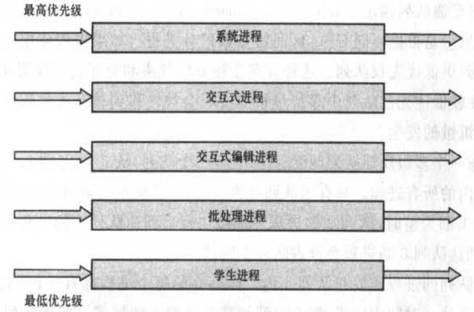
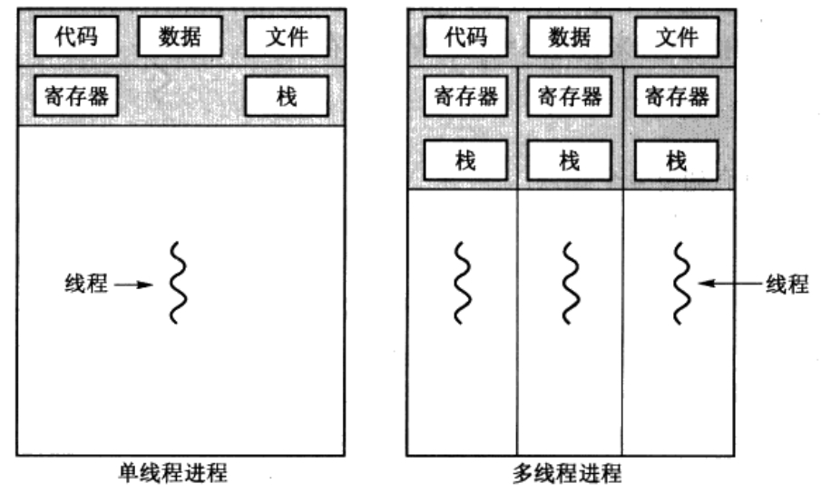
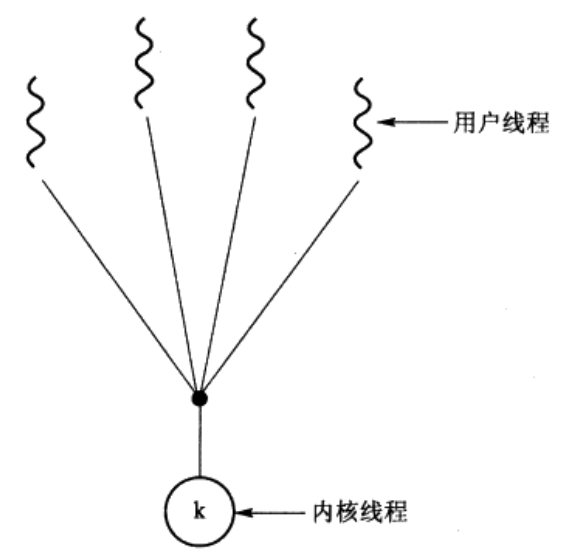
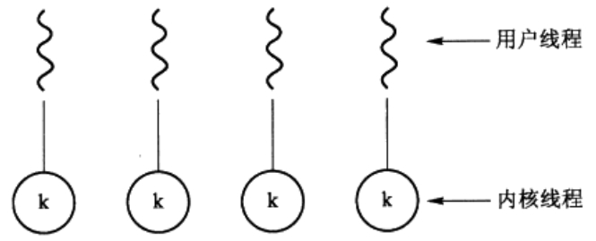
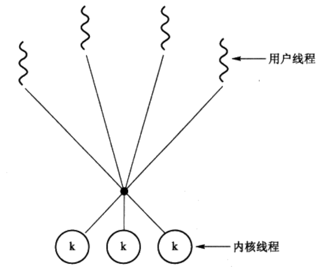

# Table of Contents

* [概述](#概述)
  * [基本功能](#基本功能)
    * [1. 进程管理](#1-进程管理)
    * [2. 内存管理](#2-内存管理)
    * [3. 文件管理](#3-文件管理)
    * [4. 设备管理](#4-设备管理)
  * [操作系统分类](#操作系统分类)
  * [系统调用](#系统调用)
  * [内核态与用户态](#内核态与用户态)
  * [中断](#中断)
    * [分类](#分类)
    * [硬中断与软中断的区别](#硬中断与软中断的区别)
* [进程管理](#进程管理)
  * [进程状态的切换](#进程状态的切换)
  * [进程通信](#进程通信)
    * [1. 管道](#1-管道)
              * [<unistd.h>](#unistdh)
    * [2. FIFO](#2-fifo)
    * [3. 消息队列](#3-消息队列)
    * [4. 信号](#4-信号)
    * [5. 共享存储](#5-共享存储)
    * [6. 套接字](#6-套接字)
  * [进程同步](#进程同步)
    * [1. 临界区](#1-临界区)
    * [2. 同步与互斥](#2-同步与互斥)
    * [3. 信号量](#3-信号量)
            * [N 100](#n-100)
    * [4. 管程-对比monitor](#4-管程-对比monitor)
    * [1. 读者-写者问题（多进程写）](#1-读者-写者问题（多进程写）)
    * [2. 哲学家进餐问题](#2-哲学家进餐问题)
            * [N 5](#n-5)
  * [进程调度算法](#进程调度算法)
    * [抢占调度](#抢占调度)
    * [调度算法性能比较的指标](#调度算法性能比较的指标)
    * [1. 批处理系统](#1-批处理系统)
      * [1. 先到先服务](#1-先到先服务)
      * [2.  最短作业优先调度](#2--最短作业优先调度)
      * [3. 最短剩余时间优先](#3-最短剩余时间优先)
    * [2. 交互式系统](#2-交互式系统)
      * [1. 优先级调度](#1-优先级调度)
      * [2. 轮转法调度](#2-轮转法调度)
      * [3. 多级队列调度](#3-多级队列调度)
      * [4. 多级反馈队列调度](#4-多级反馈队列调度)
    * [3. 实时系统](#3-实时系统)
* [线程](#线程)
  * [进程与线程](#进程与线程)
    * [1. 进程](#1-进程)
    * [2. 线程](#2-线程)
    * [3. 区别](#3-区别)
  * [线程地址空间](#线程地址空间)
  * [多线程优点](#多线程优点)
  * [多线程模型](#多线程模型)
    * [多对一](#多对一)
    * [一对一](#一对一)
    * [多对多](#多对多)
* [死锁](#死锁)
  * [必要条件](#必要条件)
  * [鸵鸟策略](#鸵鸟策略)
  * [死锁检测](#死锁检测)
    * [每种类型一个资源](#每种类型一个资源)
    * [每种类型多个资源](#每种类型多个资源)
  * [死锁恢复](#死锁恢复)
    * [进程终止](#进程终止)
    * [资源抢占](#资源抢占)
  * [死锁预防](#死锁预防)
  * [死锁避免](#死锁避免)
    * [安全状态](#安全状态)
    * [单个资源的银行家算法](#单个资源的银行家算法)
    * [多个资源的银行家算法](#多个资源的银行家算法)
* [虚拟内存](#虚拟内存)
  * [概念](#概念)
  * [优点](#优点)
  * [过程](#过程)
  * [分页系统地址映射](#分页系统地址映射)
  * [页面置换算法](#页面置换算法)
    * [1. 最佳置换算法OPT](#1-最佳置换算法opt)
    * [2. 最近最久未使用LRU](#2-最近最久未使用lru)
    * [3.最不常用LFU](#3最不常用lfu)
    * [4. 先进先出FIFO](#4-先进先出fifo)
* [段页式内存管理](#段页式内存管理)
  * [分段](#分段)
  * [段页式](#段页式)
  * [碎片](#碎片)
  * [分页与分段的比较](#分页与分段的比较)
  * [swap,cache,buffer](#swapcachebuffer)


# 概述

## 基本功能

### 1. 进程管理

**进程控制、进程同步、进程通信、死锁处理、CPU调度**等。

### 2. 内存管理

内存分配、**地址映射**、内存保护与共享、**虚拟内存**等。

### 3. 文件管理

文件存储空间的管理、目录管理、文件读写管理和保护等。

### 4. 设备管理

完成用户的 I/O 请求，方便用户使用各种设备，并提高设备的利用率。

主要包括缓冲管理、设备分配、设备处理、虛拟设备等。

## 操作系统分类

根据操作系统在用户界面的使用环境和功能特征的不同，操作系统一般可分为三种基本类型，即**批处理系统、分时系统和实时系统**。随着计算机体系结构的发展，又出现了许多种操作系统，它们是嵌人式操作系统、个人操作系统、网络操作系统和分布式操作系统。

1. 批处理操作系统
   批处理(Batch Processing)操作系统的工作方式是：用户将作业交给系统操作员，系统操作员将许多用户的作业组成一批作业，之后输入到计算机中，在系统中形成一个自动转接的连续的作业流，然后启动操作系统，系统自动、依次执行每个作业。最后由操作员将作业结果交给用户。
   批处理操作系统的特点是：多道和成批处理。
2. 分时操作系统
   分时(Time Sharing)操作系统的工作方式是：一台主机连接了若干个终端，每个终端有一个用户在使用。用户交互式地向系统提出命令请求，系统接受每个用户的命令，采用时间片轮转方式处理服务请求，并通过交互方式在终端上向用户显示结果。用户根据上步结果发出下道命。分时操作系统将CPU的时间划分成若干个片段，称为时间片。操作系统以时间片为单位，轮流为每个终端用户服务。每个用户轮流使用一个时间片而使每个用户并不感到有别的用户存在。分时系统具有多路性、交互性、“独占”性和及时性的特征。多路性指，伺时有多个用户使用一台计算机，宏观上看是多个人同时使用一个CPU，微观上是多个人在不同时刻轮流使用CPU。交互性是指，用户根据系统响应结果进一步提出新请求(用户直接干预每一步)。“独占”性是指，用户感觉不到计算机为其他人服务，就像整个系统为他所独占。及时性指，系统对用户提出的请求及时响应。
   常见的通用操作系统是分时系统与批处理系统的结合。其原则是：分时优先，批处理在后。“前台”响应需频繁交互的作业，如终端的要求； “后台”处理时间性要求不强的作业。
3. 实时操作系统
   实时操作系统(RealTimeOperatingSystem，RTOS)是指使计算机能及时响应外部事件的请求在规定的严格时间内完成对该事件的处理，并控制所有实时设备和实时任务协调一致地工作的操作系统。实时操作系统要追求的目标是：对外部请求在严格时间范围内做出反应，有高可靠性和完整性。
4. 嵌入式操作系统
   嵌入式操作系统(EmbeddedOperating System)是运行在嵌入式系统环境中，对整个嵌入式系统以及它所操作、控制的各种部件装置等资源进行统一协调、调度、指挥和控制的系统软件。程，并使整个系统能高效地运行。
5. 个人计算机操作系统
   个人计算机操作系统是一种单用户多任务的操作系统。个人计算机操作系统主要供个人使用，功能强、价格便宜，可以在几乎任何地方安装使用。它能满足一般人操作、学习、游戏等方面的需求。个人计算机操作系统的主要特点是计算机在某一时间内为单个用户服务；采用图形界面人机交互的工作方式，界面友好；使用方便，用户无需专门学习，也能熟练操纵机器。
6. 网络操作系统
   网络操作系统是基于计算机网络的，是在各种计算机操作系统上按网络体系结构协议标准开发的软件，包括网络管理、通信、安全、资源共享和各种网络应用。其目标是相互通信及资源共享。
7. 分布式操作系统
   大量的计算机通过网络被连结在一起，可以获得极高的运算能力及广泛的数据共享。这种系统被称作分布式系统(DistributedSystem)

## 系统调用

如果一个进程在用户态需要使用内核态的功能，就进行系统调用从而陷入内核，由操作系统代为完成。

<div align="center">  </div><br>
Linux 的系统调用主要有以下这些：

|     Task     | Commands                    |
| :----------: | --------------------------- |
| **进程控制** | fork(); exit(); wait();     |
| **进程通信** | pipe(); shmget(); mmap();   |
| **文件操作** | open(); read(); write();    |
|   设备操作   | ioctl(); read(); write();   |
|   信息维护   | getpid(); alarm(); sleep(); |
|     安全     | chmod(); umask(); chown();  |

## 内核态与用户态

**为什么有内核态-安全**

因为计算机的资源是有限的, 所以不可能让每个程序都能访问所有资源, 有的程序能访问任何资源, 有的则不能。就如人类社会中的社会地位一样, 越是社会地位高的人, 拥有的资源越多。所以运行于内核态的程序必须要有十分可靠的安全性, 不然随便修改了OS的内核数据结构, 就会造成系统的崩溃。而处于用户态的程序, 最多知识用户程序崩溃, 操作系统还能继续运行。

**什么时候进入内核态**

当一个任务（进程）执行系统调用而陷入内核代码中执行时，我们就称进程处于内核运行态（或简称为内核态）。此时处理器处于特权级最高的（0级）内核代码中执行。当进程处于内核态时，执行的内核代码会使用当前进程的内核栈。每个进程都有自己的内核栈。当进程在执行用户自己的代码时，则称其处于用户运行态（用户态）。即此时处理器在特权级最低的（3级）用户代码中运行。当正在执行用户程序而突然被中断程序中断时，此时用户程序也可以象征性地称为处于进程的内核态。因为中断处理程序将使用当前进程的内核栈。这与处于内核态的进程的状态有些类似。

## 中断

### 分类

1. **外中断**

由 CPU 执行指令以外的事件引起，如 I/O 完成中断，表示设备输入/输出处理已经完成，处理器能够发送下一个输入/输出请求。此外还有时钟中断、控制台中断等。

2. **异常**

由 CPU 执行指令的内部事件引起，如非法操作码、地址越界、算术溢出等。

3. **陷入**

在用户程序中使用系统调用。

### 硬中断与软中断的区别

**硬中断：**

\1. 硬中断是由硬件产生的，比如，像磁盘，网卡，键盘，时钟等。每个设备或设备集都有它自己的IRQ（中断请求）。基于IRQ，CPU可以将相应的请求分发到对应的硬件驱动上（注：硬件驱动通常是内核中的一个子程序，而不是一个独立的进程）。

\2. 处理中断的驱动是需要运行在CPU上的，因此，当中断产生的时候，CPU会中断当前正在运行的任务，来处理中断。在有多核心的系统上，一个中断通常只能中断一颗CPU（也有一种特殊的情况，就是在大型主机上是有硬件通道的，它可以在没有主CPU的支持下，可以同时处理多个中断。）。

\3. 硬中断可以直接中断CPU。它会引起内核中相关的代码被触发。对于那些需要花费一些时间去处理的进程，中断代码本身也可以被其他的硬中断中断。

\4. 对于时钟中断，内核调度代码会将当前正在运行的进程挂起，从而让其他的进程来运行。它的存在是为了让调度代码（或称为调度器）可以调度多任务。

**软中断：**

\1. 软中断的处理非常像硬中断。然而，它们仅仅是由当前正在运行的进程所产生的。

\2. 通常，软中断是一些对I/O的请求。这些请求会调用内核中可以调度I/O发生的程序。对于某些设备，I/O请求需要被立即处理，而磁盘I/O请求通常可以排队并且可以稍后处理。根据I/O模型的不同，进程或许会被挂起直到I/O完成，此时内核调度器就会选择另一个进程去运行。I/O可以在进程之间产生并且调度过程通常和磁盘I/O的方式是相同。

\3. 软中断仅与内核相联系。而内核主要负责对需要运行的任何其他的进程进行调度。一些内核允许设备驱动的一些部分存在于用户空间，并且当需要的时候内核也会调度这个进程去运行。

\4. 软中断并不会直接中断CPU。也只有当前正在运行的代码（或进程）才会产生软中断。这种中断是一种需要内核为正在运行的进程去做一些事情（通常为I/O）的请求。有一个特殊的软中断是Yield调用，它的作用是请求内核调度器去查看是否有一些其他的进程可以运行。

# 进程管理

## 进程状态的切换

<div align="center">  </div><br>
- 就绪状态（ready）：等待被调度
- 运行状态（running）
- 阻塞状态（waiting）：等待资源

应该注意以下内容：

- 只有就绪态和运行态可以相互转换，其它的都是单向转换。就绪状态的进程通过调度算法从而获得 CPU 时间，转为运行状态；而运行状态的进程，在分配给它的 CPU 时间片用完之后就会转为就绪状态，等待下一次调度。
- 阻塞状态是缺少需要的资源从而由运行状态转换而来，但是该资源不包括 CPU 时间，缺少 CPU 时间会从运行态转换为就绪态。

## 进程通信

[深入理解进程间通信](https://blog.csdn.net/century_sunshine/article/details/79882445)

进程同步与进程通信很容易混淆，它们的区别在于：

- 进程同步：控制多个进程按一定顺序执行；
- 进程通信：进程间传输信息。

进程通信是一种手段，而进程同步是一种目的。也可以说，为了能够达到进程同步的目的，需要让进程进行通信，传输一些进程同步所需要的信息。

### 1. 管道

[管道容量以及管道底层缓冲区如何组织](https://blog.csdn.net/quinn0918/article/details/72457779)

管道是通过调用 pipe 函数创建的，fd[0] 用于读，fd[1] 用于写。

```c
#include <unistd.h>
int pipe(int fd[2]);
```

它具有以下限制：

- 只支持半双工通信（单向交替传输）；
- 只能在父子进程中使用。

<div align="center">  </div><br>

### 2. FIFO

也称为**命名管道**，去除了管道只能在父子进程中使用的限制。

FIFO 常用于客户-服务器应用程序中，FIFO 用作汇聚点，在客户进程和服务器进程之间传递数据。

<div align="center">  </div><br>

### 3. 消息队列

相比于 FIFO，消息队列具有以下优点：

- 消息队列可以独立于读写进程存在，从而避免了 FIFO 中同步管道的打开和关闭时可能产生的困难；
- 避免了 FIFO 的同步阻塞问题，不需要进程自己提供同步方法；
- 读进程可以根据消息类型有选择地接收消息，而不像 FIFO 那样只能默认地接收。

### 4. 信号

用于通知接收进程某个事件已经发生

### 5. 共享存储

允许多个进程共享一个给定的存储区。因为数据不需要在进程之间复制，所以这是**最快的一种 IPC**。

需要使用信号量用来同步对共享存储的访问。

多个进程可以将同一个文件映射到它们的地址空间从而实现共享内存。另外 XSI 共享内存不是使用文件，而是使用内存的匿名段。

### 6. 套接字

与其它通信机制不同的是，它可用于不同机器间的进程通信。

## 进程同步

### 1. 临界区

对临界资源进行访问的那段代码称为临界区。

为了互斥访问临界资源，每个进程在进入临界区之前，需要先进行检查。

```html
// entry section
// critical section;
// exit section
```

### 2. 同步与互斥

- 同步：多个进程按一定顺序执行；
- 互斥：多个进程在同一时刻只有一个进程能进入临界区。

### 3. 信号量

信号量（Semaphore）是一个整型变量，可以对其执行 down 和 up 操作，也就是常见的 P 和 V 操作。

- **down**  : 如果信号量大于 0 ，执行 -1 操作；如果信号量等于 0，进程睡眠，等待信号量大于 0；
- **up** ：对信号量执行 +1 操作，唤醒睡眠的进程让其完成 down 操作。

down 和 up 操作需要被设计成原语，不可分割，通常的做法是在执行这些操作的时候屏蔽中断。

如果信号量的取值只能为 0 或者 1，那么就成为了  **互斥量（Mutex）** ，0 表示临界区已经加锁，1 表示临界区解锁。

```c
typedef int semaphore;
semaphore mutex = 1;
void P1() {
    down(&mutex);
    // 临界区
    up(&mutex);
}

void P2() {
    down(&mutex);
    // 临界区
    up(&mutex);
}
```

<font size=3>  **使用信号量实现生产者-消费者问题**  </font> </br>

问题描述：使用一个缓冲区来保存物品，只有缓冲区没有满，生产者才可以放入物品；只有缓冲区不为空，消费者才可以拿走物品。

因为缓冲区属于临界资源，因此需要使用一个互斥量 mutex 来控制对缓冲区的互斥访问。

为了同步生产者和消费者的行为，需要记录缓冲区中物品的数量。数量可以使用信号量来进行统计，这里需要使用两个信号量：empty 记录空缓冲区的数量，full 记录满缓冲区的数量。其中，empty 信号量是在生产者进程中使用，当 empty 不为 0 时，生产者才可以放入物品；full 信号量是在消费者进程中使用，当 full 信号量不为 0 时，消费者才可以取走物品。

注意，不能先对缓冲区进行加锁，再测试信号量。也就是说，不能先执行 down(mutex) 再执行 down(empty)。如果这么做了，那么可能会出现这种情况：生产者对缓冲区加锁后，执行 down(empty) 操作，发现 empty = 0，此时生产者睡眠。消费者不能进入临界区，因为生产者对缓冲区加锁了，消费者就无法执行 up(empty) 操作，empty 永远都为 0，导致生产者永远等待下，不会释放锁，消费者因此也会永远等待下去。

```c
#define N 100
typedef int semaphore;
semaphore mutex = 1;
semaphore empty = N;
semaphore full = 0;

void producer() {
    while(TRUE) {
        int item = produce_item();
        down(&empty);
        down(&mutex);
        insert_item(item);
        up(&mutex);
        up(&full);
    }
}

void consumer() {
    while(TRUE) {
        down(&full);
        down(&mutex);
        int item = remove_item();
        consume_item(item);
        up(&mutex);
        up(&empty);
    }
}
```

### 4. 管程-对比monitor

管程采用面向对象思想，将表示共享资源的数据结构及相关的操作，包括同步机制，都集中并封装到一起。所有进程都只能通过管程间接访问临界资源，而管程只允许一个进程进入并执行操作，从而实现进程互斥。

```c
Monitor monitor_name {
    share variable declarations;
    condition declarations;
    
    public:
    void P1(···) {
        ···
    }
    
    {
        initialization code;
    }
}
```

管程中设置了多个条件变量，表示多个进程被阻塞或挂起的条件，条件变量的形式为 `condition x, y;`，它也是一种抽象数据类型，每个变量保存了一条链表，记录因该条件而阻塞的进程，与条件变量相关的两个操作：`condition.cwait`和 `condition.csignal`。

- `condition.cwait`：正在调用管程的进程因 `condition`条件需要被阻塞，则调用 `condition.cwait`将自己插入到 `condition`的等待队列中，并释放管程。此时其他进程可以使用该管程。
- `condition.csignal`：正在调用管程的进程发现 `condition`条件发生变化，则调用 `condition.csignal`唤醒一个因 `condition`条件而阻塞的进程。如果没有阻塞的进程，则不产生任何结果。

### 1. 读者-写者问题（多进程写）

允许多个进程同时对数据进行读操作，但是不允许读和写以及写和写操作同时发生。

一个整型变量 count 记录在对数据进行读操作的进程数量，一个互斥量 count_mutex 用于对 count 加锁，一个互斥量 data_mutex 用于对读写的数据加锁。

```c
typedef int semaphore;
semaphore count_mutex = 1;
semaphore data_mutex = 1;
int count = 0;

void reader() {
    while(TRUE) {
        down(&count_mutex);
        count++;
        if(count == 1) down(&data_mutex); // 第一个读者需要对数据进行加锁，防止写进程访问
        up(&count_mutex);
        read();
        down(&count_mutex);
        count--;
        if(count == 0) up(&data_mutex);
        up(&count_mutex);
    }
}

void writer() {
    while(TRUE) {
        down(&data_mutex);
        write();
        up(&data_mutex);
    }
}
```

### 2. 哲学家进餐问题

<div align="center">  </div><br>

五个哲学家围着一张圆桌，每个哲学家面前放着食物，桌上放了5只筷子。哲学家的生活有两种交替活动：吃饭以及思考。当一个哲学家吃饭时，需要先拿起自己左右两边的两根筷子，并且一次只能拿起一根筷子。

下面是一种错误的解法，考虑到如果所有哲学家同时拿起左手边的筷子，那么就无法拿起右手边的筷子，造成死锁。

```c
#define N 5

void philosopher(int i) {
    while(TRUE) {
        think();
        take(i);       // 拿起左边的筷子
        take((i+1)%N); // 拿起右边的筷子
        eat();
        put(i);
        put((i+1)%N);
    }
}
```

为了防止死锁的发生，可以设置两个条件：

- 必须同时拿起左右两根筷子；（要么同时获取资源，要么全部不要获取）
- 只有在两个邻居都没有进餐的情况下才允许进餐。

## 进程调度算法

### 抢占调度

CPU调度决策可在如下4种环境下发生：

1. 当一个进程从运行状态切换到等待状态（例如，I/O请求，或调用wait等待一个子进程的终止）。
2. 当一个进程从运行状态切换到就绪状态（例如，当出现中断时）。
3. 当一个进程从等待状态切换到就绪状态（例如，I/O完成）。
4. 当一个进程终止时。

对于第1和第4两种情况，没有选择而只有调度。一个新进程（如果就绪队列中已有一个进程存在）必须被选择执行。不过，对于第2和第3两种情况，可以进行选择。

当调度只能发生在第1和第4两种情况下时，称调度方案是**非抢占的**（nonpreemptive）的或协作的（cooperative）；否则，称调度方案是**抢占的**（preemptive）。采**用非抢占调度，一CPU分配给一个进程，那么该进程会一直使用CPU直到进程终止或切换到等待状态**。Windows3.x使用该种调度方法，Windows95引入了抢占调度，所有之后的Windows 操作系统版本都使用抢占调度。Macintosh的MacOSX操作系统使用抢占调度，而之前的Macintosh操作系统依赖协作调度。协作调度在有的硬件平台上是唯一的方法，因为它不要求抢占调度所需要的特别的硬件（如定时器）支持。

### 调度算法性能比较的指标

- CPU使用率：需要使CPU尽可能忙。从概念上讲，CPU使用率从0%~100%。对于真实系统，它应从40%（轻负荷系统）~90%（重负荷系统）。
- 吞吐量：如果CPU忙于执行进程，那么就有工作在完成。一种测量工作量的方法称为吞吐量，它指一个时间单元内所完成进程的数量。对于长进程，吞吐量可能为每小时一个进程：对于短进程，吞吐量可能为每秒10个进程。
- 周转时间：从一个特定进程的角度来看，一个重要准则是运行该进程需要多长时间。
  从进程提交到进程完成的时间段称为周转时间。周转时间为所有时间段之和，包括等待进入内存、在就绪队列中等待、在CPU上执行和VO执行。
- 等待时间：CPU调度算法并不影响进程运行和执行I/O的时间；它只影响进程在就绪队列中等待所花的时间。等待时间为在就绪队列中等待所花费时间之和。
- 响应时间：对于交互系统，周转时间并不是最佳准则。通常，进程能相当早就产生输出，并继续计算新结果同时输出以前的结果给用户。因此，另一时间是从提交请求到产生第一响应的时间。这种时间称为响应时间，是开始响应所需要的时间，而不是输出响应所需要的时间。周转时间通常受输出设备速度的限制。

不同环境的调度算法目标不同，因此需要针对不同环境来讨论调度算法。

### 1. 批处理系统

批处理系统没有太多的用户操作，在该系统中，调度算法目标是保证吞吐量和周转时间（从提交到终止的时间）。

#### 1. 先到先服务

​		显然，最简单的CPU调度算法是**先到先服务调度算法（first-come，first-served（FCFS）Scheduling algorithm）**。采用这种方案，先请求CPU的进程先分配到CPU。FCFS策略可以用**FIFO**队列来容易地实现。当一个进程进入到就绪队列，其PCB链接到队列的尾部。当CPU空闲时，CPU分配给位于队列头的进程，接着该运行进程从队列中删除。FCFS调度的代码编写简单且容易理解。

​		**采用FCFS策略的平均等待时间通常较长**。FCFS调度算法是**非抢占的**。一旦CPU被分配给了一个进程，该进程就会保持CPU直到释放CPU为止，即程序终止或是请求I/O。FCFS算法对于分时系统（每个用户需要定时地得到一定的CPU时间）是特别麻烦的。允许一个进程保持CPU时间过长将是个严重错误。

####  2.  最短作业优先调度

​		另一种CPU调度方法是**最短作业优先调度算法（shortest-job-first（SJF）scheduling algorithm）**。这一算法将每个进程与其下一个CPU区间段相关联。当CPU为空闲时，它会赋给具有最短CPU区间的进程。如果两个进程具有同样长度，那么可以使用FCFS 调度来处理。注意，一个更为适当的表示是最短下一个CPU区间的算法，这是因为调度检查进程的下一个CPU区间的长度，而不是其总长度。使用术语SJF是因为绝大多数教科书和人员称这种调度策略为SJF。

​		SJF算法的真正困难是如何知道下一个CPU区间的长度。

​		SJF算法可能是抢占的或非抢占的。当一个新进程到达就绪队列而以前进程正在执行时，就需要选择。与当前运行的进程相比，新进程可能有一个更短的CPU区间。抢占SJF算法可抢占当前运行的进程，而非抢占SJF算法会允许当前运行的进程先完成其CPU区间。抢占SJF调度有时称为**最短剩余时间优先调度**（shortest-remaining-time-first scheduling）。

#### 3. 最短剩余时间优先 

最短作业优先的抢占式版本，按剩余运行时间的顺序进行调度。 当一个新的作业到达时，其整个运行时间与当前进程的剩余时间作比较。如果新的进程需要的时间更少，则挂起当前进程，运行新的进程。否则新的进程等待。

### 2. 交互式系统

交互式系统有大量的用户交互操作，在该系统中调度算法的目标是快速地进行响应。

#### 1. 优先级调度

​		SJF算法可作为通用**优先级调度算法（priority scheduling algorithm）**的一个特例。每个进程都有一个优先级与其关联，具有最高优先级的进程会分配到CPU。具有相同优先级的进程按FCFS顺序调度。SJF算法属于简单优先级算法，其优先（p）为下一个（预测的）CPU区间的倒数。CPU区间越大，则优先级越小，反之亦然。

​		优先调度可以是抢占的或者非抢占的。当一个进程到达就绪队列时，其优先级与当前运行进程的优先级相比较。如果新到达进程的优先级高于当前运行进程的优先级，那么抢优先级调度算法会抢占CPU。而非抢占优先级调度算法只是将新进程加到就绪队列的头部。

​		优先级调度算法的一个主要问题是**无穷阻塞（indefinite blocking）或饥饿（starvation）**。可以运行但缺乏CPU的进程可认为是阻塞的，它在等待CPU。优先级调度算法会使某个低优先级进程无穷等待CPU。

​		低优先级进程无穷等待问题的解决之一是**老化（aging**）。老化是一种技术，以逐渐增加在系统中等待很长时间的进程的优先级。例如，如果优先级为从127（低）到0（高），那么可以每15分钟递减等待进程的优先级的值。最终初始优先级值为127的进程会有最高优先级并能执行。事实上，不超过32小时，优先级为127的进程会老化为优先级为0的进程。

#### 2. 轮转法调度

​		**轮转法（round-robin，RR）**调度算法是专门为分时系统而设计的。它类似于FCFS调度，但是增加了抢占以在进程间切换。定义一个较小时间单元，称为**时间量（time quantum）或时间片**。时间片通常为10ms到100ms。就绪队列作为循环队列处理。CPU调度程序循环就绪队列，为每个进程分配不超过一个时间片间隔的CPU。

​		为了实现RR调度，将就绪队列实现为进程的FIFO队列。新进程增加到就绪队列的尾部。CPU调度程序从就绪队列中选择第一个进程，设置定时器在一个时间片之后中断，最后分派该进程。

​		RR算法的性能很大程度上依赖于时间片的大小。时间片越小，上下文切换越多；时间片太大，就演变为FCFS算法了。

#### 3. 多级队列调度

​		在进程可被容易地分成不同组的情况下，可以使用所建立的另一类调度算法。例如，一个常用划分方法是前台（或交互式）进程和后台（或批处理）进程。这两种不同类型的进程具有不同响应时间要求，也有不同调度需要。另外，与后台进程相比前台进程可能要有更高的（或外部定义）优先权。
​		**多级队列调度算法（multilevel queue-scheduling algorithm）**将就绪队列分成多个独立队列。根据进程的某些属性，如内存大小、进程优先权或进程类型，进程会被永久地分配到一个队列。每个队列有自己的调度算法。例如，不同队列可用于前台和后台进程。前台队列可能是用RR算法调度，而后台队列可能是用FCFS算法调度。

<div align="center">  </div><br>

​		每个队列与更低优先权队列相比有绝对的优先权。例如，只有系统进程、交互式进程和交互式编辑进程队列都为空，批处理队列内的进程才可运行。如果在一个批处理进程运行时有一个交互式编辑进程进入就绪队列，那么该批处理进程会被抢占。

#### 4. 多级反馈队列调度

​		对于多级队列调度算法.通常进程进入系统时，被永久地分配到一个队列。进程并不在队列之间移动。例如，如果有独立队列以用于前台和后台进程，进程并不从一个队列移到另…个队列，这是因为进程并不改变前台或后台性质。这种设置的优点是低调度开销，缺点是不够灵活。
​		然而，**多级反馈队列调度（multilcvel feedhack qucue scheduling）**允许进程在队列之间移动。其主要思想是根据不同CPU区间特点以区分进程。如果进程使用过多CPU时间，那么它会被移到更低优先权队列。这种方案会将I/O约束和交互式进程留在较高优先权队列。类似地，在较低优先权队列中等待过长的进程会被转移到较高优先权队列。这种形式的老化能阻止饥饿的发生。

### 3. 实时系统

实时系统要求一个请求在一个确定时间内得到响应。

分为硬实时和软实时，前者必须满足绝对的截止时间，后者可以容忍一定的超时。

# 线程

## 进程与线程

### 1. 进程

进程是**资源分配**的基本单位。

进程控制块 (Process Control Block, PCB) 描述进程的基本信息和运行状态，所谓的创建进程和撤销进程，都是指对 PCB 的操作。

下图显示了 4 个程序创建了 4 个进程，这 4 个进程可以并发地执行。

<div align="center">  </div><br>
### 2. 线程

线程是**独立调度**的基本单位。

一个进程中可以有多个线程，它们共享进程资源。

QQ 和浏览器是两个进程，浏览器进程里面有很多线程，例如 HTTP 请求线程、事件响应线程、渲染线程等等，线程的并发执行使得在浏览器中点击一个新链接从而发起 HTTP 请求时，浏览器还可以响应用户的其它事件。

<div align="center">  </div><br>
### 3. 区别

Ⅰ 拥有资源

进程是资源分配的基本单位，但是线程不拥有资源，线程可以访问隶属进程的资源。

Ⅱ 调度

线程是独立调度的基本单位，在同一进程中，线程的切换不会引起进程切换，从一个进程中的线程切换到另一个进程中的线程时，会引起进程切换。

Ⅲ 系统开销

进程有自己的独立地址空间，每启动一个进程，系统就会为它分配地址空间，建立数据表来维护代码段、堆栈段和数据段，这种操作非常昂贵。而线程是共享进程中的数据的，使用相同的地址空间，因此CPU切换一个线程的花费远比进程要小很多，同时创建一个线程的开销也比进程要小很多。

Ⅳ 通信方面

线程间可以通过直接读写同一进程中的数据进行通信，但是进程通信需要借助 IPC。

V 健壮性

但是多进程程序更健壮，多线程程序只要有一个线程死掉，整个进程也死掉了，而一个进程死掉并不会对另外一个进程造成影响，因为进程有自己独立的地址空间。

## 线程地址空间

线程是CPU使用的基本单元，它由线程ID、程序计数器、寄存器集合和栈组成。它与属于同一进程的其他线程共享代码段、数据段和其他操作系统资源，如打开文件和信号。

<div align="center">  </div><br>

## 多线程优点

1. **响应度高**：如果对一个交互程序采用多线程，那么即使其部分阻塞或执行较冗长的操作，该程序仍能继续执行，从而增加了对用户的响应程度。例如，多线程Web浏览器在用一个线程装入图像时，能通过另一个线程与用户交互。
2. 资源共享：线程默认共享它们所属进程的内存和资源。代码和数据共享的优点是它能允许一个应用程序在同一地址空间有多个不同的活动线程。
3. 经济：进程创建所需要的内存和资源的分配比较昂贵。由于线程能共享它们所属进程的资源，所以创建和切换线程会更为经济。实际地测量进程创建和管理与线程创建和管理的差别较为困难，但是前者通常要比后者花费更多的时间。例如，对于Solaris，进程创建要比线程创建慢30倍，而进程切换要比线程切换慢5倍。
4. 多处理器体系结构的利用：多线程的优点之一是能充分使用多处理器体系结构，以便每个进程能并行运行在不同的处理器上。不管有多少CPU，单线程进程只能运行在一个CPU上。在多CPU上使用多线程加强了并发功能。

## 多线程模型

### 多对一

将许多用户级线程映射到一个内核线程。线程管理是由线程库在用户空间进行的，因而效率比较高。但是如果一个线程执行了阻塞系统调用，那么整个进程会阻塞。而且，因为任一时刻只有一个线程能访问内核，多个线程不能并行运行在多处理器上。Green thread（Solaris所应用的线程库）就使用了这种模型，另外还有 GNU
可移植线程（GNU Portable Threads）。

<div align="center">  </div><br>

### 一对一

将每个用户线程映射到一个内核线程。该模型在一个线程执行阻塞系统调用时，能允许另一个线程继续执行，所以它提供了比多对一模型更好的并发功能；它也允许多个线程能并行地运行在多处理器系统上。这种模型的唯一缺点是每创建一个用户线程就需要创建一个相应的内核线程。由于创建内核线程的开销会影响应用程序的性能，所以这种模型的绝大多数实现限制了系统所支持的线程数量。Linux与Windows操作系统家族（包括Windows95、Windows 98、Windows NT、Windows 2000和Windows XP）实现了一对一模型。

<div align="center">  </div><br>

### 多对多

多路复用了许多用户线程到同样数量或更小数量的内核线程上。内核线程的数量可能与特定应用程序或特定机器有关（位于多处理器上的应用程序可比单处理器上分配更多数量的内核线程）。虽然多对一模型允许开发人员创建任意多的用户线程，但是因为内核只能一次调度一个线程，所以并没有增加并发性。一对一模型提供了更大的并发性，但是开发人员必须小心，不要在应用程序内创建太多的线程（有时可能会限制创建线程的数量）。多对多模型没有这两者的缺点：开发人员可创建任意多的用户线程，并且相应内核线程能在多处理器系统上并发执行。而且，当一个线程执行阻塞系统调用时，内核能调度另一个线程来执行。

<div align="center">  </div><br>

# 死锁

## 必要条件

如果在一个系统中下面4个条件同时满足，那么会引起死锁。

- 互斥：至少有一个资源必须处于非共享模式，即一次只有一个进程使用。如果另一进程申请该资源，那么申请进程必须等到该资源被释放为止。
- 占有并等待：一个进程必须占有至少一个资源，并等待另一资源，而该资源为其他进程所占有。
- 非抢占：资源不能被抢占，即资源只能在进程完成任务后自动释放。
- 循环等待：有一组等待进程{Po，P1，…，Pa}，Po等待的资源为P1所占有，P1等待的资源为P2所占有，…，Pa-1等待的资源为P，所占有，P。等待的资源为Po所占有。

在此，强调所有4个条件必须同时满足才会出现死锁。循环等待条件意味着占有并等待条件，这样4个条件并不完全独立。

## 鸵鸟策略

把头埋在沙子里，假装根本没发生问题。

因为解决死锁问题的代价很高，因此鸵鸟策略这种不采取任务措施的方案会获得更高的性能。

当发生死锁时不会对用户造成多大影响，或发生死锁的概率很低，可以采用鸵鸟策略。

大多数操作系统，包括 Unix，Linux 和 Windows，处理死锁问题的办法仅仅是忽略它。

## 死锁检测

不试图阻止死锁，而是当检测到死锁发生时，采取措施进行恢复。

### 每种类型一个资源

<div align="center">  </div><br>
上图为资源分配图，其中方框表示资源，圆圈表示进程。资源指向进程表示该资源已经分配给该进程，进程指向资源表示进程请求获取该资源。

图 a 可以抽取出环，如图 b，它满足了环路等待条件，因此会发生死锁。

每种类型一个资源的死锁检测算法是通过检测有向图是否存在环来实现，从一个节点出发进行深度优先搜索，对访问过的节点进行标记，如果访问了已经标记的节点，就表示有向图存在环，也就是检测到死锁的发生。

### 每种类型多个资源

<div align="center">  </div><br>
上图中，有三个进程四个资源，每个数据代表的含义如下：

- E 向量：资源总量
- A 向量：资源剩余量
- C 矩阵：每个进程所拥有的资源数量，每一行都代表一个进程拥有资源的数量
- R 矩阵：每个进程请求的资源数量

进程 P<sub>1</sub> 和 P<sub>2</sub> 所请求的资源都得不到满足，只有进程 P<sub>3</sub> 可以，让 P<sub>3</sub> 执行，之后释放 P<sub>3</sub> 拥有的资源，此时 A = (2 2 2 0)。P<sub>2</sub> 可以执行，执行后释放 P<sub>2</sub> 拥有的资源，A = (4 2 2 1) 。P<sub>1</sub> 也可以执行。所有进程都可以顺利执行，没有死锁。

算法总结如下：

每个进程最开始时都不被标记，执行过程有可能被标记。当算法结束时，任何没有被标记的进程都是死锁进程。

1. 寻找一个没有标记的进程 P<sub>i</sub>，它所请求的资源小于等于 A。
2. 如果找到了这样一个进程，那么将 C 矩阵的第 i 行向量加到 A 中，标记该进程，并转回 1。
3. 如果没有这样一个进程，算法终止。

## 死锁恢复

### 进程终止

1. 终止所有死锁进程。这种方法显然终止了死锁循环，但其代价也大。这些进程可能已计算了很长时间，这些部分计算结果必须放弃，以后可能还要重新计算。
2. 一次只终止一个进程直到取消死锁循环为止。这种方法的开销会相当大，这是因为每次终止一个进程，都必须调用死锁检测算法以确定进程是否仍处于死锁。

### 资源抢占

通过抢占资源以取消死锁，逐步从进程中抢占资源给其他进程使用，直到死锁环被打破为止。

如果要求使用抢占来处理死锁，那么有三个问题需要处理：

1. **选择一个牺牲品**：抢占哪些资源和哪个进程？与进程取消一样，必须确定抢占顺序以使代价最小化。代价因素包括许多参数，如死锁进程所拥有的资源数量，死锁进程到现在为止在其执行过程中所消耗的时间。
2. **回滚**：如果从一个进程那里抢占一个资源，那么应对该进程做些什么安排？显然，该进程不能正常执行，它缺少所需要的资源。必须将进程回滚到某个安全状态，以便从该状态重启进程。通常确定一个安全状态并不容易，所以最简单的方法是完全回滚：终止进程并重新执行。更为有效的方法是将进程回滚到足够打破死锁。另一方面，这种方法要求系统维护有关运行进程状态的更多信息。
3. **饥饿**：如何确保不会发生饥饿？即如何保证资源不会总是从同一个进程中被抢占？如果一个系统是基于代价来选择牺牲进程，那么同一进程可能总是被选为牺牲品。结果，这个进程永远不能完成其指定任务，任何实际系统都需要处理这种饥饿情况。显然，必须确保一个进程只能有限地被选择为牺牲品。最为常用的方法是在代价因素中加上**回滚次数。**

## 死锁预防

在程序运行之前预防发生死锁。

1. 破坏互斥条件

例如打印机技术允许若干个进程同时输出，唯一真正请求物理打印机的进程是打印机守护进程。

2. 破坏占有和等待条件

一种协议是规定所有进程在开始执行前请求所需要的全部资源。另外一种协议允许进程在没有资源时才可申请资源。一个进程可申请一些资源并使用它们。然而，在它申请更多其他资源之前，它必须释放其现已分配的所有资源。

3. 破坏不可抢占条件

第三个必要条件是对已分配的资源不能抢占。为了确保这一条件不成立，可以使用如下协议：如果一个进程占有资源并申请另一个不能立即分配的资源，那么其现已分配的资源都可被抢占。换句话说，这些资源都被隐式地释放了。

4. 破坏环路等待

给资源统一编号，进程只能按编号顺序来请求资源。

## 死锁避免

在程序运行时避免发生死锁。

**死锁避免的基本思想是动态地检测资源分配状态，以确保循环等待条件不成立，从而确保系统处于安全状态。所谓安全状态是指：如果系统能按某个顺序为每个进程分配资源（不超过其最大值），那么系统状态是安全的，换句话说就是，如果存在一个安全序列，那么系统处于安全状态。**资源分配图算法和银行家算法是两种经典的死锁避免的算法，其可以确保系统始终处于安全状态。其中，**资源分配图算法应用场景为每种资源类型只有一个实例(申请边，分配边，需求边，不形成环才允许分配)，而银行家算法应用于每种资源类型可以有多个实例的场景。**

### 安全状态

<div align="center">  </div><br>
图 a 的第二列 Has 表示已拥有的资源数，第三列 Max 表示总共需要的资源数，Free 表示还有可以使用的资源数。从图 a 开始出发，先让 B 拥有所需的所有资源（图 b），运行结束后释放 B，此时 Free 变为 5（图 c）；接着以同样的方式运行 C 和 A，使得所有进程都能成功运行，因此可以称图 a 所示的状态时安全的。

**定义：如果没有死锁发生，并且即使所有进程突然请求对资源的最大需求，也仍然存在某种调度次序能够使得每一个进程运行完毕，则称该状态是安全的。**

安全状态的检测与死锁的检测类似，因为安全状态必须要求不能发生死锁。下面的银行家算法与死锁检测算法非常类似，可以结合着做参考对比。

### 单个资源的银行家算法

一个小城镇的银行家，他向一群客户分别承诺了一定的贷款额度，算法要做的是判断对请求的满足是否会进入不安全状态，如果是，就拒绝请求；否则予以分配。

<div align="center">  </div><br>
上图 c中，任意一个进程所需的资源均大于空闲资源，所有进程将无法继续运行，为不安全状态，因此算法会拒绝之前的请求，从而避免进入图 c 中的状态。

### 多个资源的银行家算法

<div align="center">  </div><br>
上图中有五个进程，四个资源。左边的图表示已经分配的资源，右边的图表示还需要分配的资源。最右边的 E、P 以及 A 分别表示：总资源、已分配资源以及可用资源，注意这三个为向量，而不是具体数值，例如 A=(1020)，表示 4 个资源分别还剩下 1/0/2/0。

检查一个状态是否安全的算法如下：

- 查找右边的矩阵是否存在一行小于等于向量 A。如果不存在这样的行，那么系统将会发生死锁，状态是不安全的。
- 假若找到这样一行，将该进程标记为终止，并将其已分配资源加到 A 中。
- 重复以上两步，直到所有进程都标记为终止，则状态时安全的。

如果一个状态不是安全的，需要拒绝进入这个状态。

# 虚拟内存

## 概念

虚拟内存（virtual memory）的**目的**是为了让物理内存扩充成更大的逻辑内存，从而让程序获得更多的可用内存。

为了更好的管理内存，操作系统将内存抽象成地址空间。每个程序拥有自己的地址空间，这个地址空间被分割成多个块，每一块称为一页。这些页被映射到物理内存（psychic memory），但不需要映射到连续的物理内存，也不需要所有页都必须在物理内存中。当程序引用到不在物理内存中的页时，由硬件执行必要的映射，将缺失的部分装入物理内存并重新执行失败的指令。

从上面的描述中可以看出，虚拟内存允许程序不用将地址空间中的每一页都映射到物理内存，也就是说一个程序不需要全部调入内存就可以运行，这使得有限的内存运行大程序成为可能。例如有一台计算机可以产生 16 位地址，那么一个程序的地址空间范围是 0\~64K。该计算机只有 32KB 的物理内存，虚拟内存技术允许该计算机运行一个 64K 大小的程序。

<div align="center">  </div><br>
## 优点

1. 读写内存的安全性（**内核安全**）

物理内存本身是不限制访问的，任何地址都可以读写，而操作系统要求不同的页面具有不同的访问权限，这是利用CPU模式和MMU的内存保护机制实现的。例如，Text Segment被只读保护起来，防止被错误的指令意外改写，内核地址空间也被保护起来，防止在用户模式下执行错误的指令意外改写内核数据。这样，执行错误指令或恶意代码的破坏能力受到了限制，顶多使当前进程因段错误终止，而不会影响整个系统的稳定性。

2. 虚拟内存管理最主要的作用是让每个进程有独立的地址空间(**进程间的安全**)

所谓独立的地址空间是指，不同进程中的同一个虚拟地址（virtual address）被MMU映射到不同的物理地址（psychic address）,并且在某一个进程中访问任何地址都不可能访问到另外一个进程的数据，这样使得任何一个进程由于执行错误指令或恶意代码导致的非法内存访问都不会意外改写其它进程的数据，不会影响其它进程的运行，从而保证整个系统的稳定性。另一方面，每个进程都认为自己独占整个虚拟地址空间，这样链接器和加载器的实现会比较容易，不必考虑各进程的地址范围是否冲突。

3. VA到PA的映射会给**分配和释放内存**带来方便（**分配不连续内存，减少内存碎片**）

物理地址不连续的几块内存可以映射成虚拟地址连续的一块内存。比如要用malloc分配一块很大的内存空间，虽然有足够多的空闲物理内存，却没有足够大的连续空闲内存，这时就可以分配多个不连续的物理页面而映射到连续的虚拟地址范围。

4. 一个系统如果同时运行着很多进程，为各进程分配的内存之和可能会大于实际可用的物理内存，虚拟内存管理使得这种情况下各进程仍然能够正常运行（**使用swap获得更大的内存空间**）

因为各进程分配的只不过是虚拟内存的页面，这些页面的数据可以映射到物理页面，也可以临时保存到磁盘上而不占用物理页面，在磁盘上临时保存虚拟内存页面的可能是一个磁盘分区，也可能是一个磁盘文件，称为交换设备（Swap Device）。当物理内存不够用时，将一些不常用的物理页面中的数据临时保存到交换设备，然后这个物理页面就认为是空闲的了，可以重新分配给进程使用，这个过程称为换出（Pageout）。如果进程要用到被换出的页面，就从交换设备再加载回物理内存，这称为换入（Pagein）。换出和换入操作统称为换页（Paging）

## 过程

1、 页表
		第一部分记录此页是否在物理内存上，第二部分记录物理内存页的地址（如果在的话）
2、缺页异常
		当进程访问某个虚拟地址的时候，就会先去看页表，如果发现对应的数据不在物理内存上，就会发生缺页异常
3、页面置换
		缺页异常的处理过程，操作系统立即阻塞该进程，并将硬盘里对应的页换入内存，然后使该进程就绪，如果内存已经满了，没有空地方了，那就找一个页覆盖，至于具体覆盖的哪个页，就需要看操作系统的页面置换算法是怎么设计的了。

## 分页系统地址映射

内存管理单元（MMU）管理着地址空间和物理内存的转换，其中的页表（Page table）存储着页（程序地址空间）和页框（物理内存空间）的映射表。

一个虚拟地址分成两个部分，一部分存储页面号，一部分存储偏移量。

下图的页表存放着 16 个页，这 16 个页需要用 4 个比特位来进行索引定位。例如对于虚拟地址（0010 000000000100），前 4 位是存储页面号 2，读取表项内容为（110 1），页表项最后一位表示是否存在于内存中，1 表示存在。后 12 位存储偏移量。这个页对应的页框的地址为 （110 000000000100）。

<div align="center">  </div><br>
## 页面置换算法

在程序运行过程中，如果要访问的页面不在内存中，就发生缺页中断从而将该页调入内存中。此时如果内存已无空闲空间，系统必须从内存中调出一个页面到磁盘对换区中来腾出空间。

页面置换算法和缓存淘汰策略类似，可以将内存看成磁盘的缓存。在缓存系统中，缓存的大小有限，当有新的缓存到达时，需要淘汰一部分已经存在的缓存，这样才有空间存放新的缓存数据。

页面置换算法的主要目标是使页面置换频率最低（也可以说缺页率最低）。

### 1. 最佳置换算法OPT

所选择的被换出的页面将是最长时间内不再被访问，通常可以保证获得最低的缺页率。

是一种理论上的算法，因为无法知道一个页面多长时间不再被访问。

举例：一个系统为某进程分配了三个物理块，并有如下页面引用序列：

```html
7，0，1，2，0，3，0，4，2，3，0，3，2，1，2，0，1，7，0，1
```

开始运行时，先将 7, 0, 1 三个页面装入内存。当进程要访问页面 2 时，产生缺页中断，会将页面 7 换出，因为页面 7 再次被访问的时间最长。

### 2. 最近最久未使用LRU

虽然无法知道将来要使用的页面情况，但是可以知道过去使用页面的情况。LRU 将最近最久未使用的页面换出。

为了实现 LRU，需要在内存中维护一个所有页面的链表。当一个页面被访问时，将这个页面移到链表表头。这样就能保证链表表尾的页面是最近最久未访问的。

因为每次访问都需要更新链表，因此这种方式实现的 LRU 代价很高。

```html
4，7，0，7，1，0，1，2，1，2，6

```

<div align="center">  </div><br>
**LRU实现**

- 新数据插入到**链表**头部；
- 每当缓存命中（即缓存数据被访问），则将数据移到链表头部；
- 当链表满的时候，将链表尾部的数据丢弃。
- 使用**hashmap**加快缓存查询速度，value为链表对应元素

[[LRU算法 缓存淘汰策略](https://www.cnblogs.com/Dhouse/p/8615481.html)](https://www.cnblogs.com/Dhouse/p/8615481.html)

[LRU原理和Redis实现——一个今日头条的面试题](https://baijiahao.baidu.com/s?id=1595292420641966263&wfr=spider&for=pc)

### 3.最不常用LFU

LFU页面置换算法要求置换具有最小计数的页面。

这种选择的原因是，积极使用的页面应当具有大的引用计数。然而，当一个页面在进程的初始阶段大量使用但是随后不再使用时，会出现问题。由于被大量使用，它有一个大的计数，即使不再需要却仍保留在内存中。一种解决方案是，定期地将计数右移 1 位，以形成指数衰减的平均使用计数。

### 4. 先进先出FIFO

选择换出的页面是最先进入的页面。

该算法会将那些经常被访问的页面也被换出，从而使缺页率升高。

# 段页式内存管理

## 分段

虚拟内存采用的是分页技术，也就是将地址空间划分成固定大小的页，每一页再与内存进行映射。

下图为一个编译器在编译过程中建立的多个表，有 4 个表是动态增长的，如果使用分页系统的一维地址空间，动态增长的特点会导致覆盖问题的出现。

<div align="center">  </div><br>
分段的做法是把每个表分成段，一个段构成一个独立的地址空间。每个段的长度可以不同，并且可以动态增长。

<div align="center">  </div><br>
## 段页式

**程序的地址空间划分成多个拥有独立地址空间的段，每个段上的地址空间划分成大小相同的页。这样既拥有分段系统的共享和保护，又拥有分页系统的虚拟内存功能。**

## 碎片

[内存碎片产生原因及终极解决办法](https://blog.csdn.net/zerokkqq/article/details/79802295)

1、 内部碎片是由于采用固定大小的内存分区，当一个进程不能完全使用分给它的固定内存区域时就产生了内部碎片，通常内部碎片难以完全避免；

2、 外部碎片是由于某些未分配的连续内存区域太小，以至于不能满足任意进程的内存分配请求，从而不能被进程利用的内存区域。

现在普遍采用的段页式内存分配方式就是将进程的内存区域分为不同的段，然后将每一段由多个固定大小的页组成。通过页表机制，使段内的页可以不必连续处于同一内存区域，从而减少了外部碎片，然而同一页内仍然可能存在少量的内部碎片，只是一页的内存空间本就较小，从而使可能存在的内部碎片也较少。

## 分页与分段的比较

- 对程序员的透明性：分页透明，但是分段需要程序员显式划分每个段。
- 地址空间的维度：分页是一维地址空间，分段是二维的。
- 大小是否可以改变：页的大小不可变，段的大小可以动态改变。
- 出现的原因：**分页主要用于实现虚拟内存，从而获得更大的地址空间；分段主要是为了使程序和数据可以被划分为逻辑上独立的地址空间并且有助于共享和保护。**

## swap,cache,buffer

[linux中内存使用,swap,cache,buffer的含义总结](https://blog.csdn.net/bingqingsuimeng/article/details/51858858)

**swap**
	当有应用需要读写磁盘数据时，由系统把相关数据从磁盘读取到内存，如果物理内存不够，则把内存中的部分数据导入到磁盘，从而把磁盘的部分空间当作**虚拟内存**来使用，也称为Swap。
**cache**
	从磁盘读取到内存的数据在被相关应用程序读取后，如果有剩余内存，则这部分数据会存入cache，以备第2次**读取**时，避免重新读取磁盘。
**buffer**
	当一个应用程序在内存中修改过数据后，因为写入磁盘速度相对较低，在有空闲内存的情况下，这些数据先存入buffer，在以后某个时间再**写入**磁盘，从而应用程序可以继续后面的操作，而不必等待这些数据写入磁盘的操作完成。
