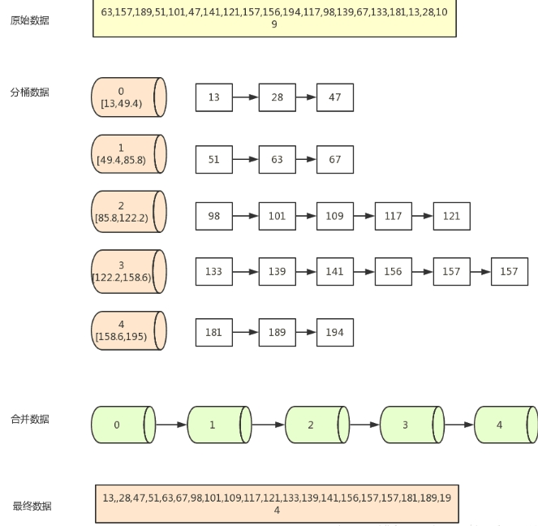

# Table of Contents

* [概述](#概述)
* [基础](#基础)
  * [BloomFilter](#bloomfilter)
  * [桶排序](#桶排序)
  * [tire树](#tire树)
  * [bitmap](#bitmap)
* [方法模式](#方法模式)
  * [**分而治之/Hash映射 + Hash统计 + 堆/快速/归并排序**](#分而治之hash映射--hash统计--堆快速归并排序)
  * [**双层桶划分**](#双层桶划分)
  * [**Bitmap**](#bitmap-1)
  * [**Trie树/数据库/倒排索引**](#trie树数据库倒排索引)
  * [**外排序**](#外排序)
  * [**Mapreduce**](#mapreduce)
* [参考](#参考)

# 概述

所谓**海量数据处理**，就是**基于海量数据上的存储、处理、操作**。

​        **海量**就是数据量太大，所以导致要么是**无法在较短时间内迅速解决**，要么是**无法一次性装入内存**。

**解决办法:**

（1）针对**时间**，可以采用巧妙的**算法**搭配合适的**数据结构**，如**Hash/bit-map**/堆/数据库或倒排索引/**trie**树；

（2）针对**空间**，大而化小：[分而治之](https://www.baidu.com/s?wd=分而治之&tn=24004469_oem_dg&rsv_dl=gh_pl_sl_csd)/hash映射，把规模大化为规模小的，[各个击破](https://www.baidu.com/s?wd=各个击破&tn=24004469_oem_dg&rsv_dl=gh_pl_sl_csd)。如果数据分散在不同的机器或者不同的文件，也需要进行分而治之/hash映射。

 

处理海量数据问题，有**6种方法模式**：

1. 分而治之/hash映射 + hash统计 + 堆/快速/归并排序；
2. 双层桶划分
3. Bloom filter/Bitmap；
4. Trie树/数据库/倒排索引；
5. 外排序；
6. 分布式处理之Hadoop/Mapreduce。

# 基础

## BloomFilter

[布隆过滤器](https://blog.csdn.net/xinzhongtianxia/article/details/81294922)

**实现原理**

BloomFiler 又叫布隆过滤器，下面举例说明 BlooFilter 的实现原理：
比如你有 10 个 Url，你完全可以创建一长度是 100bit 的数组，然后对 url 分别用 5 个不同的 hash 函数进行 hash，得到 5 个 hash 后的值，这 5 个值尽可能的保证均匀分布在 100 个 bit 的范围内。然后把 5 个 hash 值对应的 bit 位都置为 1，判断一个 url 是否已经存在时，一次看 5 个 bit 位是否为 1 就可以了，如果有任何一个不为 1，那么说明这个 url 不存在。这里需要注意的是，**如果对应的 bit 位值都为 1，那么也不能肯定这个 url 一定存在**，这个是 BloomFilter 的特点之一，稍后再说。

**核心思想**

BloomFilter 的核心思想有两点：

1. 多个 hash，增大随机性，减少 hash 碰撞的概率
2. 扩大数组范围，使 hash 值均匀分布，进一步减少 hash 碰撞的概率。

**BloomFilter 的准确性**

尽管 BloomFilter 已经尽可能的减小 hash 碰撞的概率了，但是，并不能彻底消除，因此正如上面提到的：
**如果对应的 bit 位值都为 1，那么也不能肯定这个 url 一定存在**
也就是说，BloomFilter 其实是存在一定的误判的，这个误判的概率显然和数组的大小以及 hash 函数的个数以及每个 hash 函数本身的好坏有关，具体的计算公式，可以查阅相关论文，这里只给出结果：
Wiki 的 Bloom Filter 词条有关于误报的概率的详细分析：[Probability of false positives](http://en.wikipedia.org/wiki/Bloom_filter#Probability_of_false_positives)。从分析可以看出，误判概率还是比较小的，空间利用率也很高。

**BloomFilter 的应用**

1. 黑名单
   比如邮件黑名单过滤器，判断邮件地址是否在黑名单中
2. 排序 (仅限于 BitSet)
   仔细想想，其实 BitSet 在 set(int value) 的时候，“顺便” 把 value 也给排序了。
3. 网络爬虫
   判断某个 URL 是否已经被爬取过
4. K-V 系统快速判断某个 key 是否存在
   典型的例子有 Hbase，Hbase 的每个 Region 中都包含一个 BloomFilter，用于在查询时快速判断某个 key 在该 region 中是否存在，如果不存在，直接返回，节省掉后续的查询。

## 桶排序

[算法：排序算法之桶排序 - 7-SEVENS - CSDN 博客](https://blog.csdn.net/developer1024/article/details/79770240)

桶排序（Bucket sort）或所谓的箱排序，是一个排序算法，工作的原理是将数组分到有限数量的桶里。每个桶再个别排序，最后依次把各个桶中的记录列出来记得到有序序列。

桶排序假设待排序的一组数均匀独立的分布在一个范围中，并将这一范围划分成几个子范围（桶）。

然后基于某种映射函数 f ，将待排序列的关键字 k 映射到第 i 个桶中 (即桶数组 B 的下标 i) ，那么该关键字 k 就作为 B[i] 中的元素 (每个桶 B[i] 都是一组大小为 N/M 的序列 )。

接着将各个桶中的数据有序的合并起来 : 对每个桶 B[i] 中的所有元素进行比较排序 (可以使用快排)。然后依次枚举输出 B[0]….B[M] 中的全部内容即是一个有序序列。

分步骤图示说明：设有数组 array = [63, 157, 189, 51, 101, 47, 141, 121, 157, 156, 194, 117, 98, 139, 67, 133, 181, 13, 28, 109]，对其进行桶排序： 

**复杂度分析**

平均时间复杂度：O(n + k)

最佳时间复杂度：O(n + k)

最差时间复杂度：O(n ^ 2)

空间复杂度：O(n * k)稳定性：稳定

桶排序最好情况下使用线性时间 O(n)，桶排序的时间复杂度，取决与对各个桶之间数据进行排序的时间复杂度，因为其它部分的时间复杂度都为 O(n)。很显然，桶划分的越小，各个桶之间的数据越少，排序所用的时间也会越少。但相应的空间消耗就会增大。

## tire树

[字典树(Trie树)实现与应用](https://www.cnblogs.com/xujian2014/p/5614724.html)

[字典树](https://blog.csdn.net/SongBai1997/article/details/82317259)

1、基本概念

　　字典树，又称为单词查找树，Tire 数，是一种树形结构，它是一种哈希树的变种。

　　

2、基本性质

- 根节点不包含字符，除根节点外的每一个子节点都包含一个字符
- 从根节点到某一节点。路径上经过的字符连接起来，就是该节点对应的字符串
- 每个节点的所有子节点包含的字符都不相同

3、应用场景

　　典型应用是用于统计，排序和保存大量的字符串 (不仅限于字符串)，经常被搜索引擎系统用于文本词频统计。

4、优点

　　利用字符串的公共前缀来减少查询时间，最大限度的减少无谓的字符串比较，查询效率比哈希树高。

## bitmap

[BitMap 算法 - 蒲公英的博客 - CSDN 博客](https://blog.csdn.net/qq_31622605/article/details/78041796)

1：Bit-Map 算法又名位图算法，其原理是，使用下标代替数值或特定的意义，使用这个位为 0 或者 1 代表特性是否存在。

2：Bit-Map 算法具有效率高，节省空间的特点，适用于对大量数据进行去重，查询等。

应用举例：

​    例如，我们存储了一些整形数据：2，8，4，6，9，我们需要查询是否存储了 3，那么，按普通的思路，我们需要将所有数据遍历一次，看是否有需要查找的数据，这样，时间复杂度为 O(n)，使用 Bit-Map，我们可以申请 10 bit 的空间，并将内容全部置零，需要存储 2，那么就将下标 2 的 bit 位置为 1，存储 8，就将下标为 8 的 bit 位置为 1，同样的，将下标为 4，6，9 的 bit 位也置为 1，其结果如下图所示：

​    图中，蓝色代表 0，红色代表 1。

​    此时，如果我们需要查找 3 是否保存过，只需要直接访问下标 3 的 bit 位，为 1，就说明保存过，为 0 就是未保存过。

# 方法模式	

## **分而治之/Hash映射 + Hash统计 + 堆/快速/归并排序**

**1、海量日志数据，提取出某日访问百度次数最多的那个IP。**

​      分而治之/hash映射 + hash统计 + 堆/快速/归并排序，就是**先映射，后统计，最后排序**：

1. 分而治之/hash映射：针对数据太大，内存受限，只能是：把大文件化成(取模映射)小文件，即16字方针：大而化小，各个击破，缩小规模，逐个解决
2. hash统计：当大文件转化了小文件，那么我们便可以采用常规的hash_map(ip，value)来进行频率统计。
3. 堆/快速排序：统计完了之后，便进行排序(可采取堆排序)，得到次数最多的IP。

   具体则是： “首先是这一天，并且是访问百度的日志中的IP取出来，逐个写入到一个大文件中。注意到**IP是32位的，最多有个2^32个IP**。同样可以采用映射的方法，比如模1000，**把整个大文件映射为1000个小文件**，再找出每个小文中出现频率最大的IP（可以**采用hash_map对那1000个文件中的所有IP进行频率统计**，然后依次找出**各个文件中频率最大的那个IP**）及相应的频率。然后再**在这1000个最大的IP中，找出那个频率最大的IP**，即为所求。”

   

**2、寻找热门查询，300万个查询字符串中统计最热门的10个查询**

​    原题：搜索引擎会通过日志文件把用户每次检索使用的所有检索串都记录下来，每个查询串的长度为1-255字节。假设目前有一千万个记录（这些查询串的重复度比较高，虽然总数是1千万，但如果除去重复后，不超过3百万个。一个查询串的重复度越高，说明查询它的用户越多，也就是越热门），请你统计最热门的10个查询串，要求使用的内存不能超过1G。

​    解答：数据大则划为小的，但如果数据规模比较小，**能一次性装入内存呢**? 比如此题，虽然有一千万个Query，但是由于重复度比较高，因此事实上只有300万的Query，每个Query255Byte，因此我们可以考虑把他们都放进内存中去（300万个字符串假设没有重复，都是最大长度，那么最多占用内存3M*1K/4=0.75G。所以可以将所有字符串都存放在内存中进行处理），而现在**只是需要一个合适的数据结构**，在这里，HashTable绝对是我们优先的选择。

​    所以我们放弃分而治之/hash映射的步骤，**直接上hash统计，然后排序**。针对此类**典型的TOP K问题，采取的对策往往是：hashmap + 堆**。如下所示：

1. **hash统计：**先对这批海量数据预处理。具体方法是：维护一个Key为Query字串，Value为该Query出现次数的HashTable，即hash_map(Query，Value)，每次读取一个Query，如果该字串不在Table中，那么加入该字串，并且将Value值设为1；如果该字串在Table中，那么将该字串的计数加一即可。最终我们在O(N)的时间复杂度内用Hash表完成了统计；
2. **堆排序：**第二步、借助堆这个数据结构，找出Top K，时间复杂度为N‘logK。即借助堆结构，我们可以在log量级的时间内查找和调整/移动。因此，**维护一个K(该题目中是10)大小的小根堆，然后遍历300万的Query，**分别和根元素进行对比。所以，我们最终的时间复杂度是：O（N） + N' * O（logK），（N为1000万，N’为300万）。

​      

**3、有一个1G大小的一个文件，里面每一行是一个词，词的大小不超过16字节，内存限制大小是1M。返回频数最高的100个词。**

​       文件很大且内存受限

1. **分而治之/hash映射**：顺序读文件中，对于每个词x，取hash(x)%5000，然后按照该值存到**5000个小文件**（记为x0,x1,...x4999）中。这样每个文件大概是200k左右。如果其中的有的文件超过了1M大小，还可以按照类似的方法继续往下分，直到分解得到的**小文件的大小都不超过1M**。
2. **hash统计**：对每个小文件，采用trie树/hash_map等统计每个文件中出现的词以及相应的频率。
3. **堆/归并排序**：取出出现频率最大的100个词（可以用含100个结点的最小堆）后，再把100个词及相应的频率存入文件，这样又得到了5000个文件。最后就是把这5000个文件进行归并（类似于归并排序）的过程了。

**4、海量数据分布在100台电脑中，想个办法高效统计出这批数据的TOP10。**

1. 先进行hash，生成100个小文件，这样相同的数据都放入一个文件中了，然后hash统计出现次数。

2. 堆排序：在每台电脑上求出TOP10，可以采用包含10个元素的堆完成（TOP10小，用最大堆，TOP10大，用最小堆）。
3. 求出每台电脑上的TOP10后，然后把这100台电脑上的TOP10组合起来，共1000个数据，再利用上面类似的方法求出TOP10就可以了。       

**5、有10个文件，每个文件1G，每个文件的每一行存放的都是用户的query，每个文件的query都可能重复。要求你按照query的频度排序。**

   方案1：直接上：

1. **hash映射**：顺序读取10个文件，按照hash(query)%10的结果**将query写入到另外10个文件**（记为a0,a1,..a9）中。这样新生成的文件每个的大小大约也1G（假设hash函数是随机的）。
2. **hash统计**：找一台内存在2G左右的机器，依次对用hash_map(query, query_count)来**统计每个query出现的次数**。
3. **堆/快速/归并排序**：利用快速/堆/归并排序按照出现次数进行排序，将排序好的query和对应的query_cout输出到文件中，这样得到了**10个排好序的文件**（记为

）。最后，对这10个文件进行**归并排序**（内排序与外排序相结合）。根据此方案1，这里有一份实现：https://github.com/ooooola/sortquery/blob/master/querysort.py。

​     除此之外，此题还有以下两个方法：

​    方案2：一般query的总量是有限的，只是重复的次数比较多而已，可能对于所有的query，**一次性就可以加入到内存**了。这样，我们就可以采用trie树/hash_map等直接来统计每个query出现的次数，然后按出现次数做快速/堆/归并排序就可以了。

​    方案3：与方案1类似，但在做完hash，分成多个文件后，可以交给多个文件来处理，采用**分布式的架构**来处理（比如MapReduce），最后再进行合并。

**6、 给定a、b两个文件，各存放50亿个url，每个url各占64字节，内存限制是4G，让你找出a、b文件共同的url？**

​    可以估计每个文件的大小为5G×64=320G，远远大于内存限制的4G。所以不可能将其完全加载到内存中处理。考虑采取分而治之的方法。

1. **分而治之/hash映射**：遍历文件a，对每个url求取

，然后根据所取得的值**将url分别存储到1000个小文件**（记为

，这里漏写个了a1）中。这样**每个小文件的大约为300M。**遍历文件b，采取和a相同的方式将url分别存储到1000小文件中（记为

）。这样处理后，所有可能相同的url都在对应的小文件（

）中，不对应的小文件不可能有相同的url。然后我们只要**求出1000对小文件中相同的url**即可。

2. **hash统计**：求每对小文件中**相同的url**时，可以把其中一个小文件的url存储到hash_set中。然后遍历另一个小文件的每个url，看其是否在刚才构建的hash_set中，如果是，那么就是共同的url，存到文件里面就可以了。   

**7、怎么在海量数据中找出重复次数最多的一个？**

​    方案1：先做hash，然后求模映射为小文件，求出每个小文件中重复次数最多的一个，并记录重复次数。然后找出上一步求出的数据中重复次数最多的一个就是所求

**8、上千万或上亿数据（有重复），统计其中出现次数最多的前N个数据。**

​    方案1：上千万或上亿的数据，现在的机器的内存应该能存下。所以考虑采用**hash_map**/搜索二叉树/红黑树等来进行**统计次数**。然后就是取出前N个出现次数最多的数据了，可以用**堆**完成。

**9、一个文本文件，大约有一万行，每行一个词，要求统计出其中最频繁出现的前10个词，请给出思想，给出时间复杂度分析。**

​     方案1：这题是考虑时间效率。**用trie树统计每个词出现的次数**，**时间复杂度是O(n\*le)** （le表示单词的平均长度）。然后是找出出现最频繁的前10个词，可以用**堆**来实现，前面的题中已经讲到了，**时间复杂度是O(n\*lg10)。**所以总的时间复杂度，**是O(n\*le)与O(n\*lg10)中较大的一个**。

**10. 1000万字符串，其中有些是重复的，需要把重复的全部去掉，保留没有重复的字符串。请怎么设计和实现？**

- 方案1：这题用trie树比较合适，hash_map也行。
- 方案2：1000w的数据规模插入操作完全不现实，以前试过**在stl下100w元素插入set中已经慢得不能忍受**，觉得基于hash的实现不会比红黑树好太多，使用vector+sort+unique都要可行许多，建议还是**先hash成小文件分开处理再综合。**

​    set/map，与hash_set/hash_map的性能比较：   

**RBtree PK hashtable(未完待续)**

## **双层桶划分**

双层桶划分----其实本质上还是分而治之的思想，重在“分”的技巧上！

　　适用范围：**第k大，中位数，不重复或重复的数字**

　　基本原理及要点：因为元素范围很大，不能利用直接寻址表，所以通过多次划分，逐步确定范围，然后最后在一个可以接受的范围内进行。可以通过多次缩小，双层只是一个例子。

　

**12、5亿个int找它们的中位数。**

1. 思路一：这个例子比上面那个更明显。首先我们将int划分为2^16个区域，然后读取数据统计落到各个区域里的数的个数，之后我们根据统计结果就可以判断中位数落到那个区域，同时知道这个区域中的第几大数刚好是中位数。然后第二次扫描我们只统计落在这个区域中的那些数就可以了。

实际上，如果不是int是int64，我们可以经过3次这样的划分即可降低到可以接受的程度。即可以先将int64分成2^24个区域，然后确定区域的第几大数，在将该区域分成2^20个子区域，然后确定是子区域的第几大数，然后子区域里的数的个数只有2^20，就可以直接利用direct addr table进行统计了。

1. 思路二：同样需要做两遍统计，如果数据存在硬盘上，就需要读取2次。

方法同基数排序有些像，开一个大小为65536的Int数组，第一遍读取，统计Int32的高16位的情况，也就是0-65535，都算作0,65536 - 131071都算作1。就相当于用该数除以65536。Int32 除以 65536的结果不会超过65536种情况，因此开一个长度为65536的数组计数就可以。每读取一个数，数组中对应的计数+1，考虑有负数的情况，需要将结果加32768后，记录在相应的数组内。

第一遍统计之后，遍历数组，逐个累加统计，看中位数处于哪个区间，比如处于区间k，那么0- k-1的区间里数字的数量sum应该<n/2（2.5亿）。而k+1 - 65535的计数和也<n/2，第二遍统计同上面的方法类似，但这次只统计处于区间k的情况，也就是说(x / 65536) + 32768 = k。统计只统计低16位的情况。并且利用刚才统计的sum，比如sum = 2.49亿，那么现在就是要在低16位里面找100万个数(2.5亿-2.49亿)。这次计数之后，再统计一下，看中位数所处的区间，最后将高位和低位组合一下就是结果了。

## **Bitmap**

   **14/11题、在2.5亿个整数中找出不重复的整数，注，内存不足以容纳这2.5亿个整数。**

​    方案1：采用2-Bitmap（**每个数分配2bit，00表示不存在，01表示出现一次，10表示多次，11无意义**）进行，共需内存2^32 * 2 bit=1 GB内存，还可以接受。然后扫描这2.5亿个整数，查看Bitmap中相对应位，如果是00变01，01变10，10保持不变。所描完事后，查看bitmap，把对应位是01的整数输出即可。

​    方案2：也可采用与第1题类似的方法，进行划分小文件的方法。然后在小文件中找出不重复的整数，并排序。然后再进行归并，注意去除重复的元素。

​      **15、腾讯面试题：给40亿个不重复的unsigned int的整数，没排过序的，然后再给一个数，如何快速判断这个数是否在那40亿个数当中？**

​    方案1：用位图/Bitmap的方法，申请512M的内存，一个bit位代表一个unsigned int值。读入40亿个数，设置相应的bit位，读入要查询的数，查看相应bit位是否为1，为1表示存在，为0表示不存在。

## **Trie树/数据库/倒排索引**

**Trie树**

　　适用范围：数据量大，重复多，但是数据种类小可以放入内存

　　基本原理及要点：实现方式，节点孩子的表示方式

　　扩展：压缩实现。

　　问题实例：

1. 上面的**第2题**：寻找热门查询：查询串的重复度比较高，虽然总数是1千万，但如果除去重复后，不超过3百万个，每个不超过255字节。
2. 上面的**第5题**：有10个文件，每个文件1G，每个文件的每一行都存放的是用户的query，每个文件的query都可能重复。要你按照query的频度排序。
3. 1000万字符串，其中有些是相同的(重复),需要把重复的全部去掉，保留没有重复的字符串。请问怎么设计和实现？
4. 上面的**第8**题：一个文本文件，大约有一万行，每行一个词，要求统计出其中最频繁出现的前10个词。其解决方法是：用trie树统计每个词出现的次数，时间复杂度是O(n*le)（le表示单词的平准长度），然后是找出出现最频繁的前10个词。

​    **数据库索引**

　　适用范围：大数据量的增删改查

　　基本原理及要点：利用数据的设计实现方法，对海量数据的增删改查进行处理。

 

**倒排索引(Inverted index)**

　　适用范围：搜索引擎，关键字查询

　　基本原理及要点：为何叫倒排索引？一种索引方法，被用来存储在全文搜索下某个单词在一个文档或者一组文档中的存储位置的映射。

　以英文为例，下面是要被索引的文本：

​    T0 = "it is what it is"

​    T1 = "what is it"

​    T2 = "it is a banana"

​    我们就能得到下面的反向文件索引：

​    "a":      {2}

​    "banana": {2}

​    "is":     {0, 1, 2}

​    "it":     {0, 1, 2}

​    "what":   {0, 1}

　检索的条件"what","is"和"it"将对应集合的交集。

　　正向索引开发出来用来存储每个文档的单词的列表。正向索引的查询往往满足每个文档有序频繁的全文查询和每个单词在校验文档中的验证这样的查询。在正向索引中，文档占据了中心的位置，每个文档指向了一个它所包含的索引项的序列。也就是说文档指向了它包含的那些单词，而反向索引则是单词指向了包含它的文档，很容易看到这个反向的关系。

　　扩展：

　　问题实例：文档检索系统，查询那些文件包含了某单词，比如常见的学术论文的关键字搜索。

​    

## **外排序**

　　适用范围：大数据的排序，去重

　　基本原理及要点：外排序的归并方法，置换选择败者树原理，最优归并树

　　扩展：

　　问题实例：

　　1).有一个1G大小的一个文件，里面每一行是一个词，词的大小不超过16个字节，内存限制大小是1M。返回频数最高的100个词。

　　这个数据具有很明显的特点，词的大小为16个字节，但是内存只有1M做hash明显不够，所以可以用来排序。内存可以当输入缓冲区使用。

​    关于多路归并算法及外排序的具体应用场景，请参见blog内此文：

- [第十章、如何给10^7个数据量的磁盘文件排序](http://blog.csdn.net/v_JULY_v/archive/2011/05/28/6451990.aspx)

## **Mapreduce**

​    MapReduce是一种计算模型，简单的说就是将大批量的工作（数据）分解（MAP）执行，然后再将结果合并成最终结果（REDUCE）。这样做的好处是可以在任务被分解后，可以通过大量机器进行并行计算，减少整个操作的时间。但如果你要我再通俗点介绍，那么，说白了，Mapreduce的原理就是一个归并排序。

​        适用范围：数据量大，但是数据种类小可以放入内存

　　基本原理及要点：将数据交给不同的机器去处理，数据划分，结果归约。

　　扩展：

　　问题实例：

1. The canonical example application of MapReduce is a process to count the appearances of each different word in a set of documents:
2. 海量数据分布在100台电脑中，想个办法高效统计出这批数据的TOP10。
3. 一共有N个机器，每个机器上有N个数。每个机器最多存O(N)个数并对它们操作。如何找到N^2个数的中数(median)？

 其它模式/方法论，结合操作系统知识

​    至此，六种处理海量数据问题的模式/方法已经阐述完毕。据观察，这方面的面试题无外乎以上一种或其变形，然题目为何取为是：秒杀99%的海量数据处理面试题，而不是100%呢。OK，给读者看最后一道题，如下：

​    非常大的文件，装不进内存。每行一个int类型数据，现在要你随机取100个数。

​    我们发现上述这道题，无论是以上任何一种模式/方法都不好做，那有什么好的别的方法呢？我们可以看看：操作系统内存分页系统设计(说白了，就是映射+建索引)。

​    Windows 2000使用基于分页机制的虚拟内存。每个进程有4GB的虚拟地址空间。基于分页机制，这4GB地址空间的一些部分被映射了物理内存，一些部分映射硬盘上的交换文 件，一些部分什么也没有映射。程序中使用的都是4GB地址空间中的虚拟地址。而访问物理内存，需要使用物理地址。 关于什么是物理地址和虚拟地址，请看：

- 物理地址 (physical address): 放在寻址总线上的地址。放在寻址总线上，如果是读，电路根据这个地址每位的值就将相应地址的物理内存中的数据放到数据总线中传输。如果是写，电路根据这个 地址每位的值就将相应地址的物理内存中放入数据总线上的内容。物理内存是以字节(8位)为单位编址的。 
- 虚拟地址 (virtual address): 4G虚拟地址空间中的地址，程序中使用的都是虚拟地址。 使用了分页机制之后，4G的地址空间被分成了固定大小的页，每一页或者被映射到物理内存，或者被映射到硬盘上的交换文件中，或者没有映射任何东西。对于一 般程序来说，4G的地址空间，只有一小部分映射了物理内存，大片大片的部分是没有映射任何东西。物理内存也被分页，来映射地址空间。对于32bit的 Win2k，页的大小是4K字节。CPU用来把虚拟地址转换成物理地址的信息存放在叫做页目录和页表的结构里。 

​    物理内存分页，一个物理页的大小为4K字节，第0个物理页从物理地址 0x00000000 处开始。由于页的大小为4KB，就是0x1000字节，所以第1页从物理地址 0x00001000 处开始。第2页从物理地址 0x00002000 处开始。可以看到由于页的大小是4KB，所以只需要32bit的地址中高20bit来寻址物理页。 

​    返回上面我们的题目：非常大的文件，装不进内存。每行一个int类型数据，现在要你随机取100个数。针对此题，我们可以借鉴上述操作系统中内存分页的设计方法，做出如下解决方案：

​    操作系统中的方法，先生成4G的地址表，在把这个表划分为小的4M的小文件做个索引，二级索引。30位前十位表示第几个4M文件，后20位表示在这个4M文件的第几个，等等，基于key value来设计存储，用key来建索引。

​    但如果现在只有10000个数，然后怎么去随机从这一万个数里面随机取100个数？请读者思考。更多海里数据处理面试题，请参见此文第一部分：http://blog.csdn.net/v_july_v/article/details/6685962。

# 参考

[十道海量数据处理面试题与十个方法大总结](https://blog.csdn.net/v_JULY_v/article/details/6279498)
