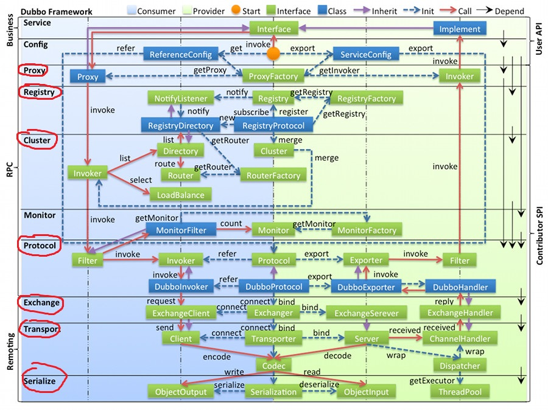
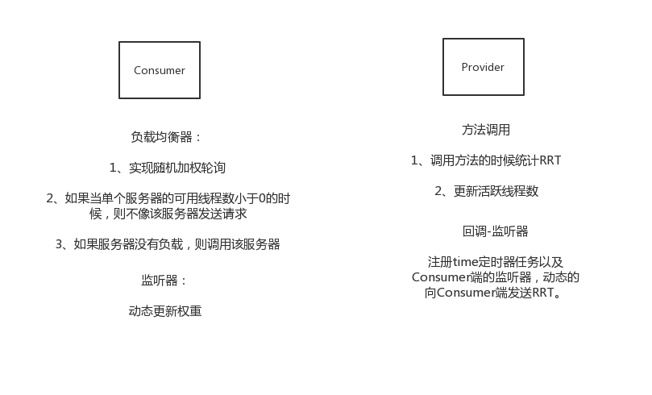
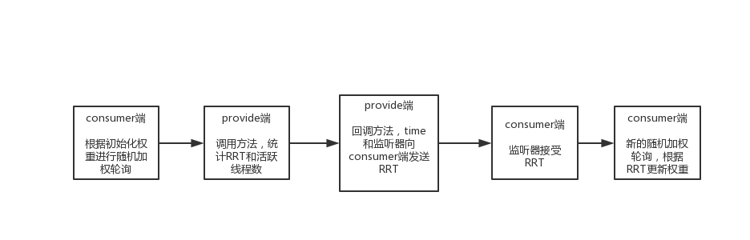

# Table of Contents

* [简介](#简介)
  * [为什么需要RPC](#为什么需要rpc)
  * [什么是RPC](#什么是rpc)
* [系统整体设计](#系统整体设计)
  * [RPC的总体架构](#rpc的总体架构)
  * [远程调用流程](#远程调用流程)
    * [服务引入](#服务引入)
    * [远程调用](#远程调用)
* [服务发布与引入](#服务发布与引入)
  * [服务引入的主要工作：获取代理对象](#服务引入的主要工作获取代理对象)
  * [服务引入的主要类](#服务引入的主要类)
    * [XxlRpcInvokerFactory](#xxlrpcinvokerfactory)
    * [XxlRpcSpringInvokerFactory](#xxlrpcspringinvokerfactory)
    * [XxlRpcReferenceBean](#xxlrpcreferencebean)
    * [XxlRpcSpringReferenceBean](#xxlrpcspringreferencebean)
  * [服务发布的主要工作：服务注册](#服务发布的主要工作服务注册)
  * [服务发布的主要类](#服务发布的主要类)
    * [XxlRpcProviderFactory](#xxlrpcproviderfactory)
    * [XxlRpcSpringProviderFactory](#xxlrpcspringproviderfactory)
* [远程调用](#远程调用-1)
  * [过程](#过程)
    * [1、代理对象发起远程调用](#1代理对象发起远程调用)
    * [2、服务端调用service方法，并返回response](#2服务端调用service方法并返回response)
    * [3、客户端接收服务端的response并调用回调方法与返回结果](#3客户端接收服务端的response并调用回调方法与返回结果)
  * [四种调用方式](#四种调用方式)
    * [共同点](#共同点)
    * [同步调用](#同步调用)
    * [异步调用](#异步调用)
    * [callback](#callback)
    * [oneway](#oneway)
  * [参考资料](#参考资料)
* [远程通信](#远程通信)
  * [概述](#概述)
  * [传输层](#传输层)
    * [ConnectClient：核心（连接池的设计）](#connectclient核心连接池的设计)
    * [NettyConnectClient](#nettyconnectclient)
    * [NettyClient](#nettyclient)
    * [NettyClientHandler](#nettyclienthandler)
    * [NettyServer](#nettyserver)
    * [NettyServerHandler](#nettyserverhandler)
  * [信息交换层](#信息交换层)
    * [request](#request)
    * [response](#response)
  * [参考资料](#参考资料-1)
* [注册中心](#注册中心)
  * [为什么要是用zookeeper作为注册中心](#为什么要是用zookeeper作为注册中心)
  * [zookeeper节点数据结构](#zookeeper节点数据结构)
  * [zookeeper注册中心实现原理](#zookeeper注册中心实现原理)
  * [zookeeper注册中心的整体框架](#zookeeper注册中心的整体框架)
    * [ServiceRegistry抽象类](#serviceregistry抽象类)
    * [ZkServiceRegistry具体zk实现](#zkserviceregistry具体zk实现)
* [负载均衡](#负载均衡)
  * [一致性hash](#一致性hash)
  * [LRU](#lru)
  * [LFU](#lfu)
  * [轮询](#轮询)
  * [随机](#随机)
  * [自适应负载均衡](#自适应负载均衡)
    * [目标](#目标)
    * [解决思路](#解决思路)
    * [consumer和provider的职责](#consumer和provider的职责)
  * [流程](#流程)
    * [随机加权轮询](#随机加权轮询)
* [参考资料](#参考资料-2)


# 简介

## 为什么需要RPC

架构演变的需要，单一应用架构、垂直应用架构、**分布式服务架构**、SOA架构

## 什么是RPC

RPC英文全名为Remote Procedure Call，也叫远程过程调用，其实就是一个计算机通信协议，它是一种通过网络从远程计算机程序上请求服务,而不需要了解底层网络技术的协议。计算机通信协议有很多种，对于开发来说，很多熟悉的是HTTP协议，我这里就做个简单的比较，HTTP协议是属于应用层的，而RPC跨越了**传输层和应用层**。HTTP本身的三次握手协议，每发送一次请求，都会有一次建立连接的过程，就会带来一定的延迟，并且HTTP本身的报文庞大，而RPC可以按需连接，调用结束后就断掉，也可以是长链接，多个远程过程调用共享同一个链接，可以看出来RPC的效率要高于HTTP，但是相对于开发简单快速的HTTP服务,RPC服务就会显得复杂一些。

# 系统整体设计

## RPC的总体架构

分为**服务通信和服务管理**两个部分，**服务管理可以分为服务注册、服务引入与发布，服务监控**

Provider、Consumer以及Registry之间的依赖关系：


**分层架构**



- **config 配置层**：对外配置接口，以 `ServiceConfig`, `ReferenceConfig` 为中心，可以直接初始化配置类，也可以通过 spring 解析配置生成配置类
- **proxy 服务代理层**：服务接口透明代理，生成服务的客户端 Stub 和服务器端 Skeleton, 以 `ServiceProxy`为中心，扩展接口为 `ProxyFactory`
- **registry 注册中心层**：封装服务地址的注册与发现，以服务 URL 为中心，扩展接口为 `RegistryFactory`, `Registry`, `RegistryService`
- **cluster 路由层**：封装多个提供者的路由及负载均衡，并桥接注册中心，以 `Invoker` 为中心，扩展接口为 `Cluster`, `Directory`, `Router`, `LoadBalance`
- **monitor 监控层**：RPC 调用次数和调用时间监控，以 `Statistics` 为中心，扩展接口为 `MonitorFactory`, `Monitor`, `MonitorService`
- **protocol 远程调用层**：封装 RPC 调用，以 `Invocation`, `Result` 为中心，扩展接口为 `Protocol`, `Invoker`, `Exporter`
- **exchange 信息交换层**：封装请求响应模式，同步转异步，以 `Request`, `Response` 为中心，扩展接口为 `Exchanger`, `ExchangeChannel`, `ExchangeClient`, `ExchangeServer`
- **transport 网络传输层**：抽象 mina 和 netty 为统一接口，以 `Message` 为中心，扩展接口为 `Channel`, `Transporter`, `Client`, `Server`, `Codec`
- **serialize 数据序列化层**：可复用的一些工具，扩展接口为 `Serialization`, `ObjectInput`, `ObjectOutput`, `ThreadPool`


- 1、provider：服务提供方；
- 2、invoker：服务消费方；
- 3、serializer: 序列化模块；
- 4、remoting：服务通讯模块；
- 5、registry：服务注册中心；
- 6、admin：服务治理、监控中心：管理服务节点信息，统计服务调用次数、QPS和健康情况；（非必选，暂未整理发布...）

## 远程调用流程

### 服务引入

获取代理对象


### 远程调用

代理对象执行远程调用，协议层，传输层


# 服务发布与引入

## 服务引入的主要工作：获取代理对象


1. 开启注册中心
2. **向注册中心订阅服务地址**
3. **获取代理对象**（代理对象的主要职责：向注册中心订阅服务地址，初始化request，并选择远程调用方式进行远程调用）

## 服务引入的主要类

### XxlRpcInvokerFactory

提供一些常用的方法

```java
start() //开启注册中心
stop()	//关闭注册中心并且关闭回调函数
notifyInvokerFuture	//请求池的管理，获取服务端的返回值，调用回调函数，将response设置到futureResponse（如果是同步调用方式的话，则还需要唤醒等待的线程）
```

### XxlRpcSpringInvokerFactory 

bean的初始化，订阅服务

调用InitializingBean.afterPropertiesSet()，调用xxlRpcInvokerFactory.start();开启注册中心

调用InstantiationAwareBeanPostProcessorAdapter.postProcessAfterInstantiation，实例化bean之后调用，解析注解标签，生成代理对象，获取serviceKey并且订阅服务

调用DiposibleBean.destory() 容器关闭

调用BeanFactoryAware.setBeanFactory()

### XxlRpcReferenceBean

获取代理对象，与注解对应的bean对象

getObject()获取代理对象

1. 获取方法的参数
2. 向注册中心获取服务的服务器地址，如果获取到了多个地址，需要进行负载均衡
3. 初始化request对象
4. 选择四种调用方式的一种，进行远程调用，并返回结果

### XxlRpcSpringReferenceBean

实现了FactoryBean工厂，调用XxlRpcReferenceBean.getObject()获取代理对象

- 调用FactoryBean.getObjet()方法获取代理对象
- 调用InitializingBean.afterPropertiesSet()，创建XxlRpcReferenceBean对象

## 服务发布的主要工作：服务注册

1.调用传输层服务端的启动方法启动服务端，启动注册中心，**将服务注册到注册中心**

2.提供service方法调用的逻辑，获取request参数，通过反射调用服务端的方法并返回结果

## 服务发布的主要类

### XxlRpcProviderFactory

start()，设置了两组回调函数，当出传输层服务端启动或者关闭会调用这个回调函数，一个是启动，主要是开启注册中心，并且注册服务，另一个是关闭，移除已经注册的服务列表，并且关闭注册中心，最后调用server.start()，启动传输层的服务端的服务器

stop()：直接调用server.stop();

invokeService：获取request参数，通过反射调用服务端的方法并返回结果

### XxlRpcSpringProviderFactory

ApplicationContextAware.setApplicationContext(),解析注解XxlRpcService，接口名，并在后序启动之后将接口名注册到注册中心

InitializingBean.afterPropertiesSet()调用XxlRpcProviderFactory.start()

DisposableBean.destroy()

# 远程调用

## 过程


### 1、代理对象发起远程调用

1. 获取请求的参数
2. 向注册中心获取服务地址
3. 构造request对象
4. 选择四种远程调用方式发起远程调用

```java
public Object invoke(Object proxy, Method method, Object[] args) throws Throwable {

   // 0.method param
   String className = method.getDeclaringClass().getName();   // iface.getName()
   String varsion_ = version;
   String methodName = method.getName();
   Class<?>[] parameterTypes = method.getParameterTypes();
   Object[] parameters = args;

   // filter for generic
   if (className.equals(XxlRpcGenericService.class.getName()) && methodName.equals("invoke")) {

      Class<?>[] paramTypes = null;
      if (args[3]!=null) {
         String[] paramTypes_str = (String[]) args[3];
         if (paramTypes_str.length > 0) {
            paramTypes = new Class[paramTypes_str.length];
            for (int i = 0; i < paramTypes_str.length; i++) {
               paramTypes[i] = ClassUtil.resolveClass(paramTypes_str[i]);
            }
         }
      }

      className = (String) args[0];
      varsion_ = (String) args[1];
      methodName = (String) args[2];
      parameterTypes = paramTypes;
      parameters = (Object[]) args[4];
   }

   // filter method like "Object.toString()"
   if (className.equals(Object.class.getName())) {
      logger.info(">>>>>>>>>>> xxl-rpc proxy class-method not support [{}#{}]", className, methodName);
      throw new XxlRpcException("xxl-rpc proxy class-method not support");
   }

   // 1、向注册中心获取服务的服务器地址，如果获取到了多个地址，需要进行负载均衡
   String finalAddress = address;
   if (finalAddress==null || finalAddress.trim().length()==0) {
      if (invokerFactory!=null && invokerFactory.getServiceRegistry()!=null) {
         // discovery
         String serviceKey = XxlRpcProviderFactory.makeServiceKey(className, varsion_);
         TreeSet<String> addressSet = invokerFactory.getServiceRegistry().discovery(serviceKey);
         // load balance
         if (addressSet==null || addressSet.size()==0) {
            // pass
         } else if (addressSet.size()==1) {
            finalAddress = addressSet.first();
         } else {
            //负载均衡
            finalAddress = loadBalance.xxlRpcInvokerRouter.route(serviceKey, addressSet);
         }

      }
   }
   if (finalAddress==null || finalAddress.trim().length()==0) {
      throw new XxlRpcException("xxl-rpc reference bean["+ className +"] address empty");
   }

   ///2、request
   XxlRpcRequest xxlRpcRequest = new XxlRpcRequest();
                xxlRpcRequest.setRequestId(UUID.randomUUID().toString());
                xxlRpcRequest.setCreateMillisTime(System.currentTimeMillis());
                xxlRpcRequest.setAccessToken(accessToken);
                xxlRpcRequest.setClassName(className);
                xxlRpcRequest.setMethodName(methodName);
                xxlRpcRequest.setParameterTypes(parameterTypes);
                xxlRpcRequest.setParameters(parameters);
                
   ///3、send，四种调用类型，返回方法调用结果
   //同步调用
   if (CallType.SYNC == callType) {
      // future-response set
      XxlRpcFutureResponse futureResponse = new XxlRpcFutureResponse(invokerFactory, xxlRpcRequest, null);
      try {
         // do invoke
         //异步NIO方式发送请求（由于netty只能支持异步方式）
         client.asyncSend(finalAddress, xxlRpcRequest);

         // future get
         // 同步获取结果
         XxlRpcResponse xxlRpcResponse = futureResponse.get(timeout, TimeUnit.MILLISECONDS);
         if (xxlRpcResponse.getErrorMsg() != null) {
            throw new XxlRpcException(xxlRpcResponse.getErrorMsg());
         }
         return xxlRpcResponse.getResult();
      } catch (Exception e) {
         logger.info(">>>>>>>>>>> xxl-rpc, invoke error, address:{}, XxlRpcRequest{}", finalAddress, xxlRpcRequest);

         throw (e instanceof XxlRpcException)?e:new XxlRpcException(e);
      } finally{
         // future-response remove
         futureResponse.removeInvokerFuture();
      }
   } else if (CallType.FUTURE == callType) {
      // 异步调用，不使用get方法阻塞获取结果
      //将结果放入线程上下文，用户在需要的时候调用get方法取结果
      XxlRpcFutureResponse futureResponse = new XxlRpcFutureResponse(invokerFactory, xxlRpcRequest, null);
                       try {
         // 创建适配器对象，并将适配器对象放入当前线程的上下文ThreadLocal中保存起来
         XxlRpcInvokeFuture invokeFuture = new XxlRpcInvokeFuture(futureResponse);
         XxlRpcInvokeFuture.setFuture(invokeFuture);

                           // do invoke
                           client.asyncSend(finalAddress, xxlRpcRequest);

                           return null;
                       } catch (Exception e) {
         logger.info(">>>>>>>>>>> xxl-rpc, invoke error, address:{}, XxlRpcRequest{}", finalAddress, xxlRpcRequest);

         // 从请求池里面删除这个请求对象
         futureResponse.removeInvokerFuture();

         throw (e instanceof XxlRpcException)?e:new XxlRpcException(e);
                       }

   } else if (CallType.CALLBACK == callType) {

      // 回调函数
      //只需要创建回调函数，并放入线程上下文
      // 直接调用回调函数，不需要处理返回结果
      XxlRpcInvokeCallback finalInvokeCallback = invokeCallback;
      XxlRpcInvokeCallback threadInvokeCallback = XxlRpcInvokeCallback.getCallback();
      if (threadInvokeCallback != null) {
         finalInvokeCallback = threadInvokeCallback;
      }
      if (finalInvokeCallback == null) {
         throw new XxlRpcException("xxl-rpc XxlRpcInvokeCallback（CallType="+ CallType.CALLBACK.name() +"） cannot be null.");
      }

      // future-response set
      XxlRpcFutureResponse futureResponse = new XxlRpcFutureResponse(invokerFactory, xxlRpcRequest, finalInvokeCallback);
      try {
         client.asyncSend(finalAddress, xxlRpcRequest);
      } catch (Exception e) {
         logger.info(">>>>>>>>>>> xxl-rpc, invoke error, address:{}, XxlRpcRequest{}", finalAddress, xxlRpcRequest);

         // future-response remove
         futureResponse.removeInvokerFuture();

         throw (e instanceof XxlRpcException)?e:new XxlRpcException(e);
      }

      return null;
   } else if (CallType.ONEWAY == callType) {
      //直接发出请求，不需要管返回值与回调函数
                       client.asyncSend(finalAddress, xxlRpcRequest);
                       return null;
                   } else {
      throw new XxlRpcException("xxl-rpc callType["+ callType +"] invalid");
   }

}
```

### 2、服务端调用service方法，并返回response

```java
@Override
public void channelRead0(final ChannelHandlerContext ctx, final XxlRpcRequest xxlRpcRequest) throws Exception {

    try {
        // do invoke
        //server端本身就是一个多线程的，为什么这里还有多写一个线程
        serverHandlerPool.execute(new Runnable() {
            @Override
            public void run() {
                // invoke + response
                XxlRpcResponse xxlRpcResponse = xxlRpcProviderFactory.invokeService(xxlRpcRequest);

                ctx.writeAndFlush(xxlRpcResponse);
            }
        });
    } catch (Exception e) {
        // catch error
        XxlRpcResponse xxlRpcResponse = new XxlRpcResponse();
        xxlRpcResponse.setRequestId(xxlRpcRequest.getRequestId());
        xxlRpcResponse.setErrorMsg(ThrowableUtil.toString(e));

        ctx.writeAndFlush(xxlRpcResponse);
    }

}

public XxlRpcResponse invokeService(XxlRpcRequest xxlRpcRequest) {

    //  make response
    XxlRpcResponse xxlRpcResponse = new XxlRpcResponse();
    xxlRpcResponse.setRequestId(xxlRpcRequest.getRequestId());

    // match service bean
    String serviceKey = makeServiceKey(xxlRpcRequest.getClassName(), xxlRpcRequest.getVersion());
    Object serviceBean = serviceData.get(serviceKey);

    // valid
    if (serviceBean == null) {
        xxlRpcResponse.setErrorMsg("The serviceKey["+ serviceKey +"] not found.");
        return xxlRpcResponse;
    }

    if (System.currentTimeMillis() - xxlRpcRequest.getCreateMillisTime() > 3*60*1000) {
        xxlRpcResponse.setErrorMsg("The timestamp difference between admin and executor exceeds the limit.");
        return xxlRpcResponse;
    }
    if (accessToken!=null && accessToken.trim().length()>0 && !accessToken.trim().equals(xxlRpcRequest.getAccessToken())) {
        xxlRpcResponse.setErrorMsg("The access token[" + xxlRpcRequest.getAccessToken() + "] is wrong.");
        return xxlRpcResponse;
    }

    try {
        // invoke
        Class<?> serviceClass = serviceBean.getClass();
        String methodName = xxlRpcRequest.getMethodName();
        Class<?>[] parameterTypes = xxlRpcRequest.getParameterTypes();
        Object[] parameters = xxlRpcRequest.getParameters();

        Method method = serviceClass.getMethod(methodName, parameterTypes);
        method.setAccessible(true);
        Object result = method.invoke(serviceBean, parameters);

        /*FastClass serviceFastClass = FastClass.create(serviceClass);
			FastMethod serviceFastMethod = serviceFastClass.getMethod(methodName, parameterTypes);
			Object result = serviceFastMethod.invoke(serviceBean, parameters);*/

        xxlRpcResponse.setResult(result);
    } catch (Throwable t) {
        // catch error
        logger.error("xxl-rpc provider invokeService error.", t);
        xxlRpcResponse.setErrorMsg(ThrowableUtil.toString(t));
    }

    return xxlRpcResponse;
}
```

### 3、客户端接收服务端的response并调用回调方法与返回结果

客户端的channlHander获取XxlRpcResponse，执行回调函数并且唤醒等待线程

```java
//服务端返回xxlRpcResponse之后，客户端调用这个方法
@Override
protected void channelRead0(ChannelHandlerContext ctx, XxlRpcResponse xxlRpcResponse) throws Exception {

   // notify response
   xxlRpcInvokerFactory.notifyInvokerFuture(xxlRpcResponse.getRequestId(), xxlRpcResponse);
}
```

```java
public void notifyInvokerFuture(String requestId, final XxlRpcResponse xxlRpcResponse){
    //根据RequestId寻找到本次调用的XxlRpcFutureResponse
    final XxlRpcFutureResponse futureResponse = futureResponsePool.get(requestId);
    if (futureResponse == null) {
        return;
    }

    // notify
    //如果回调函数为空就不执行回调函数，如果不为空则调用线程池执行回调函数
    if (futureResponse.getInvokeCallback()!=null) {

        // callback type
        try {
            //在线程池中执行
            executeResponseCallback(new Runnable() {
                @Override
                public void run() {
                    //执行回调函数
                    if (xxlRpcResponse.getErrorMsg() != null) {
                        futureResponse.getInvokeCallback().onFailure(new XxlRpcException(xxlRpcResponse.getErrorMsg()));
                    } else {
                        futureResponse.getInvokeCallback().onSuccess(xxlRpcResponse.getResult());
                    }
                }
            });
        }catch (Exception e) {
            logger.error(e.getMessage(), e);
        }
    } else {
        futureResponse.setResponse(xxlRpcResponse);
    }

    // do remove
    futureResponsePool.remove(requestId);

}
```

## 四种调用方式

### 共同点

1.每次请求会生成一个唯一的RequestId和一个RpcResponseFuture，RpcResponseFuture实现了**future模式**，托管到请求池中

2.异步发出请求，client.asyncSend(finalAddress, xxlRpcRequest);

3.请求执行完成之后会调用RpcResponseFuture的回调方法和设置response到RpcResponseFuture中

**为什么要有RequestId**

- Socket 通信是一个全双工的方式，如果有多个线程同时进行远程方法调用，这时建立在 client server 之间的 socket 连接上会有很多双方发送的消息传递，前后顺序也可能是乱七八糟的，server 处理完结果后，将结果消息发送给 client，client 收到很多消息，怎么知道哪个消息结果是原先哪个线程调用的？
- 解决：使用一个 ID，让其唯一，然后传递给服务端，再服务端又回传回来，这样就知道结果是原先哪个线程的了。

### 同步调用

XXL-RPC采用NIO进行底层通讯，但是NIO是异步通讯模型，调用线程并不会阻塞获取调用结果，因此，XXL-RPC实现了在异步通讯模型上的同步调用，即“sync-over-async”，实现原理如下，可参考上图进行理解：

- 1、每次请求会生成一个唯一的RequestId和一个RpcResponse，托管到请求池中。
- 2、调度线程，执行RpcResponse的get方法阻塞获取本次请求结果；
- 3、然后，底层通过NIO方式发起调用，provider异步响应请求结果，然后根据RequestId寻找到本次调用的RpcResponse，设置响应结果后唤醒调度线程。
- 4、调度线程被唤醒，返回异步响应的请求数据。

```java
if (CallType.SYNC == callType) {
      // future-response set
      XxlRpcFutureResponse futureResponse = new XxlRpcFutureResponse(invokerFactory, xxlRpcRequest, null);
      try {
         // do invoke
         //异步NIO方式发送请求（由于netty只能支持异步方式）
         client.asyncSend(finalAddress, xxlRpcRequest);

         // future get
         // 同步获取结果
         XxlRpcResponse xxlRpcResponse = futureResponse.get(timeout, TimeUnit.MILLISECONDS);
         if (xxlRpcResponse.getErrorMsg() != null) {
            throw new XxlRpcException(xxlRpcResponse.getErrorMsg());
         }
         return xxlRpcResponse.getResult();
      } catch (Exception e) {
         logger.info(">>>>>>>>>>> xxl-rpc, invoke error, address:{}, XxlRpcRequest{}", finalAddress, xxlRpcRequest);

         throw (e instanceof XxlRpcException)?e:new XxlRpcException(e);
      } finally{
         // future-response remove
         futureResponse.removeInvokerFuture();
      }
   }

public XxlRpcResponse get(long timeout, TimeUnit unit) throws InterruptedException, 			 ExecutionException, TimeoutException {
    if (!done) {
        synchronized (lock) {
            try {
                if (timeout < 0) {
                    lock.wait();
                } else {
                    long timeoutMillis = (TimeUnit.MILLISECONDS==unit)?timeout:TimeUnit.MILLISECONDS.convert(timeout , unit);
                    lock.wait(timeoutMillis);
                }
            } catch (InterruptedException e) {
                throw e;
            }
        }
    }

    if (!done) {
        throw new XxlRpcException("xxl-rpc, request timeout at:"+ System.currentTimeMillis() +", request:" + request.toString());
    }
    return response;
}
```

### 异步调用

1. 先创建ResponseFuture对象，之后使用适配器XxlRpcInvokeFuture包装该ResponseFuture对象；（创建ResponseFuture对象与同步的代码相同，最后得到的是一个DefaultFuture对象）
2. 然后将该XxlRpcInvokeFuture对象设入当前线程的上下文中ThreadLocal；
3. 返回空的RpcResult
4. 用户在合适的时候自己从ThreadLocal获取future，之后get。

```java
else if (CallType.FUTURE == callType) {
      // 异步调用，不使用get方法阻塞获取结果
      //将结果放入线程上下文，用户在需要的时候调用get方法取结果
      XxlRpcFutureResponse futureResponse = new XxlRpcFutureResponse(invokerFactory, xxlRpcRequest, null);
                       try {
         // 创建适配器对象，并将适配器对象放入当前线程的上下文ThreadLocal中保存起来
         XxlRpcInvokeFuture invokeFuture = new XxlRpcInvokeFuture(futureResponse);
         XxlRpcInvokeFuture.setFuture(invokeFuture);

                           // do invoke
                           client.asyncSend(finalAddress, xxlRpcRequest);

                           return null;
                       } catch (Exception e) {
         logger.info(">>>>>>>>>>> xxl-rpc, invoke error, address:{}, XxlRpcRequest{}", finalAddress, xxlRpcRequest);

         // 从请求池里面删除这个请求对象
         futureResponse.removeInvokerFuture();

         throw (e instanceof XxlRpcException)?e:new XxlRpcException(e);
                       }

   }
```

**为什么使用ThreadLocal作为线程上下文**

1、不需要**侵入**客户端代码，保证XxlRpcInvokeFuture始终在线程内部，任何时候都能拿到。

2、每一个线程的XxlRpcInvokeFuture是不同的，使用ThreadLocal可以起到**隔离**作用

3、ThreadLocal的**生命周期**与线程相同，用户可以在任务需要的时候获取需要的结果

### callback

用户自定义回调函数，并将回调函数放入线程上下文ThreadLocal中，只需执行回调函数，无需使用get()获取结果

```java
package com.xxl.rpc.remoting.invoker.call;


/**
 * 使用回调方式实现异步通信
 * @author xuxueli 2018-10-23
 */
public abstract class XxlRpcInvokeCallback<T> {

    public abstract void onSuccess(T result);

    public abstract void onFailure(Throwable exception);


    // ---------------------- thread invoke callback ----------------------

    private static ThreadLocal<XxlRpcInvokeCallback> threadInvokerFuture = new ThreadLocal<XxlRpcInvokeCallback>();

    /**
     * get callback
     *
     * @return
     */
    public static XxlRpcInvokeCallback getCallback() {
        XxlRpcInvokeCallback invokeCallback = threadInvokerFuture.get();
        threadInvokerFuture.remove();
        return invokeCallback;
    }

    /**
     * set future
     *
     * @param invokeCallback
     */
    public static void setCallback(XxlRpcInvokeCallback invokeCallback) {
        threadInvokerFuture.set(invokeCallback);
    }

    /**
     * remove future
     */
    public static void removeCallback() {
        threadInvokerFuture.remove();
    }


}
```

```java
 else if (CallType.CALLBACK == callType) {

      // 回调函数
      //只需要创建回调函数，并放入线程上下文
      // 直接调用回调函数，不需要处理返回结果
      XxlRpcInvokeCallback finalInvokeCallback = invokeCallback;
      XxlRpcInvokeCallback threadInvokeCallback = XxlRpcInvokeCallback.getCallback();
      if (threadInvokeCallback != null) {
         finalInvokeCallback = threadInvokeCallback;
      }
      if (finalInvokeCallback == null) {
         throw new XxlRpcException("xxl-rpc XxlRpcInvokeCallback（CallType="+ CallType.CALLBACK.name() +"） cannot be null.");
      }

      // future-response set
      XxlRpcFutureResponse futureResponse = new XxlRpcFutureResponse(invokerFactory, xxlRpcRequest, finalInvokeCallback);
      try {
         client.asyncSend(finalAddress, xxlRpcRequest);
      } catch (Exception e) {
         logger.info(">>>>>>>>>>> xxl-rpc, invoke error, address:{}, XxlRpcRequest{}", finalAddress, xxlRpcRequest);

         // future-response remove
         futureResponse.removeInvokerFuture();

         throw (e instanceof XxlRpcException)?e:new XxlRpcException(e);
      }

      return null;
   } 
```

### oneway

（不需要返回值），不管同步还是异步，请求直接发出，不会创建Future，直接返回RpcResult空对象

```java
else if (CallType.ONEWAY == callType) {
      //直接发出请求，不需要管返回值与回调函数
                       client.asyncSend(finalAddress, xxlRpcRequest);
                       return null;
                   } else {
      throw new XxlRpcException("xxl-rpc callType["+ callType +"] invalid");
   }

}

```

## 参考资料

[dubbo异步调用原理](https://www.cnblogs.com/java-zhao/p/8424019.html)

[ThreadLocal(应用场景及使用方式及原理)](<https://blog.csdn.net/u012813201/article/details/77578135>)

[Alibaba Dubbo框架同步调用原理分析-1](<https://blog.csdn.net/kefeng824/article/details/45576779>)

[Dubbo 远程同步调用原理分析](<https://blog.csdn.net/tycoon1988/article/details/38868917>)

[**彻底理解Java的Future模式**](https://www.cnblogs.com/cz123/p/7693064.html)

# 远程通信

## 概述

包括两层，一层传输层，一层应用层（协议层）

**传输层**

具体通信

连接对象（负责开启连接，发送请求），连接池，客户端，服务端

**应用层（信息交换层）**

其中封装了请求响应模式，在传输层之上重新封装了 Request-Response 语义，为了满足RPC的需求。这层可以认为专注在Request和Response携带的信息上。

## 传输层

### ConnectClient：核心（连接池的设计）

1、异步发送请求

 采用了**模板模式**，提供了统一的异步发送请求的方法asyncSend，asyncSend通过连接池获取连接对象，然后调用连接对象的具体的send方法实现异步发送请求

```java
    public static void asyncSend(XxlRpcRequest xxlRpcRequest, String address,
                                 Class<? extends ConnectClient> connectClientImpl,
                                 final XxlRpcReferenceBean xxlRpcReferenceBean) throws Exception {

        // client pool	[tips03 : may save 35ms/100invoke if move it to constructor, but it is necessary. cause by ConcurrentHashMap.get]
        //1、从连接池获取连接对象
        ConnectClient clientPool = ConnectClient.getPool(address, connectClientImpl, xxlRpcReferenceBean);

        try {
            // do invoke
            //2、由具体子类的方法实现send()方法
            clientPool.send(xxlRpcRequest);
        } catch (Exception e) {
            throw e;
        }

    }
```

2、单一长连接

每一条socket对应一个连接对象，由于是NIO的方式，只需要一个连接对象就可以了

3、连接池的设计

由于可能存在多个服务提供方，需要将这些多个单一长连接使用map缓存到本地，key是address（ip:port），连接池是一个单例。

当通道没有正常连接到服务端时，需要删除旧的连接，重建新的连接，这两个步骤需要使用锁，因为如果不使用锁的话，就会创建多个连接对象，就不是单一长连接了，但是锁只是针对每一个连接的，不同的连接使用不同的锁，所以这里使用了ConcurrentHashMap实现分段锁。

```java
    //连接池对象，是单例的
    //这里的key是address（ip:port）
    //每个tcp对应一个连接对象,也就是每个socket建立一个连接，在客户端启动多个netty的客户端连接不同的服务器
    //并将这个连接对象保存起来，后面可以复用这个连接，但是同一个时间只有一个线程使用这个连接对象发送数据
    private static volatile ConcurrentHashMap<String, ConnectClient> connectClientMap;        // (static) alread addStopCallBack
    //每个address使用一个锁实现了分段锁
    private static volatile ConcurrentHashMap<String, Object> connectClientLockMap = new ConcurrentHashMap<>();
    private static ConnectClient getPool(String address, Class<? extends ConnectClient> connectClientImpl,
                                         final XxlRpcReferenceBean xxlRpcReferenceBean) throws Exception {

        // init base compont, avoid repeat init
        //使用双检锁创建连接池对象
        if (connectClientMap == null) {
            synchronized (ConnectClient.class) {
                if (connectClientMap == null) {
                    // init
                    connectClientMap = new ConcurrentHashMap<String, ConnectClient>();
                    // stop callback 停止服务时的一个回调函数
                    xxlRpcReferenceBean.getInvokerFactory().addStopCallBack(new BaseCallback() {
                        @Override
                        public void run() throws Exception {
                            if (connectClientMap.size() > 0) {
                                for (String key: connectClientMap.keySet()) {
                                    //停止服务，关闭连接池里面的所有连接对象
                                    ConnectClient clientPool = connectClientMap.get(key);
                                    clientPool.close();
                                }
                                connectClientMap.clear();
                            }
                        }
                    });
                }
            }
        }

        // get-valid client
        ConnectClient connectClient = connectClientMap.get(address);
        //如果不为空并且连接的通道没有被占用（只有一个线程访问）
        if (connectClient!=null && connectClient.isValidate()) {
            return connectClient;
        }

        // lock
        Object clientLock = connectClientLockMap.get(address);
        if (clientLock == null) {
            connectClientLockMap.putIfAbsent(address, new Object());
            clientLock = connectClientLockMap.get(address);
        }

        // remove-create new client
        //这里同一个address会阻塞
        synchronized (clientLock) {

            // get-valid client, avlid repeat
            connectClient = connectClientMap.get(address);
            if (connectClient!=null && connectClient.isValidate()) {
                return connectClient;
            }

            // remove old
            if (connectClient != null) {
                connectClient.close();
                connectClientMap.remove(address);
            }

            // 创建一个新的连接对象
            ConnectClient connectClient_new = connectClientImpl.newInstance();
            try {
                //初始化连接对象，也就是开启客户端连接
                connectClient_new.init(address, xxlRpcReferenceBean.getSerializer(), xxlRpcReferenceBean.getInvokerFactory());
                connectClientMap.put(address, connectClient_new);
            } catch (Exception e) {
                connectClient_new.close();
                throw e;
            }

            return connectClient_new;
        }

    }
```


### NettyConnectClient

启动netty客户端线程组

```java
    Object[] array = IpUtil.parseIpPort(address);
    String host = (String) array[0];
    int port = (int) array[1];

    //采用的NIO的方式 NioEventLoopGroup
    this.group = new NioEventLoopGroup();
    Bootstrap bootstrap = new Bootstrap();
    bootstrap.group(group)
        //采用的NIO的方式 NioSocketChannel
        .channel(NioSocketChannel.class)
        .handler(new ChannelInitializer<SocketChannel>() {
            @Override
            public void initChannel(SocketChannel channel) throws Exception {
                channel.pipeline()
                    .addLast(new IdleStateHandler(0,0,10, TimeUnit.MINUTES))
                    .addLast(new NettyEncoder(XxlRpcRequest.class, serializer))
                    .addLast(new NettyDecoder(XxlRpcResponse.class, serializer))
                    .addLast(new NettyClientHandler(xxlRpcInvokerFactory));
            }
        })
        .option(ChannelOption.TCP_NODELAY, true)
        .option(ChannelOption.SO_KEEPALIVE, true)
        .option(ChannelOption.CONNECT_TIMEOUT_MILLIS, 10000);
    this.channel = bootstrap.connect(host, port).sync().channel();

    // valid
    if (!isValidate()) {
        close();
        return;
    }

    logger.debug(">>>>>>>>>>> xxl-rpc netty client proxy, connect to server success at host:{}, port:{}", host, port);
    }
```

调用channel.writeAndFlush异步发送请求

```java
@Override
public void send(XxlRpcRequest xxlRpcRequest) throws Exception {
    //channel.writeAndFlush是异步的，必须有一种机制来让线程等待服务端返回结果
    //这里采用最原始的wait和notify方法。
    this.channel.writeAndFlush(xxlRpcRequest).sync();
}
```

### NettyClient

实现asyncSend，调用连接对象的asyncSend方法

```java
public class NettyClient extends Client {

   private Class<? extends ConnectClient> connectClientImpl = NettyConnectClient.class;

   @Override
   public void asyncSend(String address, XxlRpcRequest xxlRpcRequest) throws Exception {
      ConnectClient.asyncSend(xxlRpcRequest, address, connectClientImpl, xxlRpcReferenceBean);
   }
}
```

### NettyClientHandler

执行回调，设置response到futureResponse，调用notify

```java
protected void channelRead0(ChannelHandlerContext ctx, XxlRpcResponse xxlRpcResponse) throws Exception {

   // 调用回调函数，并且设置response到responseFuture
   xxlRpcInvokerFactory.notifyInvokerFuture(xxlRpcResponse.getRequestId(), xxlRpcResponse);
}
```

```java
public void notifyInvokerFuture(String requestId, final XxlRpcResponse xxlRpcResponse){
    //根据RequestId寻找到本次调用的XxlRpcFutureResponse
    final XxlRpcFutureResponse futureResponse = futureResponsePool.get(requestId);
    if (futureResponse == null) {
        return;
    }

    // notify
    //如果回调函数为空就不执行回调函数，如果不为空则调用线程池执行回调函数
    if (futureResponse.getInvokeCallback()!=null) {

        // callback type
        try {
            //在线程池中执行
            executeResponseCallback(new Runnable() {
                @Override
                public void run() {
                    //执行回调函数
                    if (xxlRpcResponse.getErrorMsg() != null) {
                        futureResponse.getInvokeCallback().onFailure(new XxlRpcException(xxlRpcResponse.getErrorMsg()));
                    } else {
                        futureResponse.getInvokeCallback().onSuccess(xxlRpcResponse.getResult());
                    }
                }
            });
        }catch (Exception e) {
            logger.error(e.getMessage(), e);
        }
    } else {

        //这个方法会加锁，并且执行notifyAll
        futureResponse.setResponse(xxlRpcResponse);
    }

    // do remove
    futureResponsePool.remove(requestId);

}
```

### NettyServer

开启netty客户端

```java
public void start(final XxlRpcProviderFactory xxlRpcProviderFactory) throws Exception {

    thread = new Thread(new Runnable() {
        @Override
        public void run() {

            // param
            final ThreadPoolExecutor serverHandlerPool = ThreadPoolUtil.makeServerThreadPool(NettyServer.class.getSimpleName());
            EventLoopGroup bossGroup = new NioEventLoopGroup();
            EventLoopGroup workerGroup = new NioEventLoopGroup();

            try {
                // start server
                ServerBootstrap bootstrap = new ServerBootstrap();
                bootstrap.group(bossGroup, workerGroup)
                        .channel(NioServerSocketChannel.class)
                        .childHandler(new ChannelInitializer<SocketChannel>() {
                            @Override
                            public void initChannel(SocketChannel channel) throws Exception {
                                channel.pipeline()
                                        .addLast(new IdleStateHandler(0,0,10, TimeUnit.MINUTES))
                                        .addLast(new NettyDecoder(XxlRpcRequest.class, xxlRpcProviderFactory.getSerializer()))
                                        .addLast(new NettyEncoder(XxlRpcResponse.class, xxlRpcProviderFactory.getSerializer()))
                                        .addLast(new NettyServerHandler(xxlRpcProviderFactory, serverHandlerPool));
                            }
                        })
                        .childOption(ChannelOption.TCP_NODELAY, true)
                        .childOption(ChannelOption.SO_KEEPALIVE, true);

                // bind
                ChannelFuture future = bootstrap.bind(xxlRpcProviderFactory.getPort()).sync();

                logger.info(">>>>>>>>>>> xxl-rpc remoting server start success, nettype = {}, port = {}", NettyServer.class.getName(), xxlRpcProviderFactory.getPort());
                onStarted();

                // wait util stop
                future.channel().closeFuture().sync();

            } catch (Exception e) {
                if (e instanceof InterruptedException) {
                    logger.info(">>>>>>>>>>> xxl-rpc remoting server stop.");
                } else {
                    logger.error(">>>>>>>>>>> xxl-rpc remoting server error.", e);
                }
            } finally {

                // stop
                try {
                    serverHandlerPool.shutdown();    // shutdownNow
                } catch (Exception e) {
                    logger.error(e.getMessage(), e);
                }
                try {
                    workerGroup.shutdownGracefully();
                    bossGroup.shutdownGracefully();
                } catch (Exception e) {
                    logger.error(e.getMessage(), e);
                }

            }
        }
    });
    thread.setDaemon(true);
    thread.start();

}
```

### NettyServerHandler

调用service的方法，给客户端发送response

```java
public void channelRead0(final ChannelHandlerContext ctx, final XxlRpcRequest xxlRpcRequest) throws Exception {

    try {
        // do invoke
        //netty本身的线程用于处理IO逻辑，而这个线程池用来调用service方法
        serverHandlerPool.execute(new Runnable() {
            @Override
            public void run() {
                // invoke + response
                XxlRpcResponse xxlRpcResponse = xxlRpcProviderFactory.invokeService(xxlRpcRequest);

                ctx.writeAndFlush(xxlRpcResponse);
            }
        });
    } catch (Exception e) {
        // catch error
        XxlRpcResponse xxlRpcResponse = new XxlRpcResponse();
        xxlRpcResponse.setRequestId(xxlRpcRequest.getRequestId());
        xxlRpcResponse.setErrorMsg(ThrowableUtil.toString(e));

        ctx.writeAndFlush(xxlRpcResponse);
    }

}
```

## 信息交换层

### request

由于采用NIO单一长连接，无法区分那个线程的请求和响应，所以需要设计requestId

```java
private String requestId;
private long createMillisTime;
private String accessToken;

private String className;
private String methodName;
private Class<?>[] parameterTypes;
private Object[] parameters;

private String version;
```

### response

```java
private String requestId;
private String errorMsg;
private Object result;

```

## 参考资料

[NIO单一长连接——dubbo通信模型实现](https://www.jianshu.com/p/13bef2795c44)

# 注册中心

## 为什么要是用zookeeper作为注册中心

假设没有注册中心，采用直连的方式，如果服务提供者发生变化，那么消费者也要立即更新，耦合度太高

zk作为服务注册的一个框架，消费者只需要向注册中心获取服务提供者的地址，无需自己做更新。达到了**解耦合**的作用，而且还能实现**服务的自动发现**。

## zookeeper节点数据结构


## zookeeper注册中心实现原理

XXL-RPC中每个服务在zookeeper中对应一个节点，如图"iface name"节点，该服务的每一个provider机器对应"iface name"节点下的一个子节点，如图中"192.168.0.1:9999"、"192.168.0.2:9999"和"192.168.0.3:9999"，子节点类型为zookeeper的**EPHMERAL（临时节点）**类型，该类型节点有个特点，当机器和zookeeper集群断掉连接后节点将会被移除。consumer底层可以从zookeeper获取到可提供服务的provider集群地址列表，从而可以向其中一个机器发起RPC调用。	

## zookeeper注册中心的整体框架

采用**模板模式**，为订阅，注册等功能实现一个统一的调用框架，而涉及到具体的注册订阅又和具体的注册中心相关，所以需要由子类来实现。

### ServiceRegistry抽象类

```java
package com.xxl.rpc.registry;
import java.util.Map;
import java.util.Set;
import java.util.TreeSet;
public abstract class ServiceRegistry {
    public abstract void start(Map<String, String> param);
    public abstract void stop();
    public abstract boolean registry(Set<String> keys, String value);
    public abstract boolean remove(Set<String> keys, String value);
    public abstract Map<String, TreeSet<String>> discovery(Set<String> keys);
    public abstract TreeSet<String> discovery(String key);
}
```

### ZkServiceRegistry具体zk实现

**1、缓存**：使用ConcurrentHashMap设计两个缓存，registryData注册缓存，**discoveryData订阅缓存**，客户端向zookeeper获取服务地址时直接从缓存中获取。

**2、watcher（观察者模式）：为discoveryData设计watcher，当zookeeper节点有变化的时候通过观察者来更新缓存，实现服务的自动发现。**

zookeeper客户端：具体的创建和删除节点的请求执行

```java
public void start(Map<String, String> param)
//注册watcher，当子节点有变化的时候自动刷新
//创建守护线程，每隔60ms自动刷新订阅缓存和注册缓存

private void refreshDiscoveryData(String key)
//将zk节点的数据刷新到map缓存discoveryData中

private void refreshRegistryData()
//将map中缓存的注册服务添加到zk的节点

public boolean registry(Set<String> keys, String value)
//将注册服务添加到本地缓存，同时在zk添加节点

public boolean remove(Set<String> keys, String value)
//同时删除缓存与zk节点

public TreeSet<String> discovery(String key)
//先从缓存里面查找
//缓存没有则刷新缓存，在从缓存中获取
```

# 负载均衡

[负载均衡的几种算法Java实现代码](https://www.cnblogs.com/lr393993507/p/5702854.html)

## 一致性hash

[一致性hash和虚拟节点](https://www.cnblogs.com/yixiwenwen/p/3580646.html)

consistent hashing 是一种 hash 算法，简单的说，在移除 / 添加一个 cache 时，它能够尽可能小的改变已存在 key 映射关系，尽可能的满足单调性的要求。

1. 每个节点设置5个虚拟节点
2. 计算serviceKey的hash值
3. 使用treeMap的tailMap方法返回其键大于或等于fromKey的部分视图
4. 取视图的第一个作为服务调用的address

```java
public class XxlRpcLoadBalanceConsistentHashStrategy extends XxlRpcLoadBalance {

    private int VIRTUAL_NODE_NUM = 5;

    /**
     * get hash code on 2^32 ring (md5散列的方式计算hash值)
     * @param key
     * @return
     */
    private long hash(String key) {

        // md5 byte
        //Java 的 MessageDigest 类 可以提供 MD5 算法或 SHA 算法用于计算出数据的摘要；
        // 它接收任意大小的数据，并输出计算后的固定长度的哈希值。这个输出的哈希值就是我们所说的信息摘要。
        //MD5 算法得到的摘要是固定为 128 bit 的二进制串
        MessageDigest md5;
        try {
            md5 = MessageDigest.getInstance("MD5");
        } catch (NoSuchAlgorithmException e) {
            throw new RuntimeException("MD5 not supported", e);
        }
        md5.reset();
        byte[] keyBytes = null;
        try {
            keyBytes = key.getBytes("UTF-8");
        } catch (UnsupportedEncodingException e) {
            throw new RuntimeException("Unknown string :" + key, e);
        }

        md5.update(keyBytes);
        byte[] digest = md5.digest();

        // hash code, Truncate to 32-bits
        long hashCode = ((long) (digest[3] & 0xFF) << 24)
                | ((long) (digest[2] & 0xFF) << 16)
                | ((long) (digest[1] & 0xFF) << 8)
                | (digest[0] & 0xFF);

        long truncateHashCode = hashCode & 0xffffffffL;
        return truncateHashCode;
    }

    public String doRoute(String serviceKey, TreeSet<String> addressSet) {

        // ------A1------A2-------A3------
        // -----------J1------------------
        TreeMap<Long, String> addressRing = new TreeMap<Long, String>();
        for (String address: addressSet) {
            //每个address创建VIRTUAL_NODE_NUM个虚拟节点
            for (int i = 0; i < VIRTUAL_NODE_NUM; i++) {
                long addressHash = hash("SHARD-" + address + "-NODE-" + i);
                addressRing.put(addressHash, address);
            }
        }

        long jobHash = hash(serviceKey);
        //tailMap(K fromKey) 方法用于返回此映射，其键大于或等于fromKey的部分视图。
        //返回的映射受此映射支持，因此改变返回映射反映在此映射中，反之亦然。
        SortedMap<Long, String> lastRing = addressRing.tailMap(jobHash);
        if (!lastRing.isEmpty()) {
            return lastRing.get(lastRing.firstKey());
        }
        return addressRing.firstEntry().getValue();
    }

    @Override
    public String route(String serviceKey, TreeSet<String> addressSet) {
        String finalAddress = doRoute(serviceKey, addressSet);
        return finalAddress;
    }

}

```

## LRU

[https://github.com/CyC2018/CS-Notes/blob/master/notes/%E7%BC%93%E5%AD%98.md#%E4%BA%8Clru](https://github.com/CyC2018/CS-Notes/blob/master/notes/缓存.md#二lru)

- 访问某个节点时，将其从原来的位置删除，并重新插入到链表头部。这样就能保证链表尾部存储的就是最近最久未使用的节点，当节点数量大于缓存最大空间时就淘汰链表尾部的节点。
- 为了使删除操作时间复杂度为 O(1)，就不能采用遍历的方式找到某个节点。HashMap 存储着 Key 到节点的映射，通过 Key 就能以 O(1) 的时间得到节点，然后再以 O(1) 的时间将其从双向队列中删除。

```java
public class XxlRpcLoadBalanceLRUStrategy extends XxlRpcLoadBalance {

    private ConcurrentHashMap<String, LinkedHashMap<String, String>> jobLRUMap = new ConcurrentHashMap<String, LinkedHashMap<String, String>>();
    private long CACHE_VALID_TIME = 0;

    public String doRoute(String serviceKey, TreeSet<String> addressSet) {

        // cache clear
        if (System.currentTimeMillis() > CACHE_VALID_TIME) {
            jobLRUMap.clear();
            CACHE_VALID_TIME = System.currentTimeMillis() + 1000*60*60*24;
        }

        // init lru
        //LinkedHashMap 是 HashMap 的子类，但是内部还有一个双向链表维护键值对的顺序，
        //每个键值对既位于哈希表中，也位于双向链表中。LinkedHashMap 支持两种顺序插入顺序 、 访问顺序
        LinkedHashMap<String, String> lruItem = jobLRUMap.get(serviceKey);
        if (lruItem == null) {
            /**
             * LinkedHashMap
             *      a、accessOrder：ture=访问顺序排序（get/put时排序）/ACCESS-LAST；false=插入顺序排期/FIFO；
             *      b、removeEldestEntry：新增元素时将会调用，返回true时会删除最老元素；可封装LinkedHashMap并重写该方法，比如定义最大容量，超出是返回true即可实现固定长度的LRU算法；
             */
            lruItem = new LinkedHashMap<String, String>(16, 0.75f, true){
                @Override
                protected boolean removeEldestEntry(Map.Entry<String, String> eldest) {
                    if(super.size() > 1000){
                        return true;
                    }else{
                        return false;
                    }
                }
            };
            jobLRUMap.putIfAbsent(serviceKey, lruItem);
        }

        // put new
        for (String address: addressSet) {
            if (!lruItem.containsKey(address)) {
                lruItem.put(address, address);
            }
        }
        // remove old
        List<String> delKeys = new ArrayList<>();
        for (String existKey: lruItem.keySet()) {
            if (!addressSet.contains(existKey)) {
                delKeys.add(existKey);
            }
        }
        if (delKeys.size() > 0) {
            for (String delKey: delKeys) {
                lruItem.remove(delKey);
            }
        }

        // load
        String eldestKey = lruItem.entrySet().iterator().next().getKey();
        String eldestValue = lruItem.get(eldestKey);
        return eldestValue;
    }

    @Override
    public String route(String serviceKey, TreeSet<String> addressSet) {
        String finalAddress = doRoute(serviceKey, addressSet);
        return finalAddress;
    }

}

```

## LFU

**原理**

LFU（Least Frequently Used）[算法](http://lib.csdn.net/base/datastructure)根据数据的历史访问频率来淘汰数据，其核心思想是 “如果数据过去被访问多次，那么将来被访问的频率也更高”。

**实现**

LFU 的每个数据块都有一个引用计数，所有数据块按照引用计数排序，具有相同引用计数的数据块则按照时间排序。

具体实现如下：

\1. 新加入数据插入到队列尾部（因为引用计数为 1）；

\2. 队列中的数据被访问后，引用计数增加，队列重新排序；

\3. 当需要淘汰数据时，将已经排序的列表最后的数据块删除。

```java
public class XxlRpcLoadBalanceLFUStrategy extends XxlRpcLoadBalance {

    private ConcurrentHashMap<String, HashMap<String, Integer>> jobLfuMap = new ConcurrentHashMap<String, HashMap<String, Integer>>();
    private long CACHE_VALID_TIME = 0;

    public String doRoute(String serviceKey, TreeSet<String> addressSet) {

        // cache clear
        if (System.currentTimeMillis() > CACHE_VALID_TIME) {
            jobLfuMap.clear();
            CACHE_VALID_TIME = System.currentTimeMillis() + 1000*60*60*24;
        }

        // lfu item init
        HashMap<String, Integer> lfuItemMap = jobLfuMap.get(serviceKey);     // Key排序可以用TreeMap+构造入参Compare；Value排序暂时只能通过ArrayList；
        if (lfuItemMap == null) {
            lfuItemMap = new HashMap<String, Integer>();
            jobLfuMap.putIfAbsent(serviceKey, lfuItemMap);   // 避免重复覆盖
        }

        // put new
        for (String address: addressSet) {
            if (!lfuItemMap.containsKey(address) || lfuItemMap.get(address) >1000000 ) {
                lfuItemMap.put(address, 0);
            }
        }

        // remove old
        List<String> delKeys = new ArrayList<>();
        for (String existKey: lfuItemMap.keySet()) {
            if (!addressSet.contains(existKey)) {
                delKeys.add(existKey);
            }
        }
        if (delKeys.size() > 0) {
            for (String delKey: delKeys) {
                lfuItemMap.remove(delKey);
            }
        }

        // load least userd count address
        List<Map.Entry<String, Integer>> lfuItemList = new ArrayList<Map.Entry<String, Integer>>(lfuItemMap.entrySet());
        Collections.sort(lfuItemList, new Comparator<Map.Entry<String, Integer>>() {
            @Override
            public int compare(Map.Entry<String, Integer> o1, Map.Entry<String, Integer> o2) {
                return o1.getValue().compareTo(o2.getValue());
            }
        });

        Map.Entry<String, Integer> addressItem = lfuItemList.get(0);
        String minAddress = addressItem.getKey();
        addressItem.setValue(addressItem.getValue() + 1);

        return minAddress;
    }

    @Override
    public String route(String serviceKey, TreeSet<String> addressSet) {
        String finalAddress = doRoute(serviceKey, addressSet);
        return finalAddress;
    }

}

```

## 轮询

```java
public class XxlRpcLoadBalanceRoundStrategy extends XxlRpcLoadBalance {

    private ConcurrentHashMap<String, Integer> routeCountEachJob = new ConcurrentHashMap<String, Integer>();
    private long CACHE_VALID_TIME = 0;
    private int count(String serviceKey) {
        // cache clear
        if (System.currentTimeMillis() > CACHE_VALID_TIME) {
            routeCountEachJob.clear();
            CACHE_VALID_TIME = System.currentTimeMillis() + 24*60*60*1000;
        }

        // count++
        Integer count = routeCountEachJob.get(serviceKey);
        count = (count==null || count>1000000)?(new Random().nextInt(100)):++count;  // 初始化时主动Random一次，缓解首次压力
        routeCountEachJob.put(serviceKey, count);
        return count;
    }

    @Override
    public String route(String serviceKey, TreeSet<String> addressSet) {
        // arr
        String[] addressArr = addressSet.toArray(new String[addressSet.size()]);

        // round
        String finalAddress = addressArr[count(serviceKey)%addressArr.length];
        return finalAddress;
    }

}
```

## 随机

```java
public class XxlRpcLoadBalanceRandomStrategy extends XxlRpcLoadBalance {

    private Random random = new Random();

    @Override
    public String route(String serviceKey, TreeSet<String> addressSet) {
        // arr
        String[] addressArr = addressSet.toArray(new String[addressSet.size()]);

        // random
        String finalAddress = addressArr[random.nextInt(addressSet.size())];
        return finalAddress;
    }

}

```

## 自适应负载均衡

### 目标

1、Consumer 端能够自动根据服务处理能力变化动态最优化分配请求保证较低响应时间，较高吞吐量；

2、Provider 端能自动进行服务容量评估，当请求数量超过服务能力时，允许拒绝部分请求，以保证服务不过载；

### 解决思路

1、采用随机加权轮询的方式，根据服务器的CPU核心数以及内存等状态，设置初始权重，使用RRT的倒数乘以初始权重动态更新权重。

2、如果配置中心，获取服务器的线程总量。每一次服务调用，增加活跃线程数，可用线程数等于总线程数目-活跃线程数，当单个服务器的可用线程数小于0的时候，则该服务器拒绝请求，也就是该服务的权重设置为0，随机加权轮询将会跳过这个服务。

3、服务端通过注册time定时器任务以及Consumer端的监听器，动态的向Consumer端发送RRT。

4、服务端调用方法的时候，活跃线程数+1，并且统计出RRT。

### consumer和provider的职责



## 流程



### 随机加权轮询

将所有计算出来的权重相加，然后生成一个随机数，遍历权重数组，每次使用随机数减去权重，指到为0，返回相应的服务器。

```java
int oneWeight = ThreadLocalRandom.current().nextInt(totalWeight);

for (int i = 0, size = invokers.size(); i < size; ++i) {
  oneWeight -= serviceWeight[i];
  if (oneWeight < 0) {
    return invokers.get(i);
  }
}
```


# 参考资料

[Dubbo源码分析](https://segmentfault.com/blog/dubboanalysis)

<http://www.xuxueli.com/xxl-rpc/#/>

[自适应负载均衡-RRT](https://github.com/RuiDer/LoadBalance)

[自适应负载均衡-加权轮询-基于CPU信息](https://github.com/chenyi136/loadBalance)

